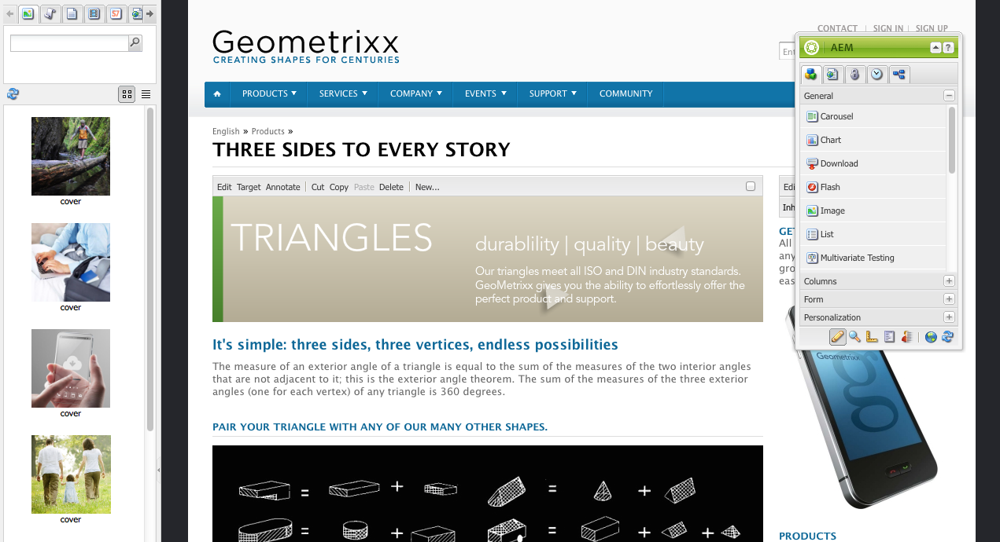
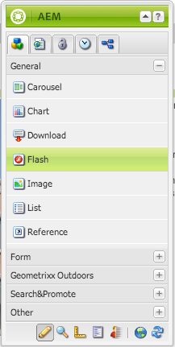
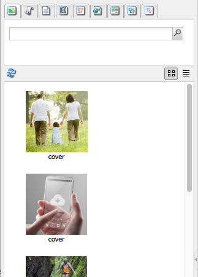
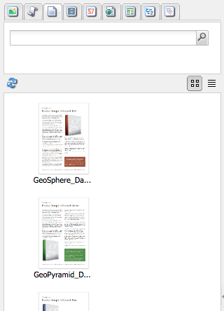
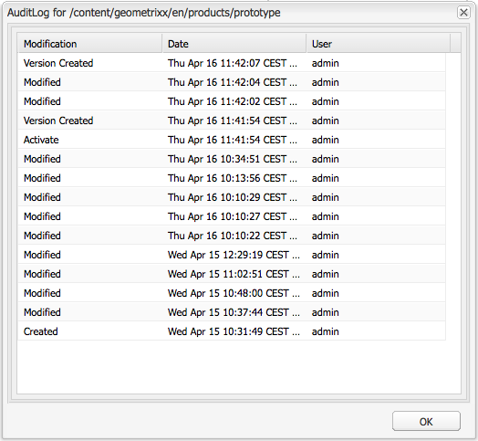

# 編寫——環境和工具 {#authoring-the-environment-and-tools}

AEM的製作環境提供多種機制來組織和編輯您的內容。 提供的工具可從各種控制台和頁面編輯器中存取。

## 網站管理 {#site-administration}

「網 **站** 」主控台可讓您管理和導覽您的網站。 使用這兩個窗格，可展開網站的結構，並對所需元素採取動作：

## 編輯頁面內容 {#editing-your-page-content}

使用傳統UI（使用內容搜尋器和sidekick）的個別頁面編輯器：

`https://localhost:4502/cf#/content/geometrixx/en/products/triangle.html`

## 存取說明 {#accessing-help}

您可 **以從** AEM直接存取各種說明資源：

除了從控制台工 [具列存取說明外](/help/sites-classic-ui-authoring/author-env-basic-handling.md#accessing-help)，您也可以從sidekick存取說明(使用？ 圖示):

或者，使用特 **定元件** 「編輯」對話方塊中的「說明」按鈕；這會顯示內容相關的說明。

## Sidekick {#sidekick}

sidekick的 **Components** （元件）標籤可讓您瀏覽可新增至目前頁面的元件。 您可以展開所需的群組，然後將元件拖曳至頁面上的所需位置。

## 內容搜尋器 {#the-content-finder}

Content Finder是編輯頁面時在儲存庫中尋找資產和／或內容的快速而簡單的方法。

您可以使用內容搜尋器來尋找一系列資源。 您可以視需要將項目拖曳至頁面上的段落：

* [影像](#finding-images)
* [文件](#finding-documents)
* [影片](#finding-movies)
* [Scene7 媒體瀏覽器](/help/sites-administering/scene7.md#scene7contentbrowser)
*  頁 [面](/help/sites-classic-ui-authoring/classic-page-author-env-tools.md#finding-pages)

* [段落](#referencing-paragraphs-from-other-pages)
* [產品](/help/sites-classic-ui-authoring/classic-page-author-env-tools.md#products)
* 或者， [依儲存庫結構瀏覽網站](#the-content-finder)

您可以透過所有選項 [搜尋特定項目](#the-content-finder)。

### 尋找影像 {#finding-images}

此頁籤列出了儲存庫中的所有映像。

在頁面上建立影像段落後，您可以拖曳項目並放入段落中。

### 查找文檔 {#finding-documents}

此頁籤列出了儲存庫中的所有文檔。

在頁面上建立「下載」段落後，您可以拖曳項目並放入段落中。

### 尋找影片 {#finding-movies}

此標籤列出儲存庫中的所有影片（如Flash項目）。

在頁面上建立適當的段落（例如Flash）後，您可以拖曳項目並放入段落中。

### 產品 {#products}

此標籤列出任何產品。 在頁面上建立適當的段落（例如「產品」）後，您可以拖曳項目並拖曳至段落中。

### 尋找頁面 {#finding-pages}

此標籤顯示所有頁面。 連按兩下任何頁面以開啟頁面進行編輯。

### 參考其他頁面的段落 {#referencing-paragraphs-from-other-pages}

此標籤可讓您搜尋其他頁面。 該頁面的所有段落都將列出。 然後，您可以將段落拖曳至目前頁面，這會建立對原始段落的參考。

### 使用完整儲存庫視圖 {#using-the-full-repository-view}

此頁籤顯示儲存庫中的所有資源。

### 將搜尋與內容瀏覽器搭配使用 {#using-search-with-the-content-browser}

在所有選項中，您可以搜尋特定項目。 會列出符合搜尋模式的任何標籤和任何資源：

您也可以使用萬用字元進行搜尋。 支援的萬用字元包括：

* `*`
符合零或多個字元的序列。

* `?`
匹配單個字元。

>[!NOTE]
>
>有一個偽屬性&quot;name&quot;，必須用於執行通配符搜索。

例如，如果有影像可使用名稱：

`ad-nmvtis.jpg`

下列搜尋模式會找到它（以及任何符合模式的其他影像）:

* `name:*nmv*`
* `name:AD*`
字元比對不 *區分大小寫* 。

* `name:ad?nm??is.*`
您可以在查詢中使用任意數量的萬用字元。

>[!NOTE]
>
>您也可以使 [用SQL2](https://helpx.adobe.com/experience-manager/6-5/sites/developing/using/reference-materials/javadoc/org/apache/jackrabbit/commons/query/sql2/package-summary.html) 搜索。

## 顯示參照 {#showing-references}

AEM可讓您檢視哪些頁面已連結至您目前正在處理的頁面。

要顯示直接頁面參考：

1. 在sidekick中，選取「頁 **面** 」標籤圖示。

   

1. **選擇**&#x200B;顯示參照……AEM會開啟「參考」視窗，並顯示哪些頁面參照所選頁面，包括其路徑。

   

在某些情況下，Sidekick會提供進一步的動作，包括：

* [啟動](/help/sites-classic-ui-authoring/classic-launches.md)
* [即時副本](/help/sites-administering/msm.md)

* [Blueprint](/help/sites-administering/msm-best-practices.md)

其他 [的頁面間關係可在網站主控台中檢視](/help/sites-classic-ui-authoring/author-env-basic-handling.md#page-information-on-the-websites-console)。

## 稽核記錄 {#audit-log}

您可 **以從側腳的「資** 訊 **** 」標籤存取「稽核記錄檔」。 它列出了當前頁面上最近採取的行動；例如：

## 頁面資訊 {#page-information}

網站主控台 [也提供有關頁面目前狀態的資訊](/help/sites-classic-ui-authoring/author-env-basic-handling.md#page-information-on-the-websites-console) ，例如出版物、修改、鎖定、即時複製等。

## 頁面模式 {#page-modes}

使用傳統UI編輯頁面時，可使用sidekick底部的圖示存取各種模式：

Sidekick底部的一列圖示可用來切換使用頁面的模式：

* [Edit](/help/sites-classic-ui-authoring/classic-page-author-edit-mode.md)（編輯）這是預設模式，允許您編輯頁面、添加或刪除元件以及進行其他更改。

* [預覽](/help/sites-classic-ui-authoring/classic-page-author-edit-content.md#previewing-pages)：此模式可讓您預覽頁面，就像它以最終形式出現在您的網站上一樣。

* [設計](/help/sites-classic-ui-authoring/classic-page-author-design-mode.md#main-pars-procedure-0)在此模式下，您可以設定可存取的元件，以編輯頁面的設計。

>[!NOTE]
>
>其他選項也可供使用：

>* [支架](/help/sites-classic-ui-authoring/classic-feature-scaffolding.md)
>* [ClientContext](/help/sites-administering/client-context.md)
* 網站——將開啟網站主控台。
* 重新載入——將重新整理頁面。

## 鍵盤快速鍵 {#keyboard-shortcuts}

您可 [使用各種鍵盤](/help/sites-classic-ui-authoring/classic-page-author-keyboard-shortcuts.md) 快速鍵。
