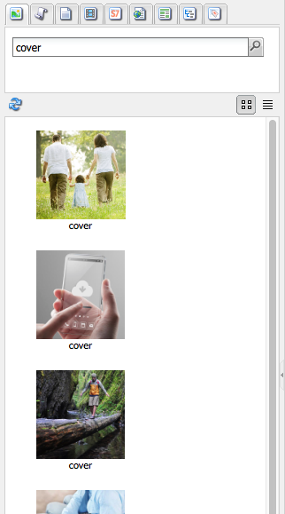

# 製作 — 環境與工具 {#authoring-the-environment-and-tools}

AEM的製作環境提供各種機制來組織和編輯您的內容。 提供的工具可從各種主控台和頁面編輯器存取。

## 網站管理 {#site-administration}

此 **網站** 主控台可讓您管理和導覽您的網站。 使用兩個窗格，可以展開網站的結構並針對所需元素採取的動作：

## 編輯您的頁面內容 {#editing-your-page-content}

有一個單獨的頁面編輯器具有傳統UI，使用內容尋找器和Sidekick：

`https://localhost:4502/cf#/content/geometrixx/en/products/triangle.html`

## 存取說明 {#accessing-help}

各種 **說明** 您可以直接從AEM記憶體取資源：

以及存取 [主控台工具列的說明](/help/sites-classic-ui-authoring/author-env-basic-handling.md#accessing-help)，您也可以存取sidekick的說明(使用？ 圖示)：

或透過使用 **說明** 按鈕；這將顯示上下文相關說明。

## Sidekick {#sidekick}

此 **元件** sidekick的索引標籤可讓您瀏覽要新增至目前頁面的可用元件。 展開所需群組，然後將元件拖曳至頁面上的所需位置。

## 內容尋找器 {#the-content-finder}

內容尋找器是在編輯頁面時，在存放庫中快速輕鬆地尋找資產和/或內容。

您可以使用內容尋找器來找出一系列資源。 您可以視情況將專案拖放到頁面上的段落中：

* [影像](#finding-images)
* [文件](#finding-documents)
* [影片](#finding-movies)
* [Dynamic Media瀏覽器](/help/sites-administering/scene7.md#scene7contentbrowser)
* [頁面](#finding-pages)

* [段落](#referencing-paragraphs-from-other-pages)
* [產品](#products)
* 或至 [依存放庫結構瀏覽網站](#the-content-finder)

使用所有選項，您可以 [搜尋特定專案](#the-content-finder).

### 尋找影像 {#finding-images}

此索引標籤會列出存放庫中的所有影像。

在頁面上建立「影像」段落後，您可以將專案拖放到段落中。

### 尋找檔案 {#finding-documents}

此索引標籤會列出存放庫中的所有檔案。

在頁面上建立「下載」段落後，您可以將專案拖放到段落中。

### 尋找電影 {#finding-movies}

此索引標籤會列出存放庫中的所有影片(例如Flash專案)。

在頁面上建立適當的段落(例如Flash)後，您可以將專案拖放到段落中。

### 產品 {#products}

此索引標籤會列出所有產品。 在頁面上建立適當的段落（例如「產品」）後，您可以將專案拖放到段落中。

### 尋找頁面 {#finding-pages}

此索引標籤會顯示所有頁面。 按兩下任何頁面以開啟它進行編輯。

### 引用其他頁面的段落 {#referencing-paragraphs-from-other-pages}

此索引標籤可讓您搜尋其他頁面。 將會列出該頁面中的所有段落。 然後，您可以將段落拖曳到目前頁面，這會建立原始段落的參照。

### 使用完整存放庫檢視 {#using-the-full-repository-view}

此索引標籤會顯示存放庫中的所有資源。

### 搭配內容瀏覽器使用搜尋 {#using-search-with-the-content-browser}

在所有選項上，您可以搜尋特定專案。 以下列出符合搜尋模式的任何標籤和所有資源：

您也可以使用萬用字元進行搜尋。 支援的萬用字元包括：

* `*`
符合零或更多字元的序列。

* `?`
符合單一字元。

>[!NOTE]
>
>假屬性「name」必須用來執行萬用字元搜尋。

例如，如果存在名稱為的可用影像：

`ad-nmvtis.jpg`

以下搜尋模式將找到它（以及符合該模式的任何其他影像）：

* `name:*nmv*`
* `name:AD*`
字元比對為 *非* 區分大小寫。

* `name:ad?nm??is.*`
您可以在查詢中使用任意數量的萬用字元。

>[!NOTE]
>
>您也可以使用 [SQL2](https://helpx.adobe.com/experience-manager/6-5/sites/developing/using/reference-materials/javadoc/org/apache/jackrabbit/commons/query/sql2/package-summary.html) 搜尋。

## 顯示引用 {#showing-references}

AEM可讓您檢視哪些頁面連結至您目前工作的頁面。

若要顯示直接頁面參照：

1. 在sidekick中，選取 **頁面** 標籤圖示。

   

1. 選取 **顯示引用……** AEM會開啟「參照」視窗，並顯示參照所選頁面的頁面，包括其路徑。

   

在某些情況下，Sidekick中提供了進一步的動作，包括：

* [啟動](/help/sites-classic-ui-authoring/classic-launches.md)
* [Live Copy](/help/sites-administering/msm.md)

* [藍圖](/help/sites-administering/msm-best-practices.md)

其他 [可以在網站主控台中檢視頁面間關係](/help/sites-classic-ui-authoring/author-env-basic-handling.md#page-information-on-the-websites-console).

## 稽核記錄 {#audit-log}

此 **稽核記錄** 可從以下位置存取： **資訊** 索引標籤。 它列出目前頁面上最近採取的動作；例如：

## 頁面資訊 {#page-information}

網站主控台也 [提供頁面目前狀態的相關資訊](/help/sites-classic-ui-authoring/author-env-basic-handling.md#page-information-on-the-websites-console) 例如，發佈、修改、鎖定、即時副本等。

## 頁面模式 {#page-modes}

使用傳統UI編輯頁面時，有多種模式可使用Sidekick底部的圖示來存取：

Sidekick底部的圖示列可用來切換處理頁面的模式：

* [編輯](/help/sites-classic-ui-authoring/classic-page-author-edit-mode.md)
此為預設模式，可讓您編輯頁面、新增或刪除元件及進行其他變更。

* [預覽](/help/sites-classic-ui-authoring/classic-page-author-edit-content.md#previewing-pages)
此模式可讓您預覽頁面，就像頁面以最終形式出現在您的網站上。

* [設計](/help/sites-classic-ui-authoring/classic-page-author-design-mode.md#main-pars-procedure-0)
在此模式中，您可以設定可存取的元件，以編輯頁面設計。

>[!NOTE]
>
>也可使用其他選項：
>
>* [支架](/help/sites-classic-ui-authoring/classic-feature-scaffolding.md)
>* [使用者端內容](/help/sites-administering/client-context.md)
>* 網站 — 開啟網站主控台。
>* 重新載入 — 將重新整理頁面。

## 鍵盤快速鍵 {#keyboard-shortcuts}

各種 [鍵盤快速鍵](/help/sites-classic-ui-authoring/classic-page-author-keyboard-shortcuts.md) 可用。
