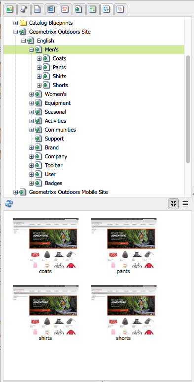

# 創作 — 環境和工具 {#authoring-the-environment-and-tools}

的創作環境AEM提供了組織和編輯內容的各種機制。 所提供的工具可從各種控制台和頁面編輯器中訪問。

## 站點管理 {#site-administration}

的 **網站** 控制台允許您管理和瀏覽網站。 使用這兩個窗格可以展開網站的結構以及對所需元素執行的操作：

## 編輯頁面內容 {#editing-your-page-content}

使用傳統UI（使用內容查找器和邊框），有單獨的頁面編輯器：

`https://localhost:4502/cf#/content/geometrixx/en/products/triangle.html`

## 訪問幫助 {#accessing-help}

各種 **幫助** 可以從中直接訪問資源AEM:

以及 [控制台工具欄的幫助](/help/sites-classic-ui-authoring/author-env-basic-handling.md#accessing-help)，也可以從旁站訪問幫助(使用？ 表徵圖)編輯頁面時：

或使用 **幫助** 按鈕；這將顯示上下文相關幫助。

## 側腳 {#sidekick}

的 **元件** 對話框的頁籤允許您瀏覽可添加到當前頁面的元件。 可以展開所需組，然後將元件拖到頁面上的所需位置。

## 內容查找器 {#the-content-finder}

在編輯頁面時， Content Finder是在儲存庫中查找資產和/或內容的一種快速而簡便的方法。

您可以使用內容查找器來查找一系列資源。 在適當情況下，您可以將項目拖放到頁面上的段落中：

* [影像](#finding-images)
* [文件](#finding-documents)
* [影片](#finding-movies)
* [Dynamic Media瀏覽器](/help/sites-administering/scene7.md#scene7contentbrowser)
* [頁面](#finding-pages)

* [段落](#referencing-paragraphs-from-other-pages)
* [產品](#products)
* 或 [按儲存庫結構瀏覽網站](#the-content-finder)

使用所有選項 [搜索特定項](#the-content-finder)。

### 查找影像 {#finding-images}

此頁籤列出儲存庫中的所有影像。

在頁面上建立「影像」段落後，可以將項目拖放到段落中。

### 查找文檔 {#finding-documents}

此頁籤列出儲存庫中的所有文檔。

在頁面上建立「下載」段落後，可以將項目拖放到段落中。

### 查找電影 {#finding-movies}

此頁籤列出儲存庫中的所有影片(例如，Flash項目)。

在頁面上建立相應的段落(例如，Flash)後，可以將項目拖放到段落中。

### 產品 {#products}

此頁籤列出所有產品。 在頁面上建立相應的段落（例如「產品」）後，可以將項目拖放到段落中。

### 查找頁面 {#finding-pages}

此頁籤顯示所有頁面。 按兩下任何頁面以將其開啟以進行編輯。

### 引用其他頁面中的段落 {#referencing-paragraphs-from-other-pages}

此頁籤允許您搜索其他頁面。 將列出該頁中的所有段落。 然後，可以將段落拖到當前頁面，這將建立對原始段落的引用。

### 使用完整儲存庫視圖 {#using-the-full-repository-view}

此頁籤顯示儲存庫中的所有資源。

### 在內容瀏覽器中使用搜索 {#using-search-with-the-content-browser}

在所有選項中，您可以搜索特定項。 將列出與搜索模式匹配的所有標籤和任何資源：

也可使用通配符進行搜索。 支援的通配符包括：

* `*`
匹配零個或多個字元的序列。

* `?`
匹配一個字元。

>[!NOTE]
>
>存在偽屬性&quot;name&quot;，必須使用它來執行通配符搜索。

例如，如果有可用的映像，其名稱為：

`ad-nmvtis.jpg`

以下搜索模式將找到它（以及與該模式匹配的任何其他影像）:

* `name:*nmv*`
* `name:AD*`
字元匹配為 *不* 區分大小寫。

* `name:ad?nm??is.*`
可以在查詢中使用任意數量的通配符。

>[!NOTE]
>
>您還可以使用 [SQL2](https://helpx.adobe.com/experience-manager/6-5/sites/developing/using/reference-materials/javadoc/org/apache/jackrabbit/commons/query/sql2/package-summary.html) 搜索。

## 顯示引用 {#showing-references}

用AEM於查看連結到當前正在處理的頁面的頁面。

要顯示直接頁面引用：

1. 在旁角中，選擇 **頁面** 按鈕

   

1. 選擇 **顯示引用……** 打AEM開「引用」(References)窗口，並顯示引用選定頁面的頁面，包括其路徑。

   

在某些情況下，Sidekick可採取進一步行動，包括：

* [Launch](/help/sites-classic-ui-authoring/classic-launches.md)
* [Live Copy](/help/sites-administering/msm.md)

* [藍圖](/help/sites-administering/msm-best-practices.md)

其他 [可以在網站控制台中查看頁面間關係](/help/sites-classic-ui-authoring/author-env-basic-handling.md#page-information-on-the-websites-console)。

## 稽核記錄 {#audit-log}

的 **審核日誌** 可以從 **資訊** 擊中了。 它列出了當前頁面上最近採取的行動；例如：

## 頁面資訊 {#page-information}

網站控制台 [提供有關頁面當前狀態的資訊](/help/sites-classic-ui-authoring/author-env-basic-handling.md#page-information-on-the-websites-console) 如發佈、修改、鎖定、livecopy等。

## 頁面模式 {#page-modes}

在使用傳統UI編輯頁面時，可以使用邊框底部的表徵圖訪問各種模式：

Sidekick底部的一行表徵圖用於切換處理頁面的模式：

* [編輯](/help/sites-classic-ui-authoring/classic-page-author-edit-mode.md)
這是預設模式，允許您編輯頁面、添加或刪除元件以及進行其他更改。

* [預覽](/help/sites-classic-ui-authoring/classic-page-author-edit-content.md#previewing-pages)
此模式允許您預覽頁面，就像頁面以最終形式出現在您的網站上一樣。

* [設計](/help/sites-classic-ui-authoring/classic-page-author-design-mode.md#main-pars-procedure-0)
在此模式下，您可以通過配置可訪問的元件來編輯頁面的設計。

>[!NOTE]
>
>其他選項也可用：
>
>* [支架](/help/sites-classic-ui-authoring/classic-feature-scaffolding.md)
>* [ClientContext](/help/sites-administering/client-context.md)
>* 網站 — 將開啟網站控制台。
>* 重新載入 — 將刷新頁面。

## 鍵盤快速鍵 {#keyboard-shortcuts}

各種 [鍵盤快捷鍵](/help/sites-classic-ui-authoring/classic-page-author-keyboard-shortcuts.md) 的雙曲餘切值。
