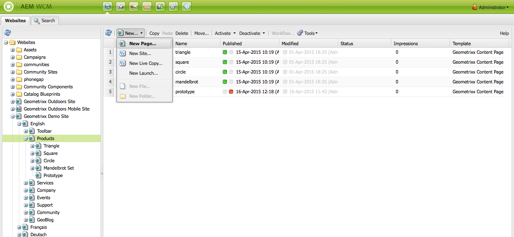
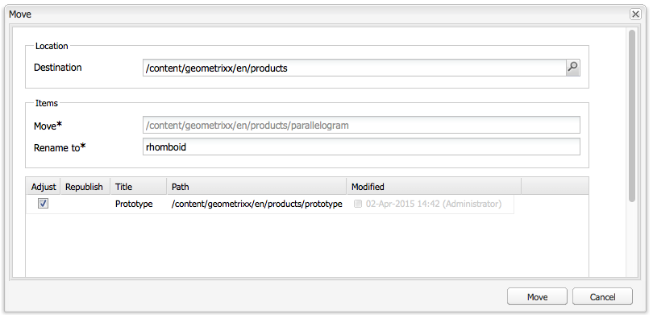

# 建立及組織頁面{#creating-and-organizing-pages}

本節說明如何使用Adobe Experience Manager(AEM)建立和管理頁面，以便您接著能在這些頁面上[建立內容](/help/sites-classic-ui-authoring/classic-page-author-edit-content.md)。

>[!NOTE]
>
>您的帳戶需要[適當的存取權限](/help/sites-administering/security.md)和[權限](/help/sites-administering/security.md#permissions)才能在頁面上採取動作，例如建立、複製、移動、編輯、刪除。
>
>如果您遇到任何問題，建議您與系統管理員聯繫。

## 組織網站{#organizing-your-website}

身為作者，您需要在AEM中組織網站。 這包括建立和命名您的內容頁面，以便：

* 您可輕鬆在製作環境中找到它們
* 您網站的訪客可輕鬆在發佈環境中瀏覽

您也可以使用[資料夾](#creating-a-new-folder)來協助組織您的內容。

網站的結構可視為包含您內容頁面的&#x200B;*樹狀結構*。 這些內容頁面的名稱會用來形成URL，而標題會在檢視頁面內容時顯示。

以下顯示Geometrixx網站的擷取；例如，將存取`Triangle`頁面：

* 製作環境

   `http://localhost:4502/cf#/content/geometrixx/en/products/triangle.html`

* 發佈環境

   `http://localhost:4503/content/geometrixx/en/products/triangle.html`

   視您執行個體的設定而定，在發佈環境中使用`/content`可能是選用的。

```xml
  /content
    /geometrixx
      /en
        /toolbar...
        /products
          /triangle
            /overview
            /features
          /square...
          /circle...
          /...
        /...
      /fr...
      /de...
      /es...
      /...
    /...
```

此結構可從網站控制台進行查看，您可以使用此控制台在樹結構](/help/sites-classic-ui-authoring/author-env-basic-handling.md#main-pars-text-15)中導航。[


### 頁面命名慣例{#page-naming-conventions}

建立新頁面時，有兩個索引鍵欄位：

* **[標題](#title)**:

   * 這會顯示在主控台中給使用者，並在編輯時顯示在頁面內容的頂端。
   * 此欄位為必填.

* **[名稱](#name)**:

   * 這用於生成URI。
   * 此欄位的用戶輸入為可選。 如果未指定，則從標題派生名稱。

建立新頁面時，AEM會根據AEM和JCR所強加的慣例](/help/sites-developing/naming-conventions.md)驗證頁面名稱。[

實作和允許的字元清單會因UI而稍有不同（觸控式UI的範圍較廣），但允許的最小值為：

* &#39;a&#39;到&#39;z&#39;
* &#39;A&#39;到&#39;Z&#39;
* &#39;0&#39;到&#39;9&#39;
* _（下划線）
* `-` （連字型大小/減號）

如果希望確保接受/使用這些字元，請只使用這些字元（如果需要所有允許字元的完整詳細資訊，請參閱[命名慣例](/help/sites-developing/naming-conventions.md)）。

#### 標題 {#title}

如果您在建立新頁面時只提供頁面 **Title** ,AEM會從此字串衍生頁面 **Name**[ ，並根據AEM和JCR所強加的慣例來驗證名稱。](/help/sites-developing/naming-conventions.md)在兩個UI中，包含無效字元的&#x200B;**Title**&#x200B;欄位將被接受，但派生的名稱將替換無效字元。 例如：

| 標題 | 衍生名稱 |
|---|---|
| 捨恩 | schoen.html |
| SC%&amp;&amp;ast;ç+ | sc---c-.html |

#### 名稱 {#name}

如果您在建立新頁面時提供頁面&#x200B;**名稱**,AEM將根據AEM和JCR所強加的慣例](/help/sites-developing/naming-conventions.md)驗證名稱[。

在傳統UI中，您不能在&#x200B;**名稱**&#x200B;欄位中輸入無效字元&#x200B;**。**

>[!NOTE]
>在觸控式UI中，您&#x200B;**無法在**&#x200B;名稱&#x200B;**欄位中提交無效字元**。 當AEM偵測到無效字元時，欄位會反白顯示，並顯示說明訊息，指出需要移除/取代的字元。

>[!NOTE]
>
>除非是語言根，否則應避免使用ISO-639-1所定義的雙字母代碼。
>
>如需詳細資訊，請參閱[準備翻譯內容](/help/sites-administering/tc-prep.md) 。

### 範本 {#templates}

在AEM中，範本會指定專用的頁面類型。 模板將用作建立任何新頁面的基礎。

範本定義頁面結構；包括縮圖影像和其他屬性。 例如，您可能有不同的產品頁面、網站地圖和聯絡資訊範本。 範本由[元件](#components)組成。

AEM隨附數個現成可用的範本。 提供的範本取決於個別網站，而需要提供的資訊（建立新頁面時）取決於使用的UI。 關鍵欄位為：

* ****
標題產生的網頁上顯示的標題。

* ****
命名頁面時使用的名稱。

* ****
範本：產生新頁面時可用的範本清單。

### 元件 {#components}

元件是AEM提供的元素，可讓您新增特定類型的內容。 AEM隨附一系列現成可用的元件，提供全面功能；包括：

* 文字
* 影像
* Slideshow
* 影片
* 更多

建立並開啟頁面後，您可以使用[sidekick](/help/sites-classic-ui-authoring/classic-page-author-env-tools.md#sidekick)中提供的元件](/help/sites-classic-ui-authoring/classic-page-author-edit-content.md#insertinganewparagraph)新增內容。[

## 管理頁面{#managing-pages}

### 建立新頁面{#creating-a-new-page}

除非您事先已為您建立所有頁面，否則您必須先建立頁面，才能開始建立內容：

1. 從&#x200B;**網站**&#x200B;控制台中，選擇要建立新頁面的級別。

   在以下示例中，您正在&#x200B;**Products**&#x200B;級別下建立頁面 — 顯示在左窗格中；右窗格顯示&#x200B;**Products**&#x200B;下層級已存在的頁面。

   

1. 在&#x200B;**新……**&#x200B;功能表（按一下&#x200B;**新增……旁的箭頭）。**)，選擇&#x200B;**新建頁面……**。 將開啟&#x200B;**建立頁面**&#x200B;窗口。

   按一下「**新建……」**&#x200B;本身也是&#x200B;**新頁面的捷徑……**&#x200B;選項。

1. **建立頁面**&#x200B;對話方塊可讓您：

   * 提供&#x200B;**Title**;這會顯示給使用者。
   * 提供&#x200B;**Name**;這用於生成URI。 若未指定，則會從標題衍生名稱。

      * 如果您在建立新頁面時提供頁面&#x200B;**Name**,AEM將根據AEM和JCR所設定的慣例](/help/sites-developing/naming-conventions.md)驗證名稱。[
      * 在傳統UI中，您&#x200B;**無法在** Name **欄位中輸入無效字元**。
   * 按一下您要用來建立新頁面的範本。

      範本是新頁面的基礎；例如，決定內容頁面的基本配置。
   >[!NOTE]
   >
   >請參閱[頁面命名慣例](#page-naming-conventions)。

   建立新頁面所需的最低資訊為&#x200B;**Title**&#x200B;和所需的範本。

   

   >[!NOTE]
   >
   >如果要在URL中使用Unicode字元，請設定別名(`sling:alias`)屬性（[頁面屬性](/help/sites-classic-ui-authoring/classic-page-author-edit-page-properties.md)）。

1. 按一下&#x200B;**建立**&#x200B;以建立頁面。 您會回到&#x200B;**網站**&#x200B;主控台，在該控制台中可以看到新頁面的條目。

   主控台會提供頁面的相關資訊（例如上次編輯頁面的時間，以及依誰），並視需要更新。

   >[!NOTE]
   >
   >您也可以在編輯現有頁面時建立頁面。 從sidekick的&#x200B;**Page**&#x200B;標籤**Create Child Page **，將直接在所編輯的頁面下建立新頁面。

### 開啟頁面進行編輯{#opening-a-page-for-editing}

您可以透過下列其中一種方法開啟要[edited](/help/sites-classic-ui-authoring/classic-page-author-edit-content.md#editing-a-component-content-and-properties)的頁面：

* 在&#x200B;**網站**&#x200B;控制台中，您可以&#x200B;**按兩下**&#x200B;頁面條目以開啟它進行編輯。

* 在&#x200B;**網站**&#x200B;控制台中，您可以按一下右鍵&#x200B;**（上下文菜單）頁項，然後從菜單中選擇**&#x200B;開啟&#x200B;**。**

* 開啟頁面後，您可以按一下超連結來導覽至網站內的其他頁面（以編輯它們）。

### 複製和貼上頁面{#copying-and-pasting-a-page}

複製時，您可以複製下列任一項：

* 單頁
* 頁面與所有子頁面

1. 從&#x200B;**網站**&#x200B;控制台中，選擇要複製的頁面。

   >[!NOTE]
   >
   >此階段無論您要複製單一頁面或基礎子頁面，都無關緊要。

1. 按一下&#x200B;**Copy**。

1. 導覽至新位置，然後按一下：

   * **貼上**  — 將頁面與所有子頁面一起貼上
   * **Shift +貼上**  — 僅貼上選取的頁面

   頁面會貼到新位置。

   >[!NOTE]
   >
   >如果現有頁面已有相同名稱，頁面名稱可能會自動調整。

   >[!NOTE]
   >
   >您也可以從sidekick的&#x200B;**Page**&#x200B;標籤使用&#x200B;**Copy Page**。 這會開啟一個對話方塊，您可在其中指定目的地等。

### 移動或更名頁面{#moving-or-renaming-page}

>[!NOTE]
>
>在指定新頁面名稱時，更名頁面也應遵循[頁面命名慣例](#page-naming-conventions)。

移動或更名頁面的過程相同。 使用相同的動作，您可以：

* 將頁面移至新位置
* 重新命名相同位置的頁面
* 將頁面移至新位置並同時重新命名

AEM可讓您更新重新命名或移動之頁面的內部連結。 您可以逐頁完成這項作業，以提供完全的彈性。

移動或更名頁面：

1. 觸發移動的方法有多種：

   * 在&#x200B;**Websites**&#x200B;控制台中，按一下以選擇頁面，然後選擇&#x200B;**移動……**
   * 從&#x200B;**Websites**&#x200B;控制台，您也可以選擇頁面項，然後按一下右鍵&#x200B;****&#x200B;並選擇&#x200B;**移動……**
   * 編輯頁面時，您可以從sidekick的&#x200B;**Page**&#x200B;標籤中選取&#x200B;**移動頁面**。

1. **Move**&#x200B;窗口開啟；您可以在此處指定新位置、頁面的新名稱，或兩者皆指定。

   

   該頁面還列出參考所移動頁面的任何頁面。 視參考頁面的狀態而定，您可以調整頁面上的這些連結及/或重新發佈頁面。

1. 視情況填入下列欄位：

   * **目的地**

      使用Sitemap（可透過下拉式選取器取得）來選取應將頁面移至的位置。

      如果您只更名頁面，請忽略此欄位。

   * **移動**

      指定要移動的頁面 — 這通常會根據您啟動移動動作的方式和位置填入。

   * **重新命名為**

      預設會顯示目前的頁面標籤。 視需要指定新的頁面標籤。

   * **調整**

      更新所列指向已移動頁面的頁面上的連結：例如，如果頁面A有連結至頁面B,AEM會調整頁面A中的連結，以防您移動頁面B。

      可針對每個個別參考頁面選取/取消選取此選項。

   * **重新發佈**

      重新發佈參考頁面；同樣地，您也可以為每個個別頁面選取此選項。
   >[!NOTE]
   >
   >如果頁面已啟用，移動頁面會自動停用它。 依預設，移動完成時會重新啟動它，但您可以取消勾選&#x200B;**Move**&#x200B;視窗中該頁面的&#x200B;**Republish**&#x200B;欄位，以變更此設定。

1. 按一下&#x200B;**移動**。 需要確認。 按一下&#x200B;**OK**&#x200B;以確認。

   >[!NOTE]
   >
   >不會更新頁面標題。

### 刪除頁面{#deleting-a-page}

1. 您可以從各種位置刪除頁面：

   * 在&#x200B;**網站**&#x200B;主控台中，按一下以選取頁面，然後按一下滑鼠右鍵並從產生的功能表中選取&#x200B;**刪除**。
   * 在&#x200B;**網站**&#x200B;控制台中，按一下以選擇頁面，然後從工具欄菜單中選擇&#x200B;**刪除**。
   * 在sidekick內，使用&#x200B;**Page**&#x200B;標籤來選取&#x200B;**Delete Page** — 這會刪除目前開啟的頁面。

1. 選取刪除頁面後，您必須確認請求，因為動作無法還原。

   >[!NOTE]
   >
   >刪除後，如果頁面已發佈，您可以還原最新（或特定）版本，但如果進行進一步修改，則此版本可能與上一個版本的內容不完全相同。 如需詳細資訊，請參閱[如何還原頁面](/help/sites-classic-ui-authoring/classic-page-author-work-with-versions.md#restoringpages) 。

>[!NOTE]
>
>如果頁面已啟用，則會在刪除前自動停用。

### 鎖定頁面{#locking-a-page}

您可以從主控台或編輯個別頁面時[鎖定/解除鎖定頁面](/help/sites-classic-ui-authoring/classic-page-author-edit-content.md#locking-a-page)。 關於頁面是否已鎖定的資訊也會顯示在兩個位置中。

### 建立新資料夾{#creating-a-new-folder}

>[!NOTE]
>
>指定新資料夾名稱時，資料夾也必須遵守[頁面命名慣例](#page-naming-conventions)。

1. 開啟&#x200B;**Websites**&#x200B;控制台並導覽至所需位置。
1. 在&#x200B;**新……**&#x200B;功能表（按一下&#x200B;**新增……旁的箭頭）。**)，選擇&#x200B;**新建資料夾……**。
1. 將會開啟「**建立資料夾**」對話框。 您可以在此處輸入&#x200B;**Name**&#x200B;和&#x200B;**Title**:

   

1. 選擇&#x200B;**建立**&#x200B;以建立資料夾。
