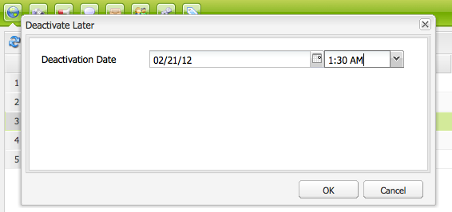

# 發佈頁面{#publishing-pages}

在您建立並檢視內容至作者環境後，其目標是將它發佈至您的公開網站（您的發佈環境）。

這稱為發佈頁面。 當您想從發佈環境中移除頁面時，稱為取消發佈。 發佈和取消發佈頁面時，在作者環境中仍可使用頁面進行進一步變更，直到您刪除為止。

您也可以立即發佈／取消發佈頁面，或在未來的預先定義日期／時間發佈／取消發佈頁面。

>[!NOTE]
>
>與發佈相關的某些術語可能會混淆：
>
>* **發佈／取消發佈**
   >  這些是讓您的內容在發佈環境（或非）上公開提供之動作的主要條款。
   >
   >
* **啟用／停用**
   >  這些詞語與publish/unpublish同義。
   >
   >
* **複製／複製**
   >  這些技術術語描述資料（例如頁面內容、檔案、程式碼、使用者註解）在某個環境之間的移動，例如發佈或反向複製使用者註解時。
>

>[!NOTE]
>
>如果您沒有發佈特定頁面的必要權限：
>
>* 系統會觸發工作流程，通知您發佈請求的適當人員。
>* 將會顯示訊息（在短時間內），通知您此事。
>

## 發佈頁面 {#publishing-a-page}

啟用頁面有兩種方法：

* [從網站主控台](#activating-a-page-from-the-websites-console)
* [頁面本身的側腳](#activating-a-page-from-sidekick)

>[!NOTE]
>
>您也可以使用「工具」控制台上的「啟 [用樹」](#howtoactivateacompletesectiontreeofyourwebsite) ，啟用多個頁面的子樹。

### 從網站主控台啟動頁面 {#activating-a-page-from-the-websites-console}

您可以在網站主控台中啟動頁面。 開啟頁面並修改其內容後，您會返回「網站」主控台：

1. 在「網站」主控台中，選取您要啟動的頁面。
1. 從 **頂端選單**，或在選取的頁面項目上的下拉式選單中，選取「啟動」。

   若要啟用頁面及其所有子頁面的內容，請使用「工 [**具&#x200B;**」主控台](/help/sites-classic-ui-authoring/classic-page-author-publish-pages.md#howtoactivateacompletesectiontreeofyourwebsite)。

   

   >[!NOTE]
   >
   >如有必要，AEM會要求您啟用或重新啟用連結至頁面的任何資產。 您可以選取或清除核取方塊來啟用這些資產。

1. 如有必要，AEM會要求您啟用或重新啟用連結至頁面的任何資產。 您可以選取或清除核取方塊來啟用這些資產。

   

1. AEM WCM會啟動選取的內容。 發佈的頁面或頁面會顯示在 [網站主控台](/help/sites-classic-ui-authoring/author-env-basic-handling.md#page-information-on-the-websites-console) （標示為綠色）中，其中包含啟動內容的使用者以及啟動日期和時間的相關資訊。

   

### 從Sidekick啟用頁面 {#activating-a-page-from-sidekick}

您也可以在開啟頁面進行編輯時啟動頁面。

開啟頁面並修改其內容後，您可以：

1. 在Sidekick中 **選取** 「頁面」標籤。
1. 按一 **下「啟動頁面**」。
視窗右上方會顯示一則訊息，確認頁面已啟動。

## 取消發佈頁面 {#unpublishing-a-page}

若要從發佈環境移除頁面，請停用內容。

停用頁面：

1. 在網站主控台中，選取您要停用的頁面。
1. 從上 **方選單**，或在選取的頁面項目上的下拉式選單中選取「停用」。 系統會要求您確認刪除。

   

1. 重新整 [理網站主控台](/help/sites-classic-ui-authoring/author-env-basic-handling.md#page-information-on-the-websites-console) ，內容會以紅色標示，表示不再發佈。

   

## 稍後啟用／停用 {#activate-deactivate-later}

### 稍後啟動 {#activate-later}

若要排程您稍後的啟動：

1. 在「網站」主控台中，前往「啟 **動** 」功能表，然後選 **取「稍後啟動」**。
1. 在開啟的對話方塊中，您提供啟動的日期和時間，然後按一下「 **確定**」。 這會建立在指定時間啟動的頁面版本。

   

稍後啟動會啟動工作流程，以在指定的時間啟動此版本的頁面。 相反地，稍後停用會啟動工作流程，在特定時間停用此版本的頁面。

如果您想要取消此啟動／停用，請前往「工作流 [控制台](/help/sites-administering/workflows-administering.md#main-pars_title_3-yjqslz-refd) 」以終止對應的工作流程。

### 稍後停用 {#deactivate-later}

若要排程您的停用作業以稍後進行：

1. 在「網站主控台」中，前往「停用 **」功能表** ，然後選取「 **稍後停用」**。

1. 在開啟的對話方塊中，您提供停用的日期和時間，然後按一下「 **確定**」。

   

**稍後**&#x200B;停用會啟動工作流程，以在特定時間停用此版本的頁面。

如果您要取消此停用，請前往「工作流控 [制台](/help/sites-administering/workflows-administering.md#main-pars_title_3-yjqslz-refd) 」以終止對應的工作流程。

## 排程的啟動／停用（開／關時間） {#scheduled-activation-deactivation-on-off-time}

您可以使用「頁面屬性」中定義的「按時和離 **職時間****」來排程要發佈／取消發佈的** 頁面時間 。

### 確定頁面發佈狀態 {#determining-page-publication-status-classic-ui}

您可從「網站」主控台 [檢視狀態](/help/sites-classic-ui-authoring/author-env-basic-handling.md#page-information-on-the-websites-console)。 顏色表示出版物狀態。

## 啟用網站的完整區段（樹狀） {#activating-a-complete-section-tree-of-your-website}

從「網 **站** 」標籤，您可以啟動個別頁面。 當您輸入或更新大量內容頁面（所有頁面都位於相同的根頁面下）後，在單一動作中啟動整個樹狀結構會更輕鬆。 您也可以執行「乾式執行」來模擬啟動，並反白標示要啟動的頁面。

1. 從「歡 **迎」頁面中選擇「工具** 」控制台，然後按兩下「複製 **」以開啟控制台(******`https://localhost:4502/etc/replication.html`)。

   

1. 在複製控 **制台** ，按一下「激活 **樹」**。

   將顯示以下 `https://localhost:4502/etc/replication/treeactivation.html`窗口()。

   

1. 輸入「 **開始路徑」**。 這會指定您要啟用（發佈）之區段的根路徑。 本頁和下面的所有頁面都視為啟動（或在選取「乾式執行」時用於模擬）。
1. 視需要啟用選取標準：

   * **僅已修改**:僅啟用已修改的頁面。
   * **僅激活**:僅啟用已（已）啟動的頁面。 以重新啟動的形式運作。
   * **忽略已停用**:忽略已停用的任何頁面。

1. 選擇要執行的動作：

   1. 如果 **要檢查要啟動的頁面，請選** 取 ** 「乾式執行」。 這只是模擬，不會啟動任何頁面。

   1. 如果 **要啟** 動頁面，請選取「啟動」。
