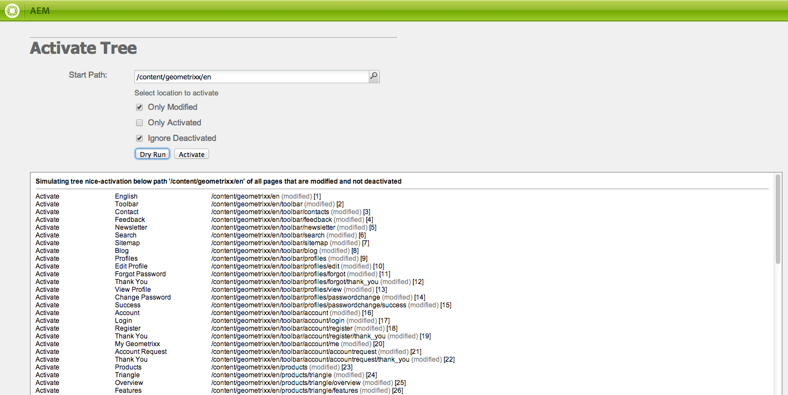

# 發佈頁面{#publishing-pages}

在作者環境中建立並檢閱您的內容後，使其可在您的公開網站（您的發佈環境）上使用。

這稱為發佈頁面。 從發佈環境中移除頁面時，系統會將其稱為取消發佈。 發佈和取消發佈頁面時，作者環境仍會提供進一步的變更，直到您刪除它為止。

您也可以立即發佈/取消發佈頁面，或在預先定義的未來日期/時間發佈/取消發佈頁面。

>[!NOTE]
>
>可能會混淆與發佈相關的某些術語：
>
>* **Publish /取消發佈**
>  這些是讓您的內容在發佈環境中公開使用（或不公開使用）的動作主要詞語。
>
>* **啟用/停用**
>  這些辭彙與發佈/取消發佈同義。
>
>* **復寫/復寫**
>  這些是技術術語，說明資料（例如頁面內容、檔案、程式碼、使用者註解）從一個環境移動到另一個環境，例如發佈或反向複製使用者註解時。
>

>[!NOTE]
>
>如果您沒有發佈特定頁面所需的許可權：
>
>* 系統會觸發工作流程，將您要發佈的請求通知適當人員。
>* 將會顯示訊息（短時間）來通知您。
>

## 發佈頁面 {#publishing-a-page}

啟用頁面的方法有兩種：

* [從「網站」主控台](#activating-a-page-from-the-websites-console)
* [從頁面本身的sidekick](#activating-a-page-from-sidekick)

>[!NOTE]
>
>您也可以使用[工具]主控台上的[啟動樹狀結構] [&#128279;](#howtoactivateacompletesectiontreeofyourwebsite)，啟動多個頁面的子樹狀結構。

### 從網站主控台啟用頁面 {#activating-a-page-from-the-websites-console}

您可以在網站主控台中啟動頁面。 開啟頁面並修改其內容後，您會返回「網站」主控台：

1. 在「網站」主控台中，選取您要啟動的頁面。
1. 從頂端功能表或所選頁面專案上的下拉式功能表中選取&#x200B;**啟動**。

   若要啟用頁面及其所有子頁面的內容，請使用&#x200B;[**工具**&#x200B;主控台](/help/sites-classic-ui-authoring/classic-page-author-publish-pages.md#howtoactivateacompletesectiontreeofyourwebsite)。

   

   >[!NOTE]
   >
   >必要時，AEM會要求您啟動或重新啟動連結至頁面的任何資產。 您可以選取或清除核取方塊以啟動這些資產。
   >
   >

1. 必要時，AEM會要求您啟動或重新啟動連結至頁面的任何資產。 您可以選取或清除核取方塊以啟動這些資產。

   

1. AEM WCM會啟用選取的內容。 已發佈的一或多個頁面會顯示在[網站主控台](/help/sites-classic-ui-authoring/author-env-basic-handling.md#page-information-on-the-websites-console) （標示為綠色）中，內含啟動內容者的相關資訊，以及啟動日期和時間。

   

### 從Sidekick啟用頁面 {#activating-a-page-from-sidekick}

您也可以在開啟頁面進行編輯時將其啟動。

開啟頁面並修改其內容後，您可以：

1. 選取Sidekick中的&#x200B;**頁面**&#x200B;索引標籤。
1. 按一下&#x200B;**啟動頁面**。
視窗右上方會顯示訊息，確認頁面已啟動。

## 取消發佈頁面 {#unpublishing-a-page}

若要從發佈環境移除頁面，請停用內容。

若要停用頁面：

1. 在「網站」主控台中，選取您要停用的頁面。
1. 選取&#x200B;**停用** （從頂端功能表或所選頁面專案的下拉式功能表）。 系統會要求您確認刪除。

   

1. 重新整理[網站主控台](/help/sites-classic-ui-authoring/author-env-basic-handling.md#page-information-on-the-websites-console)，內容會以紅色標示，表示它已不再發佈。

   

## 稍後啟用/停用 {#activate-deactivate-later}

### 稍後啟動 {#activate-later}

若要排程您的啟動作業以供稍後使用，請執行下列動作：

1. 在[網站]主控台中，移至&#x200B;**啟用**&#x200B;功能表，然後選取&#x200B;**稍後啟用**。
1. 在開啟的對話方塊中，提供啟動日期和時間，然後按一下[確定]。**&#x200B;** 這會建立指定時間啟動的頁面版本。

   

稍後啟用會啟動工作流程，以在指定時間啟用此版本頁面。 相反地，稍後停用會啟動工作流程，以便在特定時間停用此版本頁面。

如果您要取消此啟用/停用，請移至[工作流程主控台](/help/sites-administering/workflows-administering.md#main-pars_title_3-yjqslz-refd)以終止對應的工作流程。

### 稍後停用 {#deactivate-later}

若要排程稍後再停用：

1. 在網站主控台中，移至&#x200B;**停用**&#x200B;功能表，然後選取&#x200B;**稍後停用**。

1. 在開啟的對話方塊中，提供停用日期與時間，然後按一下[確定]。**&#x200B;**

   

**延遲停用** r會啟動工作流程，以在特定時間停用此版本的頁面。

若要取消此停用，請移至[工作流程主控台](/help/sites-administering/workflows-administering.md#main-pars_title_3-yjqslz-refd)以終止對應的工作流程。

## 已排程的啟用/停用（開啟/關閉時間） {#scheduled-activation-deactivation-on-off-time}

您可以使用可在[頁面屬性](/help/sites-classic-ui-authoring/classic-page-author-edit-page-properties.md)中定義的&#x200B;**開啟時間**&#x200B;和&#x200B;**關閉時間**，來排程發佈/取消發佈頁面的時間。

### 判斷頁面發佈狀態 {#determining-page-publication-status-classic-ui}

可從[網站主控台](/help/sites-classic-ui-authoring/author-env-basic-handling.md#page-information-on-the-websites-console)檢視狀態。 這些顏色指示出版狀態。

## 啟用網站的完整區段（樹狀結構） {#activating-a-complete-section-tree-of-your-website}

您可以從&#x200B;**網站**&#x200B;標籤啟用個別頁面。 當您輸入或更新了大量內容頁面時 — 所有這些頁面都位於同一個根頁面下 — 可以更輕鬆地在一次動作中啟動整個樹狀結構。 您也可以執行「練習」來模擬啟用，並反白標示要啟用的頁面。

1. 從&#x200B;**歡迎**&#x200B;頁面選取&#x200B;**工具**&#x200B;主控台，然後按兩下&#x200B;**復寫**&#x200B;以開啟主控台(`https://localhost:4502/etc/replication.html`)，以開啟主控台。

   

1. 在&#x200B;**復寫**&#x200B;主控台上，按一下&#x200B;**啟動樹狀結構**。

   將顯示下列視窗( `https://localhost:4502/etc/replication/treeactivation.html`)。

   

1. 輸入&#x200B;**開始路徑**。 這會指定您要啟動（發佈）之區段的根路徑。 此頁面及其下的所有頁面都會被視為啟動（如果選取了「試用」，則會用於模擬）。
1. 視需要啟動選取條件：

   * **僅已修改**：僅啟用已修改的頁面。
   * **僅啟動**：僅啟動已（已）啟動的頁面。 作為重新啟用的一種形式。
   * **忽略已停用的頁面**：忽略任何已停用的頁面。

1. 選取您要執行的動作：

   1. 如果您要檢查哪些頁面&#x200B;*將*&#x200B;啟動，請選取&#x200B;**試用**。 這只是模擬，不會啟用任何頁面。

   1. 若要啟用頁面，請選取&#x200B;**啟用**。
