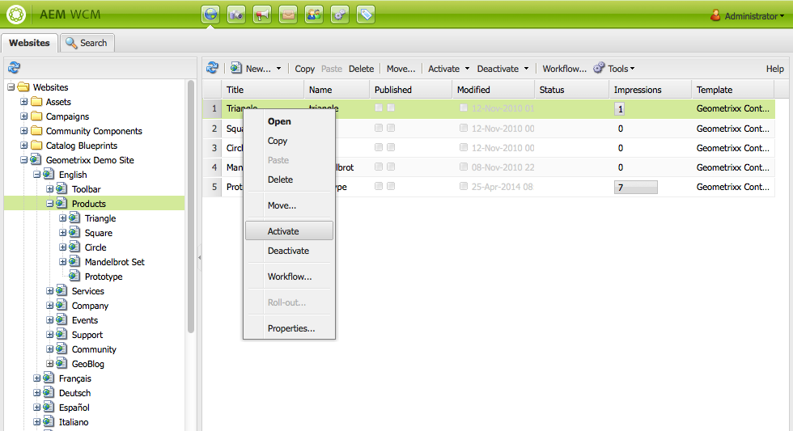

# 發佈頁面{#publishing-pages}

在作者環境中建立和查看內容後，請將其發佈到您的公共網站（發佈環境）。

這稱為發佈頁面。 當要從發佈環境中刪除頁面時，稱為取消發佈。 在發佈和取消發佈頁面時，該頁面在作者環境中仍然可用，以便進行進一步更改，直到您將其刪除。

您還可以立即發佈/取消發佈頁面，或在將來的預定義日期/時間發佈/取消發佈頁面。

>[!NOTE]
>
>某些與發佈相關的術語可能會被混淆：
>
>* **發佈/取消發佈**
   >  這些是使您的內容在發佈環境中（或不在發佈環境中）公開可用的操作的主要條款。
>
>* **激活/停用**
   >  這些術語與發佈/取消發佈是同義的。
>
>* **複製/複製**
   >  這些技術術語描述資料從一個環境移動到另一個環境（例如發佈或反向複製用戶注釋時）的移動。
>

>[!NOTE]
>
>如果您沒有發佈特定頁面所需的權限：
>
>* 將觸發一個工作流以通知相應人員您的發佈請求。
>* 將顯示一條消息（在短時間內）以通知您。
>

## 發佈頁面 {#publishing-a-page}

激活頁面有兩種方法：

* [從網站控制台](#activating-a-page-from-the-websites-console)
* [來自網頁本身的副手](#activating-a-page-from-sidekick)

>[!NOTE]
>
>您還可以使用 [激活樹](#howtoactivateacompletesectiontreeofyourwebsite) 在工具控制台上。

### 從網站控制台激活頁面 {#activating-a-page-from-the-websites-console}

您可以在網站控制台中激活頁面。 開啟頁面並修改其內容後，您將返回到「網站」控制台：

1. 在網站控制台中，選擇要激活的頁面。
1. 選擇 **激活**，或選定頁項上的下拉菜單。

   要激活頁面及其所有子頁面的內容，請使用 [**工具** 控制台](/help/sites-classic-ui-authoring/classic-page-author-publish-pages.md#howtoactivateacompletesectiontreeofyourwebsite)。

   

   >[!NOTE]
   >
   >如有必要，AEM請求您激活或重新激活連結到該頁面的任何資產。 您可以選中或清除複選框以激活這些資產。

1. 如有必要，AEM請求您激活或重新激活連結到該頁面的任何資產。 您可以選中或清除複選框以激活這些資產。

   

1. AEMWCM激活所選內容。 已發佈的頁面或頁面顯示在 [網站控制台](/help/sites-classic-ui-authoring/author-env-basic-handling.md#page-information-on-the-websites-console) （標籤為綠色），其中包含有關激活內容的人以及激活日期和時間的資訊。

   

### 從Sidekick激活頁面 {#activating-a-page-from-sidekick}

也可以在開啟頁面進行編輯時將其激活。

開啟頁面並修改其內容後，您將：

1. 選擇 **頁面** 按鈕。
1. 按一下 **激活頁面**。
窗口右上角顯示一條消息，確認頁面已激活。

## 取消發佈頁面 {#unpublishing-a-page}

要從發佈環境中刪除頁面，請停用內容。

要停用頁面：

1. 在「網站」控制台中，選擇要停用的頁面。
1. 選擇 **停用**，或選定頁項上的下拉菜單。 系統要求您確認刪除。

   

1. 刷新 [網站控制台](/help/sites-classic-ui-authoring/author-env-basic-handling.md#page-information-on-the-websites-console) 內容以紅色標籤，表示不再發佈。

   

## 稍後激活/停用 {#activate-deactivate-later}

### 稍後啟動 {#activate-later}

要安排以後的激活時間，請執行以下操作：

1. 在網站控制台中，轉到 **激活** ，然後選擇 **稍後激活**。
1. 在開啟的對話框中，提供激活的日期和時間，然後按一下 **確定**。 這將建立在指定時間激活的頁面版本。

   

稍後激活將啟動工作流以在指定時間激活此版本的頁面。 相反，稍後停用將啟動工作流以在特定時間停用此版本的頁面。

如果要取消此激活/停用，請轉到 [工作流控制台](/help/sites-administering/workflows-administering.md#main-pars_title_3-yjqslz-refd) 以終止相應的工作流。

### 稍後停用 {#deactivate-later}

要安排稍後停用：

1. 在網站控制台中，轉到 **停用** ，然後選擇 **稍後停用**。

1. 在開啟的對話框中，您提供停用的日期和時間，然後按一下 **確定**。

   

**延遲停用** r啟動工作流以在特定時間停用此版本的頁面。

如果要取消此停用，請轉到 [工作流控制台](/help/sites-administering/workflows-administering.md#main-pars_title_3-yjqslz-refd) 以終止相應的工作流。

## 計畫激活/停用（開/關時間） {#scheduled-activation-deactivation-on-off-time}

您可以使用 **準時** 和 **關機時間** 可以在 [頁面屬性](/help/sites-classic-ui-authoring/classic-page-author-edit-page-properties.md)。

### 確定頁面發佈狀態 {#determining-page-publication-status-classic-ui}

可從 [網站控制台](/help/sites-classic-ui-authoring/author-env-basic-handling.md#page-information-on-the-websites-console)。 顏色指示發佈狀態。

## 激活網站的完整部分（樹） {#activating-a-complete-section-tree-of-your-website}

從 **網站** 頁籤。 當您輸入或更新了大量內容頁面（所有內容都駐留在同一根頁面下）時，在一個操作中激活整個樹會更容易。 還可以執行「乾運行」來模擬激活並突出顯示要激活的頁面。

1. 開啟 **工具** 通過從 **歡迎** ，然後按兩下 **複製** 開啟控制台( `https://localhost:4502/etc/replication.html`)。

   

1. 在 **複製** 控制台，按一下 **激活樹**。

   以下窗口( `https://localhost:4502/etc/replication/treeactivation.html`)。

   

1. 輸入 **起始路徑**。 這指定要激活（發佈）的節的根的路徑。 此頁和下面的所有頁均被視為激活（如果選擇了「乾式運行」，則在模擬中使用）。
1. 根據需要激活選擇條件：

   * **僅修改**:僅激活已修改的頁面。
   * **僅激活**:只激活已（已）激活的頁。 充當一種重新激活的形式。
   * **忽略已停用**:忽略已停用的所有頁面。

1. 選擇要執行的操作：

   1. 選擇 **乾跑** 如果要檢查 *會* 按鈕。 這只是一個模擬，不會激活任何頁面。

   1. 選擇 **激活** 的子菜單。
