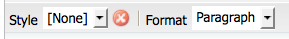
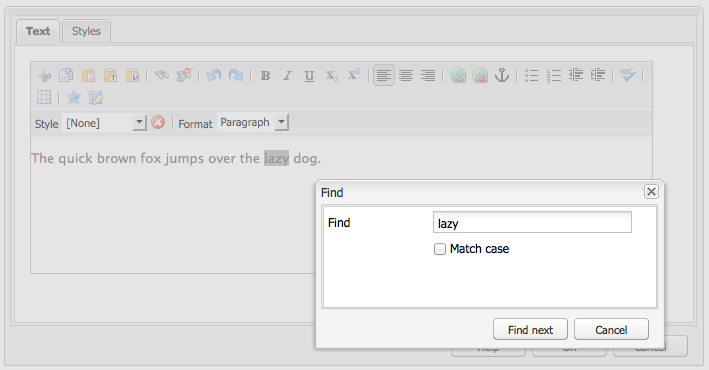
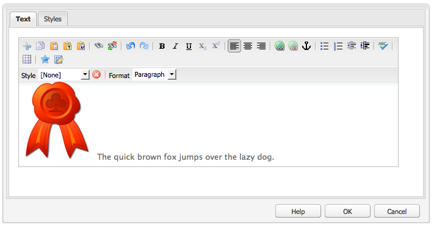

# RTF 編輯器 {#rich-text-editor}

RTF編輯器是將文字內容輸入AEM的基本建置區塊。 它構成了各種元件的基礎，包括：

* 文字
* 文字影像
* 表格

## RTF 編輯器 {#rich-text-editor-1}

WYSIWYG編輯對話框提供了多種功能：

>[!NOTE]
>
>可用的功能可針對個別專案進行設定，因此安裝時可能會有所不同。

## 就地編輯 {#in-place-editing}

除了以對話方塊為基礎的RTF編輯模式外，AEM也提供就地編輯模式，當文字顯示在頁面版面中時，可直接編輯文字。

在段落上按兩下（按兩下滑鼠即可進入就地編輯模式）（元件邊框現在會是橘色）。

您將能直接編輯頁面上的文字，而非在對話方塊視窗內。 只需進行變更，系統就會自動儲存。

>[!NOTE]
>
>如果您已開啟內容尋找器，則索引標籤頂端會顯示包含RTE格式選項的工具列（如上所示）。
>
>如果未開啟內容尋找器，則不會顯示工具列。

目前，已針對 **文字** 和 **標題** 元件。

>[!NOTE]
>
>此 [!UICONTROL 標題] 元件設計為包含不帶換行符的短文本。 在「就地編輯模式」中編輯標題時，輸入換行符將開啟新的 **文字** 元件。

## RTF編輯器的功能 {#features-of-the-rich-text-editor}

RTF編輯器提供一系列功能，這些 [取決於設定](/help/sites-administering/rich-text-editor.md) 個別元件中。 觸控最佳化和傳統UI皆提供這些功能。

### 基本字元格式 {#basic-character-formats}

您可以在此將格式套用至選取（反白顯示）的字元；有些選項也有快捷鍵：

* 粗體(Ctrl-B)
* 斜體(Ctrl-I)
* 下划線(Ctrl-U)
* 下標
* 上標

所有選項都會切換，因此重新選取會移除格式。

### 預先定義的樣式和格式 {#predefined-styles-and-formats}

您的安裝可包含預先定義的樣式和格式。 這些可搭配 **[!UICONTROL 樣式]** 和 **[!UICONTROL 格式]** 下拉式清單，可套用至您選取的文字。

樣式可套用至特定字串（與CSS關聯的樣式）:

雖然格式被應用於整個文本段落(格式是基於HTML的):

只能更改特定格式(預設為 **[!UICONTROL 段落]**)。

樣式可移除；將游標置於已應用樣式的文本中，然後按一下移除表徵圖：

>[!CAUTION]
>
>實際上，請不要重新選擇已應用樣式或表徵圖將被停用的任何文本。

### 剪下，複製，貼上 {#cut-copy-paste}

標準函式 **[!UICONTROL 剪下]** 和 **[!UICONTROL 複製]** 的URL區段。 幾種 **[!UICONTROL 貼上]** 被提供以適應不同的格式。

* 剪切(Ctrl-X)
* 複製(Ctrl-C)
* 貼上這是元件的預設貼上機制(Ctrl-V);當安裝為現成可用時，這會設定為 [!UICONTROL 從Word貼上].

* 貼上為文字：移除所有樣式和格式，僅貼上純文字。

* 從Word貼上：這會將內容貼上為HTML（含一些必要的重新格式設定）。

### 還原，重做 {#undo-redo}

AEM會依時間順序保留目前元件中最近50個動作的記錄。 如有需要，這些動作可以嚴格依序復原（然後重新完成）。

>[!CAUTION]
>
>僅為當前編輯會話保留歷史記錄。 每次開啟元件進行編輯時，都會重新啟動。

>[!NOTE]
>
>50是預設的任務數。 對於您的安裝而言，這可能有所不同。

### 對齊方式 {#alignment}

文字可以左對齊、中對齊或右對齊。

### 縮排 {#indentation}

段落的縮進可以增加或減少。 所選段落將縮進，輸入的任何新文本將保留當前縮進級別。

### 清單 {#lists}

可在文字中建立項目符號和編號清單。 選擇清單類型並開始鍵入或突出顯示要轉換的文本。 在這兩種情況下，行摘要都會啟動新的清單項目。

嵌套清單可透過縮進一或多個清單項目來達成。

只需將游標置於清單內，然後選取其他樣式，即可更改清單的樣式。 子清單也可以與包含清單有不同的樣式。 建立子清單後（透過縮排），即可套用此項目。

### 連結 {#links}

URL的連結（在您的網站內或外部位置）是透過醒目提示所需文字，然後按一下超連結圖示來產生：

對話方塊可讓您指定目標URL;以及是否應在新視窗中開啟它。

您可以：

* 直接鍵入URI
* 使用網站地圖來選取網站內的頁面
* 輸入URI，然後附加目標錨點；例如 `www.TargetUri.org#AnchorName`
* 僅輸入錨點（以參考「目前頁面」）;例如， `#anchor`
* 在內容尋找器中搜尋頁面，然後將頁面圖示拖放至超連結對話方塊中

>[!NOTE]
>
>URI可以前面加上為安裝配置的任何協定。 在標準安裝中，這些 `https://`, `ftp://`，和 `mailto:`. 未為安裝配置的協定將被拒絕，並標籤為無效。

要將游標置於連結文本內的任意位置，請按一下 [!UICONTROL 取消連結] 圖示：

### 錨點 {#anchors}

錨點可以通過定位游標或選擇某些文本在文本中的任意位置建立。 然後按一下 **錨點** 圖示以開啟對話方塊。

輸入錨點名稱，然後按一下 **確定** 儲存。

編輯元件時會顯示錨點，現在可用於目標內的連結。

### 查找和替換 {#find-and-replace}

AEM提供 **查找** 和 **取代** （尋找和取代）函式。

都有 **查找下一個** 按鈕，搜索開啟的元件以查找指定的文本。 您也可以指定是否需要比對大小寫（上/下）。

搜索將始終從文本中的當前游標位置開始。 到達元件結尾時，會顯示訊息，通知您下一個搜尋作業將從頂端開始。

此 **取代** 選項 **查找**，然後 **取代** 具有指定文字的個別例項，或 **全部替換** 例項。

### 影像 {#images}

您可以從內容尋找器拖曳影像，將其新增至文字。

>[!NOTE]
>
>AEM也提供專用元件，以供進行更詳細的影像設定。 例如 **影像** 和 **文字影像** 元件可供使用。

### 拼寫檢查程式 {#spelling-checker}

拼寫檢查器將檢查當前元件中的所有文本。

會強調顯示任何不正確的拼字：

>[!NOTE]
>
>拼字檢查程式會以網站的語言執行，方法是取用子樹狀結構的語言屬性或從URL擷取語言。 例如 `en` 將檢查分支是否為英文， `de` 德文分行。

### 表格 {#tables}

表格可同時使用：

* 作為 **表格** 元件

   

* 從 **文字** 元件

   

   >[!NOTE]
   >
   >雖然表格可在RTE中使用，但建議使用 **表格** 元件。

在 **文字** 和 **表格** 元件表格功能可透過內容功能表（通常是滑鼠右鍵）按一下表格內；例如：

>[!NOTE]
>
>在 **表格** 元件，也提供專用工具列，包括各種標準RTF編輯器函式，以及表特定函式的子集。

表的特定函式為：

* [表屬性](#table-properties)
* [儲存格屬性](#cell-properties)
* [新增或刪除列](#add-or-delete-rows)
* [添加或刪除列](#add-or-delete-columns)
* [選擇整行或列](#selecting-entire-rows-or-columns)
* [合併儲存格](#merge-cells)
* [分割儲存格](#split-cells)
* [嵌套表](#creating-nested-tables)
* [刪除表](#remove-table)

#### 表屬性 {#table-properties}

按一下「 」之前，可以設定表格的基本屬性 **確定** 要保存：

* **寬度**:表格的總寬度。

* **高度**:表的總高度。

* **邊框**:表格邊框的大小。

* **單元格填充**:這會定義儲存格內容與其邊界之間的空白。

* **儲存格間距**:這會定義儲存格之間的距離。

>[!NOTE]
>
>「寬度」和「高度」等少數儲存格屬性可定義為像素或百分比。

>[!CAUTION]
>
>Adobe建議您為表格定義寬度。

#### 儲存格屬性 {#cell-properties}

可設定特定儲存格或一系列儲存格的屬性：

* **寬度**
* **高度**
* **水準對齊**  — 左、中或右
* **垂直對齊**  — 頂部、中間、底部或基線
* **儲存格類型** — 資料或標題
* **套用至：** 單一儲存格、整列、整欄

#### 新增或刪除列 {#add-or-delete-rows}

可在目前列的上方或下方新增列。

也可刪除目前的列。

#### 添加或刪除列 {#add-or-delete-columns}

欄可新增至目前欄的左側或右側。

也可以刪除當前列。

#### 選擇整行或列 {#selecting-entire-rows-or-columns}

選擇整個當前行或列。 之後即可使用特定動作（例如合併）。

#### 合併儲存格 {#merge-cells}

 

* 如果您已選取一組儲存格，則可將這些儲存格合併為一個。
* 如果您只選取一個儲存格，則可將其與右下方的儲存格合併。

#### 分割儲存格 {#split-cells}

選取要分割的單一儲存格：

* 水準分割儲存格會在目前欄內，產生目前儲存格右側的新儲存格。
* 垂直分割儲存格會在目前儲存格下方，但在目前列內產生新儲存格。

#### 建立嵌套表 {#creating-nested-tables}

建立巢狀表格會在目前儲存格內建立新的獨立表格。

>[!NOTE]
>
>瀏覽器會依賴某些其他行為：
>
>* Windows IE:按住Ctrl鍵+主鍵 — 滑鼠按鈕 — 按一下（通常為左側）以選取多個儲存格。
>* Firefox:拖曳指標以選取儲存格範圍。

#### 刪除表 {#remove-table}

使用選項從 **[!UICONTROL 文字]** 元件。

### 特殊字元 {#special-characters}

RTF編輯器可使用特殊字元；這些值可能會因您的安裝而異。

使用滑鼠查看該字元的放大版本，然後按一下以將其包含在文本中的當前位置。

### 源編輯模式 {#source-editing-mode}

來源編輯模式可讓您查看和編輯元件的基礎HTML。

因此，文字是：

在源模式下，會如下所示（通常源長得多，因此您必須滾動）:

>[!CAUTION]
>
>離開來源模式時，AEM會進行特定驗證檢查（例如，確保區塊中的文字正確包含/巢狀）。 這可能會導致您的編輯變更。
