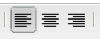
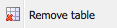

# RTF 編輯器 {#rich-text-editor}

Rich Text Editor是將文字內容輸入AEM的基本建置區塊。 它構成了各個組成部分的基礎，包括：

* 文字
* 文字影像
* 表格

## RTF 編輯器 {#rich-text-editor-1}

WYSIWYG編輯對話方塊提供多種功能：

>[!NOTE]
>
>可用的功能可針對個別專案進行設定，因此可能會因您的安裝而有所不同。

## 就地編輯 {#in-place-editing}

除了以對話方塊為基礎的「豐富式文字編輯」模式外，AEM也提供就地編輯模式，可直接編輯顯示在頁面版面中的文字。

在段落上按兩下（慢速按兩下），以進入就地編輯模式（元件邊框現在為橙色）。

您可以直接編輯頁面上的文字，而不是在對話方塊視窗內。 只要進行變更，就會自動儲存。

>[!NOTE]
>
>如果開啟了內容查找器，則頁籤頂部將顯示一個帶有RTE格式設定選項的工具欄（如上所示）。
>
>如果未開啟內容搜尋器，則不會顯示工具列。

目前，「置入編輯」模式已針對「文字」和「標題」元 **件產生** 的 **頁面元素啟用** 。

>[!NOTE]
>
>Title [!UICONTROL 元件] ，設計為包含沒有換行符的簡短文字。 在「就地編輯模式」中編輯標題時，輸入換行符將開啟標題下方的 **Text** （文本）元件。

## Rich Text Editor的功能 {#features-of-the-rich-text-editor}

Rich Text Editor提供一系列功能，這 [些功能取決於個別元件](/help/sites-administering/rich-text-editor.md) 的設定。 這些功能適用於最佳化觸控和傳統的UI。

### 基本字元格式 {#basic-character-formats}

您可以在這裡將格式套用至選取（反白顯示）的字元；一些選項還有短鍵：

* 粗體(Ctrl-B)
* 斜體(Ctrl-I)
* 下划線(Ctrl-U)
* 下標
* 上標

所有項目都會以切換方式運作，因此重新選取會移除格式。

### 預先定義的樣式和格式 {#predefined-styles-and-formats}

您的安裝可包含預先定義的樣式和格式。 「樣式」( **[!UICONTROL Style]** )和「格式」( **[!UICONTROL Format]** )下拉清單中提供了這些選項，並可以應用於已選擇的文本。

樣式可套用至特定字串（與CSS相關的樣式）:

雖然格式會套用至整個文欄位落（格式是以HTML為基礎的）:

特定格式只能變更(預設為「段 **[!UICONTROL 落]**」)。

可以移除樣式；將游標置於已應用樣式的文本中，然後按一下刪除表徵圖：

>[!CAUTION]
>
>請勿實際重新選取已套用樣式或將停用圖示的任何文字。

### 剪下、複製、貼上 {#cut-copy-paste}

Cut和Copy的標 **[!UICONTROL 準功]****[!UICONTROL 能可用]** 。 提供多種 **[!UICONTROL Paste]** ，以迎合不同格式。

* 剪下(Ctrl-X)
* 複製(Ctrl-C)
* Paste（貼上）這是元件的預設貼上機制(Ctrl-V);當安裝在現成可用的程式中時，此設定為「從 [!UICONTROL Word貼上」]。

* 貼上為文字：移除所有樣式和格式，只貼上純文字。

* 從Word貼上：這會將內容貼為HTML（含一些必要的重新格式化）。

### 還原、重做 {#undo-redo}

AEM會記錄您目前元件中最近50個動作的記錄，依時間順序保留。 如有需要，這些動作可以嚴格依序還原（然後重做）。

>[!CAUTION]
>
>歷史記錄僅保存在當前編輯會話中。 每次開啟要編輯的元件時，它都會重新啟動。

>[!NOTE]
>
>預設任務數為50。 這可能與您的安裝不同。

### 對齊方式 {#alignment}

您的文字可以向左、向中或向右對齊。

### 縮排 {#indentation}

段落的縮進可以增加或減少。 選定段落將進行縮進，所輸入的任何新文本都將保留當前縮進級別。

### 清單 {#lists}

項目清單和編號清單都可在文字中建立。 選擇清單類型並開始鍵入或突出顯示要轉換的文本。 在這兩種情況下，行動態消息都會啟動新的清單項目。

嵌套清單可通過縮進一個或多個清單項來實現。

只要將游標放在清單中，然後選擇其他樣式，即可更改清單的樣式。 子清單也可以與包含清單具有不同的樣式。 建立子清單後（透過縮排），即可套用此項。

### 連結 {#links}

URL的連結（在您的網站或外部位置）是透過反白標示所需文字，然後按一下超連結圖示來產生：

對話方塊可讓您指定目標URL;還有是否應在新視窗中開啟。

您可以：

* 直接輸入URI
* 使用網站地圖在您的網站中選取頁面
* 輸入URI，然後附加目標錨點；例如， `www.TargetUri.org#AnchorName`
* 僅輸入錨點（以參考「目前頁面」）;例如， `#anchor`
* 在內容搜尋器中搜尋頁面，然後將頁面圖示拖放至「超連結」對話方塊

>[!NOTE]
>
>URI可以前置任何為安裝配置的協定。 在標準安裝中，這 `https://`些是 `ftp://`和 `mailto:`。 為安裝配置的協定將被拒絕並標籤為無效。

要斷開連結位置，游標位於連結文本中的任意位置，然後按一下「取消鏈 [!UICONTROL 接] 」表徵圖：

### 錨點 {#anchors}

可以通過定位游標或選擇某些文本在文本中的任意位置建立錨點。 然後按一下「錨 **點** 」圖示以開啟對話方塊。

輸入錨點的名稱，然後按一下「 **確定** 」保存。

錨點會在編輯元件時顯示，現在可用於連結的目標中。

### Find and Replace {#find-and-replace}

AEM提供「尋 **找** 」和「 **取代** （尋找和取代）」功能。

兩者都有 **「查找下一** 步」按鈕，可搜索開啟的元件以查找指定的文本。 您也可以指定是否需要比對大小寫（上／下）。

搜索始終從文本中當前游標位置開始。 當到達元件結尾時，會出現訊息通知您下一個搜尋作業將從頂端開始。

選 **項** 「查找」( **Find**),「查找」( **Replace)，然後****** 「用指定文本替換單個實例」(Individual instances)，或者替換當前元件中的所有實例。

### 影像 {#images}

您可從內容搜尋器拖曳影像，將影像新增至文字。

>[!NOTE]
>
>AEM也提供專用元件，以取得更詳細的影像設定。 例如，「影 **像** 」和「 **文字影像** 」元件可供使用。

### 拼字檢查器 {#spelling-checker}

拼字檢查器將檢查當前元件中的所有文本。

會反白顯示任何不正確的拼字：

>[!NOTE]
>
>拼字檢查器將使用網站的語言操作，方法是獲取子樹的語言屬性或從URL中提取語言。 例如， `en` 將檢查分支是否為英文，並檢查 `de` 分支是否為德文。

### Tables {#tables}

表格可供使用：

* 作為表 **元件**

   

* 在 **Text元件** 內

   

   >[!NOTE]
   >
   >雖然表在RTE中可用，但建議在建立表時使 **用Table** 元件。

在Text **和** Table **** components表格中，都可通過在表格中按一下的上下文菜單（通常是滑鼠右鍵）獲得；例如：

>[!NOTE]
>
>在表 **元件中** ，也提供專用的工具列，包括各種標準富格文本編輯器函式，以及表特定函式的子集。

表格特定的函式包括：

* [表屬性](#table-properties)
* [儲存格屬性](#cell-properties)
* [添加或刪除行](#add-or-delete-rows)
* [添加或刪除列](#add-or-delete-columns)
* [選擇整個行或列](#selecting-entire-rows-or-columns)
* [合併儲存格](#merge-cells)
* [分割儲存格](#split-cells)
* [巢狀表格](#creating-nested-tables)
* [移除表格](#remove-table)

#### Table Properties {#table-properties}

可以在按一下確定保存之前配置表的基 **本屬** 性：

* **寬度**:表的總寬度。

* **高度**:桌子的總高度。

* **邊框**:表格邊框的大小。

* **單元格間距**:這會定義儲存格內容與其邊框之間的空格。

* **儲存格間距**:這會定義儲存格之間的距離。

>[!NOTE]
>
>「寬度」和「高度」等少數儲存格屬性可定義為像素或百分比。

>[!CAUTION]
>
>Adobe建議您為表格定義寬度。

#### Cell Properties {#cell-properties}

可以配置特定單元格或一系列單元格的屬性：

* **寬度**
* **高度**
* **水準對齊** -左、中或右
* **垂直對齊** -頂部、中間、底部或基線
* **儲存格類型**-資料或標題
* **** 套用至：單一儲存格、整列、整欄

#### 添加或刪除行 {#add-or-delete-rows}

可在當前行的上方或下方添加行。

也可以刪除當前行。

#### 添加或刪除列 {#add-or-delete-columns}

欄可以新增至目前欄的左側或右側。

也可以刪除當前列。

#### 選擇整個行或列 {#selecting-entire-rows-or-columns}

選擇整個當前行或列。 然後可使用特定動作（例如合併）。

#### Merge Cells {#merge-cells}

 

* 如果您已選取一組儲存格，您可將這些儲存格合併為一。
* 如果您只選取一個儲存格，則可將它與儲存格合併至右側或下方。

#### 分割儲存格 {#split-cells}

選取單一儲存格來分割：

* 水準分割儲存格會在目前欄內，在目前儲存格的右側產生新儲存格。
* 垂直分割儲存格會在目前儲存格下方，但在目前列內產生新儲存格。

#### 建立嵌套表 {#creating-nested-tables}

建立巢狀表格會在目前儲存格中建立新的自含表格。

>[!NOTE]
>
>某些其他行為與瀏覽器相關：
>
>* Windows IE:使用Ctrl+primary-mouse-button-click（通常為左側）來選取多個儲存格。
>* Firefox:拖曳指標以選取儲存格範圍。

#### Remove Table {#remove-table}

使用選項從 **[!UICONTROL Text元件中刪除表]** 。

### 特殊字元 {#special-characters}

您的豐富式文字編輯器可以使用特殊字元；這些視您的安裝而定。

使用滑鼠移至檢視字元的放大版本，然後按一下以將其包含在文字的目前位置。

### 來源編輯模式 {#source-editing-mode}

來源編輯模式可讓您查看和編輯元件的基礎HTML。

因此，文字：

在源模式下，Will的外觀如下（通常源模式比較長，因此您必須滾動）:

>[!CAUTION]
>
>離開來源模式時，AEM會進行某些驗證檢查（例如，確保文字正確包含／巢狀內嵌在區塊中）。 這會導致您的編輯變更。
