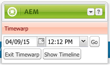

# 使用頁面版本{#working-with-page-versions}

版本修訂會在特定時間點建立頁面的「快照」。 使用版本控制，您可以執行下列動作：

* 建立頁面版本。
* 將頁面還原為舊版，以還原您對頁面所做的變更，例如。
* 比較目前版本的頁面與先前版本，其中反白顯示文字和影像的差異。

## 建立新版本 {#creating-a-new-version}

要建立頁面的新版本：

1. 在瀏覽器中，開啟您要建立新版本的頁面。
1. 在Sidekick中，選擇「版本控 **制** 」標籤，然後 **選擇「建立版本** 」子標籤。

   

1. 輸入注 **釋** （可選）。
1. 若要將標籤設為版本（可選），請按一下「更多>>」 **按鈕** ，然後設定「 **Label** 」來命名版本。 如果未設定標籤，則版本會自動遞增。
1. 按一下 **建立版本**。 頁面上會顯示灰色訊息；例如：1.2版為：襯衫。

>[!NOTE]
>
>當頁面啟動時，會自動建立版本。

## 從Sidekick還原頁面版本 {#restoring-a-page-version-from-sidekick}

要將頁面還原為舊版：

1. 開啟您要還原舊版的頁面。
1. 在sidekick中，選擇「版本 **修訂** 」頁籤，然 **後選擇「恢復版本** 」子頁籤。

   

1. 選擇要恢復的版本，然後選擇「恢 **復」**。

## 從控制台還原頁面版本 {#restoring-a-page-version-from-the-console}

此方法可用於還原頁面版本。 它也可用於還原先前已刪除的頁面：

1. 在「網 **站** 」主控台中，導覽至您要復原的頁面並加以選取。
1. 從頂部菜單中依次選 **擇工具**、 **恢復**:

   

1. **選擇**&#x200B;恢復版本……列出當前資料夾中的文檔版本。 即使已刪除頁面，也會列出最後一個版本：

   

1. 選擇要恢復的版本，然後按一下「恢 **復」**。 AEM會還原您選取的版本（或樹狀結構）。

### 從控制台恢復樹 {#restoring-a-tree-from-the-console}

此方法可用於還原頁面版本。 它也可用於還原先前已刪除的頁面：

1. 在「網 **站** 」主控台中，導覽至您要復原的檔案夾並加以選取。
1. 從頂部菜單中依次選 **擇工具**、 **恢復**。
1. **選擇**&#x200B;恢復樹……開啟對話框，以便選擇要恢復的樹：

   

1. 按一下 **恢復**。 AEM會還原您選取的樹狀結構。

## 與舊版比較 {#comparing-with-a-previous-version}

要比較頁面的當前版本和舊版：

1. 在瀏覽器中，開啟您要與舊版比較的頁面。
1. 在Sidekick中，選擇「版本 **控制** 」頁籤，然 **後選**&#x200B;擇「恢復版本」子頁籤。

   

1. 選擇要比較的版本，然後按一下「比較 **」按鈕** 。
1. 當前版本與選定版本之間的差異如下：

   * 已刪除的文字為紅色，並已穿透。
   * 已添加的文本為綠色並突出顯示。
   * 已新增或刪除的影像會以綠色框架顯示。
   

1. 在Sidekick中，選擇「 **Restore Version** 」(還原版本 **)子標籤，然後按一** 下「&lt;&lt;Back」（返回）按鈕以顯示目前版本。

## Timewarp {#timewarp}

時間彎曲是一種功能，可模 ***擬過去*** 特定時間頁面的發佈狀態。

其目的是讓您在選取的時間點追蹤發佈的網站。 這會使用頁面啟動來判斷發佈環境的狀態。

要執行此操作：

* 系統會尋找在選取時間作用中的頁面版本。
* 這表示在「時間彎曲」中選取的時 *間點之前* ，已建立／啟動顯示的版本。
* 導航到已刪除的頁面時，也會呈現此資訊——只要該頁面的舊版本仍然在儲存庫中可用。
* 如果找不到任何發佈版本，則「時間彎曲」會回復為作者環境上頁面的目前狀態（這是為了防止發生錯誤/404頁面，這表示您無法再瀏覽）。

>[!NOTE]
>
>如果從儲存庫中刪除版本，則「時間彎曲」無法顯示正確的視圖。 此外，如果轉換網站的元素（例如程式碼、css、影像等）已變更，檢視會與原本的檢視不同，因為這些項目未在儲存庫中版本化。

### 使用時間彎曲日曆 {#using-the-timewarp-calendar}

Timewarp可從sidekick取得。

如果您有特定的日期要檢視，則會使用日曆版本：

1. 開啟「版 **本修訂** 」標籤，然後按一 **下「時間彎曲** 」（靠近側腳底部）。 將顯示以下對話框：

   

1. 使用日期和時間選擇器指定您想要的日期／時間，然後按一下「 **開始**」。

   時間彎曲會顯示頁面在您選擇之日期之前／之前的發佈狀態。

   >[!NOTE]
   >
   >時間彎曲功能只有在您先前已發佈頁面時才能完全運作。 如果不是，時間彎曲會顯示作者環境中的目前頁面。

   >[!NOTE]
   >
   >如果導航到已從儲存庫中刪除／刪除的頁，如果該頁的舊版本仍然在儲存庫中可用，則會正確呈現該頁。

   >[!NOTE]
   >
   >您無法編輯舊版頁面。 僅供檢視。 如果要恢復舊版，則必須使用恢復手動執行 [操作](/help/sites-classic-ui-authoring/classic-page-author-work-with-versions.md#restoring-a-page-version-from-sidekick)。

1. 檢視完頁面後，按一下：

   * **退出時間彎曲** ，以退出並返回目前的作者頁面。
   * [顯示時間軸](#using-the-timewarp-timeline) ，以檢視時間軸。
   

### 使用時間彎曲時間軸 {#using-the-timewarp-timeline}

如果您想要檢視頁面上發佈活動的概述，則會使用時間軸版本。

如果要查看文檔的時間軸：

1. 若要顯示時間軸，您可以：

   1. 開啟「版 **本修訂** 」標籤，然後按一 **下「時間彎曲** 」（靠近側腳底部）。

   1. 使用使用「時間彎曲日曆」 [後顯示的側鍵對話方塊](#using-the-timewarp-calendar)。

1. 按一下「 **顯示時間軸** 」(Show Timeline)-檔案的時間軸將會出現；例如：

   

1. 選取並移動（按住並拖曳）時間軸，以在檔案的時間軸中移動。

   * 所有行都表示已發佈版本。
啟動頁面時，會開始新行。 每次編輯文檔時，都會顯示新顏色。
在以下範例中，紅線表示頁面是在初始綠色版本的時間範圍內編輯的，黃線表示頁面在紅色版本等期間曾編輯過。
   

1. 按一下:

   1. **前往** ，以顯示所選時間點的已發佈頁面內容。
   1. 當顯示該內容時，請使 **用「退出時間彎曲** 」退出並返回目前的作者頁面。

### 時間彎曲限制 {#timewarp-limitations}

時間彎曲會盡力在選取的時間點重制頁面。 不過，由於AEM中持續製作內容十分複雜，因此並非總能做到。 當您使用Timewarp時，應牢記這些限制。

* **時間彎曲會根據已發佈的頁面運作** -只有在您先前已發佈頁面時，時間彎曲才會完全運作。 如果不是，時間彎曲會顯示作者環境中的目前頁面。
* **時間彎曲使用頁面版本** -如果您導覽至已從儲存庫中移除／刪除的頁面，如果舊版頁面仍在儲存庫中，則會正確呈現該頁面。
* **刪除的版本會影響「時間彎曲** 」 —— 如果從儲存庫中刪除版本，則「時間彎曲」無法顯示正確的視圖。

* **時間彎曲為唯讀** -您無法編輯舊版頁面。 僅供檢視。 如果要恢復舊版，則必須使用恢復手動執行 [操作](#main-pars-title-1)。

* **時間彎曲僅基於頁面內容** -如果轉換網站的元素（例如程式碼、css、資產／影像等）已變更，檢視會與原本的檢視不同，因為這些項目未在儲存庫中版本化。

>[!CAUTION]
>
>時間彎曲功能是設計為工具，可協助作者瞭解並建立其內容。 它不是作為審計日誌或用於法律目的。
