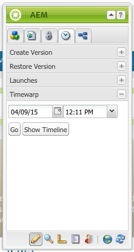

# 使用頁面版本{#working-with-page-versions}

版本設定功能會在特定時間點建立頁面的「快照」。 使用版本設定，您可以執行下列動作：

* 建立頁面的版本。
* 將頁面還原成先前的版本，讓您能夠復原對頁面所做的變更。
* 比較頁面目前的版本與上一個版本，以及反白顯示的文字和影像差異。

## 建立版本 {#creating-a-new-version}

若要建立頁面的版本：

1. 在瀏覽器中，開啟您要建立版本的頁面。
1. 在Sidekick中，選取 **版本設定** 標籤，然後 **建立版本** 子標籤。

   

1. 輸入 **註解** （選擇性）。
1. 若要將標籤設定為版本（選擇性），請按一下 **更多>>** 按鈕並設定 **標籤** 以命名版本。 如果未設定標籤，版本為自動遞增的數字。
1. 按一下 **建立版本**. 頁面會顯示灰色訊息；例如：為T恤建立的1.2版。

>[!NOTE]
>
>頁面啟動後會自動建立版本。

## 從Sidekick還原頁面版本 {#restoring-a-page-version-from-sidekick}

若要將頁面還原成先前的版本：

1. 開啟您要還原先前版本的頁面。
1. 在sidekick中，選取 **版本設定** 標籤，然後 **還原版本** 子標籤。

   

1. 選取您要還原的版本，然後選取 **還原**.

## 從主控台還原頁面版本 {#restoring-a-page-version-from-the-console}

此方法可用來還原頁面版本。 它也可用來還原先前已刪除的頁面：

1. 在 **網站** 主控台，導覽至您要還原的頁面，然後選取該頁面。
1. 從頂端選單中選取 **工具**，然後 **還原**：

   

1. 選取 **還原版本……** 列出目前資料夾中的檔案版本。 即使頁面已刪除，仍會列出最後一個版本：

   

1. 選取您要還原的版本，然後按一下 **還原**. AEM會還原您選取的版本（或樹狀結構）。

### 從主控台還原樹狀結構 {#restoring-a-tree-from-the-console}

此方法可用來還原頁面版本。 它也可用來還原先前已刪除的頁面：

1. 在 **網站** 主控台，瀏覽至您要還原的資料夾並加以選取。
1. 從頂端選單中選取 **工具**，然後 **還原**.
1. 選取 **還原樹狀結構……** 開啟對話方塊，以便選取要還原的樹狀結構：

   

1. 按一下 **還原**. AEM會還原您選取的樹狀結構。

## 與舊版比較 {#comparing-with-a-previous-version}

若要將頁面的目前版本與先前版本進行比較：

1. 在瀏覽器中，開啟您要與先前版本比較的頁面。
1. 在Sidekick中，選取 **版本設定** 標籤，然後 **還原版本** n個子標籤。

   

1. 選取您要比較的版本，然後按一下 **差異** 按鈕。
1. 目前版本與所選版本之間的差異顯示如下：

   * 已刪除的文字會變成紅色並點進。
   * 已新增的文字會以綠色反白顯示。
   * 已新增或刪除的影像會以綠色框線顯示。

   

1. 在Sidekick中，選取 **還原版本** 子標籤，然後按一下 **&lt;&lt;back span=&quot;&quot; id=&quot;3&quot; translate=&quot;no&quot; /> 按鈕以顯示目前版本。**

## Timewarp {#timewarp}

時間扭曲是一項功能，旨在模擬 ***已發佈*** 過去特定時間的頁面狀態。

目的是讓您在選取的時間點追蹤已發佈的網站。 這會使用頁面啟用來判斷發佈環境的狀態。

若要這麼做：

* 系統會尋找在選取的時間使用中的頁面版本。
* 這表示顯示的版本已建立/啟動 *早於* 在時間扭曲中選取的時間點。
* 當導覽至已刪除的頁面時，也會轉譯此功能 — 只要該頁面的舊版本仍然在存放庫中即可。
* 如果找不到發佈的版本，則Timewarp會回覆成作者環境中頁面的目前狀態（這是為了避免錯誤/404頁面，這表示您無法再瀏覽）。

>[!NOTE]
>
>如果從存放庫移除版本，則時間扭曲無法顯示正確的檢視。 此外，如果呈現網站的元素（例如程式碼、css和影像）已變更，則檢視會與原本不同，因為這些專案不在存放庫中建立版本。

### 使用時間扭曲行事曆 {#using-the-timewarp-calendar}

Timewarp可在Sidekick中使用。

如果您要檢視特定日期，則會使用行事曆版本：

1. 開啟 **版本設定** 標籤，然後按一下 **時間扭曲** （接近側拍底部）。 下列對話方塊隨即顯示：

   

1. 使用日期和時間選擇器指定您想要的日期/時間，然後按一下 **前往**.

   時間扭曲會顯示頁面在您選擇日期之前/當天的發佈狀態。

   >[!NOTE]
   >
   >只有在您先前已發佈頁面時，時間扭曲功能才能完全運作。 如果沒有，Timewarp會在作者環境中顯示目前頁面。

   >[!NOTE]
   >
   >如果您瀏覽到的頁面已從存放庫移除或刪除，如果該頁面的舊版本仍然位於存放庫中，則該頁面會正確呈現。

   >[!NOTE]
   >
   >您無法編輯頁面的舊版本。 它僅供檢視。 如果您想要還原較舊的版本，可以使用 [還原](/help/sites-classic-ui-authoring/classic-page-author-work-with-versions.md#restoring-a-page-version-from-sidekick).

1. 檢視完頁面後，請按一下：

   * **退出Timewarp** 以結束並返回目前的作者頁面。
   * [顯示時間表](#using-the-timewarp-timeline) 以便檢視時間表。

   

### 使用Timewarp時間表 {#using-the-timewarp-timeline}

如果您想要在頁面上檢視發佈活動的概觀，請使用時間軸版本。

如果要檢視檔案的時間表：

1. 若要顯示時間軸，請執行下列任一項作業：

   1. 開啟 **版本設定** 標籤，然後按一下 **時間扭曲** （接近側拍底部）。

   1. 使用之後顯示的sidekick對話方塊 [使用時間扭曲行事曆](#using-the-timewarp-calendar).

1. 按一下 **顯示時間表**  — 檔案的時間表會出現；例如：

   

1. 選取並移動（按住並拖曳）時間軸，以在檔案的時間軸中移動。

   * 所有行都表示已發佈的版本。
頁面啟動時，就會開始新的一行。 每次編輯檔案時，都會顯示新顏色。
在以下範例中，紅線表示頁面是在初始綠色版本的時間範圍內進行編輯。 黃線表示頁面在紅色版本期間編輯過，依此類推。

   

1. 按一下:

   1. **前往** 顯示所選時間已發佈頁面的內容。
   1. 顯示該內容時，請使用 **退出Timewarp** 以結束並返回目前的作者頁面。

### 時間扭曲限制 {#timewarp-limitations}

Timewarp會盡力在選取的時間點重製頁面。 但由於在AEM中持續編寫內容的過程非常複雜，並非總是可以做到這一點。 使用Timewarp時，請牢記以下限制。

* **時間扭曲根據已發佈的頁面運作**  — 只有在您先前已發佈頁面時，時間扭曲功能才能完全運作。 如果沒有，Timewarp會在作者環境中顯示目前頁面。
* **Timewarp使用頁面版本**  — 如果您導覽至已從存放庫移除/刪除的頁面，如果該頁面的舊版本仍然位於存放庫中，則會正確呈現該頁面。
* **已移除的版本會影響時間扭曲**  — 如果從存放庫移除版本，則時間扭曲無法顯示正確的檢視。

* **時間扭曲為唯讀**  — 您無法編輯頁面的舊版本。 它僅供檢視。 如果您想要還原較舊的版本，可以使用 [還原](#main-pars-title-1).

* **時間扭曲僅以頁面內容為基礎**  — 如果轉譯網站的元素（例如程式碼、css和影像資產）已變更，則檢視會與原本不同。 原因是這些專案沒有在存放庫中建立版本。

>[!CAUTION]
>
>Timewarp的設計目的是協助作者瞭解及建立其內容。 其目的並非作為稽核記錄或用於法律目的。
