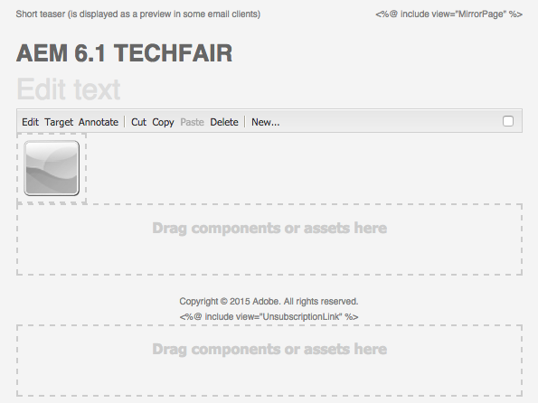
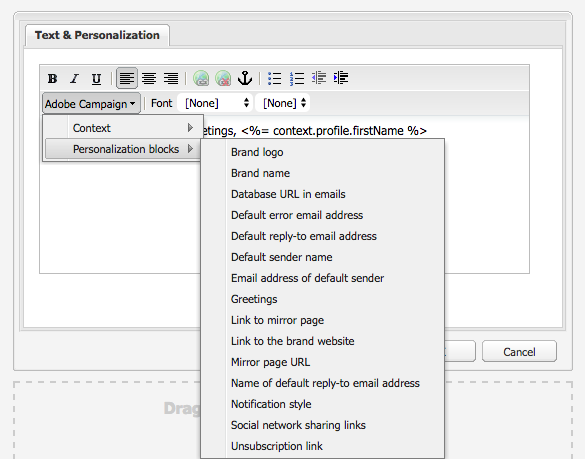

# 與Adobe Campaign6.1和Adobe Campaign Standard合作{#working-with-adobe-campaign-and-adobe-campaign-standard}

您可以在中建立電子郵件內AEM容並在Adobe Campaign電子郵件中處理。 要做到這一點，您必須：

1. 從特定於Adobe Campaign的AEM模板中建立新新聞簡報。
1. 選擇 [Adobe Campaign](#selectingtheadobecampaigncloudservice) 編輯內容以訪問所有功能之前。
1. 編輯內容。
1. 驗證內容。

然後，內容可以與在Adobe Campaign的遞送同步。 本文檔中介紹了詳細說明。

>[!NOTE]
>
>在使用此功能之前，必須配置AEM以與 [Adobe Campaign](/help/sites-administering/campaignonpremise.md) 或 [Adobe Campaign Standard](/help/sites-administering/campaignstandard.md)。

## 通過Adobe Campaign發送電子郵件內容 {#sending-email-content-via-adobe-campaign}

配置和AEMAdobe Campaign後，您可以直接在中建立電子郵件傳遞內AEM容，然後在Adobe Campaign處理。

在中建立Adobe Campaign內AEM容時，必須先連結到Adobe Campaign服務，然後才能編輯內容以訪問所有功能。

可能有兩種情況：

* 內容可以與來自Adobe Campaign的傳送同步。 這允許您在交AEM付中使用內容。
* (僅限Adobe Campaign在本地)內容可以直接發送到Adobe Campaign，而後者會自動生成新的電子郵件傳送。 此模式具有限制。

本文檔中介紹了詳細說明。

### 建立新電子郵件內容 {#creating-new-email-content}

>[!NOTE]
>
>添加電子郵件模板時，請確保在 **/內容/活動** 讓它們可用。

1. 在AEM中，選擇 **網站** 資料夾，然後瀏覽瀏覽器以查找管理電子郵件活動的位置。 在以下示例中，相關節點 **網站** > **市場活動** > **Geometrixx Outdoors** > **電子郵件活動**。

   >[!NOTE]
   >
   >[電子郵件示例僅在Geometrixx中提供](/help/sites-developing/we-retail.md#weretail)。 請從包共用下載示例Geometrixx內容。

   

1. 選擇 **新建** > **新建頁面** 建立新電子郵件內容。
1. 選擇特定於Adobe Campaign的可用模板之一，然後填充該頁的常規屬性。 預設情況下有三個模板：

   * **Adobe Campaign電郵(AC 6.1)**:允許您在將內容發送到Adobe Campaign6.1以交付之前，將內容添加到預定義模板。
   * **Adobe Campaign電子郵件(ACS)**:允許您在將內容發送到Adobe Campaign Standard以交付之前將內容添加到預定義模板。

   

1. 按一下 **建立** 建立電子郵件或新聞稿。

### 選擇Adobe Campaign雲服務和模板 {#selecting-the-adobe-campaign-cloud-service-and-template}

要與Adobe Campaign整合，您需要在頁面中添加Adobe Campaign雲服務。 這樣，您就可以訪問個性化和其他Adobe Campaign資訊。

此外，您還可能需要選擇Adobe Campaign模板並更改主題，並為那些不在HTML中查看電子郵件的用戶添加純文字檔案內容。

1. 選擇 **頁面** 頁籤，然後選擇 **頁面屬性。**
1. 在 **雲服務** 頁籤，選擇 **添加服務** 添加Adobe Campaign服務，然後按一下 **確定**。

   

1. 從下拉清單中選擇與Adobe Campaign實例匹配的配置，然後按一下 **確定**。

   >[!NOTE]
   >
   >確保點擊/按一下 **確定** 或 **應用** 添加雲服務後。 這樣， **Adobe Campaign** 按鈕。

1. 如果要應用特定的電子郵件傳遞模板(來自Adobe Campaign)，但預設 **郵件** 模板，選擇 **頁面屬性** 的雙曲餘切值。 在 **Adobe Campaign** 頁籤，在相關的Adobe Campaign實例中輸入電子郵件傳遞模板的內部名稱。

   在Adobe Campaign Standard，模板是 **隨內容交AEM付**。 在Adobe Campaign6.1中，模板 **包含內容的電子郵AEM件傳遞**。

   選擇模板時，將自AEM動啟用 **Adobe Campaign通訊** 元件。

### 編輯電子郵件內容 {#editing-email-content}

您可以在經典用戶介面或觸控優化用戶介面中編輯電子郵件內容。

1. 通過選擇 **頁面屬性** > **電子郵件** 的下界。

   

1. 通過添加希望從旁站中可用的元素來編輯電子郵件內容。 要執行此操作，請拖放它們。 然後按兩下要編輯的元素。

   例如，可以添加包含個性化欄位的文本。

   

   請參閱 [Adobe Campaign元件](/help/sites-classic-ui-authoring/classic-personalization-ac-components.md) 介紹Adobe Campaign通訊/電子郵件活動可用的元件。

   

### 插入個性化 {#inserting-personalization}

編輯內容時，可以插入：

* Adobe Campaign上下文欄位。 這些欄位可以插入文本中，並根據收件人的資料（例如，名字、姓氏或目標維的任何資料）進行調整。
* Adobe Campaign個性化區。 這些是與收件人資料無關的預定義內容塊，如品牌徽標或指向鏡像頁面的連結。

請參閱 [Adobe Campaign元件](/help/sites-classic-ui-authoring/classic-personalization-ac-components.md) 的子菜單。

>[!NOTE]
>
>* 只有Adobe Campaign的田地 **配置檔案** 目標維度被考慮在內。
>* 查看屬性時 **站點**，您無權訪問Adobe Campaign上下文欄位。 您可以在編輯時直接從電子郵件訪問這些內容。
>

1. 插入新 **新聞稿** > **文本和個性化（市場活動）** 元件。
1. 按兩下元件以開啟它。 的 **編輯** 窗口具有插入個性化元素的功能。

   >[!NOTE]
   >
   >可用上下文欄位與 **配置檔案** 瞄準Adobe Campaign。
   >
   >請參閱 [將頁面AEM連結到Adobe Campaign電子郵件](/help/sites-classic-ui-authoring/classic-personalization-ac-campaign.md#linkinganaempagetoanadobecampaignemail)。

   

1. 選擇 **客戶端上下文** 使用個人配置檔案中的資料test個性化欄位。

   

1. 將出現一個窗口，允許您選擇您喜歡的角色。 個性化欄位被來自所選配置檔案的資料自動替換。

   

### 預覽新聞稿 {#previewing-a-newsletter}

您可以預覽新聞稿的外觀以及預覽個性化。

1. 開啟要預覽的新聞稿，然後按一下「預覽」（放大鏡）以縮小旁邊。
1. 按一下電子郵件客戶端表徵圖之一，查看新聞稿在每個電子郵件客戶端中的外觀。

   

1. 展開旁邊框以再次開始編輯。

### 在中批准內AEM容 {#approving-content-in-aem}

內容完成後，您可以啟動審批流程。 轉到 **工作流** 的子菜單。 **批准Adobe Campaign** 工作流。

此現成工作流分為兩個步驟：修訂，然後審批，或修訂，然後拒絕。 然而，該工作流可以擴展並適應更複雜的過程。

要批准Adobe Campaign的內容，請通過選擇 **工作流** 在旁邊 **批准Adobe Campaign** 按一下 **啟動工作流**。 執行步驟並批准內容。 也可以通過選擇 **拒絕** 而不是 **批准** 的上界。

內容獲得批准後，它似乎在Adobe Campaign獲得批准。 然後可以發送電子郵件。

在Adobe Campaign Standard:

在Adobe Campaign6.1:

>[!NOTE]
>
>未批准的內容可以與Adobe Campaign的傳遞同步，但無法執行該傳遞。 只能通過市場活動交付發送已批准的內容。

## 連AEM接Adobe Campaign Standard和Adobe Campaign6.1 {#linking-aem-with-adobe-campaign-standard-and-adobe-campaign}

>[!NOTE]
>
>請參閱 [連AEM接Adobe Campaign Standard和Adobe Campaign6.1](/help/sites-authoring/campaign.md#linking-aem-with-adobe-campaign-standard-and-adobe-campaign-classic) 在 [與Adobe Campaign6.1和Adobe Campaign Standard合作](/help/sites-authoring/campaign.md) 在標準創作文檔中獲取詳細資訊。
