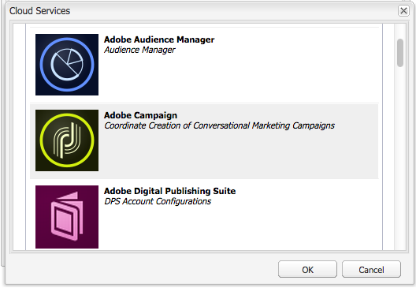

# 協作使用Adobe Campaign 6.1和Adobe Campaign Standard{#working-with-adobe-campaign-and-adobe-campaign-standard}

您可以在AEM中建立電子郵件內容，並在Adobe Campaign電子郵件中處理。 要執行此操作，您必須：

1. 從Adobe Campaign專用範本在AEM中建立新電子報。
1. 選擇 [Adobe Campaign服務](#selectingtheadobecampaigncloudservice) 編輯內容以存取所有功能之前。
1. 編輯內容。
1. 驗證內容。

然後，內容便可在Adobe Campaign中與傳送同步。 本檔案將詳細說明。

>[!NOTE]
>
>您必須先設定AEM以與 [Adobe Campaign](/help/sites-administering/campaignonpremise.md) 或 [Adobe Campaign Standard](/help/sites-administering/campaignstandard.md).

## 透過Adobe Campaign傳送電子郵件內容 {#sending-email-content-via-adobe-campaign}

設定AEM和Adobe Campaign後，您可以直接在AEM中建立電子郵件傳送內容，然後在Adobe Campaign中處理。

您在AEM中建立Adobe Campaign內容時，必須先連結至Adobe Campaign服務，才能編輯內容以存取所有功能。

可能有兩種情況：

* 內容可與來自Adobe Campaign的傳送同步。 這可讓您在傳遞中使用AEM內容。
* (僅限Adobe Campaign內部部署)內容可直接傳送至Adobe Campaign，而自動產生新的電子郵件傳送。 此模式有其限制。

本檔案將詳細說明。

### 建立新電子郵件內容 {#creating-new-email-content}

>[!NOTE]
>
>新增電子郵件範本時，請務必在 **/content/campaigns** 才能讓它們可用。

1. 在AEM中，選取 **網站** 資料夾，然後瀏覽您的檔案總管，以尋找管理電子郵件促銷活動的位置。 在以下範例中，相關節點為 **網站** > **行銷活動** > **Geometrixx Outdoors** > **電子郵件行銷活動**.

   >[!NOTE]
   >
   >[電子郵件範例僅適用於Geometrixx](/help/sites-developing/we-retail.md#weretail). 請從「封裝共用」下載Geometrixx內容範例。

   

1. 選擇 **新增** > **新頁面** 建立新電子郵件內容。
1. 選取Adobe Campaign專用的其中一個可用範本，然後填入頁面的一般屬性。 預設提供三個範本：

   * **Adobe Campaign電子郵件(AC 6.1)**:可讓您先將內容新增至預先定義的範本，再將其傳送至Adobe Campaign 6.1進行傳送。
   * **Adobe Campaign電子郵件(ACS)**:可讓您先將內容新增至預先定義的範本，再將其傳送至Adobe Campaign Standard進行傳送。

   

1. 按一下 **建立** 以建立電子郵件或電子報。

### 選取Adobe Campaign雲端服務與範本 {#selecting-the-adobe-campaign-cloud-service-and-template}

若要與Adobe Campaign整合，您必須將Adobe Campaign雲端服務新增至頁面。 這麼做可讓您存取個人化和其他Adobe Campaign資訊。

此外，您可能還需要選取Adobe Campaign範本並變更主旨，並為不會以HTML檢視電子郵件的使用者新增純文字內容。

1. 選取 **頁面** 標籤，然後選取 **頁面屬性。**
1. 在 **雲端服務** 頁簽，選擇 **添加服務** 若要新增Adobe Campaign服務，然後按一下 **確定**.

   

1. 從下拉式清單中選取符合您Adobe Campaign例項的設定，然後按一下 **確定**.

   >[!NOTE]
   >
   >請務必點選/按一下 **確定** 或 **套用** 新增雲端服務後。 這可讓 **Adobe Campaign** 標籤才能正常運作。

1. 如果您想要套用特定的電子郵件傳送範本(來自Adobe Campaign)，但預設值除外 **郵件** 範本，選取 **頁面屬性** 。 在 **Adobe Campaign** 標籤，在相關的Adobe Campaign例項中輸入電子郵件傳送範本的內部名稱。

   在Adobe Campaign Standard中，範本為 **透過AEM內容傳送**. 在Adobe Campaign 6.1中，範本為 **包含AEM內容的電子郵件傳送**.

   選取範本時，AEM會自動啟用 **Adobe Campaign電子報** 元件。

### 編輯電子郵件內容 {#editing-email-content}

您可以在傳統使用者介面或觸控最佳化使用者介面中編輯電子郵件內容。

1. 透過選取 **頁面屬性** > **電子郵件** 從工具箱中。

   

1. 從sidekick中可用的元素新增您想要的元素，以編輯電子郵件內容。 要執行此操作，請拖放它們。 然後連按兩下您要編輯的元素。

   例如，您可以新增包含個人化欄位的文字。

   

   請參閱 [Adobe Campaign元件](/help/sites-classic-ui-authoring/classic-personalization-ac-components.md) 如需Adobe Campaign電子報/電子郵件行銷活動可用元件的說明。

   

### 插入個人化 {#inserting-personalization}

編輯內容時，您可以插入：

* Adobe Campaign內容欄位。 這些欄位可插入在您的文字中，並會根據收件者的資料進行調整（例如名字、姓氏或目標維度的任何資料）。
* Adobe Campaign個人化區塊。 這些是與收件者資料無關的預先定義內容區塊，例如品牌標誌或鏡像頁面連結。

請參閱 [Adobe Campaign元件](/help/sites-classic-ui-authoring/classic-personalization-ac-components.md) ，以取得Campaign元件的完整說明。

>[!NOTE]
>
>* 只有Adobe Campaign的欄位 **設定檔** 目標維度已納入考量。
>* 從 **網站**，則您無法存取Adobe Campaign內容欄位。 您可以在編輯時直接從電子郵件存取這些內容。
>

1. 插入新 **電子報** > **文字與個人化（行銷活動）** 元件。
1. 連按兩下元件以開啟元件。 此 **編輯** 視窗有可讓您插入個人化元素的功能。

   >[!NOTE]
   >
   >可用的上下文欄位對應於 **設定檔** Adobe Campaign中的目標維度。
   >
   >請參閱 [將AEM頁面連結至Adobe Campaign電子郵件](/help/sites-classic-ui-authoring/classic-personalization-ac-campaign.md#linkinganaempagetoanadobecampaignemail).

   

1. 選擇 **用戶端內容** 在sidekick中，使用角色設定檔中的資料來測試個人化欄位。

   

1. 隨即出現一個窗口，可讓您選擇所需的角色。 個人化欄位會自動取代為所選設定檔的資料。

   

### 預覽電子報 {#previewing-a-newsletter}

您可以預覽電子報的外觀，並預覽個人化。

1. 開啟您要預覽的電子報，然後按一下「預覽」（放大鏡）以縮小側鍵。
1. 按一下其中一個電子郵件用戶端圖示，即可查看您的電子報在每個電子郵件用戶端中的外觀。

   

1. 展開sidekick以重新開始編輯。

### 在AEM中核准內容 {#approving-content-in-aem}

內容完成後，您就可以開始核准程式。 前往 **工作流程** 標籤，然後選取 **核准Adobe Campaign** 工作流程。

此現成可用的工作流程包含兩個步驟：修訂然後批准，或修訂然後拒絕。 然而，該工作流可以擴展並適應更複雜的過程。

若要核准Adobe Campaign的內容，請選取 **工作流程** 在sidekick中並選取 **核准Adobe Campaign** 按一下 **開始工作流程**. 執行步驟並核准內容。 您也可以透過選取 **拒絕** 而非 **核准** 在最後一個工作流程步驟中。

內容核准後，在Adobe Campaign中會顯示為已核准。 然後即可傳送電子郵件。

在Adobe Campaign Standard:

在Adobe Campaign 6.1中：

>[!NOTE]
>
>在Adobe Campaign中，未核准的內容可與傳送同步，但無法執行傳送。 只能透過Campaign傳送傳送已核准的內容。

## 將AEM與Adobe Campaign Standard和Adobe Campaign 6.1連結 {#linking-aem-with-adobe-campaign-standard-and-adobe-campaign}

>[!NOTE]
>
>請參閱 [將AEM與Adobe Campaign Standard和Adobe Campaign 6.1連結](/help/sites-authoring/campaign.md#linking-aem-with-adobe-campaign-standard-and-adobe-campaign-classic) 在 [協作使用Adobe Campaign 6.1和Adobe Campaign Standard](/help/sites-authoring/campaign.md) 以取得詳細資訊。
