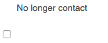

# Adobe Campaign元件{#adobe-campaign-components}

當您與Adobe Campaign整合時，有可用於處理電子報和表單的元件。 本檔案將對兩者進行說明。

>[!CAUTION]
>
>AEM電子郵件元件已過時。 由於電子郵件的性質將內容與樣式合併，AEM提供的現成可用電子郵件元件對客戶的重複使用有限，因為客戶需要將自訂樣式建置在專案所需的任何元件中。
>
>電子郵件元件可在專案層級實作，而過時的AEM電子郵件元件則說明如何實現。 不過，這些已過時的元件不應用於專案。

## Adobe Campaign電子報元件 {#adobe-campaign-newsletter-components}

所有促銷活動元件都遵循「電子郵件範本的 [最佳實務」中概述的最佳實務](/help/sites-administering/best-practices-for-email-templates.md) ，並以Adobe標籤語言 [HTL為基礎](https://helpx.adobe.com/experience-manager/htl/using/overview.html)。

當您開啟已設定為與Adobe Campaign整合的電子報／電子郵件時，您應會在 **Adobe Campaign電子報區段中看到下列元件** :

* 標題 (行銷活動)
* 影像 (行銷活動)
* 連結 (行銷活動)
* Scene7 影像範本 (行銷活動)
* 目標參考 (行銷活動)
* 文字與影像 (行銷活動)
* 文字與個人化 (行銷活動)

以下章節將說明這些元件。

### 標題 (行銷活動) {#heading-campaign}

標題元件可以：

* 將「標題」欄位留空，以顯示目前頁 **面的** 名稱。
* 顯示您在「標題」欄位中指定的 **文字** 。

您可以直接 **編輯標題（促銷活動）** 元件。 留空將使用頁面標題。

您可以設定下列項目：

* **標題**&#x200B;如果您想要使用頁面標題以外的名稱，請在此處輸入。

* **標題層級(1、2、3、4)根**&#x200B;據HTML標題大小1-4的標題層級。

下列範例顯示所顯示的標題（促銷活動）元件。

### 影像 (行銷活動) {#image-campaign}

影像（促銷活動）元件會根據指定的參數顯示影像和隨附的文字。

您可以上傳影像，然後加以編輯和操控（例如裁切、旋轉、新增連結／標題／文字）。

您可以上傳影像，然後加以編輯和操控（例如裁切、旋轉、新增連結／標題／文字）。 您可以直接從「內容搜尋器」將影  像拖放至元件或其「編輯」對話方塊。 您也可以按兩下「編輯」對話方塊中央區域，以瀏覽您的本機檔案系統並上傳影像。 「編輯」對話框的兩個頁籤還控制影像的所有定義和操作：

載入影像時，您可以設定下列項目：

* **映射**&#x200B;要映射影像，請選擇映射。 您可以指定要如何建立影像地圖（矩形、多邊形等），以及區域應指向的位置。

* **裁切**&#x200B;選取裁切以裁切影像。 使用滑鼠來裁切影像。

* **旋轉**&#x200B;若要旋轉影像，請選取「旋轉」。 重複使用，直到影像依您想要的方式旋轉為止。

* **清除**&#x200B;移除目前的影像。

* 縮放列（僅限傳統版）若要放大和縮小影像，請使用影像下方的投影片列（位於「確定」和「取消」按鈕上方）
* **標題**&#x200B;影像的標題。

* **替代文字**：建立可存取內容時使用的替代文字。

* **連結至**&#x200B;建立網站內資產或其他頁面的連結。

* **說明**&#x200B;影像的說明。

* **大小**&#x200B;設定影像的高度和寬度。

>[!NOTE]
>
>您必須在「進階」索引標籤的 **「替代文字****** 」欄位中輸入資訊，否則影像無法儲存，而您會看到下列錯誤訊息：
>
>`Validation failed. Verify the values of the marked fields.`

下列範例顯示顯示的影像（促銷活動）元件。

### 連結 (行銷活動) {#link-campaign}

連結（促銷活動）元件可讓您新增電子報的連結。 雖然您可以在觸控最佳化使用者介面中新增元件，並以相容模式開啟，但此元件僅適用於傳統使用者介面。

您可以在「顯示」、「 **URL資訊」或「進階」**&#x200B;標籤中設 **定下列****** :

* **連結標題**&#x200B;連結的標題。 這是使用者看到的文字。

* **連結工具提**&#x200B;示新增有關如何使用連結的其他資訊。

* **LinkType**&#x200B;在下拉式清單中，選取自訂URL和 **最適化** 檔案 ****。 此欄位為必填欄位. 如果您選取「自訂URL」，則可提供「連結URL」。 如果選擇「最適化文檔」，則可以提供文檔路徑。

* **其他URL參數**&#x200B;新增任何其他URL參數。 按一下「新增項目」以新增多個項目。

>[!NOTE]
>
>您必須在「 **URL Info** 」（URL資訊）標籤的「連結類型 **」(Link Type** )欄位中輸入資訊，否則元件無法儲存，而您會看到下列錯誤訊息：
>
>`Validation failed. Verify the values of the marked fields.`

下列範例顯示所顯示的連結（促銷活動）元件。

### 目標參考 (行銷活動) {#targeted-reference-campaign}

定位參考（促銷活動）元件可讓您建立定位段落的參考。

在此元件中，您導航到要選擇的目標段落。

按一下下拉式功能表，以導覽至您要參照的段落。 完成後，按一下「 **確定」**。

### 文字與影像 (行銷活動) {#text-image-campaign}

文字與影像（促銷活動）元件會新增文字區塊和影像。

和「文字與個人化」（促銷活動）和「影像」（促銷活動）元件一樣，您可以設定：

* **文字**&#x200B;輸入文字。 使用工具列來修改格式、建立清單和新增連結。

* **影像**&#x200B;從內容搜尋器拖曳影像，或按一下以瀏覽至影像。 視需要裁切或旋轉。

* **影像屬性** (進&#x200B;**階影像屬性**)可讓您指定下列項目：

   * **標題**：塊的標題；將會以mouseover顯示。

   * **替代文**&#x200B;字：如果無法顯示影像，則顯示替代文字。

   * **連結**：建立網站內資產或其他頁面的連結。

   * **說明**&#x200B;影像的說明。

   * **大小**&#x200B;設定影像的高度和寬度。

>[!NOTE]
>
>「高 **級」(** Advanced **)頁籤中的「替代文本」(Alt Text** )欄位是必需欄位，或者元件無法保存，您會看到以下錯誤消息：
>
>`Validation failed. Verify the values of the marked fields.`

下列範例顯示顯示的文字與影像（促銷活動）元件。

### 文字與個人化 (行銷活動) {#text-personalization-campaign}

「文字與個人化（促銷活動）」元件可讓您使用WYSIWYG編輯器輸入文字區塊，並具備 [Rich Text編輯器提供的功能](/help/sites-authoring/rich-text-editor.md)。 此外，此元件可讓您使用Adobe Campaign提供的內容欄位和個人化區塊；另請參閱 [插入個人化](/help/sites-classic-ui-authoring/classic-personalization-ac-campaign.md#inserting-personalization)。

選取圖示可讓您設定文字的格式，包括字型特性、對齊方式、連結、清單和縮排。

在Rich Text編輯器中新增文字，就像您平常一樣。 選擇Adobe Campaign下拉式清單並選擇適當的欄位，以新增個人化。

您可以新增文字和內容欄位或個人化區塊來建立內容。 接著，選取「用戶端內容」以測試角色描述檔中的資料。 在您選取個人檔案後，個人化欄位會自動由選取的個人檔案資料取代。

>[!NOTE]
>
>只考慮在 **nms:seedMember** schema中定義的欄位或其中一個副檔名。 連結到的表的屬性 `nms:seedMember` 不可用。

## Adobe Campaign表單元件 {#adobe-campaign-form-components}

您可以使用Adobe Campaign元件來建立表單，讓使用者填寫表單以訂閱電子報、取消訂閱電子報或更新其使用者設定檔。 如需詳 [細資訊，請參閱建立Adobe Campaign](/help/sites-classic-ui-authoring/classic-personalization-ac-forms.md) 表單。

每個元件欄位都可連結至Adobe Campaign資料庫欄位。 可用欄位會依據「元件與資料類型」一節所述的資料類 [型而不同](#components-and-data-type)。 如果您在Adobe Campaign中擴充收件者結構，新欄位將可用於資料類型相符的元件。

當您開啟已設定為與Adobe Campaign整合的表單時，您會在 **Adobe Campaign區段中看到下列元件** :

* 核取方塊 (行銷活動)
* 日期欄位（促銷活動）和日期欄位/HTML5（促銷活動）
* 加密的主要金鑰 (行銷活動)
* 錯誤顯示 (行銷活動)
* 隱藏調解金鑰 (行銷活動)
* 數值欄位 (行銷活動)
* 選項欄位 (行銷活動)
* 訂閱檢查清單 (行銷活動)
* 測試欄位 (行銷活動)

本節詳細說明每個元件。

### 元件與資料類型 {#components-and-data-type}

下表說明可用來顯示和修改Adobe Campaign描述檔資料的元件。 每個元件都可對應至Adobe Campaign描述檔欄位，以顯示其值，並在提交表單時更新欄位。 不同的元件只能與適當資料類型的欄位相符。

<table>
 <tbody>
  <tr>
   <td>
<strong>元件</strong>
 </td>
   <td>
<strong>Adobe Campaign欄位的資料類型</strong>
 </td>
   <td>
<strong>範例欄位</strong>
 </td>
  </tr>
  <tr>
   <td>
核取方塊 (行銷活動)
 </td>
   <td>
布林值
 </td>
   <td>
不再聯絡（透過任何管道）
 </td>
  </tr>
  <tr>
   <td>
日期欄位 (行銷活動)
 
日期欄位/HTML 5 (行銷活動)
 </td>
   <td>
日期
 </td>
   <td>
出生日期
 </td>
  </tr>
  <tr>
   <td>
數值欄位 (行銷活動)
 </td>
   <td>
數字（位元組、短、長、雙）
 </td>
   <td>
年齡
 </td>
  </tr>
  <tr>
   <td>
選項欄位 (行銷活動)
 </td>
   <td>
位元組，關聯值
 </td>
   <td>
性別
 </td>
  </tr>
  <tr>
   <td>
測試欄位 (行銷活動)
 </td>
   <td>
字串
 </td>
   <td>
電子郵件
 </td>
  </tr>
 </tbody>
</table>

### 大多數元件的常用設定 {#settings-common-to-most-components}

Adobe Campaign元件具有所有元件（加密的主要金鑰和隱藏的協調金鑰元件除外）中通用的設定。

在大部分元件中，您可以設定下列項目：

#### 標題和文字 {#title-and-text}

* **標題**：如果您想使用元素名稱以外的名稱，請在此處輸入。

* **隱藏標題**&#x200B;如果您不想看到標題，請選取此核取方塊。

* **說明**&#x200B;新增說明至欄位，以提供使用者詳細資訊。

* **僅顯示值**&#x200B;僅顯示值（如果有）

#### Adobe Campaign {#adobe-campaign}

您可以設定下列項目：

* **對應**&#x200B;選取Adobe Campaign個人化欄位（如果適用）。

* **協調鍵**&#x200B;如果該欄位是協調鍵的一部分，則選中此複選框。

#### 限制 {#constraints}

* **必要** -選中此複選框可使此元件成為必需元件；即，用戶必須輸入值。
* **必要訊息** -（可選）新增訊息，指出欄位為必要欄位。

#### 樣式 {#styling}

* **CSS**&#x200B;輸入要用於此元件的CSS類。

### 核取方塊 (行銷活動) {#checkbox-campaign}

核取方塊（促銷活動）元件可讓使用者修改布林資料類型的Adobe Campaign描述檔欄位。 例如，您可以有核取方塊（促銷活動）元件，讓收件者指定不想透過任何渠道聯絡。

您可以 [在核取方塊](#settings-common-to-most-components) （促銷活動）元件中設定大多數Adobe Campaign元件常用的設定。

下列範例顯示顯示的核取方塊（促銷活動）元件。

### 日期欄位（促銷活動）和日期欄位/HTML 5（促銷活動） {#date-field-campaign-and-date-field-html-campaign}

使用日期欄位可讓收件者知道日期；例如，您可能希望收件者指定其出生日期。 日期格式與Adobe Campaign例項中使用的格式相符。

除了大部 [分Adobe Campaign元件的常用設定外](#settings-common-to-most-components)，您還可以設定下列項目：

* **約束——約束** -可以選擇——無 **或日** 期 **** ，以添加日期約束或無約束。 如果您選擇日期，輸入欄位的答案使用者必須使用日期格式。

* **約束消息** -此外，還可以添加約束消息，以便用戶瞭解如何正確設定其答案的格式。
* **樣式——寬度********** -按一下或點選+和——圖示或輸入數字，以調整欄位的寬度。

下列範例顯示「日期欄位（促銷活動）」元件，並顯示寬度已調整。

### 加密的主要金鑰 (行銷活動) {#encrypted-primary-key-campaign}

此元件定義URL參數的名稱，其中將包含Adobe Campaign設定檔的識別碼(**Main Resource Identifier****** 或Encrypted primary key, in Adobe Campaign Standard和6.1)。

每個顯示和修改Adobe Campaign描述檔資料的表 **單都必須** 包含「加密的主要金鑰」元件。

您可以在「加密的主要金鑰（促銷活動）」元件中設定下列項目：

* **標題和文本——元素名稱** -預設為encryptedPK。 只有當元素名稱與表單上其他元素的名稱衝突時，您才需要變更元素名稱。 沒有兩個表單欄位可以有相同的元素名稱。
* **Adobe Campaign - URL參數** -新增EPK的URL參數。 例如，您可使用值 **epk**。

下列範例顯示所顯示的加密主要金鑰（促銷活動）元件。

### 錯誤顯示 (行銷活動) {#error-display-campaign}

此元件可讓您顯示後端錯誤。 表單的錯誤處理必須設為「轉送」，以讓元件正常運作。

下列範例顯示所顯示的錯誤顯示（促銷活動）元件。

### 隱藏調解金鑰 (行銷活動) {#hidden-reconciliation-key-campaign}

「隱藏的協調鍵（促銷活動）」元件可讓您新增隱藏欄位，作為協調鍵的一部分至表單。

您可以在隱藏的協調金鑰（促銷活動）元件中設定下列項目：

* **標題和文字——元素名稱** -預設為reconcilKey。 只有當元素名稱與表單上其他元素的名稱衝突時，您才需要變更元素名稱。 沒有兩個表單欄位可以有相同的元素名稱。
* **Adobe Campaign —— 對應** -對應至Adobe Campaign個人化欄位。

以下範例顯示顯示的隱藏協調金鑰（促銷活動）元件。

### 數值欄位 (行銷活動) {#numeric-field-campaign}

使用數字欄位可讓收件者輸入數字，例如其年齡。

除了大部 [分Adobe Campaign元件的常用設定外](#settings-common-to-most-components)，您還可以設定下列項目：

* **約束——約束** -下拉式選擇——無 **或****** 數值——可添加數字或無約束的約束。 如果選擇數字，則用戶輸入欄位的答案必須是數字。

* **約束消息** -此外，還可以添加約束消息，以便用戶瞭解如何正確設定其答案的格式。
* **樣式——寬度********** -按一下或點選+和——圖示或輸入數字，以調整欄位的寬度。

下列範例顯示設定寬度的數值欄位（促銷活動）元件。

### 選項欄位 (行銷活動) {#option-field-campaign}

此下拉式清單可讓您選取選項；例如，收件者的性別或狀態。

您可以 [在「選項欄位](#settings-common-to-most-components) （促銷活動）」元件中設定大多數Adobe Campaign元件的共同設定。 若要填入下拉式清單，請按一下或點選Adobe Campaign符號並導覽至欄位，以在Adobe Campaign個人化欄位中選取適當的欄位。

下列範例顯示所顯示的選項欄位（促銷活動）元件。

### 訂閱檢查清單 (行銷活動) {#subscriptions-checklist-campaign}

使用「 **訂閱檢查清單（促銷活動）** 」元件，修改與Adobe Campaign設定檔相關的訂閱。

新增至表單時，此元件會將所有可用的訂閱顯示為核取方塊，並讓使用者選取所需的訂閱。 當使用者送出表單時，此元件會根據表單動作類型，將使用者訂閱或取消訂閱選取的服務(**Adobe Campaign:訂閱服務** 或 **Adobe Campaign:取消訂閱服務**)。

>[!NOTE]
>
>該元件不檢查用戶已訂閱／取消訂閱的服務。

您可以 [在「訂閱檢查清單](#settings-common-to-most-components) （促銷活動）」元件中設定大多數Adobe Campaign元件的共同設定。 （此元件沒有可用的Adobe Campaign設定。）

下列範例顯示所顯示的訂閱檢查清單（促銷活動）元件。

### 測試欄位 (行銷活動) {#text-field-campaign}

文字欄位（促銷活動）元件，可讓您輸入字串類型資料，例如名字、姓氏、位址、電子郵件地址等。

除了大部 [分Adobe Campaign元件的常用設定外](#settings-common-to-most-components)，您還可以設定下列項目：

* **約束——約束** -下拉式——您可以選擇- **無**、電子郵件 **、名稱****** （無變母）來添加電子郵件地址、名稱或無約束的約束。 如果您選擇電子郵件，使用者輸入欄位的答案必須是電子郵件地址。 如果您選取名稱，則必須是名稱（不允許變母音）。

* **約束消息** -此外，還可以添加約束消息，以便用戶瞭解如何正確設定其答案的格式。
* **樣式——寬度********** -按一下或點選+和——圖示或輸入數字，以調整欄位的寬度。

下列範例顯示顯示的文字欄位（促銷活動）元件。

