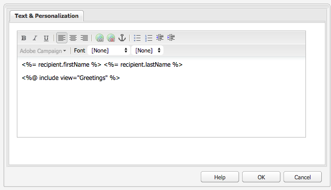

# Adobe Campaign元件{#adobe-campaign-components}

當您與Adobe Campaign整合時，您可以使用新聞稿和表單的元件。 本文檔對這兩種方法進行了說明。

>[!CAUTION]
>
>電子AEM郵件元件已棄用。 由於電子郵件的性質，即內容和樣式的合併，現成提供的電子郵件元件對客戶的重用變得有限AEM，因為需要將自定義樣式實施到項目所需的任何元件中。
>
>電子郵件元件可以在項目級別上實施，不建議使用的AEM電子郵件元件說明了如何實現這一點。 但是，不應在項目中使用這些已過時的元件。

## Adobe Campaign新聞通訊元件 {#adobe-campaign-newsletter-components}

所有市場活動元件都遵循中概述的最佳做法 [電子郵件模板的最佳做法](/help/sites-administering/best-practices-for-email-templates.md) 基於Adobe標籤語言 [HTL](https://helpx.adobe.com/tw/experience-manager/htl/using/overview.html)。

當您開啟配置為與Adobe Campaign整合的新聞稿/電子郵件時，您應在 **Adobe Campaign通訊** 部分：

* 標題 (行銷活動)
* 影像 (行銷活動)
* 連結 (行銷活動)
* Scene7 影像範本 (行銷活動)
* 目標參考 (行銷活動)
* 文字與影像 (行銷活動)
* 文字與個人化 (行銷活動)

以下部分介紹了這些元件。

### 標題 (行銷活動) {#heading-campaign}

標題元件可以：

* 通過保留 **標題** 欄位為空。
* 顯示在 **標題** 的子菜單。

編輯 **標題（市場活動）** 元件。 留空將使用頁面標題。

您可以配置以下內容：

* **標題**
如果要使用頁面標題以外的名稱，請在此處輸入。

* **標題級別(1、2、3、4)**
基於HTML標題大小1-4的標題級別。

以下示例顯示了要顯示的標題（市場活動）元件。

### 影像 (行銷活動) {#image-campaign}

影像（市場活動）元件根據指定的參數顯示影像和附帶的文本。

您可以上載影像，然後編輯和操作影像（例如裁剪、旋轉、添加連結/標題/文本）。

您可以上載影像，然後編輯和操作影像（例如裁剪、旋轉、添加連結/標題/文本）。 可以從 [內容查找器](/help/sites-authoring/author-environment-tools.md#thecontentfinderclassicui) 直接到元件或其「編輯」(Edit)對話框。 也可以按兩下「編輯」對話框的中央區域以瀏覽本地檔案系統並上載影像。 「編輯」(Edit)對話框的兩個頁籤還控制影像的所有定義和操作：

載入映像時，可以配置以下內容：

* **地圖**
要映射影像，請選擇映射。 您可以指定要如何建立影像映射（矩形、多邊形等）以及區域應指向的位置。

* **裁剪**
選擇「裁剪」以裁剪影像。 使用滑鼠裁剪影像。

* **旋轉**
要旋轉影像，請選擇「旋轉」。 重複使用，直到影像按所需方式旋轉。

* **清除**
刪除當前映像。

* 縮放欄（僅限傳統）要放大和縮小影像，請使用影像下方的幻燈片欄（位於「確定」和「取消」按鈕上方）
* **標題**
影像的標題。

* **替代文字**
建立可訪問內容時使用的替代文本。

* **連結至**
建立指向網站中資產或其他頁面的連結。

* **說明**
影像的說明。

* **大小**
設定影像的高度和寬度。

>[!NOTE]
>
>必須在 **替代文字** 的 **高級** 頁籤，或影像無法保存，您會看到以下錯誤消息：
>
>`Validation failed. Verify the values of the marked fields.`

以下示例顯示了要顯示的影像（市場活動）元件。

### 連結 (行銷活動) {#link-campaign}

連結（市場活動）元件允許您添加新聞簡報連結。 此元件僅在經典用戶介面中可用，儘管您可以在觸控優化用戶介面中添加一個元件並在相容模式下將其開啟。

可以在 **顯示**。 **URL資訊**&#x200B;或 **高級** 頁籤：

* **連結標題**
連結的標題。 這是用戶看到的文本。

* **連結工具提示**
添加有關如何使用連結的其他資訊。

* **連結類型**
在下拉清單中，在 
**自定義URL** 和 **自適應文檔**。 此欄位為必填欄位. 如果選擇「自定義URL」，則可以提供「連結URL」。 如果選擇「自適應文檔」，則可以提供文檔路徑。

* **其他URL參數**
添加任何其他URL參數。 按一下「添加項目」以添加多個項目。

>[!NOTE]
>
>必須在 **連結類型** 的 **URL資訊** 頁籤，或元件無法保存，您會看到以下錯誤消息：
>
>`Validation failed. Verify the values of the marked fields.`

以下示例顯示了要顯示的連結（市場活動）元件。

### 目標參考 (行銷活動) {#targeted-reference-campaign}

「目標參考（市場活動）」元件允許您建立對目標段落的參考。

在此元件中，導航到目標段落以選擇它。

按一下下拉菜單以導航到要引用的段落。 完成後，按一下 **確定**。

### 文字與影像 (行銷活動) {#text-image-campaign}

文本和影像（市場活動）元件添加文本塊和影像。

與文本和個性化（市場活動）和影像（市場活動）元件一樣，您可以配置：

* **文本**
輸入文本。 使用工具欄修改格式、建立清單和添加連結。

* **影像**
從內容查找器中拖動影像，或按一下瀏覽到影像。 根據需要裁剪或旋轉。

* **影像屬性** (**高級映像屬性**)允許您指定以下內容：

   * **標題**
塊名；將由mouseover顯示。

   * **替代文字**
如果無法顯示影像，則要顯示的替代文本。

   * **連結至**
建立指向網站中資產或其他頁面的連結。

   * **說明**
影像的說明。

   * **大小**
設定影像的高度和寬度。

>[!NOTE]
>
>的 **替代文字** 的 **高級** 頁籤，或者元件無法保存，您會看到以下錯誤消息：
>
>`Validation failed. Verify the values of the marked fields.`

以下示例顯示了要顯示的文本和影像（市場活動）元件。

### 文字與個人化 (行銷活動) {#text-personalization-campaign}

文本和個性化（市場活動）元件允許您使用WYSIWYG編輯器輸入文本塊，並提供 [富格文本編輯器](/help/sites-authoring/rich-text-editor.md)。 此外，此元件還允許您使用Adobe Campaign提供的上下文欄位和個性化塊；參見 [插入個性化](/help/sites-classic-ui-authoring/classic-personalization-ac-campaign.md#inserting-personalization)。

通過選擇表徵圖，可以格式化文本，包括字型特徵、對齊方式、連結、清單和縮進。

在富格文本編輯器中添加文本。 通過選擇「Adobe Campaign」下拉清單並選擇相應的欄位來添加個性化。

您可以添加文本和上下文欄位或個性化塊以建立內容。 接下來，選擇「客戶端上下文」以test個人配置檔案中的資料。 選擇個人角色後，個性化欄位將自動被選定配置檔案中的資料替換。

>[!NOTE]
>
>僅定義於 **nms:seedMember** 架構或其擴展之一被考慮在內。 連結到的表的屬性 `nms:seedMember` 不可用。

## Adobe Campaign窗體元件 {#adobe-campaign-form-components}

您可以使用Adobe Campaign元件建立一個表單，用戶可以填寫該表單，以訂閱新聞簡報、取消訂閱新聞簡報或更新其用戶配置檔案。 請參閱 [建立Adobe CampaignForms](/help/sites-classic-ui-authoring/classic-personalization-ac-forms.md) 的子菜單。

每個元件欄位都可以連結到Adobe Campaign資料庫欄位。 可用欄位因包含的資料類型而異，如一節所述 [元件和資料類型](#components-and-data-type)。 如果在Adobe Campaign擴展收件人架構，則新欄位將在資料類型匹配的元件中可用。

當您開啟配置為與Adobe Campaign整合的表單時，在 **Adobe Campaign** 部分：

* 核取方塊 (行銷活動)
* 日期欄位（市場活動）和日期欄位/HTML5（市場活動）
* 加密的主要金鑰 (行銷活動)
* 錯誤顯示 (行銷活動)
* 隱藏調解金鑰 (行銷活動)
* 數值欄位 (行銷活動)
* 選項欄位 (行銷活動)
* 訂閱檢查清單 (行銷活動)
* 測試欄位 (行銷活動)

本節將詳細描述每個元件。

### 元件和資料類型 {#components-and-data-type}

下表介紹了可用於顯示和修改Adobe Campaign配置檔案資料的元件。 每個元件都可以映射到Adobe Campaign配置檔案欄位，以顯示其值並在提交表單時更新該欄位。 不同的元件只能與適當資料類型的欄位匹配。

<table>
 <tbody>
  <tr>
   <td>
<strong>Component</strong>
 </td>
   <td>
<strong>Adobe Campaign欄位的資料類型</strong>
 </td>
   <td>
<strong>示例欄位</strong>
 </td>
  </tr>
  <tr>
   <td>
核取方塊 (行銷活動)
 </td>
   <td>
布林值
 </td>
   <td>
不再聯繫（通過任何渠道）
 </td>
  </tr>
  <tr>
   <td>
日期欄位 (行銷活動)
 
日期欄位/HTML 5 (行銷活動)
 </td>
   <td>
日期
 </td>
   <td>
出生日期
 </td>
  </tr>
  <tr>
   <td>
數值欄位 (行銷活動)
 </td>
   <td>
數字（位元組、短、長、雙）
 </td>
   <td>
年齡
 </td>
  </tr>
  <tr>
   <td>
選項欄位 (行銷活動)
 </td>
   <td>
與值關聯的位元組
 </td>
   <td>
性別
 </td>
  </tr>
  <tr>
   <td>
測試欄位 (行銷活動)
 </td>
   <td>
字串
 </td>
   <td>
電子郵件
 </td>
  </tr>
 </tbody>
</table>

### 大多數元件的常用設定 {#settings-common-to-most-components}

Adobe Campaign元件具有所有元件（除加密主密鑰和隱藏協調密鑰元件外）中通用的設定。

在大多數元件中，可以配置以下元件：

#### 標題和文字 {#title-and-text}

* **標題**
如果要使用元素名稱以外的名稱，請在此處輸入。

* **隱藏標題**
如果不希望標題可見，請選中此複選框。

* **說明**
向欄位添加說明以提供用戶的詳細資訊。

* **僅顯示值**
只顯示值（如果有）

#### Adobe Campaign {#adobe-campaign}

您可以配置以下內容：

* **映射**
選擇一個Adobe Campaign個性化欄位（如果適用）。

* **協調密鑰**
如果此欄位是協調鍵的一部分，則選中此複選框。

#### 限制 {#constraints}

* **必需**  — 選中此複選框以要求此元件；即，用戶必須輸入一個值。
* **所需消息**  — （可選）添加一條消息，指出該欄位是必需的。

#### 樣式 {#styling}

* **CSS**
輸入要用於此元件的CSS類。

### 核取方塊 (行銷活動) {#checkbox-campaign}

複選框（市場活動）元件允許用戶修改布爾資料類型的Adobe Campaign配置檔案欄位。 例如，您可以有一個複選框（市場活動）元件，它允許收件人指定他/她不想通過任何渠道聯繫。

你可以 [配置大多數Adobe Campaign元件通用的設定](#settings-common-to-most-components) 複選框（市場活動）元件。

以下示例顯示了正在顯示的複選框（市場活動）元件。

### 日期欄位（市場活動）和日期欄位/HTML5（市場活動） {#date-field-campaign-and-date-field-html-campaign}

使用日期欄位允許收件人使用日期；例如，您可能希望收件人指定其出生日期。 日期格式與您的Adobe Campaign實例中使用的格式匹配。

除 [大多數Adobe Campaign元件的公用設定](#settings-common-to-most-components)，可以配置以下內容：

* **約束 — 約束**  — 您可以選擇 —  **無** 或 **日期** 來修改標籤元素的屬性。 如果選擇日期，輸入欄位的應答用戶必須採用日期格式。

* **約束消息**  — 此外，您可以添加約束消息，以便用戶知道如何正確格式化其答案。
* **樣式 — 寬度**  — 通過按一下或點擊 **+** 和 **-** 表徵圖或輸入數字。

以下示例顯示了「日期欄位（市場活動）」元件，其中顯示了調整寬度的元件。

### 加密的主要金鑰 (行銷活動) {#encrypted-primary-key-campaign}

此元件定義包含Adobe Campaign配置檔案標識符的URL參數的名稱(**主資源標識符** 或 **加密的主密鑰** Adobe Campaign Standard和6.1)。

每個表單顯示和修改Adobe Campaign配置檔案資料 **必須** 包括加密主密鑰元件。

您可以在「加密的主密鑰（市場活動）」元件中配置以下內容：

* **標題和文本 — 元素名稱**  — 預設為encryptedPK。 只需在元素名稱與窗體上其他元素的名稱衝突時更改它。 兩個表單域不能具有相同的元素名稱。
* **Adobe Campaign- URL參數**  — 添加EPK的URL參數。 例如，可以使用 **平**。

以下示例顯示了正在顯示的加密主鍵（市場活動）元件。

### 錯誤顯示 (行銷活動) {#error-display-campaign}

此元件允許您顯示後端錯誤。 表單的錯誤處理需要設定為「轉發」以使元件正常工作。

以下示例顯示了要顯示的錯誤顯示（市場活動）元件。

### 隱藏調解金鑰 (行銷活動) {#hidden-reconciliation-key-campaign}

「隱藏協調密鑰（市場活動）」元件允許您將隱藏欄位作為協調密鑰的一部分添加到表單。

您可以在「隱藏協調密鑰（市場活動）」元件中配置以下內容：

* **標題和文本 — 元素名稱**  — 預設為reconcilKey。 只需在元素名稱與窗體上其他元素的名稱衝突時更改它。 兩個表單域不能具有相同的元素名稱。
* **Adobe Campaign — 地圖**  — 映射到Adobe Campaign個性化欄位。

以下示例顯示了正在顯示的隱藏協調密鑰（市場活動）元件。

### 數值欄位 (行銷活動) {#numeric-field-campaign}

使用數字欄位可允許收件人輸入數字，例如其年齡。

除 [大多數Adobe Campaign元件的公用設定](#settings-common-to-most-components)，可以配置以下內容：

* **約束 — 約束** 下拉框，可以選擇 —  **無** 或 **數字 —** 來修改標籤元素的屬性。 如果選擇數字，則輸入欄位的應答用戶必須是數字。

* **約束消息**  — 此外，您可以添加約束消息，以便用戶知道如何正確格式化其答案。
* **樣式 — 寬度**  — 通過按一下或點擊 **+** 和 **-** 表徵圖或輸入數字。

以下示例顯示了配置寬度的數字欄位（市場活動）元件。

### 選項欄位 (行銷活動) {#option-field-campaign}

此下拉清單允許您選擇一個選項；例如，接受者的性別或地位。

你可以 [配置大多數Adobe Campaign元件通用的設定](#settings-common-to-most-components) 選項欄位（市場活動）元件中。 要填充下拉清單，請按一下或點擊Adobe Campaign符號並導航至該欄位，在「Adobe Campaign個性化」欄位中選擇相應的欄位。

以下示例顯示了要顯示的選項欄位（市場活動）元件。

### 訂閱檢查清單 (行銷活動) {#subscriptions-checklist-campaign}

使用 **訂閱核對表（市場活動）** 修改與Adobe Campaign配置檔案關聯的訂閱的元件。

添加到表單時，此元件將所有可用訂閱顯示為複選框，並允許用戶選擇所需的訂閱。 當用戶提交表單時，此元件根據表單操作類型(**Adobe Campaign:訂閱服務** 或 **Adobe Campaign:取消訂閱服務**)。

>[!NOTE]
>
>該元件不檢查用戶已訂閱或取消訂閱的服務。

你可以 [配置大多數Adobe Campaign元件通用的設定](#settings-common-to-most-components) 在「訂閱核對清單（市場活動）」元件中。 (此元件沒有可用的Adobe Campaign配置。)

以下示例顯示了正在顯示的「訂閱核對清單（市場活動）」元件。

### 測試欄位 (行銷活動) {#text-field-campaign}

文本欄位（市場活動）元件，用於輸入字串類型資料，如名、姓、地址、電子郵件地址等。

除 [大多數Adobe Campaign元件的公用設定](#settings-common-to-most-components)，可以配置以下內容：

* **約束 — 約束**  — 下拉 — 您可以選擇 —  **無**。 **電子郵件**。 **名稱** （無umlauts），以添加電子郵件地址、名稱或無約束的約束。 如果您選擇電子郵件，則輸入欄位的應答用戶必須是電子郵件地址。 如果選擇名稱，則必須是名稱（不允許使用umlauts）。

* **約束消息**  — 此外，您可以添加約束消息，以便用戶知道如何正確格式化其答案。
* **樣式 — 寬度**  — 通過按一下或點擊 **+** 和 **-** 表徵圖或輸入數字。

以下示例顯示了要顯示的文本欄位（市場活動）元件。

