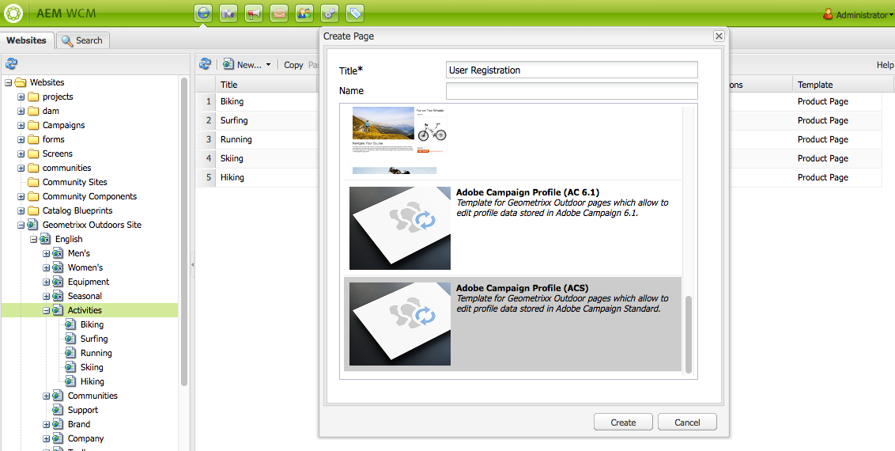

# 建立Adobe CampaignForms AEM{#creating-adobe-campaign-forms-in-aem}

允AEM許您建立和使用網站上與Adobe Campaign交互的表單。 可將特定欄位插入表單並映射到Adobe Campaign資料庫。

您可以管理新的聯繫人訂閱、取消訂閱和用戶配置檔案資料，同時將其資料整合到您的Adobe Campaign資料庫中。

要在中使用Adobe Campaign表AEM單，您需要遵循本文檔中介紹的以下步驟：

1. 使模板可用。
1. 建立窗體。
1. 編輯表單內容。

預設情況下，有三種類型的表單(特定於Adobe Campaign)可用：

* 保存配置檔案
* 訂閱服務
* 取消訂閱服務

這些表單定義一個URL參數，該參數接受Adobe Campaign配置檔案的加密主鍵。 基於此URL參數，表單更新關聯的Adobe Campaign配置檔案的資料。

雖然您獨立建立了這些表單，但在典型的使用案例中，您會生成到新聞稿內容內表單頁面的個性化連結，以便收件人可以開啟該連結並調整其配置檔案資料（無論是取消訂閱、訂閱還是更新其配置檔案）。

表單會根據用戶自動更新。 請參閱 [編輯表單內容](#editing-form-content) 的子菜單。

## 使模板可用 {#making-a-template-available}

在能夠建立特定於Adobe Campaign的表單之前，必須在應用程式中提供不同的模AEM板。

要執行此操作，請參閱 [模板文檔](/help/sites-developing/page-templates-static.md#templateavailability)。

首先，檢查作者和發佈實例之間的聯繫，Adobe Campaign正在工作。 請參閱 [與Adobe Campaign Standard整合](/help/sites-administering/campaignstandard.md) 或 [與Adobe Campaign6.1整合](/help/sites-administering/campaignonpremise.md)。

>[!NOTE]
>
>確保 **acMapping** 頁的 **jcr：內容** 節點設定為 **mapRecipient** 或 **輪廓** 使用Adobe Campaign6.1.x或Adobe Campaign Standard時

### 建立窗體 {#creating-a-form}

1. 從siteadmin開始。
1. 滾動瀏覽樹結構以到達要在所選網站中建立表單的位置。
1. 選擇 **新建** > **新頁……**。
1. 選擇 **Adobe Campaign概況(AC 6.1)** 或 **Adobe Campaign檔案(ACS)** 輸入頁面屬性。

   >[!NOTE]
   >
   >如果模板不可用，請參閱 [使模板可用](/help/sites-classic-ui-authoring/classic-personalization-ac.md#activatingatemplate) 的子菜單。

1. 按一下 **建立** 的子菜單。

   

   你可以 [編輯和配置表單的內容](#editing-form-content)。

## 編輯表單內容 {#editing-form-content}

Forms專門研究Adobe Campaign，有一些具體的組成部分。 這些元件具有一個選項，允許您將表單的每個欄位連結到Adobe Campaign資料庫中的一個欄位。

>[!NOTE]
>
>如果所需模板不可用，請參見 [使模板可用](/help/sites-classic-ui-authoring/classic-personalization-ac.md#activatingatemplate)。

本節僅詳細說明指向Adobe Campaign的特定連結。 有關如何在Adobe Experience Manager使用表單的更一般性概述的詳細資訊，請參見 [編輯模式元件](/help/sites-classic-ui-authoring/classic-page-author-edit-mode.md)。

1. 導航到要編輯的表單。
1. 在工具箱中，選擇 **頁面** > **頁面屬性……** 然後轉到 **Cloud Services** 按鈕。
1. 通過按一下添加Adobe Campaign服務 **添加服務**，然後在服務的下拉清單中選擇與您的Adobe Campaign實例對應的配置。 在設定實例之間的連接時執行此配置。 有關詳細資訊，請參見 [連接AEM到Adobe Campaign](/help/sites-administering/campaignonpremise.md#connecting-aem-to-adobe-campaign)。

   >[!NOTE]
   >
   >如有必要，請通過按一下掛鎖表徵圖來解鎖配置，以便能夠添加Adobe Campaign服務。

1. 使用 **編輯** 按鈕。 的 **窗體** 頁籤允許您選擇在驗證表單後將用戶重定向到的感謝頁。

   的 **高級** 表單允許您選擇表單類型。 的 **帖子選項** 欄位可讓您在三種類型的Adobe Campaign窗體中進行選擇：

   * **Adobe Campaign:保存配置檔案**:允許您在Adobe Campaign建立或更新收件人（預設值）。
   * **Adobe Campaign:訂閱服務**:允許您管理收件人在Adobe Campaign的訂閱。
   * **Adobe Campaign:取消訂閱服務**:允許您取消Adobe Campaign的收件人訂閱。

   的 **操作配置** 欄位中，您可以指定是否要在Adobe Campaign資料庫中建立收件人配置檔案（如果該配置檔案尚不存在）。 要執行此操作，請檢查 **如果不存在，則建立用戶** 的雙曲餘切值。

1. 通過將所選元件從工具箱中拖動並拖入表單來添加它們。 有關可用的Adobe Campaign特定元件的詳細資訊，請參見 [Adobe窗體元件](/help/sites-classic-ui-authoring/classic-personalization-ac-components.md)。

   

1. 通過按兩下添加的欄位來配置這些欄位。 的 **Adobe Campaign** 頁籤中，您可以將欄位連結到「Adobe Campaign收件人」表中的欄位。 您還可以指定該欄位是否是協調密鑰的一部分，該密鑰允許識別Adobe Campaign資料庫中已存在的收件人。

   >[!CAUTION]
   >
   >的 **元素名稱** 每個表單域必須不同。 如有必要，請更改。
   >
   >每個表單必須包含 **加密的主密鑰** 以正確管理Adobe Campaign資料庫中的收件人。

1. 通過選擇 **頁面** > **激活頁面** 的雙曲餘切值。 該頁面在您的站點上被激活。 您可以轉到發佈實例來AEM查看它。 一旦對表格進行驗證，Adobe Campaign資料庫中的資料就會更新。

## 測試表單 {#testing-a-form}

建立表單並編輯表單內容後，您可能需要手動test表單正按預期工作。

>[!NOTE]
>
>您必須 **加密的主密鑰** 元件。 在「元件」中，選擇「Adobe Campaign」，以便只顯示那些元件。
>
>雖然在此過程中您手動輸入epk編號，但在實踐中，用戶將在新聞簡報中獲得指向此頁面的連結（是取消訂閱、訂閱還是更新您的個人資料）。 基於用戶，epk自動更新。
>
>要建立該連結，請使用變數 **主資源標識符**(Adobe Campaign Standard或 **加密的標識符** (Adobe Campaign6.1) **文本和個性化（市場活動）** 元件)，它連結到Adobe Campaign的epk。

為此，您需要手動獲取Adobe Campaign配置檔案的EPK，然後將其附加到URL:

1. 要獲取Adobe Campaign配置檔案的加密主密鑰(EPK)，請執行以下操作：

   * 在Adobe Campaign Standard — 導航到 **配置檔案和受眾** > **配置檔案**，其中列出現有配置檔案。 確保表顯示 **主資源標識符** 欄位(可通過按一下/點擊來配置 **配置清單**)。 複製所需配置檔案的主資源標識符。
   * 在Adobe Campaign6.11中，轉到 **配置檔案和目標** >  **收件人**，其中列出現有配置檔案。 確保表顯示 **加密的標識符** 欄位(可通過按一下右鍵條目並選擇 **配置清單……**)。 複製所需配置檔案的加密標識符。

1. 在AEM中，開啟發佈實例上的表單頁，並將步驟1中的EPK作為URL參數追加：創作表單時，使用先前在EPK元件中定義的相同名稱(例如： `?epk=...`)
1. 現在，該表單可用於修改與連結的Adobe Campaign配置檔案關聯的資料和訂閱。 修改某些欄位並提交表單後，您可以在Adobe Campaign內驗證是否更新了相應的資料。

一旦對表格進行驗證，Adobe Campaign資料庫中的資料就會更新。
