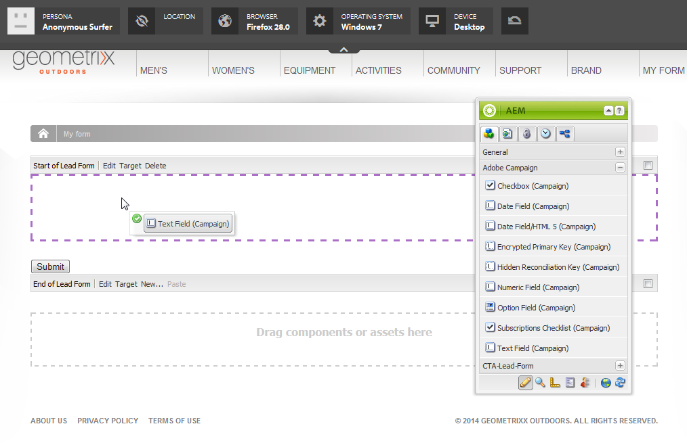

# 在AEM中建立Adobe Campaign Forms{#creating-adobe-campaign-forms-in-aem}

AEM可讓您建立和使用與網站上的Adobe Campaign互動的表單。 特定欄位可插入您的表單中，並對應至Adobe Campaign資料庫。

您可以管理新的連絡人訂閱、取消訂閱和使用者設定檔資料，同時將他們的資料整合至您的Adobe Campaign資料庫。

若要在AEM中使用Adobe Campaign表單，您必須依照本檔案所述的步驟操作：

1. 讓範本可供使用。
1. 建立表單。
1. 編輯表單內容。

預設提供Adobe Campaign專用的三種表單：

* 儲存設定檔
* 訂閱服務
* 取消訂閱服務

這些表單會定義URL參數，此參數接受Adobe Campaign設定檔的加密主要金鑰。 表單會根據此URL參數更新相關聯Adobe Campaign設定檔的資料。

雖然您可以單獨建立這些表單，但在一般的使用案例中，您會產生個人化連結至電子報內容內的表單頁面，讓收件者可以開啟連結，並調整其設定檔資料（無論是取消訂閱、訂閱或更新其設定檔）。

表單會根據使用者自動更新。 請參閱 [編輯表單內容](#editing-form-content) 以取得更多資訊。

## 讓範本可供使用 {#making-a-template-available}

您必須先在AEM應用程式中提供不同的範本，才能建立Adobe Campaign專屬的表單。

若要這麼做，請參閱 [範本檔案](/help/sites-developing/page-templates-static.md#templateavailability).

首先，檢查製作與發佈執行個體之間的連線，讓Adobe Campaign正常運作。 請參閱 [與Adobe Campaign Standard整合](/help/sites-administering/campaignstandard.md) 或 [與Adobe Campaign 6.1整合](/help/sites-administering/campaignonpremise.md).

>[!NOTE]
>
>請確定 **acMapping** 頁面的 **jcr:content** 節點設為 **mapRecipient** 或 **設定檔** 分別使用Adobe Campaign 6.1.x或Adobe Campaign Standard時

### 建立表單 {#creating-a-form}

1. 從網站管理員開始。
1. 捲動至樹狀結構，以找到您要在所選網站中建立表單的位置。
1. 選擇 **新增** > **新頁面……**.
1. 選取 **Adobe Campaign設定檔(AC 6.1)** 或 **Adobe Campaign設定檔(ACS)** 範本並輸入頁面屬性。

   >[!NOTE]
   >
   >如果範本無法使用，請參閱 [讓範本可供使用](/help/sites-classic-ui-authoring/classic-personalization-ac.md#activatingatemplate) 區段。

1. 按一下 **建立** 來建立表單。

   

   然後 [編輯和配置表單的內容](#editing-form-content).

## 編輯表單內容 {#editing-form-content}

專屬於Adobe Campaign的Forms具有特定元件。 這些元件可讓您將表單的每個欄位連結至Adobe Campaign資料庫中的欄位。

>[!NOTE]
>
>如果所需的範本無法使用，請參閱 [讓範本可供使用](/help/sites-classic-ui-authoring/classic-personalization-ac.md#activatingatemplate).

本節僅詳細說明連線至Adobe Campaign的特定連結。 如需更一般概述如何在Adobe Experience Manager中使用表單的詳細資訊，請參閱 [編輯模式元件](/help/sites-classic-ui-authoring/classic-page-author-edit-mode.md).

1. 導覽至您要編輯的表單。
1. 在工具箱中，選取 **頁面** > **頁面屬性……** 然後前往 **Cloud Services** 頁簽。
1. 按一下「 」以新增Adobe Campaign服務 **添加服務**，然後在服務的下拉式清單中選取與您的Adobe Campaign例項對應的設定。 設定執行個體之間的連線時，會執行此設定。 如需詳細資訊，請參閱 [將AEM連線至Adobe Campaign](/help/sites-administering/campaignonpremise.md#connecting-aem-to-adobe-campaign).

   >[!NOTE]
   >
   >如有必要，請按一下掛鎖圖示以新增Adobe Campaign服務，以解除鎖定設定。

1. 使用 **編輯** 按鈕。 此 **表單** 索引標籤可讓您選取感謝頁面，在驗證表單後，系統會將使用者重新導向至該頁面。

   此 **進階** 表單可讓您選取表單類型。 此 **貼文選項** 欄位可讓您在三種Adobe Campaign表單之間進行選擇：

   * **Adobe Campaign:儲存設定檔**:可讓您在Adobe Campaign中建立或更新收件者（預設值）。
   * **Adobe Campaign:訂閱服務**:可讓您在Adobe Campaign中管理收件者的訂閱。
   * **Adobe Campaign:取消訂閱服務**:可讓您取消Adobe Campaign中收件者的訂閱。

   此 **動作設定** 欄位可讓您指定是否要在Adobe Campaign資料庫中建立收件者設定檔（如果尚未存在）。 若要這麼做，請檢查 **建立用戶（如果不存在）** 選項。

1. 將所選元件從工具箱中拖動並拖放到窗體中，以添加這些元件。 如需可用Adobe Campaign特定元件的詳細資訊，請參閱 [Adobe表單元件](/help/sites-classic-ui-authoring/classic-personalization-ac-components.md).

   

1. 連按兩下新增的欄位以設定欄位。 此 **Adobe Campaign** 索引標籤可讓您將欄位連結至Adobe Campaign收件者表格中的欄位。 您也可以指定欄位是否為調解金鑰的一部分，該金鑰可讓識別Adobe Campaign資料庫中已存在的收件者。

   >[!CAUTION]
   >
   >此 **元素名稱** 每個表單欄位必須不同。 視需要變更。
   >
   >每個表單都必須包含 **加密的主密鑰** 元件，以便在Adobe Campaign資料庫中正確管理收件者。

1. 選取 **頁面** > **啟動頁面** 中的所有參數。 頁面已在您的網站上啟動。 您可以前往AEM出版物例項進行檢視。 驗證表單後，會更新Adobe Campaign資料庫中的資料。

## 測試表單 {#testing-a-form}

建立表單並編輯表單內容後，您可能想要手動測試表單是否如預期般運作。

>[!NOTE]
>
>您必須有 **加密的主密鑰** 元件。 在「元件」中，選取「Adobe Campaign」，只顯示這些元件。
>
>雖然在此程式中，您需手動輸入epk編號，但實際上，使用者會在電子報中取得本頁面的連結（無論是取消訂閱、訂閱或更新您的設定檔）。 epk會根據使用者自動更新。
>
>若要建立該連結，請使用變數 **主要資源標識符**(Adobe Campaign Standard)或 **加密的識別碼** (Adobe Campaign 6.1)(例如 **文字與個人化（行銷活動）** 元件)，此元件會連結至Adobe Campaign中的epk。

若要這麼做，您需要手動取得Adobe Campaign設定檔的EPK，然後將其附加至URL:

1. 若要取得Adobe Campaign設定檔的加密主金鑰(EPK):

   * 在Adobe Campaign Standard中 — 導覽至 **設定檔與對象** > **設定檔**，列出現有設定檔。 請確定表格顯示 **主要資源標識符** 欄中的欄位(按一下/點選即可設定 **配置清單**)。 複製所需設定檔的主要資源識別碼。
   * 在Adobe Campaign 6.11中，前往 **設定檔與目標** >  **收件者**，列出現有設定檔。 請確定表格顯示 **加密的識別碼** 欄中的欄位(可透過以滑鼠右鍵按一下項目並選取「 」來設定 **配置清單……**)。 複製所需設定檔的加密識別碼。

1. 在AEM中，開啟發佈例項上的表單頁面，並將步驟1的EPK附加為URL參數：在編寫表單時使用先前在EPK元件中定義的相同名稱(例如： `?epk=...`)
1. 此表單現在可用來修改與連結Adobe Campaign設定檔相關聯的資料和訂閱。 修改部分欄位並提交表單後，您可以在Adobe Campaign內確認適當的資料已更新。

驗證表單後，會更新Adobe Campaign資料庫中的資料。
