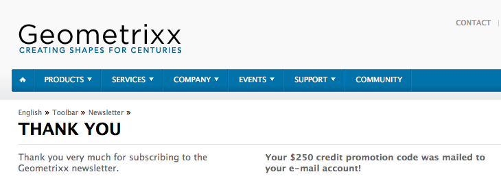

# 建立有效的電子報登陸頁面{#creating-an-effective-newsletter-landing-page}

有效的電子報登陸頁面可協助您讓盡可能多的人註冊電子報（或其他電子郵件行銷活動）。 您可以使用從電子報註冊收集到的資訊來取得潛在客戶。

若要建立有效的電子報登陸頁面，您必須執行下列動作：

1. 建立電子報清單，讓使用者訂閱電子報。
1. 建立註冊表單。 在執行此動作時，新增工作流程步驟，自動將註冊電子報的人員新增至您的潛在客戶清單。
1. 建立「確認」頁面，感謝使用者註冊，並可能提供促銷。
1. 加入茶匙。

>[!NOTE]
>
>Adobe不打算進一步增強這項功能（管理銷售機會和清單）。
>建議您運用 [Adobe Campaign和AEM的整合](/help/sites-administering/campaign.md)。

## 建立電子報清單 {#creating-a-list-for-the-newsletter}

在MCM中建立清單，例如 **Geometrixx Newsletter**，供人們應訂閱的電子報。 建立清單在建立清單 [中介紹](/help/sites-classic-ui-authoring/classic-personalization-campaigns.md#creatingnewlists)。

下列為清單範例：

## 建立註冊表單 {#create-a-sign-up-form}

建立電子報註冊表單，讓使用者訂閱標籤。 範例Geometrixx網站在Geometrixx工具列中提供電子報頁面，您可在其中建立表格。

若要建立您自己的電子報表單，請參閱 [Forms檔案中有關建立表單的資](/help/sites-authoring/default-components.md#form)訊。 電子報使用「標籤庫」中的標籤。 若要新增其他標籤，請參 [閱標籤管理](/help/sites-authoring/tags.md#tagadministration)。

下例中的隱藏欄位提供最少的資訊量（電子郵件）;此外，您稍後可以新增更多欄位，但這會影響轉換率。

以下範例是在https://localhost:4502/cf#/content/geometrixx/en/toolbar/newsletter.html上建立的表格。

1. 建立表格。

   

1. 按一 **下** 「表單」元件中的「編輯」，將表單設定為前往「感謝」頁面(請參閱 [建立感謝頁面](#creating-a-thank-you-page))。

   

1. 設定「表單」動作（這是您送出表單時的結果），並設定群組，將已註冊的使用者指派至您先前建立的清單（例如geometrixx-newsletter）。

   

### 建立感謝頁面 {#creating-a-thank-you-page}

當使用者按一 **下「立即訂閱**」時，您會想要自動開啟「感謝」頁面。 在Geometrixx電子報頁面中建立感謝頁面。 建立電子報表單後，請編輯表單元件，並新增感謝頁面的路徑。

提交請求會將使用者帶往「感 **謝」頁面** ，之後會收到電子郵件。 此「感謝」頁面是在/content/geometrixx/tw/toolbar/newsletter/thank_you建立。

### 新增茶匙 {#adding-teasers}

新增 [預告](/help/sites-classic-ui-authoring/classic-personalization-campaigns.md#teasers) ，以鎖定特定對象。 例如，您可以新增茶匙至「感謝」頁面和「電子報」註冊頁面。

若要新增廣告以建立有效的電子報登陸頁面：

1. 建立摘要段落以取得註冊贈品。 選擇 **First** （優先）作為策略，並加入文字，告知他們將獲得哪些贈品。

   

1. 為「感謝」頁面建立摘要段落。 選擇 **First** （優先）作為策略，並包含表示贈品即將送出的文字。

   

1. 使用兩個預告建立促銷活動——將一個廣告標示為商業廣告，另一個未標籤。

### 推送內容給訂閱者 {#pushing-content-to-subscribers}

透過MCM中的電子報功能，推播任何頁面變更。 然後，您就會將更新的內容推送給訂閱者。

請參閱 [傳送電子報](/help/sites-classic-ui-authoring/classic-personalization-campaigns.md#newsletters)。
