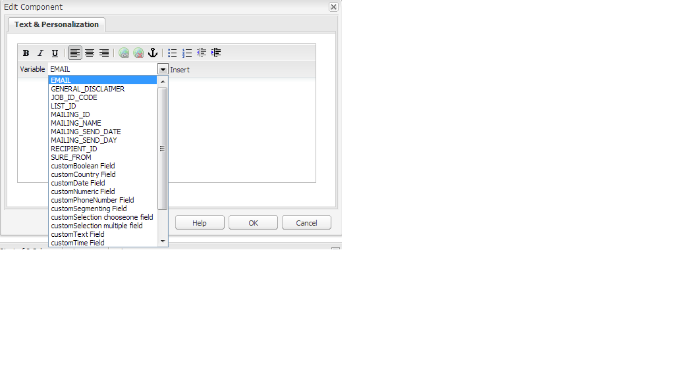

# 向電子郵件服務提供商發佈電子郵件{#publishing-an-email-to-email-service-providers}

您可以將新聞稿發佈到電子郵件服務，如ExactTarget和Silverpop Engage。 本文檔介紹如何配AEM置將新聞簡報發佈到這些電子郵件服務。

>[!NOTE]
>
>在建立和發佈電子郵件之前，需要配置服務提供商。 請參閱 [配置ExactTarget](/help/sites-administering/exacttarget.md) 和 [配置Silverpop Engage](/help/sites-administering/silverpop.md) 的子菜單。

要將電子郵件發佈到電子郵件服務提供商，您需要執行以下步驟：

1. 建立電子郵件。
1. 將「電子郵件服務」配置應用於電子郵件。
1. 發佈電子郵件。

>[!NOTE]
>
>如果您更新電子郵件提供商、執行航班test或發送新聞稿，則如果新聞稿未首先發佈到「發佈」實例或「發佈」實例不可用，則這些操作將失敗。 請確保發佈新聞簡報，並確保「發佈」實例已啟動並正在運行。

## 建立電子郵件 {#creating-an-email}

您希望發佈到電子郵件服務的電子郵件或新聞稿可以在市場活動下使用 **Geometrixx通訊** 的下界。 您還可以使用 **Geometrixx Outdoors電子郵件** 的下界。 基於以下內容的示例電子郵件/新聞稿 **Geometrixx Outdoors電子郵件** 模板可在 `https://<hostname>:<port>/cf#/content/campaigns/geometrixx-outdoors/e-mails.html`。

建立發佈到已配置電子郵件服務的新電子郵件：

1. 轉到 **網站** 然後 **市場活動**。 選擇市場活動。
1. 按一下 **新建** 開啟 **建立頁** 的子菜單。
1. 輸入標題、名稱，然後選擇 **Geometrixx通訊** 模板。
1. 按一下&#x200B;**建立**。
1. 開啟已建立的電子郵件。
1. 切換到設計模式以選擇要在側腳中顯示的元件。
1. 切換到編輯模式並開始添加內容(文本、影像、 [電子郵件工具](#adding-exacttarget-email-tools-to-your-email)。 [個性化變數](#adding-text-and-personalization-tool-to-your-e-mail)等)。

### 將ExactTarget電子郵件工具添加到電子郵件 {#adding-exacttarget-email-tools-to-your-email}

>[!NOTE]
>
>此部分特定於ExactTarget服務。

的 **電子郵件工具** ExactTarget元件可以為您的電子郵件/新聞稿添加更多電子郵件功能。

1. 開啟要發佈到ExactTarget的電子郵件。
1. 添加元件 **ET — 電子郵件工具** 用側腳打到你的頁面。 在「編輯」模式下開啟元件。

   

1. 從 **選項** 菜單：

<table>
 <tbody>
  <tr>
   <td>郵寄地址 (必要)</td>
   <td>此元件在電子郵件中插入您組織的物理郵件地址。</td>
  </tr>
  <tr>
   <td>設定檔中心 (必要)</td>
   <td>配置檔案中心是一個網頁，用戶可以在其中輸入和維護您保留的有關他們的個人資訊。</td>
  </tr>
  <tr>
   <td>以網頁的形式檢視電子郵件</td>
   <td>此元件允許用戶將電子郵件作為網頁查看。</td>
  </tr>
  <tr>
   <td>隱私權原則</td>
   <td>此元件在電子郵件中插入指向隱私策略的連結。  </td>
  </tr>
  <tr>
   <td>取消訂閱中心</td>
   <td>為用戶提供取消訂閱郵件清單的選項。</td>
  </tr>
  <tr>
   <td>訂閱中心</td>
   <td>訂閱中心是一個網頁，訂閱者可以在其中控制從您的組織接收的消息。</td>
  </tr>
  <tr>
   <td>追蹤電子郵件開啟次數</td>
   <td>允許您使用ExactTarget跟蹤功能的隱藏元件。  </td>
  </tr>
 </tbody>
</table>

>[!NOTE]
>
>的 **選項** 僅當將ExactTarget配置應用於電子郵件時，才會填充下拉菜單。 請參閱 [將電子郵件服務配置應用於電子郵件設定](#applying-e-mail-service-configuration-to-e-mail-settings) 的子菜單。

1. 將電子郵件發佈到ExactTarget。

   帶有電子郵件工具的電子郵件可用於配置的ExactTarget帳戶。

>[!NOTE]
>
>* 僅當使用以下方式發送電子郵件時，電子郵件工具中的URL才被其實際值替換（在收到的電子郵件中） **簡單發送** 或 **引導發送** 但 **Test發送**。
>
>* 需要以下兩種電子郵件工具： **物理郵寄地址（必需）** 和 **配置檔案中心（必需）**。 當電子郵件發佈到ExactTarget時，預設情況下，這兩個電子郵件工具會添加到每封郵件的底部。
>

### 將文本和個性化工具添加到電子郵件 {#adding-text-and-personalization-tool-to-your-e-mail}

您可以通過添加 **文本和個性化** 元件：

1. 開啟要發佈到您的電子郵件服務的電子郵件。
1. 要從電子郵件服務啟用個性化欄位，請在配置電子郵件服務時添加框架配置。 請參閱 [配置Silverpop Engage](/help/sites-administering/silverpop.md) 和 [配置精確目標](/help/sites-administering/exacttarget.md) 的子菜單。
1. 添加元件 **文本和個性化** 從側腿上。 此部分是新聞稿組的一部分。 在編輯模式下開啟此元件。

   

1. 通過從下拉菜單中選擇欄位並按一下，將所需的個性化欄位添加到文本中 **插入**。
1. 按一下 **確定** 完成。

## 將電子郵件服務配置應用於電子郵件設定 {#applying-e-mail-service-configuration-to-e-mail-settings}

要將電子郵件服務配置應用於新聞簡報，請執行以下操作：

1. 建立電子郵件服務配置。
1. 開啟您的電子郵件/新聞稿。
1. 通過按一下 **設定** 或 **中的頁面屬性** 幫手。
1. 按一下 **添加服務** 在 **Cloud Services** 頁籤。 您可以看到服務清單。 選擇所需的配置 —  **精確目標** 或 **銀鱸**  — 從下拉清單中。

   

1. 按一下&#x200B;**「確定」**。

## 將電子郵件發佈到電子郵件服務 {#publishing-emails-to-email-service}

電子郵件/新聞稿可以通過以下步驟發佈到您的電子郵件服務：

1. 開啟電子郵件。
1. 在發佈電子郵件之前，請確保您已將正確的配置應用於電子郵件。
1. 點擊&#x200B;**發佈**。開啟 **向電子郵件服務提供商發佈新聞稿** 的子菜單。
1. 填寫 **新聞稿名稱** 的子菜單。 電子郵件/新聞稿將以此名稱發佈給電子郵件服務提供商。 如果未提供電子郵件名稱，則使用中新聞稿的頁名發佈該電AEM子郵件。
1. 點擊&#x200B;**發佈**。

   

   如果成功，AEM確認您可以在ExactTarget或Silverpop Engage中查看電子郵件。

   在ExactTarget中，通過按一下 **查看已發佈電子郵件**。 這將直接帶您訪問ExactTarget([https://members.exacttarget.com/](https://members.exacttarget.com/)。)

>[!NOTE]
>
>如果以與已發佈的電子郵件/新聞稿相同的名稱發佈電子郵件/新聞稿，則不會更換以前的電子郵件/新聞稿。 相反，以同一名稱建立新電子郵件/新聞稿（但是，兩份新聞稿的ID不同）。
>
>將電子郵件/新聞稿發佈給電子郵件服務提供商還將電子郵件/新聞稿發佈AEM到發佈實例。

### 更新已發佈的電子郵件 {#updating-a-published-e-mail}

的 **更新** 按鈕，您可以更新已發佈到電子郵件服務提供商的新聞稿。 如果通訊尚未出版， **更新** 按鈕 **未發佈新聞稿** 顯示消息。

要更新已發佈的電子郵件，請執行以下操作：

1. 開啟以前已發佈給電子郵件服務提供商的電子郵件/新聞稿，在對電子郵件/新聞稿進行更改後，您要重新發佈該電子郵件服務提供商。
1. 點擊&#x200B;**發佈**。的 **向電子郵件服務提供商發佈新聞稿** 窗口。 按一下&#x200B;**更新**。

   要檢查ExactTarget上是否更新了電子郵件/新聞稿，請按一下 **查看已發佈電子郵件**。 這將帶您訪問ExactTarget中發佈的電子郵件。

   要檢查Silverpop電子郵件服務上的電子郵件/新聞稿是否已更新，請訪問Silverpop Engage網站。
