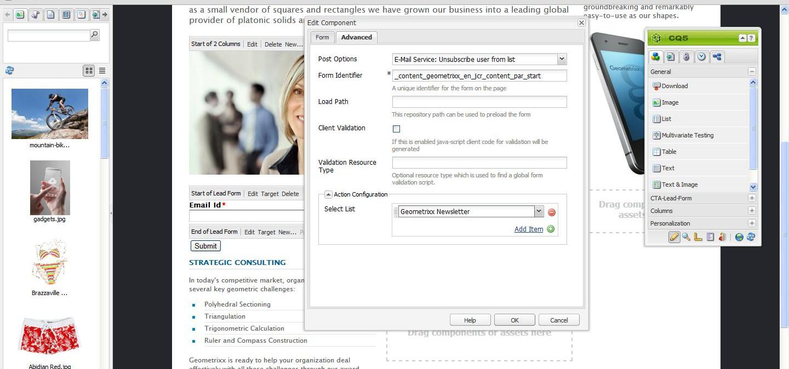

# 管理訂閱{#managing-subscriptions}

>[!NOTE]
>
>Adobe不打算進一步增強這項功能（管理銷售機會和清單）。
>建議您運用 [Adobe Campaign及其AEM整合](/help/sites-administering/campaign.md)。

使用者可透過AEM網頁上使用的 **Form** （表單）元件，訂閱 **** Email Service Provider的郵寄清單。 若要準備AEM頁面，並附上註冊表單以訂閱您的電子郵件服務郵寄清單，您必須將對應的服務設定套用至潛在訂閱者將造訪的AEM頁面。

## 將電子郵件服務配置應用於頁面 {#applying-email-service-configuration-to-a-page}

若要設定AEM頁面：

1. 導覽至「網 **站** 」標籤。
1. 選擇需要為服務配置的頁面。 按一下右鍵該頁並選擇「屬 **性」**。

1. 選擇 **雲端服務** ，然 **後選擇新增服務**。 從可用配置清單中選擇配置。

   

1. 按一下 **確定**。

## 在AEM頁面上建立註冊表單以訂閱／取消訂閱清單 {#creating-a-sign-up-form-on-an-aem-page-for-subscribing-unsubscribing-to-lists}

要建立註冊表單並將其配置為訂閱電子郵件服務提供商的郵件清單：

1. 開啟使用者將造訪的AEM頁面。
1. 將電子郵件服務提供商的配置應用到該頁。

1. 將元 **件從側腳拖曳** ，將Form元件新增至頁面。 如果元件不可用，請切換到設計模式並啟用 **Form** group。
1. 按一 **下** 「表單開 **始」列中的「編輯** 」，並導覽至「 **進階** 」標籤。
1. 在「表 **單** 」下拉式功能表中，選 **擇「電子郵件服務：建立訂閱者** ，並新增至清單。
1. 在對話方塊底部，開啟「 **Action Configuration** 」（動作設定）下拉式清單，可讓您選取一或多個訂閱清單。
1. 在「選 **擇」清單**，選擇您希望用戶訂閱的清單。 您可以使用加號按鈕(新增項目&#x200B;****)新增多個清單。

   

   >[!NOTE]
   >
   >根據電子郵件服務提供商的不同，對話框可能會有所不同。

1. 在「表 **單** 」索引標籤中，選擇您希望使用者在提交表單後前往的感謝頁面（如果留空，表單會在提交時重新顯示）。按一下 **確定**。 「表 **單」中會顯示** 「電子郵件ID」元件，可讓您建立表單，讓使用者提交其電子郵件地址以訂閱或取消訂閱郵寄清單。
1. 從sidekick的「表 **單」區段新增** Submit **** button元件。

   表單已就緒。 將上述步驟中設定的頁面與感謝頁 **面一起發佈** ，到發佈例項。 任何潛在的瀏覽頁面訂閱者都可填寫表單，並訂閱設定中提供的清單。

   >[!NOTE]
   >
   >為了使表單訂閱功能正確， [作者的加密金鑰必須匯出並匯入發佈執行個體](#exporting-keys-from-author-and-importing-on-publish)。

## 從作者匯出金鑰並在發佈時匯入 {#exporting-keys-from-author-and-importing-on-publish}

若要透過發佈例項上的註冊表單訂閱和取消訂閱電子郵件服務，您必須遵循下列步驟：

1. 在作者實例上，導航至「包管理器」。
1. 建立新套件。 將篩選設為 `/etc/key`。
1. 建立並下載套件。
1. 導覽至發佈例項上的「封裝管理員」，然後上傳此封裝。
1. 導覽至「發佈」主控台，然後重新啟動名為 **Adobe Granite Crypto Support的套件**。

## 從清單取消訂閱使用者 {#unsubscribing-users-from-lists}

要從清單中取消訂閱用戶：

1. 開啟具有註冊表單以取消訂閱銷售機會的AEM頁面的頁面屬性。
1. 將服務配置應用到頁面。
1. 在頁面上建立註冊表單。
1. 在配置元件時，選擇操作 **電子郵件服務**:從清 **單取消訂閱使用者。**
1. 從下拉式選單中，選取在取消訂閱時將移除使用者的適當清單。

   

1. 從作者匯出索引鍵以發佈。

## 為電子郵件服務設定自動回應電子郵件 {#configuring-auto-responder-emails-for-email-service}

若要為訂閱者設定自動回應電子郵件：

1. 開啟具有註冊表單的AEM頁面的頁面屬性，以設定銷售機會的自動回應者。
1. 將ExactTarget設定套用至頁面。

1. 將元 **件從側腳拖曳** ，將Form元件新增至頁面。 如果元件不可用，請切換到設計模式並啟用 **Form** 組。
1. 按一 **下** 「表單開 **始」列中的「編輯** 」，並導覽至「 **進階** 」標籤。
1. 在「表 **單** 」下拉式功能表中，選 **擇「電子郵件服務：傳送自動回應者電子郵件。**
1. **選擇電子郵件** （這是以自動回應者電子郵件傳送的郵件）。

1. **選擇「分類** 」（此分類用於傳送電子郵件）。
1. 選取「 **感謝」頁** （使用者提交表單後即被導向至的頁面）。

   在「表 **單** 」索引標籤中，選擇您希望使用者在提交表單後前往的感謝頁面。 （如果留空，表單會在提交時重新顯示）。按一下 **確定**。

1. 從作者匯出索引鍵以發佈。
1. 從sidekick的「表 **單」區段新增** Submit **** button元件。

   註冊表單已準備就緒。 將上述步驟中設定的頁面與感謝頁 **面一起發佈** ，到發佈例項。 任何潛在的訂閱者若造訪該頁面，可填寫表格，而在提交表格時，訪客會在表格中填入的電子郵件ID上收到自動回應的電子郵件。

   >[!NOTE]
   >
   >為了讓註冊表單訂閱功能正常運作， [作者的加密金鑰必須匯出並匯入發佈執行個體](#exporting-keys-from-author-and-importing-on-publish)。

   

