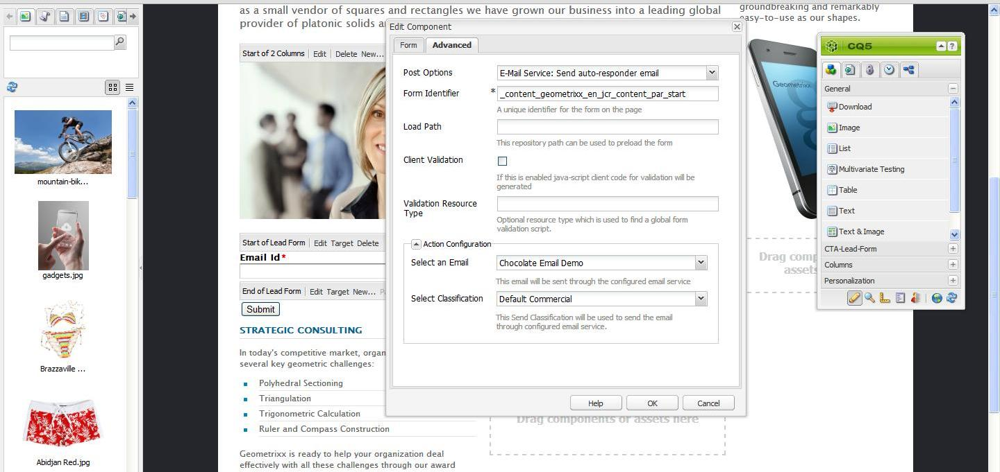

# 管理訂閱{#managing-subscriptions}

>[!NOTE]
>
>Adobe不打算進一步增強此功能（管理銷售機會和清單）。
>建議是利用 [Adobe Campaign及其AEM整合](/help/sites-administering/campaign.md).

可要求使用者訂閱 **電子郵件服務提供商的** 在 **表單** 用於AEM網頁的元件。 要準備具有註冊表格的AEM頁面以訂購電子郵件服務郵寄清單，必須將相應的服務配置應用於潛在訂閱者將訪問的AEM頁面。

## 將電子郵件服務設定套用至頁面 {#applying-email-service-configuration-to-a-page}

設定AEM頁面：

1. 導覽至 **網站** 標籤。
1. 選取需要為服務設定的頁面。 以滑鼠右鍵按一下頁面並選取 **屬性**.

1. 選擇 **Cloud Services** then **添加服務**. 從可用配置清單中選擇配置。

   

1. 按一下&#x200B;**「確定」**。

## 在AEM頁面上建立註冊表單以訂閱/取消訂閱清單 {#creating-a-sign-up-form-on-an-aem-page-for-subscribing-unsubscribing-to-lists}

要建立註冊表單並將其配置為訂閱電子郵件服務提供商的郵件清單，請執行以下操作：

1. 開啟使用者將造訪的AEM頁面。
1. 將電子郵件服務提供者的設定套用至頁面。

1. 新增 **表單** 元件從sidekick拖曳至頁面。 如果元件不可用，請切換到設計模式並啟用 **表單** 群組。
1. 按一下 **編輯** 在 **表單開始** 並導覽至 **進階** 標籤。
1. 在 **表單** 下拉式功能表，選取 **電子郵件服務：建立訂閱者** 和添加到清單。
1. 在對話框底部，開啟 **動作設定** 下拉式清單中，您可以選取一或多個訂閱清單。
1. 在 **選擇清單**，選擇您希望用戶訂閱的清單。 您可以使用加號按鈕(**新增項目**)。

   

   >[!NOTE]
   >
   >您的對話框可能因電子郵件服務提供商而異。

1. 在 **表單** 頁簽中，選擇用戶提交表單後要轉到的感謝頁（如果保留為空，則在提交時表單將重新顯示）。 按一下&#x200B;**「確定」**。安 **電子郵件ID** 元件會顯示在「表單」中，您可以建立表單，讓使用者提交其電子郵件地址以訂閱或取消訂閱郵寄清單。
1. 新增 **提交** 按鈕元件 **表單** sidekick中的區段。

   表單已就緒。 發佈上述步驟中設定的頁面，連同 **謝謝** 頁面至發佈例項。 任何造訪頁面的潛在訂閱者都可填寫表單並訂閱設定中提供的清單。

   >[!NOTE]
   >
   >要使表單訂閱功能正確， [來自作者的加密密鑰需要匯出並匯入發佈執行個體](#exporting-keys-from-author-and-importing-on-publish).

## 從作者匯出金鑰並在發佈時匯入 {#exporting-keys-from-author-and-importing-on-publish}

若要讓電子郵件服務透過發佈執行個體上的註冊表單訂閱和取消訂閱工作，您必須執行下列步驟：

1. 在製作例項上，導覽至套件管理器。
1. 建立新套件。 將篩選器設定為 `/etc/key`.
1. 建置並下載套件。
1. 導覽至發佈執行個體上的套件管理器，然後上傳此套件。
1. 導覽至發佈osgi主控台，然後重新啟動名為 **AdobeGranite加密支援**.

## 從清單取消訂閱用戶 {#unsubscribing-users-from-lists}

若要取消訂閱清單中的用戶：

1. 開啟具有註冊表單的AEM頁面的頁面屬性，以取消訂閱銷售機會。
1. 將服務配置應用到頁。
1. 在頁面上建立註冊表單。
1. 設定元件時，選取動作 **電子郵件服務**: **從清單中取消訂閱用戶。**
1. 從下拉式功能表中，選取取消訂閱時將從中移除使用者的適當清單。

   

1. 從作者匯出索引鍵至發佈。

## 為電子郵件服務設定自動回應者電子郵件 {#configuring-auto-responder-emails-for-email-service}

為訂閱者配置自動響應者電子郵件：

1. 開啟具有註冊表單的AEM頁面的頁面屬性，以設定銷售機會的自動回應者。
1. 將ExactTarget設定套用至頁面。

1. 新增 **表單** 元件從sidekick拖曳至頁面。 如果元件不可用，請切換到設計模式並啟用 **表單** 群組。
1. 按一下 **編輯** 在 **表單開始** 並導覽至 **進階** 標籤。
1. 在 **表單** 下拉式功能表，選取 **電子郵件服務：傳送自動回應者電子郵件。**
1. **選取電子郵件** （這是以自動回應者電子郵件傳送的郵件）。

1. **選取分類** （此分類用於傳送電子郵件）。
1. 選取 **謝謝** 頁面（使用者提交表單後，即會導向至的頁面）。

   在 **表單** 頁簽，選擇用戶提交表單後要轉到的感謝頁。 （如果保留為空白，則提交時會重新顯示表單。） 按一下&#x200B;**「確定」**。

1. 從作者匯出索引鍵至發佈。
1. 新增 **提交** 按鈕元件 **表單** sidekick中的區段。

   註冊表已準備好。 發佈上述步驟中設定的頁面，連同 **謝謝** 頁面至發佈例項。 任何可能造訪頁面的訂閱者皆可填寫表單，在提交表單時，訪客會在表單中填入的電子郵件ID上收到自動回應者的電子郵件。

   >[!NOTE]
   >
   >要使註冊表單訂閱功能正確， [來自作者的加密密鑰需要匯出並匯入發佈執行個體](#exporting-keys-from-author-and-importing-on-publish).

   
