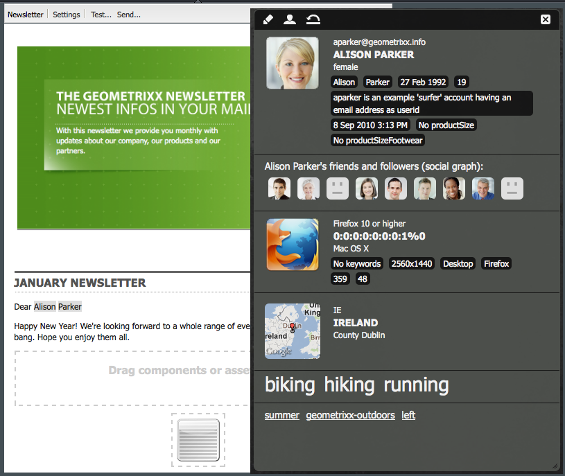
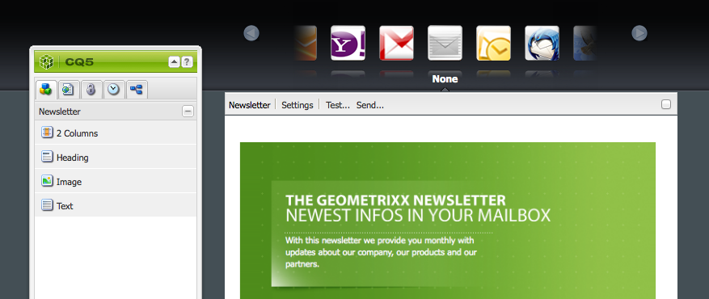
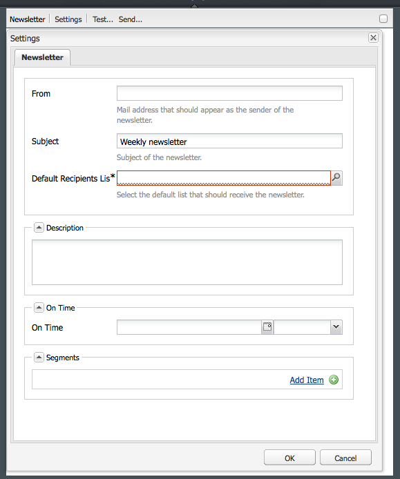
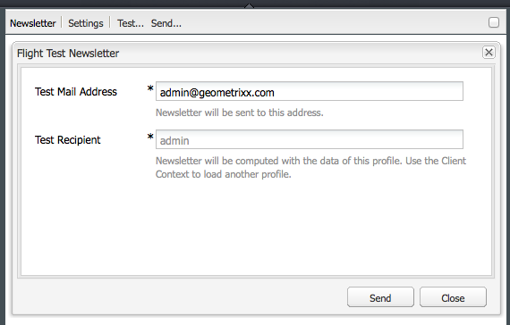
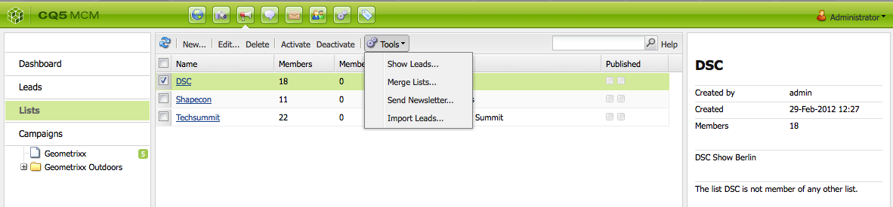
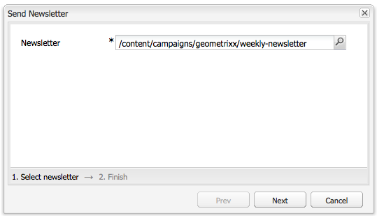

# 電子郵件行銷{#e-mail-marketing}

>[!NOTE]
>
>Adobe不打算進一步加強AEM SMTP服務傳送之開啟／彈回（無法傳遞）的電子郵件追蹤。
>建議您 [運用Adobe Campaign和AEM整合](/help/sites-administering/campaign.md)。

電子郵件行銷（例如電子報）是任何行銷促銷活動的重要部分，因為您使用電子郵件行銷將內容推播至潛在客戶。 在AEM中，您可以從現有的AEM內容建立電子報，並新增電子報專用的新內容。

建立後，您就可立即或在其他排程時間（透過使用工作流程）將電子報傳送給特定的使用者群組。 此外，使用者可以選擇格式訂閱電子報。

此外，AEM還可讓您管理電子報功能，包括維護主題、封存電子報，以及檢視電子報統計資料。

>[!NOTE]
>
>在Geometrixx中，電子報範本會自動開啟電子郵件編輯器。 您可以在其他範本中使用電子郵件編輯器，以傳送電子郵件，例如邀請函。 每當從 **mcm/components/newsletter/page繼承頁面時，就會顯示電子郵件編輯器**。

本檔案說明在AEM中建立電子報的基本概念。 有關如何使用電子郵件行銷的詳細資訊，請參閱下列檔案：

* [建立有效的電子報登陸頁面](/help/sites-classic-ui-authoring/classic-personalization-campaigns-email-landingpage.md)
* [管理訂閱](/help/sites-classic-ui-authoring/classic-personalization-campaigns-email-subscriptions.md)
* [將電子郵件發佈給電子郵件服務供應商](/help/sites-classic-ui-authoring/classic-personalization-campaigns-email-newsletters.md)
* [追蹤已跳回的電子郵件](/help/sites-classic-ui-authoring/classic-personalization-campaigns-email-tracking-bounces.md)

>[!NOTE]
>
>如果您更新電子郵件提供者、進行飛行測試或傳送電子報，如果電子報未先發佈至「發佈」例項或「發佈」例項不可用，這些作業就會失敗。 請確定要發佈您的電子報，並確定「發佈」執行個體已啟動並執行。

## 建立電子報體驗 {#creating-a-newsletter-experience}

>[!NOTE]
>
>電子郵件通知需要透過osgi設定來設定。 請參閱 [設定電子郵件通知。](/help/sites-administering/notification.md)

1. 在左窗格中選取您的新促銷活動，或在右窗格中按兩下它。

1. 使用表徵圖選擇清單視圖：

   

1. 按一下 **新建……**

   您可以指定 **要建立的**「標題 **」** 、「名稱」和體驗類型；在本例中，請使用電子報。

   

1. 按一下&#x200B;**「建立」**。

1. 新對話方塊將立即開啟。 您可以在此處輸入電子報的屬性。

   「預 **設收件者清單** 」是必填欄位，因為此欄位是電子報的觸點(如需清單的詳細資訊，請 [參閱使用清單](/help/sites-classic-ui-authoring/classic-personalization-campaigns.md#workingwithlists) )。

   

   * **From Name** Name, that should be aspear as the sender of the newsletter.

   * **寄件者**：應顯示為電子報寄件者的電子郵件地址。

   * **電子**&#x200B;報的主旨。

   * **回覆寄**&#x200B;送電子報的回覆地址。

   * **說明**&#x200B;電子報的說明。

   * **準時**&#x200B;傳送電子報的準時時間。

   * **預設收件者清**&#x200B;單應接收電子報的預設清單。
   **這些內容可在稍後的階段從「屬**&#x200B;性……」對話框。

1. 按一 **下「確定** 」以儲存。

## 新增內容至電子報 {#adding-content-to-newsletters}

您可以像在任何AEM元件中一樣，將內容（包括動態內容）新增至電子報。 在Geometrixx中，電子報範本有某些元件可用來新增和修改電子報中的內容。

1. 在MCM中，按一下「促 **銷活動** 」標籤，然後按兩下您要新增內容或編輯的電子報。 電子報開啟。

1. 如果元件不可見，請前往「設計」檢視並啟用必要的元件（例如，電子報元件），然後再開始編輯。
1. 視需要輸入任何新文字、影像或其他元件。 在Geometrixx範例中，有4個元件可供使用：文字、影像、標題和2欄。 根據您的設定方式，您的電子報可能會有更多或更少的元件。

   >[!NOTE]
   >
   >您使用變數來個人化電子報。 在Geometrixx電子報中，變數可在Text元件中使用。 變數的值會繼承自使用者設定檔中的資訊。

   

1. 若要插入變數，請從清單中選取變數，然後按一下「 **插入**」。 變數會從描述檔填入。

## 個人化電子報 {#personalizing-newsletters}

您可在Geometrixx中，將預先定義的變數插入電子報的Text元件，以個人化電子報。 變數的值會繼承自使用者設定檔中的資訊。

您也可以使用客戶情境並載入個人檔案，模擬電子報的個人化方式。

若要個人化電子報並模擬其外觀：

1. 從MCM開啟您要自訂的電子報設定。

1. 開啟您要個人化的文字元件。

1. 將游標置於要顯示變數的位置，然後從下拉式清單中選取變數，然後按一下「插入 **」**。 請視需要對任意數量的變數執行此動作，然後按一下「 **確定**」。

   

1. 若要模擬變數在傳送時的外觀，請按CTRL+ALT+c以開啟用戶端內容並選取「載入」 **(Load**)。 從要載入其配置檔案的清單中選擇用戶，然後按一下「確 **定」**。

   您載入的描述檔資訊已填入變數。

   

## 在不同的電子郵件客戶端中測試電子報 {#testing-newsletters-in-different-e-mail-clients}

>[!NOTE]
>
>在傳送電子報之前，請在中檢查Day CQ Link Externalizer的OSGi設定 `https://localhost:4502/system/console/configMgr`。
>
>預設情況下，參數的值為，如果 `localhost:4502` 更改了運行實例的埠，則無法完成操作。

在常用的電子郵件用戶端之間切換，可查看銷售機會端所看到的 Newsletter 外觀。依預設，您的電子報會開啟，但未選取任何電子郵件用戶端。

目前，您可以在下列電子郵件用戶端中檢視電子報：

* Yahoo郵件
* Gmail
* Hotmail
* Thunderbird
* Microsoft Outlook 2007
* Apple Mail

若要在用戶端之間切換，請按一下對應的圖示，以檢視該電子郵件用戶端中的電子報：

1. 從MCM開啟您要自訂的電子報設定。

1. 按一下頂端列中的電子郵件用戶端，查看該用戶端中的電子報外觀。

   

1. 對您想查看的任何其他電子郵件客戶端重複此步驟。

   

## 自訂電子報設定 {#customizing-newsletter-settings}

雖然只有授權的使用者可以傳送電子報，但您應自訂下列內容：

* 主旨行，讓使用者可以開啟您的電子郵件，並確保電子報不會最後標示為垃圾訊息。
* 「寄件者」位址(例如noreply@geometrixx.com)，讓使用者從指定位址接收電子郵件。

若要自訂電子報設定：

1. 從MCM開啟您要自訂的電子報設定。

   

1. 在電子報頂端，按一下「設 **定」**。

   
1. 輸入 **寄件者** (From)電子郵件地址

1. 如有必 **要** ，請修改電子郵件的主旨。

1. 從下拉 **式清單中選取「預設收件者清單** 」。

1. 按一下 **確定**。

   當您測試或傳送電子報時，收件者將會收到電子郵件，內含指定的電子郵件地址和主旨。

## 飛行測試電子報 {#flight-testing-newsletters}

雖然飛行測試並非必備，但在您傳送電子報之前，您可能會想先進行測試，以確定它以您想要的方式呈現。

飛行測試可讓您執行下列動作：

* 查看所有預定客戶 [的電子報](#testing-newsletters-in-different-e-mail-clients)。
* 驗證郵件伺服器設定正確。
* 判斷您的電子郵件是否被標幟為垃圾訊息。 （請確定您將自己納入收件者清單中）。

>[!NOTE]
>
>如果您更新電子郵件提供者、進行飛行測試或傳送電子報，如果電子報未先發佈至「發佈」例項或「發佈」例項不可用，這些作業就會失敗。 請確定要發佈您的電子報，並確定「發佈」執行個體已啟動並執行。

要試飛電子報，請：

1. 從MCM開啟您要測試並傳送的電子報。

1. 在電子報頂端，按一下「測 **試** 」以進行測試再傳送。

   

1. 輸入要傳送電子報的測試郵件地址，然後按一下「 **傳送**」。 如果您要變更描述檔，請在用戶端內容中載入另一個描述檔。 要執行此操作，請按CTRL+ALT+c，然後選擇「載入」(Load)並載入配置檔案。

## 傳送電子報 {#sending-newsletters}

>[!NOTE]
>
>Adobe不打算進一步加強AEM SMTP服務傳送之開啟／彈回（無法傳遞）的電子郵件追蹤。
>建議您 [運用Adobe Campaign和AEM整合](/help/sites-administering/campaign.md)。

您可以從電子報或清單中傳送電子報。 說明了兩個過程。

>[!NOTE]
>
>在傳送電子報之前，請在中檢查Day CQ Link Externalizer的OSGi設定 `https://localhost:4502/system/console/configMgr`。
>
>預設情況下，參數的值為，如果 `localhost:4502` 更改了運行實例的埠，則無法完成操作。

>[!NOTE]
>
>如果您更新電子郵件提供者、進行飛行測試或傳送電子報，如果電子報未先發佈至「發佈」例項或「發佈」例項不可用，這些作業就會失敗。 請確定要發佈您的電子報，並確定「發佈」執行個體已啟動並執行。

### 從促銷活動傳送電子報 {#sending-newsletters-from-a-campaign}

若要從促銷活動內傳送電子報：

1. 從MCM開啟您要傳送的電子報。

   >[!NOTE]
   >
   >在傳送之前，請務必自訂電子報的主旨並透過自訂其設定來寄送 [電子郵件地址](#customizing-newsletter-settings)。
   >
   >
   >[建議在傳送](#flight-testing-newsletters) 之前先測試電子報。

1. 在電子報頂端，按一下「傳 **送」**。 Newsletter精靈隨即開啟。

1. 在收件者的清單中，選取您要接收電子報的清單，然後按一下「下 **一步**」。

   

1. 已確認安裝完成。 按一 **下「傳送** 」以實際傳送電子報。

   

   >[!NOTE]
   >
   >請確定您是其中一位收件者，以確保收到電子報。

### 從清單傳送電子報 {#sending-newsletters-from-a-list}

若要從清單傳送電子報：

1. 在MCM中，按一下左 **窗格中** 「清單」。

   >[!NOTE]
   >
   >在傳送之前，請務必自訂電子報的主旨並透過自訂其設定來寄送 [電子郵件地址](#customizing-newsletter-settings)。 如果您從清單中傳送電子報，則無法測試電子報；如果您 [從電子報傳送](#flight-testing-newsletters) ，就可以進行飛行測試。

1. 選取您要傳送電子報給之潛在客戶清單旁的核取方塊。

1. 在「工具 **」功能表** ，選取「 **傳送電子報」**。 「Send **Newsletter** （傳送電子報）」視窗隨即開啟。

   

1. 在「電 **子報** 」欄位中，選取您要傳送的電子報，然後按一下「下 **一步」**。

   

1. 已確認安裝完成。 按一 **下「傳送** 」，將選取的電子報傳送至指定的銷售機會清單。

   

   您的電子報會傳送給選取的收件者。

## 訂閱電子報 {#subscribing-to-a-newsletter}

本節說明如何訂閱電子報。

### 訂閱電子報 {#subscribing-to-a-newsletter-1}

若要訂閱電子報（以Geometrixx網站為例）:

1. 按一 **下「網站** 」，並導覽至Geometrixx **工具列** ，然後開啟它。

   

1. 在Geometrixx電子報 **註冊欄位** ，輸入您的電子郵件地址，然後按一下 **註冊**。 您現在已訂閱電子報。
