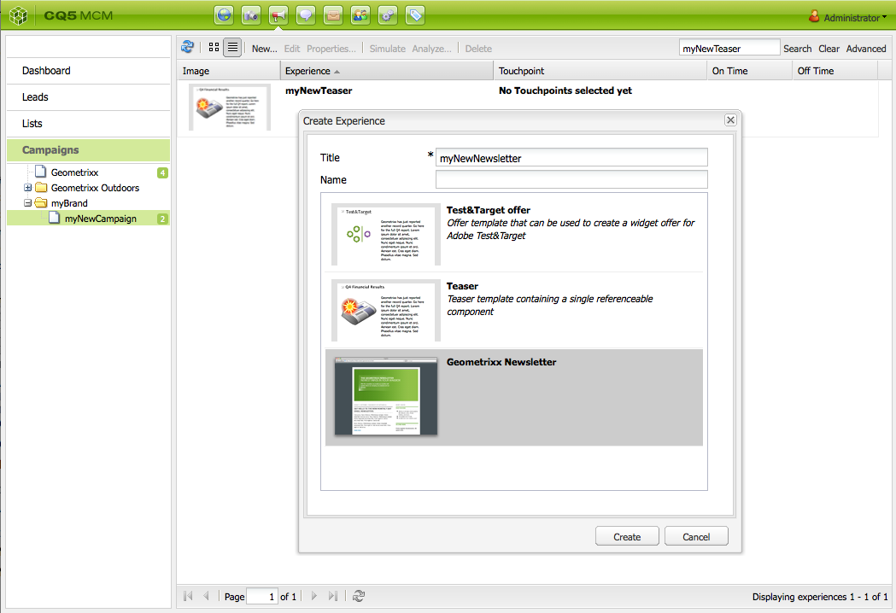

# 電子郵件行銷{#e-mail-marketing}

>[!NOTE]
>
>Adobe不打算進一步增強AEM SMTP服務所傳送開啟/跳出（無法傳遞）的電子郵件追蹤功能。
>建議使用[Adobe Campaign以及與AEM](/help/sites-administering/campaign.md)的整合。

電子郵件行銷（例如電子報）是任何行銷活動的重要部分，因為您會使用電子郵件行銷將內容推送至潛在客戶。 在AEM中，您可以從現有AEM內容建立電子報，並新增電子報專屬的新內容。

建立後，您可以立即或在另一個排程時間（透過使用工作流程）將電子報傳送給特定使用者群組。 此外，使用者可選擇格式訂閱電子報。

此外，AEM可讓您管理新聞稿功能，包括維護主題、封存新聞稿和檢視新聞稿統計資料。

>[!NOTE]
>
>在Geometrixx中，電子報範本會自動開啟電子郵件編輯器。 您可以在想要傳送電子郵件的其他範本（例如邀請）中使用電子郵件編輯器。 電子郵件編輯器會在任何從&#x200B;**mcm/components/newsletter/page**&#x200B;繼承頁面時顯示。

本檔案說明在AEM中建立電子報的基本概念。 如需如何使用電子郵件行銷的詳細資訊，請參閱下列檔案：

* [建立有效的Newsletter登陸頁面](/help/sites-classic-ui-authoring/classic-personalization-campaigns-email-landingpage.md)
* [管理訂閱](/help/sites-classic-ui-authoring/classic-personalization-campaigns-email-subscriptions.md)
* [發佈電子郵件給電子郵件服務提供者](/help/sites-classic-ui-authoring/classic-personalization-campaigns-email-newsletters.md)
* [追蹤退信電子郵件](/help/sites-classic-ui-authoring/classic-personalization-campaigns-email-tracking-bounces.md)

>[!NOTE]
>
>如果您更新電子郵件提供者、進行快速測試或傳送電子報，如果未先將電子報發佈至Publish執行個體，或無法使用Publish執行個體，則這些作業會失敗。 請務必發佈電子報，並確定Publish執行個體已啟動且執行中。

## 建立電子報體驗 {#creating-a-newsletter-experience}

>[!NOTE]
>
>需要透過osgi設定來設定電子郵件通知。 請參閱[設定電子郵件通知。](/help/sites-administering/notification.md)

1. 在左窗格中選取新的行銷活動，或在右窗格中按兩下。

1. 使用圖示選取清單檢視：

   

1. 按一下&#x200B;**新增……**

   您可以指定要建立的&#x200B;**標題**、**名稱**&#x200B;和體驗型別；在此案例中為Newsletter。

   

1. 按一下&#x200B;**建立**。

1. 隨即開啟新的對話方塊。 您可在此輸入Newsletter的屬性。

   **預設收件者清單**&#x200B;為必填欄位，因為這會形成Newsletter的接觸點（如需清單的詳細資訊，請參閱[使用清單](/help/sites-classic-ui-authoring/classic-personalization-campaigns.md#workingwithlists)）。

   

   * **來自名稱**
應顯示為Newsletter寄件者的名稱。

   * **寄件者地址**
應顯示為Newsletter寄件者的郵件地址。

   * **主旨**
Newsletter的主題。

   * **回覆**
郵件地址，負責處理已傳送Newsletter的回覆

   * **描述**
Newsletter的說明。

   * **開啟時間**
傳送Newsletter的準時。

   * **預設收件者清單**
應接收Newsletter的預設清單。

   稍後可從&#x200B;**屬性……**&#x200B;對話方塊更新這些專案。

1. 按一下&#x200B;**確定**&#x200B;以儲存。

## 新增內容至電子報 {#adding-content-to-newsletters}

您可以像在任何AEM元件中一樣將內容（包括動態內容）新增到您的電子報中。 在Geometrixx中，電子報範本有某些元件可用於新增和修改電子報的內容。

1. 在MCM中，按一下&#x200B;**促銷活動**&#x200B;標籤，然後按兩下您要新增內容或編輯的新聞稿。 電子報隨即開啟。

1. 如果元件未顯示，請前往「設計」檢視並啟用必要的元件（例如Newsletter元件），然後再開始編輯。
1. 視需要輸入任何新文字、影像或其他元件。 在Geometrixx範例中，有4個元件可供使用：文字、影像、標題和2欄。 視您的設定方式而定，您的Newsletter可能有更多或更少的元件。

   >[!NOTE]
   >
   >您可以使用變數個人化電子報。 在Geometrixx電子報中，變數位於文字元件中。 變數的值繼承自使用者設定檔中的資訊。

   

1. 若要插入變數，請從清單中選取變數，然後按一下&#x200B;**插入**。 變數會從設定檔填入。

## 個人化電子報 {#personalizing-newsletters}

您可以在Geometrixx的電子報的文字元件中插入預先定義的變數，以個人化電子報。 變數的值繼承自使用者設定檔中的資訊。

您也可以使用使用者端內容並載入設定檔，以類比電子報的個人化方式。

若要個人化電子報並模擬其外觀：

1. 從MCM，開啟您要自訂設定的Newsletter。

1. 開啟您要個人化的文字元件。

1. 將游標放在您要變數出現的位置，並從下拉式清單中選取變數，然後按一下&#x200B;**插入**。 請視需要為任意數量的變數執行此動作，然後按一下[確定]。****

   

1. 若要模擬變數在傳送時的外觀，請按CTRL+ALT+c開啟使用者端內容，並選取&#x200B;**載入**。 從清單中選取您要載入其設定檔的使用者，然後按一下[確定]。****

   您載入的設定檔資訊已填入變數。

   

## 在不同電子郵件使用者端中測試電子報 {#testing-newsletters-in-different-e-mail-clients}

>[!NOTE]
>
>在傳送電子報之前，請檢查`https://localhost:4502/system/console/configMgr`處Day CQ Link Externalizer的OSGi設定。
>
>依預設，引數的值為`localhost:4502`，如果執行執行個體的連線埠已變更，則作業無法完成。

在常用的電子郵件使用者端之間切換，可檢視潛在客戶所看到的Newsletter外觀。 依預設，您的Newsletter會開啟，但未選取任何電子郵件使用者端。

目前，您可以在下列電子郵件使用者端中檢視電子報：

* Yahoo郵件
* Gmail
* Hotmail
* Thunderbird
* Microsoft Outlook 2007
* Apple Mail

若要在使用者端之間切換，請按一下對應的圖示以檢視該電子郵件使用者端中的Newsletter：

1. 從MCM，開啟您要自訂設定的Newsletter。

1. 按一下頂端列中的電子郵件使用者端，檢視該使用者端中的Newsletter外觀。

   

1. 對您要檢視的其他電子郵件使用者端重複此步驟。

   

## 自訂Newsletter設定 {#customizing-newsletter-settings}

雖然只有授權使用者才能傳送電子報，但您應自訂下列專案：

* 主旨列，讓使用者想要開啟您的電子郵件，並確保您的電子報最終不會標示為垃圾訊息。
* 寄件者地址，例如`noreply@geometrixx.com`，讓使用者從指定的地址接收電子郵件。

若要自訂Newsletter設定：

1. 從MCM，開啟您要自訂設定的Newsletter。

   

1. 在Newsletter頂端按一下&#x200B;**設定**。

   
1. 輸入&#x200B;**寄件者**&#x200B;電子郵件地址

1. 如有需要，請修改電子郵件的&#x200B;**主旨**。

1. 從下拉式清單中選取&#x200B;**預設收件者清單**。

1. 按一下&#x200B;**「確定」**。

   當您測試或傳送Newsletter時，收件者會收到含有指定電子郵件地址和主旨的電子郵件。

## 飛行測試電子報 {#flight-testing-newsletters}

雖然航班測試並非強制性，但在您傳送電子報之前，您可能需要先測試航班是否如您預期般顯示。

飛行測試可讓您進行以下工作：

* 檢視[所有預定使用者端](#testing-newsletters-in-different-e-mail-clients)中的Newsletter。
* 驗證郵件伺服器是否已正確設定。
* 判斷您的電子郵件是否被標籤為垃圾訊息。 （請務必將自己加入收件者清單。）

>[!NOTE]
>
>如果您更新電子郵件提供者、進行快速測試或傳送電子報，如果未先將電子報發佈至Publish執行個體，或無法使用Publish執行個體，則這些作業會失敗。 請務必發佈電子報，並確定Publish執行個體已啟動且執行中。

若要試飛測試電子報：

1. 從MCM，開啟您要測試並傳送的Newsletter。

1. 在Newsletter最上方，按一下&#x200B;**測試**，測試後再傳送。

   

1. 輸入您要傳送Newsletter的測試郵件地址，然後按一下&#x200B;**傳送**。 如果要變更設定檔，請在使用者端內容中載入另一個設定檔。 若要這麼做，請按下CTRL+ALT+c並選取「載入」並載入設定檔。

## 傳送電子報 {#sending-newsletters}

>[!NOTE]
>
>Adobe不打算進一步增強AEM SMTP服務所傳送開啟/跳出（無法傳遞）的電子郵件追蹤功能。
>建議使用[Adobe Campaign以及與AEM](/help/sites-administering/campaign.md)的整合。

您可以從Newsletter或清單傳送Newsletter。 這兩個程式都有所描述。

>[!NOTE]
>
>在傳送電子報之前，請檢查`https://localhost:4502/system/console/configMgr`處Day CQ Link Externalizer的OSGi設定。
>
>依預設，引數的值為`localhost:4502`，如果執行執行個體的連線埠已變更，則作業無法完成。

>[!NOTE]
>
>如果您更新電子郵件提供者、進行快速測試或傳送電子報，如果未先將電子報發佈至Publish執行個體，或無法使用Publish執行個體，則這些作業會失敗。 請務必發佈電子報，並確定Publish執行個體已啟動且執行中。

### 從行銷活動傳送電子報 {#sending-newsletters-from-a-campaign}

若要從行銷活動傳送電子報：

1. 從MCM，開啟您要傳送的Newsletter。

   >[!NOTE]
   >
   >在寄出之前，請確定您已自訂新聞稿的主旨及原始電子郵件地址，方法是[自訂其設定](#customizing-newsletter-settings)。
   >
   >
   >[小眾測試版](#flight-testing-newsletters)建議在傳送前先測試電子報。

1. 在Newsletter頂端按一下&#x200B;**傳送**。 Newsletter精靈隨即開啟。

1. 在收件者清單中，選取您要接收Newsletter的清單，然後按一下&#x200B;**下一步**。

   

1. 已確認安裝完成。 按一下&#x200B;**傳送**&#x200B;以實際傳送Newsletter。

   

   >[!NOTE]
   >
   >請確定您是收件者之一，這樣您就可以確保已收到Newsletter。

### 從清單傳送電子報 {#sending-newsletters-from-a-list}

若要從清單傳送Newsletter：

1. 在MCM中，按一下左側窗格中的&#x200B;**清單**。

   >[!NOTE]
   >
   >在寄出之前，請確定您已自訂新聞稿的主旨及原始電子郵件地址，方法是[自訂其設定](#customizing-newsletter-settings)。 如果您從清單傳送Newsletter，則無法測試它；如果您從Newsletter傳送，則可以[試用](#flight-testing-newsletters)。

1. 選取您要傳送Newsletter的目標銷售機會清單旁的核取方塊。

1. 在&#x200B;**工具**&#x200B;功能表中，選取&#x200B;**傳送Newsletter**。 **傳送Newsletter**&#x200B;視窗隨即開啟。

   

1. 在&#x200B;**電子報**&#x200B;欄位中，選取您要傳送的電子報，然後按一下&#x200B;**下一步**。

   

1. 已確認安裝完成。 按一下&#x200B;**傳送**，將選取的Newsletter傳送到指定的銷售機會清單。

   

   您的Newsletter已傳送給所選的收件者。

## 訂閱電子報 {#subscribing-to-a-newsletter}

本節說明如何訂閱電子報。

### 訂閱電子報 {#subscribing-to-a-newsletter-1}

訂閱電子報(以Geometrixx網站為例)：

1. 按一下&#x200B;**網站**&#x200B;並瀏覽至Geometrixx **工具列**&#x200B;並開啟它。

   

1. 在Geometrixx電子報&#x200B;**註冊**&#x200B;欄位中，輸入您的電子郵件地址並按一下&#x200B;**註冊**。 您已訂閱電子報。
