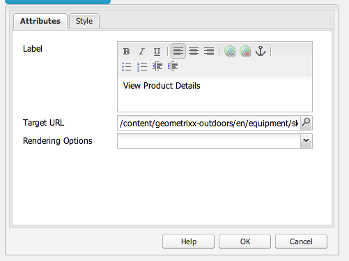
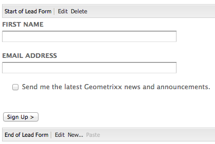
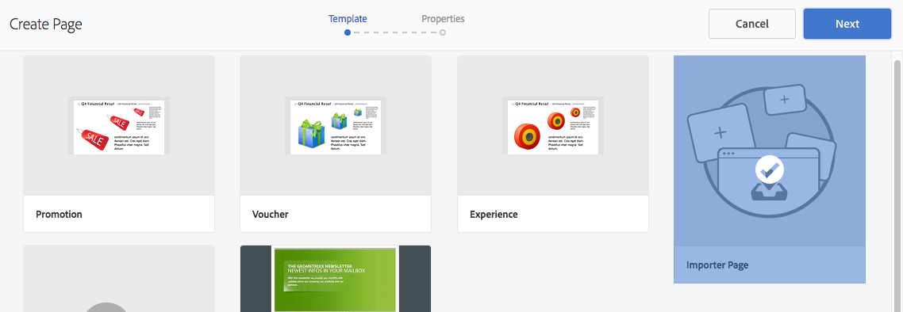

# 著陸頁面{#landing-pages}

登錄頁面功能可讓您快速輕鬆地將設計和內容直接匯入AEM頁面。 網頁開發人員可以準備HTML和其他資產，這些資產可以匯入為完整頁面或僅匯入頁面的一部分。 此功能對於建立僅在有限時間內有效且需要快速建立的行銷登錄頁面非常有用。

本頁面說明下列項目：

* AEM中的登錄頁面看起來是什麼樣子，包括可用的元件
* 如何建立登錄頁面及如何匯入設計套件
* 如何使用AEM中的登錄頁面
* 如何設定行動登錄頁面

[Extending and Configuring the Design Importer](/help/sites-administering/extending-the-design-importer-for-landingpages.md)中涵蓋準備要匯入的設計套件。 [將登錄頁面與Adobe Analytics整合中涵蓋與Adobe Analytics的整合。](/help/sites-administering/integrating-landing-pages-with-adobe-analytics.md)

>[!CAUTION]
>
>AEM 6.5](/help/release-notes/deprecated-removed-features.md#deprecated-features)已棄用用於匯入登錄頁面的設計匯入工具[。

>[!CAUTION]
>
>由於設計匯入工具需要存取`/apps`，因此在不可變的`/apps`容器化雲端環境中無法運作。

## 什麼是登錄頁面？{#what-are-landing-pages}

登錄頁面是單頁或多頁面網站，是行銷外展的「端點」，例如電子郵件、廣告詞/橫幅、社交媒體。 登錄頁面可以用於各種用途，但所有頁面都有一個共同點：訪客應完成一項工作，並定義登錄頁面的成功。

AEM中的「登錄頁面」功能可讓行銷人員與代理商或內部創意團隊的網頁設計人員合作，建立可輕鬆匯入AEM、仍可由行銷人員編輯的頁面設計，並在與其他AEM支援網站相同的控管下發佈。

在AEM中，您需執行下列步驟以建立登錄頁面：

1. 在AEM中建立包含登錄頁面畫布的頁面。 AEM隨附名為&#x200B;**匯入工具頁面**&#x200B;的範例。

1. [準備HTML和資產。](/help/sites-administering/extending-the-design-importer-for-landingpages.md)
1. 將資源封裝成ZIP檔案，即此處所稱的「設計套件」。
1. 在匯入工具頁面上匯入設計套件。
1. 修改並發佈頁面。

### 案頭登錄頁{#desktop-landing-pages}

AEM中的著陸頁面範例如下所示：

### 行動登陸頁面{#mobile-landing-pages}

登錄頁面也可以有頁面的行動版本。 若要擁有登錄頁面的個別行動版本，匯入設計必須有兩個html檔案：*index.htm(l)*&#x200B;和&#x200B;*mobile.index.htm(l)*。

登錄頁面匯入程式與一般登錄頁面的程式相同，登錄頁面設計有與行動登錄頁面對應的其他html檔案。 此html檔案也必須具有畫布`div`，其`id=cqcanvas`與案頭登錄頁面html類似，並支援案頭登錄頁面說明的所有可編輯元件。

行動登錄頁面會建立為案頭登錄頁面的子頁面。 若要開啟，請導覽至網站中的登陸頁面，然後開啟子頁面。

>[!NOTE]
>
>如果案頭登錄頁面遭刪除或停用，行動登錄頁面會與案頭登錄頁面一併刪除/停用。

## 登錄頁面元件{#landing-page-components}

若要讓在AEM中匯入的部分HTML可以編輯，您可以直接將登錄頁面HTML中的內容對應至AEM元件。 設計匯入工具可依預設了解下列元件：

* 文本，適用於任何文本
* 標題，適用於H1-6標籤中的內容
* 影像，用於應可更換的影像
* 呼叫動作：

   * 點進連結
   * 圖形連結

* CTA銷售機會表單，以擷取使用者資訊
* 段落系統(Parsys)，以允許新增任何元件，或轉換上述元件

此外，您也可以擴充此功能，並支援自訂元件。 本節將詳細說明這些元件。

### 文字 {#text}

Text元件可讓您使用WYSIWYG編輯器輸入文字區塊。 如需詳細資訊，請參閱[文字元件](/help/sites-authoring/default-components.md#text)。

以下是登錄頁面上的文字元件範例：

#### 標題 {#title}

標題元件可讓您顯示標題並設定大小(h1-6)。 如需詳細資訊，請參閱[標題元件](/help/sites-authoring/default-components.md#title)。

以下是登錄頁面上的標題元件範例：

#### 影像 {#image}

影像元件會顯示一個影像，您可以從「內容尋找器」拖放或按一下以上傳。 如需詳細資訊，請參閱[影像元件](/help/sites-authoring/default-components.md)。

以下是登錄頁面上的影像元件範例：

#### 動作呼叫(CTA){#call-to-action-cta}

登錄頁面設計可能有數個連結，其中有些可能是以「行動呼籲」的形式呈現。

動作呼叫(CTA)可用來讓訪客在登陸頁面上立即採取動作，例如「立即訂閱」、「檢視此影片」、「僅限時間」等。

* 點進連結 — 可讓您新增文字連結，當點按連結時，會將訪客帶往目標URL。
* 圖形連結 — 可讓您新增在點按時將訪客帶往目標URL的影像。

兩個CTA元件都有類似的選項。 點進連結有其他RTF選項。 下文各段將詳細說明這些構成部分。

#### 點進連結{#click-through-link}

此CTA元件可用來在登錄頁面上新增文字連結。 可以按一下該連結，將使用者帶往元件屬性中指定的目標URL。 這是「行動呼籲」群組的一部分。

**** 標籤使用者看到的文字。您可以使用RTF編輯器修改格式。

**目** 標URL輸入希望用戶按一下文本時訪問的URI。

**呈現選** 項描述呈現選項。您可以選取下列項目：

* 在新瀏覽器視窗中載入頁面
* 在目前視窗中載入頁面
* 在父框架中載入頁面
* 取消所有幀，並在完整瀏覽器窗口中載入頁

**** CSSO在「樣式」頁簽中，輸入CSS樣式表的路徑。

**** 在樣式標籤中，輸入元件的ID以唯一識別元件。

以下是點進連結的範例：

#### 圖形連結 {#graphical-link}

此CTA元件可用來新增任何圖形影像，其中包含登陸頁面上的連結。 影像可以是簡單按鈕或任何以圖形影像作為背景的影像。 按一下影像時，會將使用者帶至元件屬性中指定的目標URL。 它是&#x200B;**動作呼叫**&#x200B;群組的一部分。

**** 標籤用戶在圖形中看到的文本。您可以使用RTF編輯器修改格式。

**目** 標URL輸入用戶按一下影像時要訪問的URI。

**呈現選** 項描述呈現選項。您可以選取下列項目：

* 在新瀏覽器視窗中載入頁面
* 在目前視窗中載入頁面
* 在父框架中載入頁面
* 取消所有幀，並在完整瀏覽器窗口中載入頁

**** CSSO在「樣式」頁簽中，輸入CSS樣式表的路徑。

**** 在樣式標籤中，輸入元件的ID以唯一識別元件。

以下是範例圖形連結：

### 行動要求(CTA)銷售機會表單{#call-to-action-cta-lead-form}

銷售機會表單是用於收集訪客/銷售機會設定檔資訊的表單。 這些資訊可以儲存，並稍後用於根據這些資訊進行有效的營銷。 此資訊通常包括標題、姓名、電子郵件、出生日期、地址、興趣等。 它是&#x200B;**CTA Lead表單**&#x200B;組的一部分。

CTA銷售機會表單範例如下：

CTA銷售機會表單是由數個不同元件所建立：

* **銷售**
機會表單銷售機會表單元件定義頁面上新銷售機會表單的開始和結束。接著，您就可以將其他元件放在這些元素之間，例如電子郵件ID、名字等。

* **表單欄位**
和元素表單欄位和元素可以包括文本框、單選按鈕、影像等。使用者通常會在表單欄位中完成動作，例如輸入文字。 如需詳細資訊，請參閱個別表單元素。

* **設定**
檔元件設定檔元件與用於社交協作的訪客設定檔，以及需要訪客個人化的其他區域相關。

前面是示例表單；它由&#x200B;**Lead Form**&#x200B;元件（開頭和結尾）組成，其中&#x200B;**First Name**&#x200B;和&#x200B;**Email Id**&#x200B;欄位用於輸入，**Submit**&#x200B;欄位用於輸入

從sidekick,CTA Lead Form可使用下列元件：

#### 許多潛在客戶表單元件的常見設定{#settings-common-to-many-lead-form-components}

雖然每個銷售機會表單元件的用途不同，但許多元件都包含類似的選項和參數。

配置任何表單元件時，對話框中都提供以下頁簽：

* **標題和**
文本您需要在此處指定基本資訊，如元件的標題和任何隨附的文本。如果適用，它還允許您定義其他關鍵資訊，例如欄位是否為多個可選欄位，以及可供選擇的項目。

* **初始**
值允許指定預設值。

* ****
限制在此您可以指定欄位是否為必要欄位，並將限制置於該欄位上（例如，必須為數值等）。

* ****
樣式指示欄位的大小和樣式。

>[!NOTE]
>
>您看到的欄位會依個別元件而異。
>
>並非所有選項都適用於所有銷售機會表單元件。 如需這些[常見設定](/help/sites-authoring/default-components.md#formsgroup)的詳細資訊，請參閱Forms 。

#### 潛在客戶表單元件{#lead-form-components}

以下章節說明「行動要求」銷售機會表單可用的元件。

**** 關於讓使用者新增關於資訊。

**地址** 欄位允許用戶輸入地址資訊。配置此元件時，必須在對話框中輸入「元素名稱」。 「元素名稱」是表單元素的名稱。 這表示資料儲存在存放庫中的位置。

**出生日** 期用戶可以輸入出生日期資訊。

**電子** 郵件Id允許用戶輸入電子郵件地址（標識）。

**名** 字提供欄位供使用者輸入其名字。

**** GenderUsers可從下拉式清單中選取其性別。

**姓氏** 用戶可以輸入姓氏資訊。

**銷** 售機會表單新增此元件以新增銷售機會表單至您的登錄頁面。銷售機會表單自動包含銷售機會表單的開始和銷售機會表單的結束欄位。 在中間，添加本節所述的銷售機會表單元件。

Lead Form元件使用&#x200B;**Form Start**&#x200B;和&#x200B;**Form End**&#x200B;元素定義表單的起始和結束。 這些一律會配對，以確保表單已正確定義。

新增銷售機會表單後，按一下對應列中的&#x200B;**Edit**，即可設定表單的開頭或結尾。

**銷售機會表單的開頭**

配置&#x200B;**Form**&#x200B;和&#x200B;**Advanced**&#x200B;有兩個頁簽：

**感謝頁** 面要參考的頁面感謝訪客提供其輸入。如果保留為空白，表單會在提交後重新顯示。

**啟動** 工作流確定提交銷售機會表單後觸發的工作流。

**貼文** 選項可使用下列貼文選項：

* 建立銷售機會
* 電子郵件服務：建立訂閱者和添加到清單 — 如果您使用的是電子郵件服務提供程式，如ExactTarget，請使用。
* 電子郵件服務：傳送自動回應者電子郵件 — 如果您使用ExactTarget等電子郵件服務提供者，請使用。
* 電子郵件服務：從清單中取消訂閱使用者 — 如果您使用ExactTarget等電子郵件服務提供者，請使用。
* 取消訂閱用戶

**表單** 標識符表單標識符唯一標識銷售機會表單。如果單一頁面上有數個表單，請使用表單識別碼；請確定它們有不同的識別碼。

**Load** Path是用於將預定義值載入到銷售機會表單欄位中的節點屬性路徑。

這是一個可選欄位，它指定儲存庫中節點的路徑。 如果此節點的屬性與欄位名稱匹配，則表單上的相應欄位將預載這些屬性的值。 如果不存在匹配項，則欄位包含預設值。

**客戶端** 驗證指明此表單是否需要客戶端驗證（始終進行伺服器驗證）。這可與Forms驗證碼元件一起實現。

**驗證資** 源類型如果要驗證整個銷售線索表單（而不是單個欄位），則定義表單驗證資源類型。

如果您正在驗證完整的表單，也包括下列其中一項：

* 用於客戶端驗證的指令碼：
   ` /apps/<myApp>/form/<myValidation>/formclientvalidation.jsp`

* 伺服器端驗證的指令碼：
   ` /apps/<myApp>/form/<myValidation>/formservervalidation.jsp`

**動** 作設定根據「貼文選項」中的選取，動作設定會變更。例如，當您選擇建立銷售機會時，可以配置銷售機會添加到的清單。

* **顯示提**
交按鈕指示是否應顯示提交按鈕。

* **提交**
名稱表單中使用多個提交按鈕時的標識符。

* **Submit**
Title（提交標題）按鈕上顯示的名稱，如Submit（提交）或Send（發送）。

* **顯示重置**
按鈕選擇複選框以使重置按鈕可見。

* **重置**
標題顯示在「重置」按鈕上的名稱。

* ****
說明顯示在按鈕下方的資訊。

## 建立登錄頁面{#creating-a-landing-page}

建立登錄頁面時，您需要執行三個步驟：

1. 建立匯入工具頁面。
1. [準備要匯入的HTML。](/help/sites-administering/extending-the-design-importer-for-landingpages.md)
1. 匯入設計套件。

### 使用設計匯入工具{#use-of-the-design-importer}

由於匯入頁面需要準備HTML、驗證和測試頁面，因此匯入登錄頁面的目的是作為管理任務。 身為管理員，執行匯入的使用者需要`/apps`的讀取、寫入、建立和刪除權限。 如果使用者沒有這些權限，匯入將會失敗。

>[!NOTE]
>
>由於設計匯入工具的用途是要求`/apps`的讀取、寫入、建立和刪除權限的管理工具，因此Adobe不建議在生產中使用設計匯入工具。

Adobe建議在測試執行個體上使用設計匯入工具。 在測試執行個體上，匯入可由開發人員測試及驗證，開發人員隨後負責將程式碼部署至生產執行個體。

### 建立匯入工具頁面{#creating-an-importer-page}

您必須先建立匯入工具頁面（例如在促銷活動下），才能匯入登錄頁面設計。 「匯入器頁面」範本可讓您匯入完整的HTML登陸頁面。 頁面包含一個放置方塊，您可透過拖放來匯入登錄頁面設計套件。

>[!NOTE]
>
>依預設，匯入工具頁面只能建立在促銷活動下，但您也可以覆蓋此範本，以便在`/content/mysite`下建立登錄頁面。

若要建立新的登錄頁面：

1. 前往&#x200B;**Websites**&#x200B;主控台。
1. 在左窗格中選取您的促銷活動。
1. 按一下&#x200B;**New**&#x200B;以開啟&#x200B;**Create Page**&#x200B;視窗。
1. 選取&#x200B;**匯入工具頁面**&#x200B;範本並新增標題和名稱（可選），然後按一下&#x200B;**建立**。

   

   隨即顯示您的新匯入工具頁面。

### 準備要導入的HTML {#preparing-the-html-for-import}

匯入設計套件之前，需要準備HTML。 如需詳細資訊，請參閱[擴充和設定設計匯入](/help/sites-administering/extending-the-design-importer-for-landingpages.md)。

### 導入設計包{#importing-the-design-package}

建立匯入工具頁面後，您可以將設計套件匯入至該頁面。 有關建立設計包及其建議結構的詳細資訊，請參閱[擴展和配置設計導入](/help/sites-administering/extending-the-design-importer-for-landingpages.md)。

假設您已準備好設計套件，下列步驟說明如何將設計套件匯入至匯入工具頁面。

1. 開啟您[先前](#creatingablankcanvaspage)建立的匯入工具頁面。

   

1. 將設計套件拖放至下拉式方塊。 請注意，拖曳套件至該套件時，箭頭會變更方向。
1. 拖放後，您會看到您的登陸頁面取代匯入工具頁面。 已成功匯入您的HTML登錄頁面。

   

>[!NOTE]
>
>在導入時，由於安全原因和為了避免導入和發佈無效標籤，對標籤進行清理。 這會假設僅HTML標籤，且將篩選掉所有其他形式的元素，例如內嵌SVG或Web元件。

>[!NOTE]
>
>如果導入設計包時遇到問題，請參閱[疑難解答](/help/sites-administering/extending-the-design-importer-for-landingpages.md#troubleshooting)。

## 使用登錄頁面{#working-with-landing-pages}

登錄頁面的設計和資產通常由設計人員在代理商處建立，而他們使用的工具有：Adobe Photoshop或Adobe Dreamweaver。 設計完成時，設計人員會傳送包含所有資產的zip檔案至行銷。 然後行銷中的連絡人負責將zip檔案拖放到AEM中並發佈內容。

此外，設計人員在匯入登錄頁面後，可能需要編輯或刪除內容並設定動作呼叫元件來對其進行修改。 最後，行銷人員會想要預覽登錄頁面，然後啟動促銷活動以確保登錄頁面已發佈。

本節說明如何執行下列操作：

* 刪除登錄頁面
* 下載設計套件
* 查看導入資訊
* 重設登錄頁面
* [設定CTA元件並新增內容至頁面](#call-to-action-cta)
* 預覽登錄頁面
* 啟動/發佈登錄頁面

匯入設計套件時，頁面的設定功能表中會提供&#x200B;**清除設計**&#x200B;和&#x200B;**下載匯入的Zip**:

### 下載導入的設計包{#downloading-the-imported-design-package}

下載zip檔案可讓您記錄哪個zip是透過特定登錄頁面匯入的。 請注意，頁面上所做的變更不會新增至Zip。

若要下載匯入的設計套件，請按一下「登錄頁面」工具列中的「下載Zip **」 。**

### 查看導入資訊{#viewing-import-information}

您可以隨時按一下傳統使用者介面登陸頁面頂端的藍色驚嘆號，以檢視上次匯入的相關資訊。

如果匯入的設計套件有某些問題，例如，如果它參考的是套件內不存在的影像/指令碼等，則設計匯入工具會以清單的形式顯示這些問題。 若要檢視問題清單，請在傳統使用者介面中，按一下「登錄頁面」工具列中的「問題」連結。 在下圖中，按一下&#x200B;**Issues**&#x200B;連結會開啟Import Issues窗口。

### 重設登錄頁面{#resetting-a-landing-page}

如果您想在對登錄頁面設計套件進行某些變更後重新匯入，您可以按一下傳統使用者介面登陸頁面頂端的&#x200B;**Clear**，或按一下觸控最佳化使用者介面之設定功能表中的「清除」，以「清除」登錄頁面。 這麼做會刪除匯入的登錄頁面，並建立空白匯入工具頁面。

清除登錄頁面時，您可以移除內容變更。 如果按一下&#x200B;**No**，則會保留內容變更，即會保留`jcr:content/importer`下的結構，並僅移除匯入工具頁面元件和`etc/design`中的資源。 然而，如果按一下&#x200B;**Yes**，也會移除`jcr:content/importer`。

>[!NOTE]
>
>如果您決定移除內容變更，當您按一下&#x200B;**Clear**&#x200B;時，您在匯入的登陸頁面上所做的所有變更以及所有頁面屬性都會遺失。

### 在登錄頁面{#modifying-and-adding-components-on-a-landing-page}上修改和新增元件

若要修改登錄頁面上的元件，請連按兩下元件以開啟元件並進行編輯，如同您對任何其他元件一樣。

若要在登錄頁面上新增元件，請將元件拖放至登錄頁面（從傳統使用者介面的sidekick或觸控最佳化使用者介面的「元件」窗格），並視需要編輯。

>[!NOTE]
>
>如果無法編輯登錄頁面上的元件，您必須在修改HTML檔案[後重新匯入zip檔案。](/help/sites-administering/extending-the-design-importer-for-landingpages.md) 這表示在匯入期間，不可編輯的部件不會轉換為AEM元件。

### 刪除登錄頁面{#deleting-a-landing-page}

刪除登錄頁面就像刪除一般的AEM頁面。

唯一的例外是當您刪除案頭登陸頁面時，也會刪除對應的行動登陸頁面（如果存在），但反之亦然。

### 發佈登錄頁面{#publishing-a-landing-page}

您可以發佈登錄頁面及其所有相依性，就像發佈一般頁面一樣。

>[!NOTE]
>
>發佈案頭登錄頁面也會發佈其對應的行動版本（如果有的話）。 但發佈行動登錄頁面不會發佈案頭版本。
