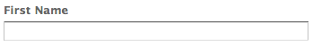

# 著陸頁面{#landing-pages}

著陸頁面功能可讓您快速且輕鬆地將設計和內容直接匯入AEM頁面。 網頁開發人員可準備HTML和其他可匯入為完整頁面或僅匯入頁面一部分的資產。 此功能對於建立僅在限定時間內有效且需要快速建立的行銷著陸頁面非常有用。

本頁介紹以下內容：

* AEM中的著陸頁面外觀，包括可用的元件
* 如何建立著陸頁面，以及如何匯入設計套件
* 如何在AEM中處理著陸頁面
* 如何設定行動登陸頁面

Extending and Configuring the Design Importer中介紹了準備要導入的 [設計包](/help/sites-administering/extending-the-design-importer-for-landingpages.md)。 整合Adobe Analytics的「整合著陸頁 [面與Adobe Analytics」中涵蓋。](/help/sites-administering/integrating-landing-pages-with-adobe-analytics.md)

>[!CAUTION]
>
>用於匯入登陸頁面的Design Importer已 [在AEM 6.5中停用](/help/release-notes/deprecated-removed-features.md#deprecated-features)。

>[!CAUTION]
>
>由於Design Importer需要存取權 `/apps`，因此無法在不可變的容器化雲端環境 `/apps` 中運作。

## 什麼是著陸頁面？ {#what-are-landing-pages}

著陸頁面是單頁或多頁的網站，是行銷推廣的「端點」-例如電子郵件、廣告字／橫幅、社交媒體。 著陸頁面可以用於各種用途，但都有一點共同之處——訪客應完成工作並定義著陸頁面的成功。

AEM中的「著陸頁面」功能可讓行銷人員與廣告公司或內部創意團隊的網頁設計人員合作，建立頁面設計，這些設計可輕鬆匯入AEM，而且行銷人員仍可編輯，並在與其他AEM支援網站相同的管理之下發佈。

在AEM中，您可以執行下列步驟來建立著陸頁面：

1. 在AEM中建立包含著陸頁面畫布的頁面。 AEM隨附範例，稱為「匯入工 **具頁面」**。

1. [準備HTML和資產。](/help/sites-administering/extending-the-design-importer-for-landingpages.md)
1. 將資源封裝到此處稱為「設計套件」的ZIP檔案中。
1. 匯入匯入工具頁面上的設計套件。
1. 修改並發佈頁面。

### 案頭著陸頁面 {#desktop-landing-pages}

AEM中的範例著陸頁面如下所示：

### 行動著陸頁面 {#mobile-landing-pages}

著陸頁面也可以有頁面的行動版本。 若要擁有著陸頁面的個別行動版本，匯入設計必須有兩個html檔案： *index.htm(l)**和mobile.index.htm(l)*。

著陸頁面匯入程式與一般著陸頁面的程式相同，著陸頁面設計有與行動著陸頁面對應的額外html檔案。 此html檔案也必須有畫布，其中 `div` 與桌 `id=cqcanvas` 面登陸頁面html類似，並支援案頭登陸頁面所描述的所有可編輯元件。

行動裝置登陸頁面會建立為案頭登陸頁面的子頁面。 若要開啟它，請導覽至「網站」中的登陸頁面，然後開啟子頁面。

>[!NOTE]
>
>刪除或停用案頭著陸頁面時，行動著陸頁面會與案頭著陸頁面一起被刪除／停用。

## 著陸頁面元件 {#landing-page-components}

若要讓AEM中匯入的HTML部分變成可編輯，您可以直接將「著陸頁面HTML」中的內容對應至AEM元件。 設計匯入工具依預設會瞭解下列元件：

* 文字，適用於任何文字
* 標題，適用於H1-6標籤中的內容
* 影像，適用於應可交換的影像
* 呼叫動作：

   * 點進連結
   * 圖形連結

* CTA Lead-Form，用於捕獲用戶資訊
* 段落系統(Paragraph System)，允許添加任何元件或轉換上述元件

此外，還可擴充此功能並支援自訂元件。 本節將詳細說明這些元件。

### 文字 {#text}

「文字」元件可讓您使用WYSIWYG編輯器輸入文字區塊。 如需詳 [細資訊](/help/sites-authoring/default-components.md#text) ，請參閱文字元件。

以下是登陸頁面上文字元件的範例：

#### 標題 {#title}

標題元件可讓您顯示標題並設定大小(h1-6)。 如需詳 [細資訊](/help/sites-authoring/default-components.md#title) ，請參閱標題元件。

以下是登陸頁面上標題元件的範例：

#### 影像 {#image}

影像元件會顯示影像，您可從「內容搜尋器」拖放，或按一下以上傳。 如需詳 [細資訊](/help/sites-authoring/default-components.md) ，請參閱影像元件。

以下是登陸頁面上影像元件的範例：

#### 行動要求(CTA) {#call-to-action-cta}

著陸頁面設計可能有數個連結——其中一些連結可能會以「行動呼籲」的形式提供。

動作呼籲(CTA)可讓訪客在登陸頁面上立即採取動作，例如「立即訂閱」、「檢視此影片」、「限時」等。

* 點進連結——可讓您新增文字連結，在點按時會將訪客帶往目標URL。
* 圖形連結——可讓您新增在點按時將訪客帶往目標URL的影像。

兩個CTA元件都有類似的選項。 「點進連結」有其他豐富式文字選項。 以下各段對各組成部分作了詳細說明。

#### 點進連結 {#click-through-link}

此CTA元件可用來在登陸頁面上新增文字連結。 可以按一下該連結，將使用者帶往元件屬性中指定的目標URL。 它是「行動呼籲」群組的一部分。

**標籤** ：使用者會看到的文字。 您可以使用RTF編輯器修改格式。

**目標URL** 輸入使用者按一下文字時要造訪的URI。

**演算選項** ：說明演算選項。 您可以從下列選項中選擇：

* 在新瀏覽器視窗中載入頁面
* 在目前視窗中載入頁面
* 在父影格中載入頁面
* 取消所有影格，並在完整瀏覽器視窗中載入頁面

**CSS** 在「樣式」標籤上，輸入CSS樣式表的路徑。

**ID** 在「樣式」標籤上，輸入元件的ID以唯一識別它。

以下是點進連結的範例：

#### 圖形連結 {#graphical-link}

此CTA元件可用來新增任何在著陸頁面上具有連結的圖形影像。 影像可以是簡單按鈕或任何圖形影像做為背景。 當點按影像時，使用者會移至元件屬性中指定的目標URL。 它是「行動呼籲」 **群組的一部分** 。

**標籤** ：使用者在圖中看到的文字。 您可以使用RTF編輯器修改格式。

**目標URL** 輸入使用者按一下影像時要造訪的URI。

**演算選項** ：說明演算選項。 您可以從下列選項中選擇：

* 在新瀏覽器視窗中載入頁面
* 在目前視窗中載入頁面
* 在父影格中載入頁面
* 取消所有影格，並在完整瀏覽器視窗中載入頁面

**CSS** 在「樣式」標籤上，輸入CSS樣式表的路徑。

**ID** 在「樣式」標籤上，輸入元件的ID以唯一識別它。

以下是範例圖形連結：

### 行動要求(CTA)銷售機會表單 {#call-to-action-cta-lead-form}

銷售機會表單是用於收集訪客／銷售機會描述檔資訊的表單。 這些資訊可以儲存，稍後再使用這些資訊進行有效的行銷。 這些資訊通常包括標題、姓名、電子郵件、出生日期、地址、興趣等。 它是 **CTA Lead表單群組的一部分** 。

CTA銷售機會表單範例如下所示：

CTA銷售機會表單由幾個不同的元件組成：

* **Lead Form**（銷售機會表單）銷售機會表單元件定義頁面上新銷售機會表單的開始和結束。 然後，其他元件可以放在這些元素之間，例如電子郵件ID、名字等。

* **表單欄位和元素**&#x200B;表單欄位和元素可包含文字方塊、選項按鈕、影像等。 使用者通常會在表單欄位中完成動作，例如輸入文字。 如需詳細資訊，請參閱個別的表單元素。

* **描述檔元件**「描述檔元件」元件與用於社交協作的訪客描述檔以及需要訪客個人化的其他區域相關。

前面是示例表；它由Lead Form **（開始和結束）組成，** First Name **（名字）和Email Id（電子郵件ID）欄位** 用於輸入和提交 ******** 欄位

從sidekick,CTA Lead Form可使用下列元件：

#### 許多銷售機會表單元件的常見設定 {#settings-common-to-many-lead-form-components}

雖然每個引線表單元件有不同的用途，但許多元件由相似的選項和參陣列成。

在配置任何表單元件時，對話框中提供以下頁籤：

* **標題和文字**：您需要在此處指定基本資訊，例如元件的標題和任何隨附的文字。 在適當的情況下，它還允許您定義其他關鍵資訊，如欄位是否為多選項和可供選擇的項目。

* **初始值**：允許您指定預設值。

* **Constraints** Here you can specify if a field is required and place constraints are on that field(example, must be numeric, and so on)。

* **樣式**&#x200B;表示欄位的大小和樣式。

>[!NOTE]
>
>您看到的欄位視個別元件而定。
>
>並非所有選項都可用於所有銷售機會表單元件。 如需這些常見設定的詳細資訊，請 [參閱表格](/help/sites-authoring/default-components.md#formsgroup)。

#### 銷售機會表單元件 {#lead-form-components}

下節說明Call-to-Action Lead表單的可用元件。

**關於** ，可讓使用者新增關於資訊。

**地址欄位** ：允許用戶輸入地址資訊。 配置此元件時，必須在對話框中輸入元素名稱。 「元素名稱」是表單元素的名稱。 這表示資料儲存在儲存庫中的位置。

**出生日期** ：用戶可以輸入出生日期資訊。

**電子郵件ID** 允許使用者輸入電子郵件地址（識別碼）。

**名字** ：提供欄位給使用者輸入名字。

**性別** ：使用者可從下拉式清單中選擇其性別。

**姓氏使用者** ，可以輸入姓氏資訊。

**銷售機會表單** ：新增此元件，將銷售機會表單新增至著陸頁面。 銷售線索表單會自動包含「銷售線索表單的開始」和「銷售線索表單的結束」欄位。 在其中，您添加本節中介紹的Lead Form元件。

Lead Form元件使用Form Start和Form End元素定義表單的 **開始****和結束** 。 這些表格會一律配對，以確保表格已正確定義。

添加銷售機會表單後，可以通過按一下相應條中的「編輯」( **Edit** )來配置表單的開始或結束。

**銷售機會表單的開頭**

配置表單和高級選項 **卡****可用**:

**感謝頁面** ：要參考的頁面，感謝訪客提供其輸入。 如果保留空白，表單會在提交後重新顯示。

**啟動工作流** ：確定提交銷售機會表單後觸發的工作流。

**貼文選項** ：有下列貼文選項可供使用：

* 建立銷售機會
* 電子郵件服務：建立訂閱者並新增至清單——如果您使用電子郵件服務供應商（例如ExactTarget），請使用。
* 電子郵件服務：傳送自動回應電子郵件——如果您使用電子郵件服務供應商（例如ExactTarget），請使用。
* 電子郵件服務：從清單中取消訂閱使用者——如果您使用電子郵件服務供應商（例如ExactTarget），請使用。
* 取消訂閱用戶

**表單識別碼** ：表單識別碼可唯一識別銷售機會表單。 如果單一頁面上有多個表格，請使用表格識別碼；請確定它們有不同的識別碼。

**載入路徑** ：用於將預定義值載入到銷售線索表單欄位的節點屬性的路徑。

這是一個可選欄位，它指定到儲存庫中節點的路徑。 當此節點具有與欄位名稱匹配的屬性時，表單上的相應欄位將預先載入這些屬性的值。 如果不存在匹配，則欄位包含預設值。

**用戶端驗證** ：指出此表單是否需要用戶端驗證（伺服器驗證一律會進行）。 這可與Forms Captcha元件搭配使用。

**驗證資源類型** ：如果要驗證整個銷售線索表單（而不是單個欄位），則定義表單驗證資源類型。

如果要驗證完整表單，還應包含下列其中一項：

* 用於客戶端驗證的指令碼：
   ` /apps/<myApp>/form/<myValidation>/formclientvalidation.jsp`

* 伺服器端的驗證指令碼：
   ` /apps/<myApp>/form/<myValidation>/formservervalidation.jsp`

**動作設定** 根據「貼文選項」中的選取，「動作設定」會變更。 例如，當您選擇「建立銷售線索」時，可以配置銷售線索添加到的清單。

* **顯示提交按**&#x200B;鈕指出是否應顯示「提交」按鈕。

* **提交名稱**：如果您在表單中使用多個提交按鈕，則是識別碼。

* **Submit Title**（提交標題）按鈕上顯示的名稱，例如「提交」或「傳送」。

* **顯示重設按鈕**&#x200B;選擇複選框，使「重設」按鈕可見。

* **重設標題**「重設」按鈕上顯示的名稱。

* **說明**&#x200B;顯示在按鈕下方的資訊。

## 建立著陸頁面 {#creating-a-landing-page}

建立著陸頁面時，您需要執行三個步驟：

1. 建立匯入工具頁面。
1. [準備要導入的HTML。](/help/sites-administering/extending-the-design-importer-for-landingpages.md)
1. 匯入設計套件。

### 使用Design Importer {#use-of-the-design-importer}

由於匯入頁面需要準備HTML、驗證和測試頁面，因此匯入著陸頁面會當成管理工作。 身為管理員，執行匯入的使用者需要讀取、寫入、建立和刪除權限 `/apps`。 如果使用者沒有這些權限，匯入將會失敗。

>[!NOTE]
>
>由於設計匯入工具是做為需要讀取、寫入、建立和刪除權限的管理工具 `/apps`,Adobe不建議在生產中使用設計匯入工具。

Adobe建議在測試執行個體上使用設計匯入工具。 在測試執行個體上，匯入可由負責將程式碼部署至生產執行個體的開發人員進行測試和驗證。

### 「建立導入程式」頁 {#creating-an-importer-page}

您必須先建立匯入工具頁面（例如促銷活動下），才能匯入著陸頁面設計。 「匯入器頁面」範本可讓您匯入完整的HTML登陸頁面。 頁面包含一個放置方塊，可透過拖放方式匯入著陸頁面設計套件。

>[!NOTE]
>
>依預設，「匯入工具頁面」只能建立在促銷活動下，但您也可以覆蓋此範本，以便在下方建立著陸頁面 `/content/mysite`。

若要建立新的著陸頁面：

1. 前往「網 **站** 」主控台。
1. 在左窗格中選取您的促銷活動。
1. 按一 **下「新增** 」以開啟「 **建立頁面** 」視窗。
1. 選取「匯 **入工具頁面** 」範本並新增標題，或選擇新增名稱，然後按一下「 **建立」**。

   

   隨即顯示您的新匯入工具頁面。

### 準備HTML以匯入 {#preparing-the-html-for-import}

在匯入設計套件之前，必須先準備HTML。 如需詳 [細資訊，請參閱擴充和設定設計匯入](/help/sites-administering/extending-the-design-importer-for-landingpages.md) 。

### 導入設計包 {#importing-the-design-package}

建立匯入工具頁面後，您可將設計套件匯入至該頁面。 有關建立設計包及其建議結構的詳細資訊，請參閱「擴 [展和配置設計導入」](/help/sites-administering/extending-the-design-importer-for-landingpages.md)。

假設您已準備好設計套件，下列步驟將說明如何將設計套件匯入匯入工具頁面。

1. 開啟您先前建立的匯 [入工具頁面](#creatingablankcanvaspage)。

   

1. 將設計套件拖放至dropbox。 請注意，當將包拖曳到其上時，箭頭會改變方向。
1. 拖放後，您會看到著陸頁面取代匯入工具頁面。 您的HTML著陸頁面已成功匯入。

   

>[!NOTE]
>
>在導入時，會基於安全原因和為了避免導入和發佈無效標籤而清理標籤。 這假定僅HTML標籤，且所有其他形式的元素（例如內嵌SVG或Web元件）將被過濾掉。

>[!NOTE]
>
>如果您無法匯入設計套件，請參閱疑難 [排解](/help/sites-administering/extending-the-design-importer-for-landingpages.md#troubleshooting)。

## 使用著陸頁面 {#working-with-landing-pages}

著陸頁面的設計和資產通常由設計人員在機構中使用Adobe Photoshop或Adobe Dreamweaver等常用工具來建立。 當設計完成時，設計人員會傳送包含所有資產的zip檔案給行銷人員。 然後，行銷部門的聯絡人負責將zip檔案拖曳至AEM並發佈內容。

此外，設計人員在匯入登陸頁面後，可能需要透過編輯或刪除內容及設定動作要求元件，對其進行修改。 最後，行銷人員會想要預覽著陸頁面，然後啟動促銷活動，以確保著陸頁面已發佈。

本節說明如何執行下列動作：

* 刪除著陸頁面
* 下載設計套件
* 檢視匯入資訊
* 重設著陸頁面
* [設定CTA元件並新增內容至頁面](#call-to-action-cta)
* 預覽著陸頁面
* 啟動／發佈登陸頁面

當您匯入設計套件時，頁 **面的設定選單中會提供「清除設計」和「** 下載匯入的Zip **」(Clear Design** and Download Imported Zip):

### 下載匯入的設計套件 {#downloading-the-imported-design-package}

下載zip檔案可讓您記錄哪個zip已匯入特定著陸頁面。 請注意，頁面上所做的變更不會新增至zip。

若要下載匯入的設計套件，請按一下「 **著陸頁面** 」工具列中的「下載Zip」。

### 查看導入資訊 {#viewing-import-information}

您隨時都可以按一下傳統使用者介面中登陸頁面頂端的藍色驚嘆號，來檢視上次匯入的相關資訊。

如果匯入的設計套件有某些問題，例如，如果它參考的是套件中不存在的影像／指令碼等，則設計匯入工具會以清單的形式顯示此類問題。 若要檢視問題清單，請在傳統的使用者介面中，按一下「著陸頁面」工具列中的問題連結。 在下列影像中，按一下「 **期刊** 」連結會開啟「匯入期刊」視窗。

### 重設著陸頁面 {#resetting-a-landing-page}

如果您想在對著陸頁面設計套件進行某些變更後重新匯入，可以按一下傳統使用者介面中著陸頁面頂端的 **Clear** ，或按一下觸控最佳化使用者介面中設定選單中的「清除」，以「清除」著陸頁面。 這樣做會刪除匯入的登陸頁面，並建立空白匯入程式頁面。

清除著陸頁面時，您可以移除內容變更。 如果按一下「 **否**」(No `jcr:content/importer`)，則保留內容更改，即保留下面的結構， `etc/design` 並僅刪除導入程式頁元件和中的資源。 但是，如果按一下「是 **」**，則 `jcr:content/importer` 也會刪除。

>[!NOTE]
>
>如果您決定移除內容變更，則當您按一下「清除」時，您在匯入的登陸頁面上所做的所有變更以及所有頁面屬性都會 **遺失**。

### 修改和新增著陸頁面上的元件 {#modifying-and-adding-components-on-a-landing-page}

若要修改著陸頁面上的元件，請連按兩下這些元件以開啟它們，然後像編輯其他元件一樣進行編輯。

若要在著陸頁面上新增元件，請將元件拖放至著陸頁面——從傳統使用者介面的sidekick或從觸控最佳化使用者介面的「元件」窗格——並視需要編輯。

>[!NOTE]
>
>如果無法編輯著陸頁面上的元件，您必須在修改HTML檔案後重新 [匯入zip檔案。](/help/sites-administering/extending-the-design-importer-for-landingpages.md) 這表示在匯入期間，不可編輯的部件不會轉換為AEM元件。

### 刪除著陸頁面 {#deleting-a-landing-page}

刪除著陸頁面就像刪除一般AEM頁面。

唯一的例外是，當您刪除案頭著陸頁面時，也會刪除對應的行動著陸頁面（如果有），但不會相反。

### 發佈著陸頁面 {#publishing-a-landing-page}

您可以發佈著陸頁面及其所有相依性，就像發佈一般頁面一樣。

>[!NOTE]
>
>發佈案頭著陸頁面也會發佈其對應的行動版本（如果有的話）。 但發佈行動登陸頁面並不會發佈案頭版本。
