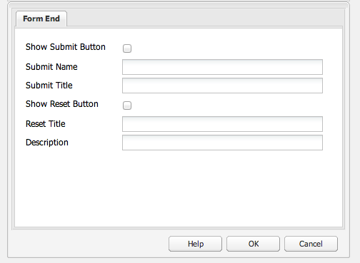

# 登陸頁面{#landing-pages}

登錄頁功能允許將設計和內容快速而輕鬆地導入到AEM頁中。 Web開發人員可以準備HTML和附加資產，這些資產可以作為完整頁面或僅作為頁面的一部分導入。 此功能對於建立僅在有限時間內處於活動狀態且需要快速建立的市場營銷登錄頁非常有用。

本頁介紹以下內容：

* 登錄頁的外觀，包括AEM可用元件
* 如何建立登錄頁以及如何導入設計包
* 如何使用登錄頁AEM
* 如何設定移動登錄頁

為導入而準備設計包的內容包括 [擴展和配置設計導入程式](/help/sites-administering/extending-the-design-importer-for-landingpages.md)。 與Adobe Analytics的整合涵蓋 [將登錄頁與Adobe Analytics整合。](/help/sites-administering/integrating-landing-pages-with-adobe-analytics.md)

>[!CAUTION]
>
>用於導入登錄頁的設計導入程式， [不建議使用AEM6.5](/help/release-notes/deprecated-removed-features.md#deprecated-features)。

>[!CAUTION]
>
>因為設計導入程式需要訪問 `/apps`在集裝箱化雲環境中， `/apps` 是不可變的。

## 什麼是登錄頁？ {#what-are-landing-pages}

登錄頁是單頁或多頁站點，是營銷推廣的「終點」 — 例如，電子郵件、廣告詞/橫幅、社交媒體。 登錄頁可以用於各種目的，但所有功能都有一個共同點 — 訪問者應完成任務，並定義登錄頁的成功。

中的「登錄頁」功AEM能使營銷人員能夠與代理機構或內部創意團隊的Web設計人員協作，建立頁面設計，這些設計可以輕鬆導入到AEM，並且仍可由營銷人員編輯，並在與其他支援的站點相同的管理AEM下發佈。

在AEM中，通過執行以下步驟建立登錄頁：

1. 在中建立包AEM含登錄頁畫布的頁面。 AEM有樣本的船 **導入程式頁**。

1. [準備HTML和資產。](/help/sites-administering/extending-the-design-importer-for-landingpages.md)
1. 將資源打包到此處稱為「設計包」的ZIP檔案中。
1. 在導入程式頁面上導入設計包。
1. 修改並發佈頁面。

### 案頭登錄頁 {#desktop-landing-pages}

中的示例登錄頁AEM如下所示：

### 移動登錄頁 {#mobile-landing-pages}

登錄頁還可以具有該頁的移動版本。 要使登錄頁具有單獨的移動版本，導入設計必須有兩個html檔案： *index.htm(l)* 和 *mobile.index.htm(l)*。

登錄頁導入程式與普通登錄頁相同，登錄頁設計具有對應於移動登錄頁的附加html檔案。 此html檔案也必須具有畫布 `div` 與 `id=cqcanvas` 與案頭登錄頁html類似，它支援案頭登錄頁中描述的所有可編輯元件。

移動登錄頁作為案頭登錄頁的子頁建立。 要開啟它，請導航到「網站」中的登錄頁並開啟子頁。

>[!NOTE]
>
>如果刪除或停用案頭登錄頁，則移動登錄頁和案頭登錄頁一起被刪除/停用。

## 登錄頁元件 {#landing-page-components}

要使導入的HTML的部分在中可編輯AEM，可以將「登錄頁」HTML中的內容直接映射AEM到元件。 設計導入程式在預設情況下瞭解以下元件：

* 文本，對於任何文本
* 標題，用於H1-6標籤中的內容
* 影像，用於應可更換的影像
* 調用操作：

   * 點擊連結
   * 圖形連結

* CTA Lead-Form，用於捕獲用戶資訊
* 段落系統(Parsys)，允許添加任何元件或轉換上述元件

此外，還可以擴展此功能並支援定制元件。 本節將詳細描述這些元件。

### 文字 {#text}

「文本」元件允許您使用WYSIWYG編輯器輸入文本塊。 請參閱 [文本元件](/help/sites-authoring/default-components.md#text) 的子菜單。

以下是登錄頁上文本元件的示例：

#### 標題 {#title}

標題元件允許您顯示標題並配置大小(h1-6)。 請參閱 [標題元件](/help/sites-authoring/default-components.md#title) 的子菜單。

以下是登錄頁上標題元件的示例：

#### 影像 {#image}

影像元件顯示一個影像，您可以從Content Finder中拖放或按一下以上載。 請參閱 [影像分量](/help/sites-authoring/default-components.md) 的子菜單。

下面是登錄頁上的影像元件示例：

#### 行動要求(CTA) {#call-to-action-cta}

登錄頁設計可能有幾個連結 — 其中一些連結可能是「行動要求」。

行動要求(CTA)用於使訪問者在登錄頁上立即採取行動，如「立即訂閱」、「查看此視頻」、「僅限時間」等。

* 按一下「通過連結」(Through Link) — 用於添加文本連結，按一下該連結時訪問者將訪問目標URL。
* 圖形連結 — 用於添加按一下時訪問者訪問目標URL的影像。

兩個CTA元件都有類似的選項。 「按一下直通連結」包含其他富格文本選項。 以下各段對這些構成作了詳細說明。

#### 按一下「通過」連結 {#click-through-link}

此CTA元件可用於在登錄頁上添加文本連結。 可以按一下該連結，使用戶訪問在元件屬性中指定的目標URL。 它是「行動要求」組的一部分。

**標籤** 用戶看到的文本。 可以使用RTF編輯器修改格式。

**目標URL** 如果用戶按一下文本，請輸入要訪問的URI。

**呈現選項** 描述呈現選項。 可從以下選項中選擇：

* 在新瀏覽器視窗中載入頁面
* 在目前視窗中載入頁面
* 在父框架中載入頁
* 取消所有框架，並在全面瀏覽器窗口中載入頁面

**CSS** 在「樣式」頁籤上，輸入CSS樣式表的路徑。

**ID** 在「樣式」頁籤上，輸入元件的ID以唯一標識它。

以下是按一下連結的示例：

#### 圖形連結 {#graphical-link}

此CTA元件可用於添加登錄頁上具有連結的任何圖形影像。 影像可以是簡單按鈕或任何作為背景的圖形影像。 按一下影像後，用戶將被帶到元件屬性中指定的目標URL。 是 **行動要求** 組。

**標籤** 用戶在圖形中看到的文本。 可以使用RTF編輯器修改格式。

**目標URL** 輸入用戶按一下影像時要訪問的URI。

**呈現選項** 描述呈現選項。 可從以下選項中選擇：

* 在新瀏覽器視窗中載入頁面
* 在目前視窗中載入頁面
* 在父框架中載入頁
* 取消所有框架，並在全面瀏覽器窗口中載入頁面

**CSS** 在「樣式」頁籤上，輸入CSS樣式表的路徑。

**ID** 在「樣式」頁籤上，輸入元件的ID以唯一標識它。

下面是一個圖形連結示例：

### 行動要求(CTA)線索表 {#call-to-action-cta-lead-form}

潛在顧客表單是用於收集訪問者/潛在顧客的個人資料資訊的表單。 該資訊可以被儲存並稍後用於基於該資訊進行有效的營銷。 此資訊通常包括標題、姓名、電子郵件、出生日期、地址、興趣等。 是 **CTA Lead窗體** 組。

CTA潛在顧客表單示例如下所示：

CTA潛在客戶表單由幾個不同的元件構成：

* **潛在顧客表單**
銷售線索表單元件定義頁面上新銷售線索表單的開始和結束。 然後，可以將其他元件放置在這些元素之間，如電子郵件ID、名字等。

* **窗體域和元素**
表單域和元素可以包括文本框、單選按鈕、影像等。 用戶通常在表單域中完成操作，如鍵入文本。 有關詳細資訊，請參閱單個窗體元素。

* **配置檔案元件**
配置檔案元件與用於社會協作的訪問者配置檔案以及需要訪問者個性化的其他區域相關。

前面是示例表；它由 **潛在顧客表單** 元件（起始和結束）, **名字** 和 **電子郵件ID** 用於輸入的欄位和 **提交** 場

從側腳，CTA Lead Form可使用以下元件：

#### 許多潛在客戶表單元件的常用設定 {#settings-common-to-many-lead-form-components}

雖然每個引線表單元件有不同的用途，但許多元件都由相似的選項和參陣列成。

配置任何表單元件時，對話框中都提供以下頁籤：

* **標題和文本**
在此，您需要指定基本資訊，如元件的標題和隨附的任何文本。 在適當情況下，它還允許您定義其它關鍵資訊，如欄位是否是多選項和可供選擇的項目。

* **初始值**
允許您指定預設值。

* **約束**
在此，您可以指定是否需要欄位，並將約束放在該欄位上（例如，必須是數字，等等）。

* **造型**
指示欄位的大小和樣式。

>[!NOTE]
>
>您看到的欄位因各個元件而異。
>
>並非所有選項都可用於所有銷售線索表單元件。 有關這些項的詳細資訊，請參閱Forms [常用設定](/help/sites-authoring/default-components.md#formsgroup)。

#### 潛在客戶表單元件 {#lead-form-components}

下節介紹了「行動要求」潛在顧客表單可用的元件。

**關於** 允許用戶添加關於資訊。

**地址欄位** 允許用戶輸入地址資訊。 配置此元件時，必須在對話框中輸入元素名稱。 「元素名稱」是表單元素的名稱。 這表示在儲存庫中儲存資料的位置。

**出生日期** 用戶可以輸入出生日期資訊。

**電子郵件ID** 允許用戶輸入電子郵件地址（標識）。

**名字** 提供一個欄位，供用戶輸入其名字。

**性別** 用戶可以從下拉清單中選擇其性別。

**姓氏** 用戶可以輸入姓氏資訊。

**潛在顧客表單** 添加此元件以將銷售線索表單添加到登錄頁。 銷售線索表單自動包含「銷售線索表單的起始」和「銷售線索表單的結束」欄位。 在其中，添加本節中介紹的Lead Form元件。

Lead Form元件使用 **窗體開始** 和 **表單結束** 元素。 這些檔案始終成對，以確保正確定義表單。

添加了潛在顧客表單後，可以通過按一下 **編輯** 的上界。

**銷售機會表單的開頭**

兩個頁籤可用於配置 **窗體** 和 **高級**:

**謝謝頁** 要引用的頁面感謝訪問者提供他們的輸入。 如果留空，則提交後將重新顯示表單。

**啟動工作流** 確定提交潛在顧客表單後觸發的工作流。

**帖子選項** 以下帖子選項可用：

* 建立銷售機會
* 電子郵件服務：建立訂閱伺服器並添加到清單 — 使用電子郵件服務提供商（如ExactTarget）。
* 電子郵件服務：發送自動響應程式電子郵件 — 使用電子郵件服務提供商（如ExactTarget）。
* 電子郵件服務：取消訂閱清單中的用戶 — 使用電子郵件服務提供商（如ExactTarget）。
* 取消訂閱用戶

**窗體標識符** 表單標識符唯一地標識銷售線索表單。 如果單頁上有多個表單，請使用表單標識符；確保它們有不同的標識符。

**載入路徑** 是用於將預定義值載入到潛在顧客表單域的節點屬性的路徑。

這是一個可選欄位，它指定儲存庫中節點的路徑。 如果此節點具有與欄位名稱匹配的屬性，則表單上的相應欄位將預先載入這些屬性的值。 如果不存在匹配項，則欄位包含預設值。

**客戶端驗證** 指示此表單是否需要客戶端驗證（始終進行伺服器驗證）。 這可以與Forms驗證碼元件一起實現。

**驗證資源類型** 如果要驗證整個銷售線索表單（而不是單個欄位），請定義表單驗證資源類型。

如果要驗證完整表單，還應包括以下內容之一：

* 客戶端驗證指令碼：
   ` /apps/<myApp>/form/<myValidation>/formclientvalidation.jsp`

* 用於伺服器端驗證的指令碼：
   ` /apps/<myApp>/form/<myValidation>/formservervalidation.jsp`

**操作配置** 根據「後置選項」中的選擇，「操作配置」將更改。 例如，在選擇「建立銷售線索」時，可以配置銷售線索添加到的清單。

* **顯示提交按鈕**
指示是否應顯示「提交」按鈕。

* **提交名稱**
如果在表單中使用多個提交按鈕，則為標識符。

* **提交標題**
按鈕上顯示的名稱，如提交或發送。

* **顯示重置按鈕**
選中複選框可使「重置」按鈕可見。

* **重置標題**
「重置」按鈕上顯示的名稱。

* **說明**
按鈕下方顯示的資訊。

## 建立登錄頁 {#creating-a-landing-page}

建立登錄頁時，需要執行三個步驟：

1. 建立導入程式頁。
1. [準備導入HTML。](/help/sites-administering/extending-the-design-importer-for-landingpages.md)
1. 導入設計包。

### 設計導入程式的使用 {#use-of-the-design-importer}

由於導入頁面需要準備HTML、驗證和測試頁面，因此導入登錄頁面將作為管理任務。 作為管理員，執行導入的用戶需要讀取、寫入、建立和刪除 `/apps`。 如果用戶沒有這些權限，則導入將失敗。

>[!NOTE]
>
>因為設計導入程式是作為需要讀取、寫入、建立和刪除權限的管理工具 `/apps`,Adobe不建議在生產中使用設計進口商。

Adobe建議在轉移實例上使用設計導入程式。 在轉移實例上，可由負責將代碼部署到生產實例的開發人員測試和驗證導入。

### 建立導入程式頁 {#creating-an-importer-page}

在導入登錄頁設計之前，您需要建立導入程式頁，例如在市場活動下。 「導入頁」模板用於導入完整的HTML登錄頁。 該頁包含一個下拉框，可以通過拖放導入登錄頁設計包。

>[!NOTE]
>
>預設情況下，只能在市場活動下建立導入程式頁，但您也可以覆蓋此模板以在市場活動下建立登錄頁 `/content/mysite`。

要建立新登錄頁，請執行以下操作：

1. 轉到 **網站** 控制台。
1. 在左窗格中選擇您的市場活動。
1. 按一下 **新建** 開啟 **建立頁** 的子菜單。
1. 選擇 **導入程式頁** 模板，並添加標題和名稱（可選），然後按一下 **建立**。

   

   將顯示新導入程式頁面。

### 準備HTML以導入 {#preparing-the-html-for-import}

在導入設計包之前，需要準備HTML。 請參閱 [擴展和配置設計導入](/help/sites-administering/extending-the-design-importer-for-landingpages.md) 的子菜單。

### 導入設計包 {#importing-the-design-package}

建立導入程式頁後，可將設計包導入該頁。 有關建立設計包及其建議結構的詳細資訊，請參見 [擴展和配置設計導入](/help/sites-administering/extending-the-design-importer-for-landingpages.md)。

假定您已準備好設計包，則以下步驟將介紹如何將設計包導入導入程式頁。

1. 開啟導入程式頁面 [建立早](#creatingablankcanvaspage)。

   

1. 將設計包拖放到收放箱上。 注意，當包拖過時，箭頭會改變方向。
1. 拖放後，您會看到登錄頁代替導入頁。 已成功導入HTML登錄頁。

   

>[!NOTE]
>
>在導入時，出於安全原因和為了避免導入和發佈無效標籤而對標籤進行清理。 這假定僅HTML標籤，並且所有其它形式的元素(如內聯SVG或Web元件)將被過濾掉。

>[!NOTE]
>
>如果導入設計包時遇到問題，請參閱 [故障排除](/help/sites-administering/extending-the-design-importer-for-landingpages.md#troubleshooting)。

## 使用登錄頁 {#working-with-landing-pages}

登錄頁的設計和資產通常由設計師在機構中建立，他們使用的工具可能是Adobe Photoshop或Adobe Dreamweaver。 設計完成後，設計人員會將包含所有資產的zip檔案發送到市場營銷。 然後，市場營銷部門的聯繫人負責將zip檔案放AEM入並發佈內容。

此外，設計人員可能需要在通過編輯或刪除內容以及配置行動要求元件導入登錄頁後對其進行修改。 最後，營銷員將希望預覽登錄頁，然後激活市場活動以確保登錄頁已發佈。

本節介紹如何執行以下操作：

* 刪除登錄頁
* 下載設計包
* 查看導入資訊
* 重置登錄頁
* [配置CTA元件並將內容添加到頁面](#call-to-action-cta)
* 預覽登錄頁
* 激活/發佈登錄頁

導入設計包時， **清除設計** 和 **下載導入的ZIP** 在頁面的「設定」菜單中可用：

### 下載導入的設計包 {#downloading-the-imported-design-package}

下載zip檔案允許您記錄使用特定登錄頁導入的zip。 請注意，在頁面上所做的更改不會添加到zip中。

要下載導入的設計包，請按一下 **下載Zip** 的子菜單。

### 查看導入資訊 {#viewing-import-information}

您可以隨時通過按一下經典用戶介面登錄頁頂部的藍色感嘆號來查看有關上次導入的資訊。

如果導入的設計包存在某些問題，例如，如果它引用的是包中不存在的映像/指令碼等，則設計導入程式將以清單的形式顯示此類問題。 要查看問題清單，請在經典用戶介面中按一下登錄頁工具欄中的問題連結。 在下圖中，按一下 **問題** 連結將開啟「導入問題」窗口。

### 重置登錄頁 {#resetting-a-landing-page}

如果在對登錄頁設計包進行一些更改後要重新導入它，可通過按一下「清除」登錄頁 **清除** 位於傳統用戶介面登錄頁頂部，或按一下觸控優化用戶介面設定菜單中的「清除」。 這樣做會刪除導入的登錄頁並建立空的導入程式頁。

清除登錄頁時，可以刪除內容更改。 如果按一下 **否**，然後保留內容更改，即 `jcr:content/importer`將保留，並僅保留導入程式頁元件和中的資源 `etc/design` 的子菜單。 但是，如果你 **是**，也請參見Wiki頁。 `jcr:content/importer` 的子菜單。

>[!NOTE]
>
>如果您決定刪除內容更改，則當您按一下時，在導入的登錄頁上所做的所有更改以及所有頁面屬性都將丟失 **清除**。

### 在登錄頁上修改和添加元件 {#modifying-and-adding-components-on-a-landing-page}

要修改登錄頁上的元件，請按兩下它們以開啟它們並像編輯任何其它元件一樣進行編輯。

要在登錄頁上添加元件，請將元件拖放到登錄頁上，然後根據需要進行編輯。

>[!NOTE]
>
>如果無法編輯登錄頁上的元件，則需要在 [修改HTML檔案。](/help/sites-administering/extending-the-design-importer-for-landingpages.md) 這意味著在導入過程中，不可編輯的部件不會轉換為元AEM件。

### 刪除登錄頁 {#deleting-a-landing-page}

刪除登錄頁就像刪除正常AEM頁。

唯一的例外是，刪除案頭登錄頁時，它還會刪除相應的移動登錄頁（如果存在），但不會刪除相應的移動登錄頁。

### 發佈登錄頁 {#publishing-a-landing-page}

您可以發佈登錄頁及其所有依賴項，就像發佈正常頁一樣。

>[!NOTE]
>
>發佈案頭登錄頁還發佈相應的移動版本（如果有）。 但發佈移動登錄頁並不發佈案頭版本。
