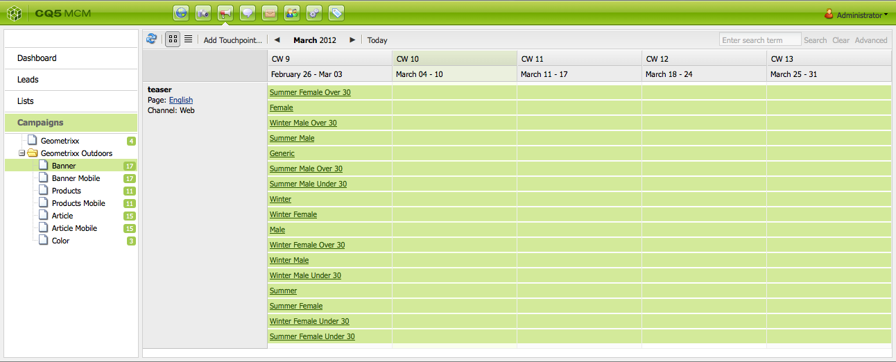

# 使用行銷活動管理員{#working-with-the-marketing-campaign-manager}

在AEM中，行銷活動管理員(MCM)是協助您管理多頻道行銷活動的主控台。 使用此行銷自動化軟體，您可以管理所有品牌、行銷活動和體驗，以及相關區段、清單、銷售機會和報表。

MCM可從AEM中的不同位置存取；例如，「歡迎」畫面，使用「促銷活動」圖示或搭配URL存取：

`https://<hostname>:<port>/libs/mcm/content/admin.html`

例如：

`https://localhost:4502/libs/mcm/content/admin.html`

從MCM，您可以存取：

* **[儀表板](#dashboard)**
這分為四個窗格：

   * [清單](#lists)
此窗格會顯示您已建立的清單，以及該清單中的潛在客戶數目。 您可以從此窗格直接建立清單，或匯入銷售機會以建立清單。
選取特定清單後，您將會前往[清單](#lists)區段，顯示清單的詳細資料。

   * [區段](/help/sites-classic-ui-authoring/classic-personalization-campaigns.md#anoverviewofsegmentation)
此窗格會顯示您已定義的區段。 區段可讓您為共用特定特徵的訪客集合設定特徵。
選取特定區段會開啟區段定義頁面。

   * [報告](/help/sites-administering/reporting.md)
AEM提供不同的報表，協助您分析及監控執行個體的狀態。 此MCM窗格會列出報告。
選取報告會開啟報告頁面。

   * [行銷活動](#campaigns)
此窗格會列出您的行銷活動體驗，例如[電子報](/help/sites-classic-ui-authoring/classic-personalization-campaigns.md#newsletters)和[Teasers](/help/sites-classic-ui-authoring/classic-personalization-campaigns.md#teasers)。

* **[個銷售機會](#leads)**
您可以在此處管理您的銷售機會。 您可以建立或匯入銷售機會、編輯個別銷售機會的特定詳細資訊，或在不再需要時刪除。 您也可以將潛在客戶放入不同的群組中，稱為「清單」。 **注意：**Adobe不打算進一步增強此功能。
建議使用[Adobe Campaign以及與AEM](/help/sites-administering/campaign.md)的整合。

* **[清單](#lists)**
您可以在此處管理您的（潛在客戶）清單。**注意：**Adobe不打算進一步增強此功能。
建議使用[Adobe Campaign以及與AEM](/help/sites-administering/campaign.md)的整合。

* **[行銷活動](#campaigns)**
您可以在此處管理您的品牌、行銷活動和體驗。

## 儀表板 {#dashboard}

儀表板會顯示四個窗格，為您提供清單（銷售機會）、區段、報表和行銷活動的概覽。 您也可以在此處存取這些工具的基本功能。

### 銷售機會 {#leads}

>[!NOTE]
>
>Adobe不打算進一步增強此功能（管理銷售機會）。
>建議使用[Adobe Campaign以及與AEM](/help/sites-administering/campaign.md)的整合。

在AEM MCM中，您可以手動輸入潛在客戶或匯入以逗號分隔的清單（例如郵寄清單）來整理和新增潛在客戶。 產生銷售機會的其他方法來自電子報註冊或社群註冊（如果設定，這些可能會觸發工作流程填入銷售機會）。 潛在客戶通常會分類並放入清單中，以便您稍後可以對整個清單執行動作；例如，傳送自訂電子郵件給特定清單。

在左窗格的&#x200B;**銷售機會**&#x200B;下，您可以建立、匯入、編輯和刪除銷售機會，然後視需要啟用或停用。 您可以將銷售機會新增至清單，或檢視其已屬於哪些清單。

>[!NOTE]
>
>請參閱[使用銷售機會](/help/sites-classic-ui-authoring/classic-personalization-campaigns.md#workingwithleads)，以取得特定工作的詳細資訊。

### 清單 {#lists}

>[!NOTE]
>
>Adobe不打算進一步增強此功能（管理清單）。
>建議使用[Adobe Campaign以及與AEM](/help/sites-administering/campaign.md)的整合。

清單可讓您將銷售機會整理到群組中。 透過清單，您可以將行銷活動定位至特定一群人員；例如，您可以傳送目標定位電子報至清單。

在&#x200B;**清單**&#x200B;下，您可以透過建立、匯入、編輯、合併及刪除清單來管理清單，然後視需要加以啟用或停用。 您也可以檢視該清單中的銷售機會、檢視清單是否為其他清單的成員，或檢視說明。

>[!NOTE]
>
>請參閱[使用清單](/help/sites-classic-ui-authoring/classic-personalization-campaigns.md#workingwithlists)以取得特定工作的詳細資訊。

### 行銷活動 {#campaigns}

>[!NOTE]
>
>如需特定工作的詳細資訊，請參閱[Teasers和策略](/help/sites-classic-ui-authoring/classic-personalization-campaigns.md#workingwithlists)、[設定您的行銷活動](/help/sites-classic-ui-authoring/classic-personalization-campaigns.md#settingupyourcampaign)和[電子報](/help/sites-classic-ui-authoring/classic-personalization-campaigns.md#newsletters)。

若要存取現有的行銷活動，請在MCM中按一下&#x200B;**行銷活動**。

* **在左窗格**：
這裡有所有品牌和行銷活動的清單。
按一下品牌可展開清單，以在左側窗格中顯示所有相關行銷活動；此清單也會顯示每個行銷活動中存在的體驗數量。 它也會在右窗格中開啟品牌概觀。

* **在右窗格**：
系統會為每個品牌顯示圖示（不會顯示歷史行銷活動）。
您可以連按兩下以開啟品牌概觀。

#### 品牌概觀 {#brand-overview}

從這裡，您可以：

* 檢視此品牌現有的行銷活動和體驗數量（顯示在左窗格中的數量）。
* 建立此品牌的&#x200B;**新……**&#x200B;行銷活動。

* 變更檢視的時間範圍；選取&#x200B;**周**、**月**&#x200B;或&#x200B;**季**，使用箭頭選取特定期間或返回&#x200B;**今天**。

* 選取行銷活動（在右窗格中）以：

   * 編輯&#x200B;**屬性……**
   * **刪除**&#x200B;行銷活動。

* 開啟行銷活動概覽（在右窗格中按兩下行銷活動，或在左窗格中按一下）。

#### Campaign概覽 {#campaign-overview}

針對個別行銷活動，有兩個可用的檢視：

1. **日曆檢視**

   使用圖示：

   

   這會呈現所有接觸點（灰色）清單，其中包含連線到該接觸點的體驗水準時間範圍（綠色）：

   

   從這裡，您可以：

   * 使用箭頭變更您檢視的時間範圍，或返回&#x200B;**Today**。

   * 使用&#x200B;**新增接觸點……**&#x200B;為現有體驗新增接觸點。

   * 按一下Teaser （在右窗格中）以設定&#x200B;**開啟時間**&#x200B;和&#x200B;**關閉時間**。

1. **清單檢視**

   使用圖示：

   

   這會列出所選行銷活動的所有體驗（例如，Teaser和電子報）：

   

   從這裡，您可以：

   * 建立&#x200B;**新的……**&#x200B;體驗；例如Adobe Target選件、Teaser和電子報。
   * **編輯**&#x200B;特定Teaser頁面或電子報的詳細資料（也可以使用連按兩下）。
   * 為特定的Teaser頁面或電子報定義&#x200B;**屬性……**。
   * **模擬**體驗（Teaser頁面或電子報）的外觀與風格。
當模擬頁面開啟時，您可以接著開啟Sidekick以切換至該頁面的編輯模式。

   * **分析……**&#x200B;為頁面產生的曝光數。

   * **刪除**&#x200B;個不再需要的專案。
   * **搜尋**&#x200B;您的文字（將會搜尋體驗的標題欄位）。
   * 使用&#x200B;**進階**&#x200B;搜尋將篩選套用至搜尋。

### 模擬您的行銷活動體驗 {#simulating-your-campaign-experiences}

在MCM中，按一下&#x200B;**行銷活動**。 確定清單檢視為使用中，然後選取必要的行銷活動體驗並按一下&#x200B;**模擬**。 即將開啟接觸點（Teaser或電子報頁面），以顯示您選取的體驗，因為訪客會看到該體驗。

您也可以從此開啟Sidekick （按一下小型向下箭頭）以變更為更新頁面的編輯模式。

### 分析您的行銷活動體驗 {#analyzing-your-campaign-experiences}

在MCM中，按一下&#x200B;**行銷活動**。 確定清單檢視為使用中，然後選取必要的行銷活動體驗並選取&#x200B;**分析……**。 畫面會顯示一段時間的頁面曝光圖。

