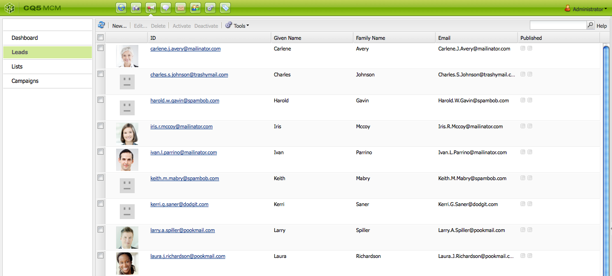

# 使用行銷活動管理員{#working-with-the-marketing-campaign-manager}

在AEM中，Marketing Campaign Manager(MCM)是可協助您管理多管道促銷活動的主控台。 使用此行銷自動化軟體，您可以管理所有品牌、宣傳和體驗，以及相關的細分、清單、潛在客戶和報表。

MCM可從AEM的不同位置存取；例如，「歡迎」畫面，使用「促銷活動」圖示或搭配URL:

`https://<hostname>:<port>/libs/mcm/content/admin.html`

例如：

`https://localhost:4502/libs/mcm/content/admin.html`

從MCM中，您可以訪問：

* **[控制面](#dashboard)**板這分為四個窗格：

   * [清單](#lists)此窗格顯示您已建立的清單，以及該清單中的銷售機會數。 在此窗格中，您可以直接建立新清單，或匯入銷售機會以建立新清單。
選擇特定清單後，您將進入「列 [表](#lists) 」部分，其中顯示清單的詳細資訊。

   * [區段](/help/sites-classic-ui-authoring/classic-personalization-campaigns.md#anoverviewofsegmentation)此窗格顯示您已定義的區段。 區段可讓您描述共用特定特徵的訪客集合。
選取特定區段會開啟區段定義頁面。

   * [Reports](/help/sites-administering/reporting.md)AEM提供不同的報表，可協助您分析並監控執行個體的狀態。 此MCM窗格列出報告。
選取報表會開啟報表頁面。

   * [促銷活](#campaigns)動此窗格會列出您的促銷活動體驗，例如 [電子報](/help/sites-classic-ui-authoring/classic-personalization-campaigns.md#newsletters) 和 [報](/help/sites-classic-ui-authoring/classic-personalization-campaigns.md#teasers)。

* **[銷售](#leads)**機會您可以在這裡管理銷售機會。 您可以建立或匯入銷售線索、編輯個別銷售線索的特定詳細資料，或在不再需要時刪除。 您也可以將銷售機會放入不同的群組，稱為清單。****注意：Adobe不打算進一步增強這項功能。
建議您[運用Adobe Campaign和AEM整合](/help/sites-administering/campaign.md)。

* **[清單](#lists)**您可以在此處管理您的清單（銷售機會）。****注意：Adobe不打算進一步增強這項功能。
建議您[運用Adobe Campaign和AEM整合](/help/sites-administering/campaign.md)。

* **[促銷活](#campaigns)**動您可在此處管理品牌、促銷活動和體驗。

## 控制面板 {#dashboard}

控制面板顯示四個窗格，提供您清單（銷售機會）、區段、報表和促銷活動的概觀。 您也可從這裡存取這些功能的基本功能。

### 銷售機會 {#leads}

>[!NOTE]
>
>Adobe不打算進一步增強這項功能（管理銷售機會）。
>建議您運用 [Adobe Campaign和AEM的整合](/help/sites-administering/campaign.md)。

在AEM MCM中，您可以手動輸入銷售線索或匯入逗號分隔清單，以組織和新增銷售線索；例如，郵件清單。 產生銷售機會的其他方式包括電子報註冊或社群註冊（如果設定，這些方式可觸發填入銷售機會的工作流程）。 銷售線索通常被分類並放入一個清單中，以便您以後能夠對整個清單執行操作；例如，將自訂電子郵件傳出至特定清單。

在左 **窗格的** 「銷售機會」下，您可以建立、匯入、編輯和刪除銷售機會，然後視需要啟用或停用。 您可以新增銷售線索至清單，或查看其已屬於哪些清單。

>[!NOTE]
>
>有關特 [定任務的詳細資訊](/help/sites-classic-ui-authoring/classic-personalization-campaigns.md#workingwithleads) ，請參閱使用銷售線索。

### 清單 {#lists}

>[!NOTE]
>
>Adobe不打算進一步增強這項功能（管理清單）。
>建議您運用 [Adobe Campaign和AEM的整合](/help/sites-administering/campaign.md)。

清單可讓您將潛在客戶組織成群組。 有了清單，您可以將行銷活動鎖定在特定人群；例如，您可以將定位的電子報傳送至清單。

在「 **清單**」下，您可以建立、匯入、編輯、合併和刪除清單，然後視需要啟用或停用清單，以管理清單。 您也可以查看該清單中的銷售線索、查看該清單是否是其他清單的成員或查看說明。

>[!NOTE]
>
>有關特 [定任務的詳細資訊](/help/sites-classic-ui-authoring/classic-personalization-campaigns.md#workingwithlists) ，請參閱使用清單。

### 促銷活動 {#campaigns}

>[!NOTE]
>
>如需 [特定工作的詳細資訊](/help/sites-classic-ui-authoring/classic-personalization-campaigns.md#workingwithlists)，請參 [閱「預告與策略」、「設定促銷活動](/help/sites-classic-ui-authoring/classic-personalization-campaigns.md#settingupyourcampaign) 」 [和「電子報](/help/sites-classic-ui-authoring/classic-personalization-campaigns.md#newsletters) 」。

若要存取現有的促銷活動，請在MCM中按一下 **促銷活動**。

* **在左窗格中**:有所有品牌和宣傳的清單。
只要按一下品牌，兩者皆可：

   * 展開清單，在左窗格中顯示所有相關的促銷活動；此清單也顯示每個促銷活動的體驗數。
   * 在右窗格中開啟品牌概觀。

* **在右窗格中**:會針對每個品牌顯示圖示（不會顯示歷史促銷活動）。
您可以按兩下這些項目，以開啟品牌概觀。

#### 品牌概觀 {#brand-overview}

從這裡，您可以：

* 查看此品牌存在的促銷活動和體驗數量（顯示在左窗格中的數量）。
* **建立**&#x200B;新……促銷活動。

* 變更檢視的時間範圍；選擇「 **周」、「月**」或「 **季」** ，使用箭頭選擇特定期間或返回 ********「今天」。

* 選擇促銷活動（在右窗格中）以：

   * 編輯 **屬性……**
   * **刪除促銷活動** 。

* 開啟促銷活動概述（按兩下右窗格中的促銷活動，或在左窗格中按一下）。

#### 促銷活動概述 {#campaign-overview}

對於個別促銷活動，有兩種檢視可供使用：

1. **行事曆檢視**

   使用圖示：

   

   這會顯示所有觸點（灰色）的清單，以及與該觸點連接的體驗（綠色）的水準時間範圍：

   

   從這裡，您可以：

   * 使用箭頭變更您正在檢視的時間範圍，或返回 **Today**。

   * **使用**&#x200B;新增觸點……為現有體驗新增觸點。

   * 按一下摘要（在右窗格中）以設定「開 **機** 」和 **「關機」**。

1. **清單檢視**

   使用圖示：

   

   這會列出所選促銷活動的所有體驗（例如茶具和電子報）:

   

   從這裡，您可以：

   * **建立**&#x200B;新……經驗；例如，Adobe Target優惠、廣告和電子報。
   * **編輯** 特定摘要頁面或電子報的詳細資訊（您也可以按兩下）。
   * **定義**&#x200B;屬性……特定摘要頁面或電子報。
   * **模擬** （摘要頁面或電子報）體驗的外觀和感覺。
當模擬頁面開啟時，您可以開啟sidekick，以切換至該頁面的編輯模式。

   * **** 分析……為頁面產生的印象。

   * **刪除** （不再需要）項目。
   * **搜尋** 您的文字（將搜尋體驗的「標題」欄位）。
   * 使用 **進階搜尋** ，將篩選套用至搜尋。

### 模擬您的促銷活動體驗 {#simulating-your-campaign-experiences}

在MCM中，按一下「促 **銷活動**」。 請確定清單檢視為作用中，然後選取所需的促銷活動體驗，然後按一下「模 **擬」**。 觸點（摘要或電子報頁面）將會開啟，以顯示您所選取的體驗——如訪客所見。

您也可以從這裡開啟側鍵（按一下小向下箭頭），以變更為編輯模式以更新頁面。

### 分析您的促銷活動體驗 {#analyzing-your-campaign-experiences}

在MCM中，按一下「促 **銷活動**」。 **請確定清單檢視是作用中的，然後選取所需的促銷活動體驗，然後選取「**&#x200B;分析……」. 將會顯示隨時間變化的頁面印象圖表。

