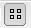

# 協作行銷活動管理員{#working-with-the-marketing-campaign-manager}

在AEM中，行銷活動管理員(MCM)是可協助您管理多管道行銷活動的主控台。 透過這個行銷自動化軟體，您可以管理所有品牌、行銷活動和體驗，以及相關的區段、清單、銷售機會和報表。

MCM可從AEM的各種位置訪問；例如，歡迎畫面，使用「促銷活動」圖示或搭配URL:

`https://<hostname>:<port>/libs/mcm/content/admin.html`

例如：

`https://localhost:4502/libs/mcm/content/admin.html`

從MCM可以訪問：

* ****
控制面板這分為四個窗格：

   * 
清單此窗格顯示您已建立的清單以及該清單中的銷售機會數量。從此窗格，您可以直接建立新清單，或導入銷售線索以建立新清單。
選取特定清單後，您會前往[Lists](#lists)區段，其中顯示清單的詳細資訊。

   * 
區段此窗格顯示您已定義的區段。區段可讓您描述共用特定特徵的訪客集合。
選取特定區段會開啟區段定義頁面。

   * 
ReportsAEM提供不同的報表，協助您分析及監控執行個體的狀態。此MCM窗格列出報告。
選取報表會開啟報表頁面。

   * 
促銷活動此窗格會列出您的促銷活動體驗，  例如電子報 [和茶匙](/help/sites-classic-ui-authoring/classic-personalization-campaigns.md#teasers)。

* ****
銷售機會您可以在此處管理銷售機會。您可以建立或匯入銷售機會、編輯個別銷售機會的特定詳細資訊，或在不再需要時刪除。 您也可以將銷售機會分成不同的群組，稱為清單。 **注意：** Adobe不打算進一步增強此功能。建議是[運用Adobe Campaign以及與AEM](/help/sites-administering/campaign.md)的整合。

* ****
清單您可以在此處管理清單（銷售機會）。**注意：** Adobe不打算進一步增強此功能。建議是[運用Adobe Campaign以及與AEM](/help/sites-administering/campaign.md)的整合。

* ****
行銷活動您可以在此處管理品牌、行銷活動和體驗。

## 控制面板 {#dashboard}

控制面板顯示四個窗格，提供您清單（銷售機會）、區段、報表和促銷活動的概觀。 此處也提供這些功能的基本存取權。

### 銷售機會 {#leads}

>[!NOTE]
>
>Adobe不打算進一步增強此功能（管理銷售機會）。
>建議您運用[Adobe Campaign以及AEM](/help/sites-administering/campaign.md)的整合。

在AEM MCM中，您可以手動輸入銷售線索或導入逗號分隔清單來組織和添加銷售線索；例如，郵件清單。 產生銷售機會的其他方法包括電子報註冊或社群註冊（如果已設定，這些可觸發填入銷售機會的工作流程）。 銷售機會通常會分類並放入清單中，以便您稍後可以在整個清單中執行動作；例如，傳送自訂電子郵件至特定清單。

在左窗格的&#x200B;**Leads**&#x200B;下，您可以建立、導入、編輯和刪除您的銷售機會，然後根據需要激活或停用。 您可以將銷售機會新增至清單，或查看其已隸屬的清單。

>[!NOTE]
>
>有關特定任務的詳細資訊，請參閱[使用銷售機會](/help/sites-classic-ui-authoring/classic-personalization-campaigns.md#workingwithleads)。

### 清單 {#lists}

>[!NOTE]
>
>Adobe不打算進一步增強此功能（管理清單）。
>建議您運用[Adobe Campaign以及AEM](/help/sites-administering/campaign.md)的整合。

清單可讓您將銷售機會組織成群組。 透過清單，您可以將行銷活動鎖定在選定的一組人員；例如，您可以將目標式電子報傳送至清單。

在&#x200B;**Lists**&#x200B;下，您可以建立、匯入、編輯、合併和刪除清單來管理清單，然後您可以視需要啟用或停用清單。 您也可以查看該清單中的銷售機會，查看該清單是否是其他清單的成員，或查看說明。

>[!NOTE]
>
>有關特定任務的詳細資訊，請參閱[使用清單](/help/sites-classic-ui-authoring/classic-personalization-campaigns.md#workingwithlists)。

### 促銷活動 {#campaigns}

>[!NOTE]
>
>如需特定工作的詳細資訊，請參閱[茶匙和策略](/help/sites-classic-ui-authoring/classic-personalization-campaigns.md#workingwithlists)、[設定您的Campaign](/help/sites-classic-ui-authoring/classic-personalization-campaigns.md#settingupyourcampaign)和[電子報](/help/sites-classic-ui-authoring/classic-personalization-campaigns.md#newsletters)。

若要存取現有促銷活動，請在MCM中按一下&#x200B;**Campaigns**。

* **在左窗格中**:列出所有品牌和行銷活動。只要按一下品牌，便可同時：

   * 展開清單以在左窗格中顯示所有相關的促銷活動；此清單也顯示每個促銷活動的體驗數量。
   * 在右窗格中開啟品牌概觀。

* **在右窗格中**:會針對每個品牌顯示圖示（不會顯示歷史促銷活動）。您可以連按兩下這些項目以開啟品牌概觀。

#### 品牌概觀{#brand-overview}

您可以在此：

* 請參閱此品牌存在的促銷活動和體驗數量（左窗格中顯示的數量）。
* 建立&#x200B;**新……**&#x200B;此品牌的促銷活動。

* 變更正在檢視的時間範圍；選擇&#x200B;**周**、**月**&#x200B;或&#x200B;**季**，使用箭頭選擇特定期間或返回&#x200B;**今天**。

* 選取促銷活動（在右窗格中）以：

   * 編輯&#x200B;**屬性……**
   * **** 刪除促銷活動。

* 開啟促銷活動概覽（在右窗格中按兩下促銷活動，或在左窗格中按一下）。

#### 促銷活動概述{#campaign-overview}

對於個別促銷活動，有兩個可用的檢視：

1. **日曆檢視**

   使用圖示：

   

   這會顯示所有接觸點的清單（灰色），以及連線至該接觸點的體驗（綠色）的水準時間範圍：

   

   您可以在此：

   * 使用箭頭更改您正在查看的時間範圍，或返回&#x200B;**Today**。

   * 使用&#x200B;**添加接觸點……**&#x200B;為現有體驗新增接觸點。

   * 按一下預告（在右窗格中）以設定&#x200B;**開啟時間**&#x200B;和&#x200B;**關閉時間**。

1. **清單檢視**

   使用圖示：

   

   這會列出所選促銷活動的所有體驗（例如茶匙和電子報）:

   

   您可以在此：

   * 建立&#x200B;**新……**&#x200B;體驗；例如，Adobe Target優惠、茶匙和電子報。
   * **** 編輯特定宣傳預告頁面或電子報的詳細資訊（也可使用連按兩下的方式）。
   * 定義&#x200B;**屬性……**，取得特定宣傳預告頁面或電子報。
   * **** 模擬體驗（預告頁面或電子報）的外觀和風格。當模擬頁面開啟時，您可以開啟sidekick以切換至該頁面的編輯模式。

   * **分析……** 為頁面產生的曝光數。

   * **** 刪除不再需要的項目。
   * **** 搜尋您的文字（將會搜尋體驗的標題欄位）。
   * 使用&#x200B;**Advanced**&#x200B;搜索將篩選器應用於搜索。

### 模擬促銷活動體驗{#simulating-your-campaign-experiences}

在MCM中，按一下&#x200B;**Campaigns**。 確認清單檢視處於作用中狀態，然後選取所需的促銷活動體驗，然後按一下「**模擬**」。 接觸點（宣傳或電子報頁面）將會開啟，以顯示您所選取的體驗 — 訪客將看到的體驗。

您也可以從此處開啟sidekick（按一下小型向下箭頭），以變更為編輯模式以更新頁面。

### 分析促銷活動體驗{#analyzing-your-campaign-experiences}

在MCM中，按一下&#x200B;**Campaigns**。 確認清單檢視處於作用中狀態，然後選取所需的促銷活動體驗，然後選取&#x200B;**分析……**。 將會顯示一段時間的頁面曝光次數圖表。

