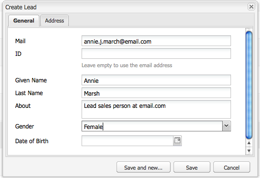
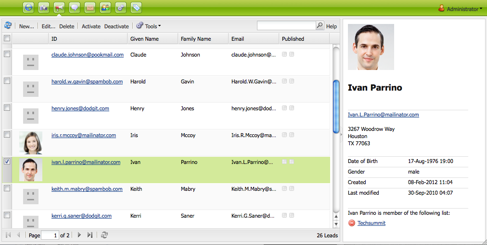
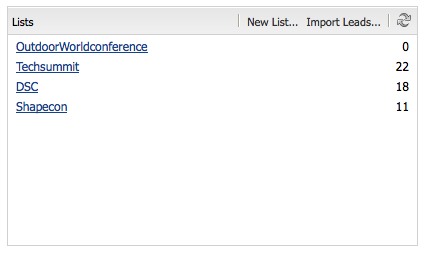

# 設定促銷活動{#setting-up-your-campaign}

設定新促銷活動包含下列（一般）步驟：

1. [建立品牌](#creating-a-new-brand) ，以容納您的促銷活動。
1. 如有需要，您 [可以定義新品牌的屬性](#defining-the-properties-for-your-new-brand)。
1. [建立促銷活動](#creating-a-new-campaign) ，以容納體驗；例如摘要頁面或電子報。
1. 如有需要，您 [可以定義新促銷活動的屬性](#defining-the-properties-for-your-new-campaign)。

然後，您將需要建立體驗，視您所建立的體 [驗類型而定](#creating-a-new-experience)。 體驗的詳細資訊及其建立後的動作，取決於您要建立的體驗類型：

* 如果建立摘要：

   1. [建立摘要體驗](/help/sites-classic-ui-authoring/classic-personalization-campaigns.md#creatingateaserexperience)。
   1. [新增內容至您的摘要](/help/sites-classic-ui-authoring/classic-personalization-campaigns.md#addingcontenttoyourteaser)。
   1. [為您的摘要建立Touchpoint](/help/sites-classic-ui-authoring/classic-personalization-campaigns.md#creatingatouchpointforyourteaser) （將摘要新增至內容頁面）。

* 如果建立電子報：

   1. [建立電子報體驗](/help/sites-classic-ui-authoring/classic-personalization-campaigns.md#creatinganewsletterexperience)。
   1. [新增內容至電子報。](/help/sites-classic-ui-authoring/classic-personalization-campaigns.md#addingcontenttonewsletters)
   1. [個人化電子報。](/help/sites-classic-ui-authoring/classic-personalization-campaigns.md#personalizingnewsletters)
   1. [建立引人入勝的電子報登陸頁面](/help/sites-classic-ui-authoring/classic-personalization-campaigns.md#settingupanewsletterlandingpage)。
   1. [傳送電子報給訂閱者](/help/sites-classic-ui-authoring/classic-personalization-campaigns.md#sendingnewsletters) ，或是潛在客戶。

* 如果建立Adobe Target（先前稱為Test&amp;Target）選件：

   1. [建立Adobe target選件體驗](/help/sites-classic-ui-authoring/classic-personalization-campaigns.md#creatingatesttargetofferexperience)。
   1. [與Adobe Target整合](/help/sites-classic-ui-authoring/classic-personalization-campaigns.md#integratewithadobetesttarget)

>[!NOTE]
>
>如需定 [義區段的詳細指示](/help/sites-administering/campaign-segmentation.md) ，請參閱區段。

## 建立新品牌 {#creating-a-new-brand}

若要建立新品牌：

1. 開啟 **MCM** ，並在左 **窗格中選擇Campaigns** 。

1. **選擇**&#x200B;新建……要輸入要 **用於新品牌** 的「標 **題」和「名稱** 」以及模板，請執行以下操作：

   

1. 按一下&#x200B;**「建立」**。您的新品牌將會以MCM（含預設圖示）顯示。

### 定義新品牌的屬性 {#defining-the-properties-for-your-new-brand}

1. 從左 **窗格的** 「促銷活動」中，在右窗格中選取您的新品牌圖示，然後按一 **下屬性……**

   您可以輸入 **標題**、 **說明** ，以及要用作表徵圖的影像。

   

1. 按一 **下「確定** 」以儲存。

### Creating a New Campaign {#creating-a-new-campaign}

若要建立新促銷活動：

1. 從「 **促銷活動**」中，在左窗格中選取您的新品牌，或在右窗格中按兩下圖示。

   將顯示概述（如果品牌是新品，則為空）。

1. **按一下**&#x200B;新建……並指定要 **用於新促**&#x200B;銷活動的 **** 「標題」、「名稱」和範本。

   

1. 按一下&#x200B;**「建立」**。MCM中將顯示您的新促銷活動。

### 定義新促銷活動的屬性 {#defining-the-properties-for-your-new-campaign}

設定控制行為的促銷活動屬性：

* **** 優先順序：此促銷活動相對於其他促銷活動的優先順序。 當多個促銷活動同時開啟時，具有最高優先順序的促銷活動會控制訪客體驗。
* **** 開啟和關閉時間：這些屬性可控制促銷活動控制訪客體驗的時段。 「按時」屬性控制促銷活動開始控制體驗的時間。 當促銷活動停止控制體驗時，「關閉時間」屬性會加以控制。
* **** 影像：代表AEM中促銷活動的影像。
* **** 雲端服務：整合促銷活動的雲端服務設定。 (請參 [閱「與Adobe Marketing cloud整合](/help/sites-administering/marketing-cloud.md)」。)

* **** Adobe Target:設定與Adobe Target整合之促銷活動的屬性。 (請參 [閱「與Adobe Target整合](/help/sites-administering/target.md)」)。

1. 從「促 **銷活動**」中，選取您的品牌。 在右窗格中，選擇您的促銷活動，然後按一下「 **屬性**」。

   您可以輸入各種屬性，包括 **標題**、 **說明** ，以及 **您想要的Cloud Services** 。

   

1. 按一 **下「確定** 」以儲存。

### 建立新體驗 {#creating-a-new-experience}

建立新體驗的程式取決於體驗類型：

* [建立摘要](/help/sites-classic-ui-authoring/classic-personalization-campaigns.md#creatingateaser)
* [建立電子報](/help/sites-classic-ui-authoring/classic-personalization-campaigns.md#creatinganewsletter)
* [建立Adobe target選件](/help/sites-classic-ui-authoring/classic-personalization-campaigns.md#creatingatesttargetoffer)

>[!NOTE]
>
>和舊版一樣，您仍可在 **Websites** console中將體驗建立為頁面（舊版中建立的任何此類頁面仍完全受支援）。
>
>現在建議的做法是使用MCM來建立體驗。

### 設定您的新體驗 {#configuring-your-new-experience}

現在，您已建立體驗的基本架構，您需要根據體驗類型繼續執行下列動作：

* [Teaser](/help/sites-classic-ui-authoring/classic-personalization-campaigns.md#teasers):

   * [將摘要頁面連接至訪客區段。](/help/sites-classic-ui-authoring/classic-personalization-campaigns.md#applyingasegmenttoyourteaser)
   * [為您的摘要建立Touchpoint](/help/sites-classic-ui-authoring/classic-personalization-campaigns.md#creatingatouchpointforyourteaser) （將摘要新增至內容頁面）。

* [Newsletter](/help/sites-classic-ui-authoring/classic-personalization-campaigns.md#newsletters):

   * [新增內容至電子報。](/help/sites-classic-ui-authoring/classic-personalization-campaigns.md#addingcontenttonewsletters)
   * [個人化電子報。](/help/sites-classic-ui-authoring/classic-personalization-campaigns.md#personalizingnewsletters)
   * [傳送電子報給訂閱者](/help/sites-classic-ui-authoring/classic-personalization-campaigns.md#sendingnewsletters) ，或是潛在客戶。
   * [建立引人入勝的電子報登陸頁面](/help/sites-classic-ui-authoring/classic-personalization-campaigns.md#settingupanewsletterlandingpage)。

* [Adobe target優惠](/help/sites-classic-ui-authoring/classic-personalization-campaigns.md#testtargetoffers):

   * [與Adobe Target整合](/help/sites-administering/target.md)

### 新增觸點 {#adding-a-new-touchpoint}

如果您有現有的體驗，可以直接從MCM的「行事歷」檢視新增觸點：

1. 選取促銷活動的日曆檢視。

1. **按一**&#x200B;下「新增接觸點……」的雙曲餘切值。 指定您要新增的體驗：

   

1. 按一 **下「確定** 」以儲存。

## 使用Lead {#working-with-leads}

>[!NOTE]
>
>Adobe不打算進一步增強這項功能（管理銷售機會）。
>建議您 [運用Adobe Campaign和AEM整合](/help/sites-administering/campaign.md)。

在AEM MCM中，您可以手動輸入銷售線索或匯入逗號分隔清單（例如郵件清單），以組織和新增銷售線索。 其他產生銷售機會的方式包括電子報註冊或社群註冊（如果設定，這些方式可觸發填入銷售機會的工作流程）。

銷售機會通常會分類並放入清單中，以便您稍後可以對整個清單執行動作，例如將自訂電子郵件傳送至特定清單。

在「控制面板」中，您可以按一下左窗格中的「 **銷售線索** 」來存取所有銷售線索。 您也可以從「清單」窗格存 **取客源** 。

>[!NOTE]
>
>若要新增或修改使用者的變數，請開啟點按流雲端(Ctrl+Alt+c)、載入描述檔，然後按一下「編 **輯」**。

### 建立新銷售線索 {#creating-new-leads}

建立新的銷售機會後，請務必啟 [動他們](#activating-or-deactivating-leads) ，以便追蹤他們在發佈執行個體上的活動並個人化其體驗。

要人工建立新銷售線索，請執行以下操作：

1. 在AEM中，導覽至MCM。 在「控制面板」中，按一下「 **銷售機會**」。
1. 按一 **下新**。 將開啟 **「建立新** 」窗口。

   

1. 在相應欄位中輸入資訊。 按一下「 **地址** 」標籤。

   

1. 根據需要輸入地址資訊。 按一下 **保存** ，保存銷售線索。 如果您需要新增其他銷售機會，請按一下「 **儲存並新增」**。

   新銷售線索將顯示在「銷售線索」窗格中。 按一下條目後，所有輸入的資訊都會顯示在右窗格中。 建立銷售線索後，您可將其新增至清單。

   

### 啟用或停用銷售線索 {#activating-or-deactivating-leads}

啟動銷售機會可協助您追蹤其發佈例項上的活動，並讓您個人化其體驗。 當您不再想追蹤其活動時，可以停用它們。

要激活或取消激活的銷售線索，請執行以下操作：

1. 在AEM中，導覽至MCM，然後按一下「銷 **售機會**」。

1. 選擇要激活或停用的銷售線索，然後按一下「激活 **」** 或「 **停用」**。

   

   和AEM頁面一樣，「發佈」欄會指 **示發佈** 狀態。

   

### 匯入新銷售線索 {#importing-new-leads}

在導入新銷售線索時，您可以自動將其添加到現有清單或建立新清單以包括這些銷售線索。

要從逗號分隔清單導入銷售線索：

1. 在AEM中，導覽至MCM，然後按一下「銷 **售機會**」。

   >[!NOTE]
   >
   >或者，您可以通過執行下列操作之一導入銷售線索：
   >
   >
   >
   >    * 在「控制面板」中，按一 **下「清單** 」窗格中的 **「匯入銷售線索** 」
      >
      >    
   * 按一下 **清單** ，在「工具」菜單中 **選擇「導入** 銷售線索 ****」。

1. 在「工 **具** 」菜單中，選 **擇「導入****銷售線索**」。

1. 按照示例資料中所述輸入資訊。 可匯入下列欄位：email,familyName,givenName,geder,aboutMe,city,country,phoneNumber,postalCode, region,streetAddress

   >[!NOTE]
   >
   >CSV清單中的第一列是預先定義的標籤，必須與範例中的相同：
   >
   >
   >`email,givenName,familyName` -例如，如 `givenname`果寫入方式為，系統將無法識別。

   

1. 按一 **下「下一步**」。 在這裡，您可預覽銷售機會，以確保銷售機會準確無誤。

   

1. 按一 **下「下一步**」。 選擇您希望銷售線索所屬的清單。 如果您不希望它們屬於清單，請刪除該欄位中的資訊。 依預設，AEM會建立包含日期和時間的清單名稱。 按一 **下匯入**。

   

   新銷售線索將顯示在「銷售線索」窗格中。 如果按一下該條目，則所有輸入的資訊都會顯示在右窗格中。 建立銷售線索後，您可將其新增至清單。

### 將銷售線索添加到清單 {#adding-leads-to-lists}

要將銷售線索添加到預先存在的清單，請執行以下操作：

1. 在MCM中，按一下 **Leads** 以查看所有可用銷售線索。

1. 通過選擇銷售線索旁的複選框，選擇要添加到清單的銷售線索。 您可以視需要新增任何數量的銷售機會。

   

1. 在「工 **具** 」菜單中，選 **擇「添加到清單……」.** 將開啟 **「添加到清單** 」窗口。

   

1. 選擇要將銷售線索添加到的清單，然後按一下「確 **定」**。 銷售機會會新增至適當的清單。

### 查看銷售線索資訊 {#viewing-lead-information}

要查看銷售線索資訊，在MCM中，按一下銷售線索旁的複選框，並開啟一個右窗格，其中顯示了所有銷售線索的資訊，包括清單從屬關係。

### 修改現有銷售線索 {#modifying-existing-leads}

要修改現有銷售線索資訊，請執行以下操作：

1. 在MCM中，按一下「銷 **售線索」**。 從銷售線索清單中，選擇要編輯的銷售線索旁的複選框。 所有銷售線索資訊都顯示在右窗格中。

   

   >[!NOTE]
   >
   >您一次只能編輯單一銷售機會。 如果您需要修改屬於同一清單一部分的銷售線索，則可以改為修改清單。

1. 按一 **下編輯**。 「編 **輯銷售線索** 」窗口開啟。

   

1. 視需要進行編輯，然後按一下「 **儲存** 」以儲存變更。

   >[!NOTE]
   >
   >若要變更銷售機會頭像，請前往使用者設定檔。 您可以按CTRL+ALT+c，按一下「載入」，然後選取描述檔，將描述檔載入點按流雲 **中**。

### 刪除現有銷售線索 {#deleting-existing-leads}

要刪除MCM中的現有銷售線索，請選擇銷售線索旁的複選框，然後按一下「刪 **除」**。 銷售線索將從銷售線索清單和所有關聯清單中刪除。

>[!NOTE]
>
>在刪除之前，AEM會確認您要刪除現有的銷售線索。 刪除後，將無法檢索。

## 使用清單 {#working-with-lists}

>[!NOTE]
>
>Adobe不打算進一步增強這項功能（管理清單）。
>建議您 [運用Adobe Campaign和AEM整合](/help/sites-administering/campaign.md)。

清單可讓您將潛在客戶組織成群組。 有了清單，您可以將行銷促銷活動鎖定在特定的人員群組，例如，您可以將定位的電子報傳送到清單。 清單可在MCM中顯示，在「儀表板」中或按一下「列 **表」**。 兩者都提供清單的名稱和成員數。

如果按一下「 **清單**」(Lists)，則還可以查看清單是否是其他清單的成員，並查看說明。

### 建立新清單 {#creating-new-lists}

若要建立新清單（群組）:

1. **在MCM操控板中，按一下「**&#x200B;新建清單……」(New List ...)或在清 **單中**，按一 **下新增** ...將開啟「建立清單」(Create List)窗口。

   

1. 輸入名稱（必要），並視需要輸入說明，然後按一下「儲 **存」**。 清單將出現在「列 **表** 」窗格中。

   

### 修改現有清單 {#modifying-existing-lists}

要修改現有清單：

1. 在MCM中，按一下「列 **表」**。

1. 從清單中，選擇要編輯的清單旁的複選框，然後按一下「編 **輯」**。 「編 **輯清單** 」(Edit List)窗口開啟。

   

   >[!NOTE]
   >
   >一次只能編輯一個清單。

1. 視需要進行編輯，然後按一下「 **儲存** 」以儲存變更。

### 刪除現有清單 {#deleting-existing-lists}

要刪除現有清單，在MCM中，選中清單旁的複選框，然後按一下「刪 **除」**。 清單已移除。 不會移除與清單相關聯的銷售機會——只會刪除與清單相關聯的銷售機會。

>[!NOTE]
>
>在刪除之前，AEM會確認您要刪除現有清單。 刪除後，將無法檢索。

### 合併清單 {#merging-lists}

您可以將現有清單與其他清單合併。 執行此操作時，要合併的清單將成為另一個清單的成員。 它仍以單獨的實體存在，不應刪除。

如果您在兩個不同位置有相同的會議，並想將它們合併為所有會議的與會者清單，則可合併清單。

要合併現有清單：

1. 在MCM中，按一下「列 **表」**。

1. 通過選擇清單旁的複選框，選擇要與其合併的清單。

1. 在「工具 **」菜單中** ，選擇「 **合併清單」**。

   >[!NOTE]
   >
   >一次只能合併一個清單。

1. 在「合 **並清單** 」窗口中，選擇要合併的清單，然後按一下「確 **定」**。

   

   您合併的清單應增加一個成員。 要查看您的清單已合併，請選擇您合併的清單，並在「工具」菜單中 **選擇** 「顯 **示銷售線索」**。

1. 重複此步驟，直到您合併了所有想要的清單。

   

>[!NOTE]
>
>從其成員資格中刪除合併清單與從清單中刪除銷售線索相同。 開啟「 **清單** 」標籤，選取包含合併清單的清單，然後按一下清單旁的紅色圓圈以移除成員資格。

### 在清單中查看銷售線索 {#viewing-leads-in-lists}

您可以隨時瀏覽或搜尋成員，以檢視屬於特定清單的銷售機會。

要查看屬於清單的銷售線索，請執行以下操作：

1. 在MCM中，按一下「列 **表」**。

1. 選擇要查看其成員的清單旁的複選框。

1. 在「工具 **」菜單** ，選擇「 **顯示銷售線索」**。 AEM會顯示屬於該清單成員的銷售機會。 您可以瀏覽整個清單或搜索成員。

   >[!NOTE]
   >
   >此外，您還可以從清單中刪除銷售線索，方法是選擇銷售線索，然後按一下「移除 **會籍」**。

   

1. 按一下 **關閉** ，返回MCM。
