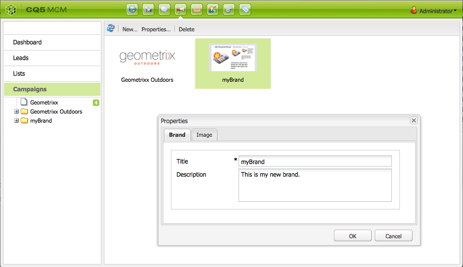
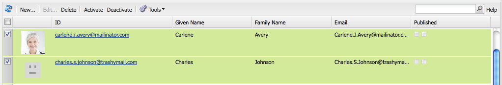
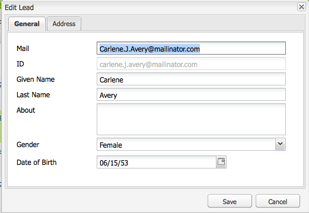
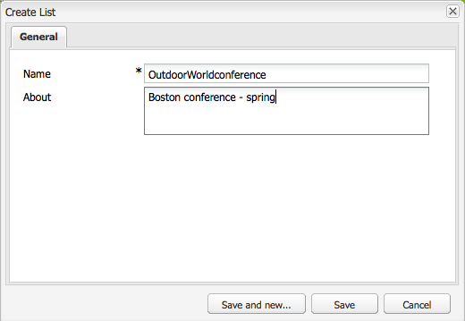
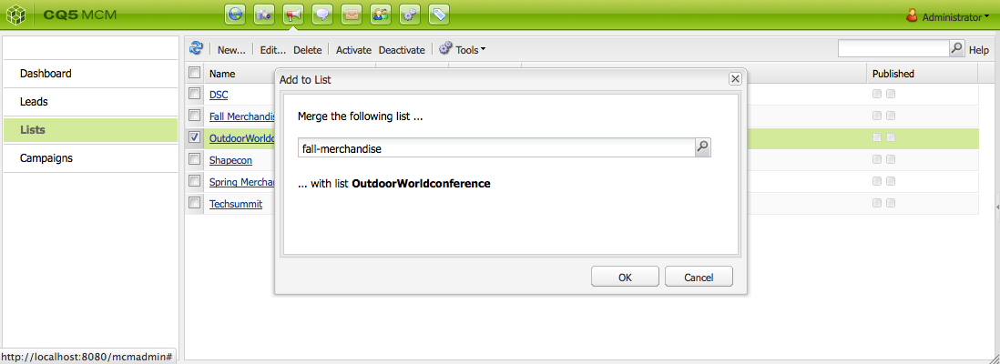

# 設定您的活動{#setting-up-your-campaign}

設定新市場活動包括以下（一般）步驟：

1. [建立品牌](#creating-a-new-brand) 來進行競選活動。
1. 如果需要，您可以 [定義新品牌的屬性](#defining-the-properties-for-your-new-brand)。
1. [建立市場活動](#creating-a-new-campaign) 掌握經驗；例如預告頁或新聞簡報。
1. 如果需要，您可以 [定義新市場活動的屬性](#defining-the-properties-for-your-new-campaign)。

然後，根據您正在建立的體驗類型，您需要 [創造體驗](#creating-a-new-experience)。 體驗的詳細資訊及其建立後的操作取決於要建立的體驗類型：

* 如果建立預告：

   1. [建立預告體驗](/help/sites-classic-ui-authoring/classic-personalization-campaigns.md#creatingateaserexperience)。
   1. [向預告添加內容](/help/sites-classic-ui-authoring/classic-personalization-campaigns.md#addingcontenttoyourteaser)。
   1. [為預告建立觸點](/help/sites-classic-ui-authoring/classic-personalization-campaigns.md#creatingatouchpointforyourteaser) （將預告添加到內容頁面）。

* 如果建立新聞簡報：

   1. [建立新聞稿體驗](/help/sites-classic-ui-authoring/classic-personalization-campaigns.md#creatinganewsletterexperience)。
   1. [將內容添加到新聞稿。](/help/sites-classic-ui-authoring/classic-personalization-campaigns.md#addingcontenttonewsletters)
   1. [個性化新聞稿。](/help/sites-classic-ui-authoring/classic-personalization-campaigns.md#personalizingnewsletters)
   1. [建立引人注目的新聞簡報登錄頁](/help/sites-classic-ui-authoring/classic-personalization-campaigns.md#settingupanewsletterlandingpage)。
   1. [發送新聞稿](/help/sites-classic-ui-authoring/classic-personalization-campaigns.md#sendingnewsletters) 訂戶或潛在顧客。

* 如果建立Adobe Target(以前為Test和目標)優惠：

   1. [建立Adobe Target服務體驗](/help/sites-classic-ui-authoring/classic-personalization-campaigns.md#creatingatesttargetofferexperience)。
   1. [與Adobe Target整合](/help/sites-classic-ui-authoring/classic-personalization-campaigns.md#integratewithadobetesttarget)

>[!NOTE]
>
>請參閱 [分段](/help/sites-administering/campaign-segmentation.md) 的子目錄。

## 建立新品牌 {#creating-a-new-brand}

要建立新品牌：

1. 開啟 **MCM** 選擇 **市場活動** 的子菜單。

1. 選擇 **新建……** 的 **標題** 和 **名稱** 和用於新品牌的模板：

   

1. 按一下&#x200B;**建立**。您的新品牌將顯示在MCM中（帶預設表徵圖）。

### 定義新品牌的屬性 {#defining-the-properties-for-your-new-brand}

1. 從 **市場活動** 在左窗格中，選擇右窗格中的新品牌表徵圖，然後按一下 **屬性……**

   您可以輸入 **標題**。 **說明** 和要用作表徵圖的影像。

   

1. 按一下 **確定** 來保存。

### 建立新市場活動 {#creating-a-new-campaign}

要建立新市場活動，請執行以下操作：

1. 從 **市場活動**，在左窗格中選擇新品牌，或按兩下右窗格中的表徵圖。

   將顯示概述（如果品牌是新品，則為空）。

1. 按一下 **新建……** 並指定 **標題**。 **名稱** 和用於新市場活動的模板。

   

1. 按一下&#x200B;**建立**。你的新活動將在MCM展出。

### 定義新市場活動的屬性 {#defining-the-properties-for-your-new-campaign}

配置控制行為的市場活動屬性：

* **優先順序：** 此市場活動相對於其他市場活動的優先順序。 當多個市場活動同時啟動時，優先順序最高的市場活動控制訪問者體驗。
* **開/關時間：** 這些屬性控制活動控制訪問者體驗的時間段。 「按時」屬性控制市場活動開始控制體驗的時間。 當市場活動停止控制體驗時，「關機時間」屬性將控制。
* **影像：** 表示中市場活動的圖AEM像。
* **Cloud Services:** 整合市場活動的Cloud Service配置。 (請參閱 [與Adobe Marketing Cloud整合](/help/sites-administering/marketing-cloud.md)。)

* **Adobe Target:** 配置與Adobe Target整合的市場活動的屬性。 (請參閱 [與Adobe Target整合](/help/sites-administering/target.md)。)

1. 從 **市場活動**，選擇您的品牌。 在右窗格中，選擇市場活動，然後按一下 **屬性**。

   您可以輸入各種屬性，包括 **標題**。 **說明** 和 **Cloud Services** 你想要。

   

1. 按一下 **確定** 來保存。

### 創造新體驗 {#creating-a-new-experience}

建立新體驗的過程取決於體驗的類型：

* [建立預告](/help/sites-classic-ui-authoring/classic-personalization-campaigns.md#creatingateaser)
* [建立新聞稿](/help/sites-classic-ui-authoring/classic-personalization-campaigns.md#creatinganewsletter)
* [建立Adobe Target優惠](/help/sites-classic-ui-authoring/classic-personalization-campaigns.md#creatingatesttargetoffer)

>[!NOTE]
>
>與以前的版本一樣，仍可以在 **網站** 控制台（以及以前版本中建立的任何此類頁面仍完全受支援）。
>
>現在推薦的做法是使用MCM來創造經驗。

### 配置新體驗 {#configuring-your-new-experience}

現在，您已經建立了基本的體驗框架，您需要根據體驗類型繼續執行以下操作：

* [Teaser](/help/sites-classic-ui-authoring/classic-personalization-campaigns.md#teasers):

   * [將預告頁連接到訪問者段。](/help/sites-classic-ui-authoring/classic-personalization-campaigns.md#applyingasegmenttoyourteaser)
   * [為預告建立觸點](/help/sites-classic-ui-authoring/classic-personalization-campaigns.md#creatingatouchpointforyourteaser) （將預告添加到內容頁面）。

* [Newsletter](/help/sites-classic-ui-authoring/classic-personalization-campaigns.md#newsletters):

   * [將內容添加到新聞稿。](/help/sites-classic-ui-authoring/classic-personalization-campaigns.md#addingcontenttonewsletters)
   * [個性化新聞稿。](/help/sites-classic-ui-authoring/classic-personalization-campaigns.md#personalizingnewsletters)
   * [發送新聞稿](/help/sites-classic-ui-authoring/classic-personalization-campaigns.md#sendingnewsletters) 訂戶或潛在顧客。
   * [建立引人注目的新聞簡報登錄頁](/help/sites-classic-ui-authoring/classic-personalization-campaigns.md#settingupanewsletterlandingpage)。

* [Adobe Target優惠](/help/sites-classic-ui-authoring/classic-personalization-campaigns.md#testtargetoffers):

   * [與Adobe Target整合](/help/sites-administering/target.md)

### 添加新觸點 {#adding-a-new-touchpoint}

如果您有現有經驗，則可以直接從MCM的「日曆」視圖添加一個觸點：

1. 選擇市場活動的日曆視圖。

1. 按一下 **添加觸點……** 的子菜單。 指定要添加的體驗：

   

1. 按一下 **確定** 來保存。

## 使用Lead {#working-with-leads}

>[!NOTE]
>
>Adobe不打算進一步增強此功能（管理銷售線索）。
>建議是 [利用Adobe Campaign和AEM](/help/sites-administering/campaign.md)。

在AEMMCM中，您可以通過手動輸入銷售線索或導入逗號分隔的清單來組織和添加銷售線索，例如，郵寄清單。 生成潛在顧客的其他方法來自新聞簡報註冊或社區註冊（如果配置，這些方法可觸發填充潛在顧客的工作流）。

銷售線索通常被分類並放入清單中，以便以後您可以對整個清單執行操作，例如向特定清單發送自定義電子郵件。

在儀表板中，通過按一下 **銷售線索** 的下界。 您還可以從 **清單** 的子菜單。

>[!NOTE]
>
>要添加或修改用戶的虛擬角色，請開啟按一下流雲(Ctrl+Alt+c)，載入配置檔案，然後按一下 **編輯**。

### 建立新銷售線索 {#creating-new-leads}

建立新銷售線索後，請務必 [激活](#activating-or-deactivating-leads) 以便您可以跟蹤他們在發佈實例上的活動並個性化他們的體驗。

要人工建立新銷售線索，請執行以下操作：

1. 在AEM中，導航到MCM。 在儀表板中，按一下 **銷售線索**。
1. 按一下 **新建**。 的 **新建** 的下界。

   

1. 在欄位中輸入相應的資訊。 按一下 **地址** 頁籤。

   

1. 根據需要輸入地址資訊。 按一下 **保存** 來拯救領頭羊。 如果需要添加其他銷售線索，請按一下 **保存並新建**。

   新銷售線索將出現在「銷售線索」窗格中。 按一下該條目後，所有輸入的資訊都將顯示在右窗格中。 建立潛在顧客後，可將其添加到清單中。

   

### 激活或停用銷售線索 {#activating-or-deactivating-leads}

激活銷售線索可幫助您跟蹤發佈實例上的活動，並讓您個性化其體驗。 當您不再想跟蹤其活動時，可以停用它們。

要執行有效或停用的銷售線索：

1. 在AEM中，導航到MCM並按一下 **銷售線索**。

1. 選擇要激活或停用的銷售線索，然後按一下 **激活** 或 **停用**。

   

   與頁面AEM一樣，在 **已發佈** 的雙曲餘切值。

   

### 導入新銷售線索 {#importing-new-leads}

在導入新銷售線索時，您可以自動將它們添加到現有清單或建立新清單以包括這些銷售線索。

要從逗號分隔的清單中導入銷售線索，請執行以下操作：

1. 在AEM中，導航到MCM並按一下 **銷售線索**。

   >[!NOTE]
   >
   >或者，可以通過執行以下操作之一來導入引線：
   >
   >* 在儀表板中，按一下 **導入銷售線索** 的 **清單** 窗格
   >* 按一下 **清單** 在 **工具** 菜單，選擇 **導入銷售線索**。

1. 在 **工具** 菜單，選擇 **導入** **銷售線索**。

1. 按示例資料中所述輸入資訊。 可以導入以下欄位：email,familyName,givenName，性別，aboutMe,city,country，國家，phoneNumber,postalCode,region,streetAddress

   >[!NOTE]
   >
   >CSV清單中的第一行是預定義的標籤，必須與示例中的內容完全相同：
   >
   >
   >`email,givenName,familyName`  — 如果寫入 `givenname`例如，系統無法識別它。

   

1. 按一下&#x200B;**下一步**。在此，您可以預覽銷售線索，以確保其準確。

   

1. 按一下&#x200B;**下一步**。選擇希望銷售線索所屬的清單。 如果不希望它們屬於清單，請刪除該欄位中的資訊。 預設情況下，AEM建立包含日期和時間的清單名稱。 按一下 **導入**。

   

   新銷售線索將出現在「銷售線索」窗格中。 如果按一下該條目，則所有輸入的資訊都將顯示在右窗格中。 建立潛在顧客後，可將其添加到清單中。

### 將銷售線索添加到清單 {#adding-leads-to-lists}

要將銷售線索添加到預先存在的清單，請執行以下操作：

1. 在MCM中，按一下 **銷售線索** 查看所有可用銷售線索。

1. 通過選中銷售線索旁邊的複選框，選擇要添加到清單的銷售線索。 您可以添加任意數量的潛在顧客。

   

1. 在 **工具** 菜單，選擇 **添加到清單……。** 的 **添加到清單** 的下界。

   

1. 選擇要將銷售線索添加到的清單，然後按一下 **確定**。 銷售線索會添加到相應的清單中。

### 查看潛在顧客資訊 {#viewing-lead-information}

要查看銷售線索資訊，請在MCM中按一下銷售線索旁邊的複選框，然後開啟右窗格，顯示所有銷售線索資訊，包括清單從屬關係。

### 修改現有銷售線索 {#modifying-existing-leads}

要修改現有銷售線索資訊，請執行以下操作：

1. 在MCM中，按一下 **銷售線索**。 從銷售線索清單中，選中要編輯的銷售線索旁邊的複選框。 所有潛在客戶資訊都顯示在右窗格中。

   

   >[!NOTE]
   >
   >一次只能編輯一個潛在顧客。 如果需要修改屬於同一清單的銷售線索，則可以改變該清單。

1. 按一下 **編輯**。 的 **編輯潛在顧客** 的下界。

   

1. 根據需要進行編輯，然後按一下 **保存** 的子菜單。

   >[!NOTE]
   >
   >要更改潛在顧客虛擬形象，請轉到用戶配置檔案。 通過按CTRL+ALT+c，按一下 **載入**，然後選擇配置檔案。

### 刪除現有銷售線索 {#deleting-existing-leads}

要刪除MCM中的現有銷售線索，請選中銷售線索旁邊的複選框，然後按一下 **刪除**。 潛在顧客將從潛在顧客清單和所有關聯清單中刪除。

>[!NOTE]
>
>刪除前，AEM確認要刪除現有潛在顧客。 刪除後，將無法檢索。

## 使用清單 {#working-with-lists}

>[!NOTE]
>
>Adobe不打算進一步增強此功能（管理清單）。
>建議是 [利用Adobe Campaign和AEM](/help/sites-administering/campaign.md)。

清單允許您將銷售線索組織成組。 使用清單，您可以將市場營銷活動目標定為選定的一組人員，例如，您可以將目標新聞稿發送到清單。 清單在MCM中可見，可在操控板中或通過按一下 **清單**。 兩者都提供清單名稱和成員數。

如果按一下 **清單**，您還可以查看清單是否是另一個清單的成員，並查看說明。

### 建立新清單 {#creating-new-lists}

要建立新清單（組）:

1. 在MCM操控板中，按一下 **新建清單……** 或 **清單**&#x200B;按一下 **新建** ...將開啟「建立清單」(Create List)窗口。

   

1. 輸入名稱（必需），如果需要，請輸入說明並按一下 **保存**。 清單將出現在 **清單** 的子菜單。

   

### 修改現有清單 {#modifying-existing-lists}

要修改現有清單：

1. 在MCM中，按一下 **清單**。

1. 從清單中，選中要編輯的清單旁邊的複選框，然後按一下 **編輯**。 的 **編輯清單** 的下界。

   

   >[!NOTE]
   >
   >一次只能編輯一個清單。

1. 根據需要進行編輯，然後按一下 **保存** 的子菜單。

### 刪除現有清單 {#deleting-existing-lists}

要刪除現有清單，請在MCM中，選中清單旁邊的複選框，然後按一下 **刪除**。 該清單將被刪除。 不刪除與清單關聯的線索 — 只刪除與清單關聯。

>[!NOTE]
>
>刪除前，AEM確認要刪除現有清單。 刪除後，將無法檢索。

### 合併清單 {#merging-lists}

可以將現有清單與其他清單合併。 執行此操作時，正在合併的清單將成為另一個清單的成員。 它仍作為單獨的實體存在，不應刪除。

如果您在兩個不同位置擁有相同的會議並且希望將它們合併到所有會議的與會者清單中，則可以合併清單。

要合併現有清單：

1. 在MCM中，按一下 **清單**。

1. 通過選中清單旁邊的複選框，選擇要合併其他清單的清單。

1. 在 **工具** 菜單，選擇 **合併清單**。

   >[!NOTE]
   >
   >一次只能合併一個清單。

1. 在 **合併清單** 的子菜單，選擇要合併的清單，然後按一下 **確定**。

   

   合併的清單應增加一個成員。 要查看您的清單已合併，請選擇您合併的清單，並在 **工具** 菜單，選擇 **顯示銷售線索**。

1. 重複該步驟，直到合併了所有所需清單。

   

>[!NOTE]
>
>從合併清單的成員資格中刪除與從清單中刪除潛在顧客相同。 開啟 **清單** 頁籤，選擇包含合併清單的清單，並通過按一下清單旁邊的紅色圓圈來刪除成員資格。

### 查看清單中的銷售線索 {#viewing-leads-in-lists}

您可以隨時通過瀏覽或搜索成員來查看屬於特定清單的線索。

要查看屬於清單的銷售線索，請執行以下操作：

1. 在MCM中，按一下 **清單**。

1. 選中要查看其成員的清單旁邊的複選框。

1. 在 **工具** 菜單，選擇 **顯示銷售線索**。 顯AEM示作為該清單成員的銷售線索。 您可以瀏覽清單或搜索成員。

   >[!NOTE]
   >
   >此外，您還可以通過選擇潛在顧客，然後按一下 **刪除成員資格**。

   

1. 按一下 **關閉** 回到反水雷。
