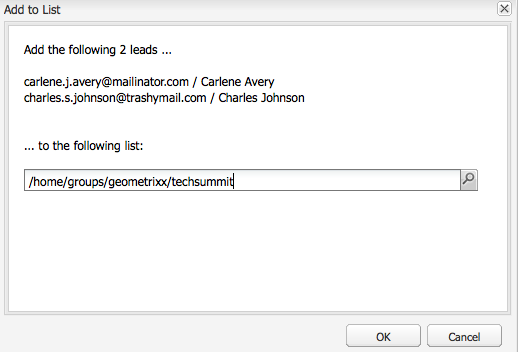
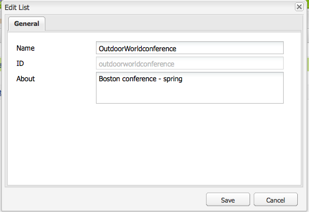

# 設定促銷活動{#setting-up-your-campaign}

設定新促銷活動包含下列（一般）步驟：

1. [建立品牌](#creating-a-new-brand) 以容納您的促銷活動。
1. 如果需要，您可以[定義新品牌的屬性](#defining-the-properties-for-your-new-brand)。
1. [建立促](#creating-a-new-campaign) 銷活動以保存體驗；例如摘要頁面或電子報。
1. 如有需要，您可以[定義新促銷活動的屬性](#defining-the-properties-for-your-new-campaign)。

然後，視您所建立的體驗類型而定，您需要[建立體驗](#creating-a-new-experience)。 體驗的詳細資訊及其建立後的動作，取決於您要建立的體驗類型：

* 如果建立摘要：

   1. [建立摘要體驗](/help/sites-classic-ui-authoring/classic-personalization-campaigns.md#creatingateaserexperience)。
   1. [新增內容至您的摘要](/help/sites-classic-ui-authoring/classic-personalization-campaigns.md#addingcontenttoyourteaser)。
   1. [為您的摘要建立Touchpoint](/help/sites-classic-ui-authoring/classic-personalization-campaigns.md#creatingatouchpointforyourteaser) （將摘要新增至內容頁面）。

* 如果建立電子報：

   1. [建立電子報體驗](/help/sites-classic-ui-authoring/classic-personalization-campaigns.md#creatinganewsletterexperience)。
   1. [新增內容至電子報。](/help/sites-classic-ui-authoring/classic-personalization-campaigns.md#addingcontenttonewsletters)
   1. [個人化電子報。](/help/sites-classic-ui-authoring/classic-personalization-campaigns.md#personalizingnewsletters)
   1. [建立引人入勝的電子報登陸頁面](/help/sites-classic-ui-authoring/classic-personalization-campaigns.md#settingupanewsletterlandingpage)。
   1. [傳送電子](/help/sites-classic-ui-authoring/classic-personalization-campaigns.md#sendingnewsletters) 報給訂閱者或潛在客戶。

* 如果建立Adobe Target（先前稱為Test&amp;Target）選件：

   1. [建立Adobe Target選件體驗](/help/sites-classic-ui-authoring/classic-personalization-campaigns.md#creatingatesttargetofferexperience)。
   1. [與Adobe Target整合](/help/sites-classic-ui-authoring/classic-personalization-campaigns.md#integratewithadobetesttarget)

>[!NOTE]
>
>如需定義區段的詳細指示，請參閱[區段](/help/sites-administering/campaign-segmentation.md)。

## 建立新品牌{#creating-a-new-brand}

若要建立新品牌：

1. 開啟&#x200B;**MCM**，然後在左窗格中選取&#x200B;**Campaigns**。

1. 選擇&#x200B;**新建……**&#x200B;輸入&#x200B;**Title**&#x200B;和&#x200B;**Name**，以及用於您新品牌的範本：

   

1. 按一下&#x200B;**建立**。您的新品牌將會以MCM（含預設圖示）顯示。

### 定義新品牌的屬性{#defining-the-properties-for-your-new-brand}

1. 從左窗格的&#x200B;**促銷活動**&#x200B;中，在右窗格中選擇您的新品牌圖示，然後按一下「屬性……」****

   您可以輸入&#x200B;**Title**、**Description**&#x200B;和要用作表徵圖的影像。

   

1. 按一下&#x200B;**確定**&#x200B;保存。

### 建立新促銷活動{#creating-a-new-campaign}

若要建立新促銷活動：

1. 從&#x200B;**促銷活動**&#x200B;中，在左窗格中選取您的新品牌，或連按兩下右窗格中的圖示。

   將顯示概述（如果品牌是新品，則為空）。

1. 按一下&#x200B;**新建……**&#x200B;並指定&#x200B;**Title**、**Name**&#x200B;和範本以用於新促銷活動。

   

1. 按一下&#x200B;**建立**。MCM中將顯示您的新促銷活動。

### 定義新促銷活動的屬性{#defining-the-properties-for-your-new-campaign}

設定控制行為的促銷活動屬性：

* **優先順序：** 此促銷活動相對於其他促銷活動的優先順序。當多個促銷活動同時開啟時，具有最高優先順序的促銷活動會控制訪客體驗。
* **開啟和關閉時間：** 這些屬性可控制促銷活動控制訪客體驗的時段。「按時」屬性控制促銷活動開始控制體驗的時間。 當促銷活動停止控制體驗時，「關閉時間」屬性會加以控制。
* **影像：** 代表AEM中促銷活動的影像。
* **雲端服務：** 整合促銷活動的雲端服務組態。（請參閱[與Adobe Marketing Cloud](/help/sites-administering/marketing-cloud.md)整合。）

* **Adobe Target：設** 定與Adobe Target整合之促銷活動的屬性。（請參閱[與Adobe Target整合](/help/sites-administering/target.md)）。

1. 從&#x200B;**促銷活動**&#x200B;中，選取您的品牌。 在右窗格中，選擇您的促銷活動，然後按一下「屬性」**。**

   您可以輸入各種屬性，包括&#x200B;**Title**、**Description**&#x200B;和您想要的任何&#x200B;**Cloud Services**。

   

1. 按一下&#x200B;**確定**&#x200B;保存。

### 建立新體驗{#creating-a-new-experience}

建立新體驗的程式取決於體驗類型：

* [建立摘要](/help/sites-classic-ui-authoring/classic-personalization-campaigns.md#creatingateaser)
* [建立電子報](/help/sites-classic-ui-authoring/classic-personalization-campaigns.md#creatinganewsletter)
* [建立Adobe Target選件](/help/sites-classic-ui-authoring/classic-personalization-campaigns.md#creatingatesttargetoffer)

>[!NOTE]
>
>和舊版一樣，您仍可在&#x200B;**Websites**&#x200B;主控台中將體驗建立為頁面（而舊版中建立的任何頁面仍完全受支援）。
>
>現在建議的做法是使用MCM來建立體驗。

### 設定新體驗{#configuring-your-new-experience}

現在，您已建立體驗的基本架構，您需要根據體驗類型繼續執行下列動作：

* [Teaser](/help/sites-classic-ui-authoring/classic-personalization-campaigns.md#teasers):

   * [將摘要頁面連接至訪客區段。](/help/sites-classic-ui-authoring/classic-personalization-campaigns.md#applyingasegmenttoyourteaser)
   * [為您的摘要建立Touchpoint](/help/sites-classic-ui-authoring/classic-personalization-campaigns.md#creatingatouchpointforyourteaser) （將摘要新增至內容頁面）。

* [Newsletter](/help/sites-classic-ui-authoring/classic-personalization-campaigns.md#newsletters):

   * [新增內容至電子報。](/help/sites-classic-ui-authoring/classic-personalization-campaigns.md#addingcontenttonewsletters)
   * [個人化電子報。](/help/sites-classic-ui-authoring/classic-personalization-campaigns.md#personalizingnewsletters)
   * [傳送電子](/help/sites-classic-ui-authoring/classic-personalization-campaigns.md#sendingnewsletters) 報給訂閱者或潛在客戶。
   * [建立引人入勝的電子報登陸頁面](/help/sites-classic-ui-authoring/classic-personalization-campaigns.md#settingupanewsletterlandingpage)。

* [Adobe Target優惠](/help/sites-classic-ui-authoring/classic-personalization-campaigns.md#testtargetoffers):

   * [與Adobe Target整合](/help/sites-administering/target.md)

### 新增接觸點{#adding-a-new-touchpoint}

如果您有現有的體驗，可以直接從MCM的「行事歷」檢視新增觸點：

1. 選取促銷活動的日曆檢視。

1. 按一下「新增接觸點……」**以開啟對話方塊。**&#x200B;指定您要新增的體驗：

   

1. 按一下&#x200B;**確定**&#x200B;保存。

## 使用Lead {#working-with-leads}

>[!NOTE]
>
>Adobe不打算進一步增強這項功能（管理銷售機會）。
>建議使用[運用Adobe Campaign和AEM](/help/sites-administering/campaign.md)的整合。

在AEM MCM中，您可以手動輸入銷售線索或匯入逗號分隔清單（例如郵件清單），以組織和新增銷售線索。 其他產生銷售機會的方式包括電子報註冊或社群註冊（如果設定，這些方式可觸發填入銷售機會的工作流程）。

銷售機會通常會分類並放入清單中，以便您稍後可以對整個清單執行動作，例如將自訂電子郵件傳送至特定清單。

在「儀表板」中，通過從左窗格按一下&#x200B;**Leads**&#x200B;來訪問所有銷售線索。 您也可以從&#x200B;**Lists**&#x200B;窗格存取潛在客源。

>[!NOTE]
>
>若要新增或修改使用者的變數，請開啟點按流雲(Ctrl+Alt+c)，載入描述檔，然後按一下「編輯&#x200B;****」。

### 建立新銷售線索{#creating-new-leads}

建立新銷售機會後，請務必[啟用他們](#activating-or-deactivating-leads)，以便您追蹤他們在發佈執行個體上的活動並個人化他們的體驗。

要人工建立新銷售線索，請執行以下操作：

1. 在AEM中，導覽至MCM。 在「儀表板」中，按一下&#x200B;**Leads**。
1. 按一下&#x200B;**新建**。 將開啟&#x200B;**新建**&#x200B;窗口。

   

1. 在相應欄位中輸入資訊。 按一下&#x200B;**地址**&#x200B;頁籤。

   

1. 根據需要輸入地址資訊。 按一下&#x200B;**保存**&#x200B;保存銷售線索。 如果您需要添加其他銷售線索，請按一下「保存」和「新建」。****

   新銷售線索將顯示在「銷售線索」窗格中。 按一下條目後，所有輸入的資訊都會顯示在右窗格中。 建立銷售線索後，您可將其新增至清單。

   

### 激活或停用銷售線索{#activating-or-deactivating-leads}

啟動銷售機會可協助您追蹤其發佈例項上的活動，並讓您個人化其體驗。 當您不再想追蹤其活動時，可以停用它們。

要激活或取消激活的銷售線索，請執行以下操作：

1. 在AEM中，導覽至MCM，然後按一下&#x200B;**Leads**。

1. 選擇要激活或停用的銷售線索，然後按一下&#x200B;**激活**&#x200B;或&#x200B;**停用**。

   

   與AEM頁面一樣，發佈狀態會在&#x200B;**Published**&#x200B;欄中指出。

   

### 導入新銷售線索{#importing-new-leads}

在導入新銷售線索時，您可以自動將其添加到現有清單或建立新清單以包括這些銷售線索。

要從逗號分隔清單導入銷售線索：

1. 在AEM中，導覽至MCM，然後按一下&#x200B;**Leads**。

   >[!NOTE]
   >
   >或者，您可以通過執行下列操作之一導入銷售線索：
   >
   >
   >
   >    * 在儀表板中，按一下&#x200B;**清單**&#x200B;窗格中的&#x200B;**導入銷售線索**
      >
      >    
   * 按一下&#x200B;**清單**，在&#x200B;**工具**&#x200B;菜單中，選擇&#x200B;**導入銷售線索**。

1. 在&#x200B;**工具**&#x200B;菜單中，選擇&#x200B;**導入** **銷售線索**。

1. 按照示例資料中所述輸入資訊。 可匯入下列欄位：email,familyName,givenName,geder,aboutMe,city,country,phoneNumber,postalCode, region,streetAddress

   >[!NOTE]
   >
   >CSV清單中的第一列是預先定義的標籤，必須與範例中的相同：
   >
   >
   >`email,givenName,familyName` -例如，如 `givenname`果寫入方式為，系統將無法識別。

   

1. 按一下&#x200B;**下一步**。在這裡，您可預覽銷售機會，以確保銷售機會準確無誤。

   

1. 按一下&#x200B;**下一步**。選擇您希望銷售線索所屬的清單。 如果您不希望它們屬於清單，請刪除該欄位中的資訊。 依預設，AEM會建立包含日期和時間的清單名稱。 按一下&#x200B;**Import**。

   

   新銷售線索將顯示在「銷售線索」窗格中。 如果按一下該條目，則所有輸入的資訊都會顯示在右窗格中。 建立銷售線索後，您可將其新增至清單。

### 將銷售線索添加到清單{#adding-leads-to-lists}

要將銷售線索添加到預先存在的清單，請執行以下操作：

1. 在MCM中，按一下&#x200B;**Leads**&#x200B;查看所有可用銷售線索。

1. 通過選擇銷售線索旁的複選框，選擇要添加到清單的銷售線索。 您可以視需要新增任何數量的銷售機會。

   

1. 在&#x200B;**工具**&#x200B;菜單中，選擇&#x200B;**添加到清單…….** 將開啟「 **添加到列** 表」窗口。

   

1. 選擇要向哪個清單添加銷售線索，然後按一下&#x200B;**確定**。 銷售機會會新增至適當的清單。

### 查看銷售線索資訊{#viewing-lead-information}

要查看銷售線索資訊，在MCM中，按一下銷售線索旁的複選框，並開啟一個右窗格，其中顯示了所有銷售線索的資訊，包括清單從屬關係。

### 修改現有銷售線索{#modifying-existing-leads}

要修改現有銷售線索資訊，請執行以下操作：

1. 在MCM中，按一下&#x200B;**Leads**。 從銷售線索清單中，選擇要編輯的銷售線索旁的複選框。 所有銷售線索資訊都顯示在右窗格中。

   

   >[!NOTE]
   >
   >您一次只能編輯單一銷售機會。 如果您需要修改屬於同一清單一部分的銷售線索，則可以改為修改清單。

1. 按一下&#x200B;**編輯**。 將開啟&#x200B;**編輯銷售線索**&#x200B;窗口。

   

1. 視需要進行編輯，然後按一下「儲存」以儲存變更。****

   >[!NOTE]
   >
   >若要變更銷售機會頭像，請前往使用者設定檔。 您可以按CTRL+ALT+c，按一下&#x200B;**Load**，然後選取描述檔，將描述檔載入點按流雲中。

### 刪除現有銷售線索{#deleting-existing-leads}

要刪除MCM中的現有銷售線索，請選擇銷售線索旁的複選框，然後按一下&#x200B;**Delete**。 銷售線索將從銷售線索清單和所有關聯清單中刪除。

>[!NOTE]
>
>在刪除之前，AEM會確認您要刪除現有的銷售線索。 刪除後，將無法檢索。

## 使用清單{#working-with-lists}

>[!NOTE]
>
>Adobe不打算進一步增強這項功能（管理清單）。
>建議使用[運用Adobe Campaign和AEM](/help/sites-administering/campaign.md)的整合。

清單可讓您將潛在客戶組織成群組。 有了清單，您可以將行銷促銷活動鎖定在特定的人員群組，例如，您可以將定位的電子報傳送到清單。 清單可在MCM中顯示，在「儀表板」中或按一下&#x200B;**清單**。 兩者都提供清單的名稱和成員數。

如果按一下&#x200B;**清單**，則還可以查看清單是否是其他清單的成員，並查看說明。

### 建立新清單{#creating-new-lists}

若要建立新清單（群組）:

1. 在MCM操控板中，按一下&#x200B;**新建清單……**&#x200B;或在&#x200B;**Lists**&#x200B;中，按一下&#x200B;**New** ...將開啟「建立清單」(Create List)窗口。

   

1. 輸入名稱（必需），並視需要輸入說明，然後按一下「儲存」。 ****&#x200B;該清單將出現在&#x200B;**清單**&#x200B;窗格中。

   

### 修改現有清單{#modifying-existing-lists}

要修改現有清單：

1. 在MCM中，按一下&#x200B;**Lists**。

1. 從清單中，選擇要編輯的清單旁邊的複選框，然後按一下&#x200B;**編輯**。 將開啟&#x200B;**編輯清單**&#x200B;窗口。

   

   >[!NOTE]
   >
   >一次只能編輯一個清單。

1. 視需要進行編輯，然後按一下「儲存」以儲存變更。****

### 刪除現有清單{#deleting-existing-lists}

要刪除現有清單，在MCM中，選擇清單旁的複選框，然後按一下&#x200B;**Delete**。 清單已移除。 不會移除與清單相關聯的銷售機會——只會刪除與清單相關聯的銷售機會。

>[!NOTE]
>
>在刪除之前，AEM會確認您要刪除現有清單。 刪除後，將無法檢索。

### 合併清單{#merging-lists}

您可以將現有清單與其他清單合併。 執行此操作時，要合併的清單將成為另一個清單的成員。 它仍以單獨的實體存在，不應刪除。

如果您在兩個不同位置有相同的會議，並想將它們合併為所有會議的與會者清單，則可合併清單。

要合併現有清單：

1. 在MCM中，按一下&#x200B;**Lists**。

1. 通過選擇清單旁的複選框，選擇要與其合併的清單。

1. 在&#x200B;**工具**&#x200B;菜單中，選擇&#x200B;**合併清單**。

   >[!NOTE]
   >
   >一次只能合併一個清單。

1. 在&#x200B;**合併清單**&#x200B;窗口中，選擇要合併的清單，然後按一下&#x200B;**確定**。

   

   您合併的清單應增加一個成員。 要查看您的清單已合併，請選擇您合併的清單，並在&#x200B;**工具**&#x200B;菜單中選擇&#x200B;**顯示銷售線索**。

1. 重複此步驟，直到您合併了所有想要的清單。

   

>[!NOTE]
>
>從其成員資格中刪除合併清單與從清單中刪除銷售線索相同。 開啟&#x200B;**清單**&#x200B;標籤，選取包含合併清單的清單，然後按一下清單旁的紅色圓圈以移除成員資格。

### 查看清單{#viewing-leads-in-lists}中的銷售線索

您可以隨時瀏覽或搜尋成員，以檢視屬於特定清單的銷售機會。

要查看屬於清單的銷售線索，請執行以下操作：

1. 在MCM中，按一下&#x200B;**Lists**。

1. 選擇要查看其成員的清單旁的複選框。

1. 在&#x200B;**工具**&#x200B;菜單中，選擇&#x200B;**顯示銷售線索**。 AEM會顯示屬於該清單成員的銷售機會。 您可以瀏覽整個清單或搜索成員。

   >[!NOTE]
   >
   >此外，您還可以從清單中刪除銷售線索，方法是選擇銷售線索，然後按一下&#x200B;**刪除成員資格**。

   

1. 按一下&#x200B;**Close**&#x200B;返回MCM。
