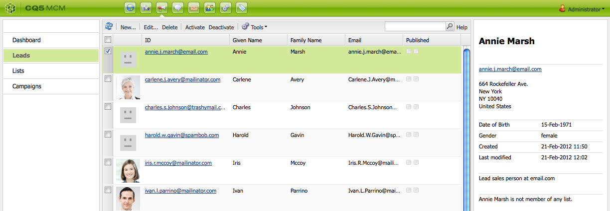

# 設定您的行銷活動{#setting-up-your-campaign}

設定新促銷活動包含下列（一般）步驟：

1. [建立品牌](#creating-a-new-brand) 來保留您的行銷活動。
1. 如果需要，您可以 [定義新品牌的屬性](#defining-the-properties-for-your-new-brand).
1. [建立促銷活動](#creating-a-new-campaign) 來保存體驗；例如預告頁面或電子報。
1. 如果需要，您可以 [定義新促銷活動的屬性](#defining-the-properties-for-your-new-campaign).

然後，根據您建立的體驗類型，您需要 [建立體驗](#creating-a-new-experience). 體驗的詳細資訊以及建立體驗後的動作取決於您要建立的體驗類型：

* 如果建立預告：

   1. [建立預告體驗](/help/sites-classic-ui-authoring/classic-personalization-campaigns.md#creatingateaserexperience).
   1. [將內容新增至您的預告](/help/sites-classic-ui-authoring/classic-personalization-campaigns.md#addingcontenttoyourteaser).
   1. [為您的Teaser建立接觸點](/help/sites-classic-ui-authoring/classic-personalization-campaigns.md#creatingatouchpointforyourteaser) （將預告新增至內容頁面）。

* 如果建立電子報：

   1. [建立電子報體驗](/help/sites-classic-ui-authoring/classic-personalization-campaigns.md#creatinganewsletterexperience).
   1. [新增內容至電子報。](/help/sites-classic-ui-authoring/classic-personalization-campaigns.md#addingcontenttonewsletters)
   1. [個人化電子報。](/help/sites-classic-ui-authoring/classic-personalization-campaigns.md#personalizingnewsletters)
   1. [建立引人入勝的電子報登陸頁面](/help/sites-classic-ui-authoring/classic-personalization-campaigns.md#settingupanewsletterlandingpage).
   1. [傳送電子報](/help/sites-classic-ui-authoring/classic-personalization-campaigns.md#sendingnewsletters) 訂閱者或銷售機會。

* 如果建立Adobe Target（舊稱Test&amp;Target）選件：

   1. [建立Adobe Target選件體驗](/help/sites-classic-ui-authoring/classic-personalization-campaigns.md#creatingatesttargetofferexperience).
   1. [整合Adobe Target](/help/sites-classic-ui-authoring/classic-personalization-campaigns.md#integratewithadobetesttarget)

>[!NOTE]
>
>請參閱 [區段](/help/sites-administering/campaign-segmentation.md) 以取得定義區段的詳細指示。

## 建立新品牌 {#creating-a-new-brand}

建立新品牌：

1. 開啟 **MCM** 選取 **行銷活動** 中。

1. 選擇 **新……** ，輸入 **標題** 和 **名稱** 用於新品牌的範本：

   

1. 按一下&#x200B;**建立**。您的新品牌將以MCM（帶預設表徵圖）顯示。

### 定義新品牌的屬性 {#defining-the-properties-for-your-new-brand}

1. 從 **行銷活動** 在左窗格中，在右窗格中選擇新品牌表徵圖，然後按一下 **屬性……**

   您可以輸入 **標題**, **說明** 和要用作表徵圖的影像。

   

1. 按一下 **確定** 儲存。

### 建立新促銷活動 {#creating-a-new-campaign}

若要建立新促銷活動：

1. 從 **行銷活動**，請在左窗格中選取您的新品牌，或按兩下右窗格中的圖示。

   將會顯示概述（如果品牌為新品牌，則為空白）。

1. 按一下 **新……** 和指定 **標題**, **名稱** 和範本，以用於新促銷活動。

   

1. 按一下&#x200B;**建立**。你的新促銷活動將以MCM顯示。

### 定義新促銷活動的屬性 {#defining-the-properties-for-your-new-campaign}

設定可控制行為的促銷活動屬性：

* **優先順序：** 此促銷活動相對於其他促銷活動的優先順序。 當多個促銷活動同時開啟時，優先順序最高的促銷活動會控制訪客體驗。
* **開啟和關閉時間：** 這些屬性可控制促銷活動控制訪客體驗的時段。 「準時」屬性會控制促銷活動開始控制體驗的時間。 當促銷活動停止控制體驗時，「關閉時間」屬性會加以控制。
* **影像：** 在AEM中代表促銷活動的影像。
* **Cloud Services:** 整合促銷活動的Cloud Service設定。 (請參閱 [與Adobe Marketing Cloud整合](/help/sites-administering/marketing-cloud.md).)

* **Adobe Target:** 設定與Adobe Target整合之促銷活動的屬性。 (請參閱 [與Adobe Target整合](/help/sites-administering/target.md).)

1. 從 **行銷活動**，選取您的品牌。 在右窗格中，選取您的促銷活動，然後按一下 **屬性**.

   您可以輸入各種屬性，包括 **標題**, **說明** 和 **Cloud Services** 你想要。

   

1. 按一下 **確定** 儲存。

### 建立新體驗 {#creating-a-new-experience}

建立新體驗的程式取決於體驗類型：

* [建立Teaser](/help/sites-classic-ui-authoring/classic-personalization-campaigns.md#creatingateaser)
* [建立電子報](/help/sites-classic-ui-authoring/classic-personalization-campaigns.md#creatinganewsletter)
* [建立Adobe Target選件](/help/sites-classic-ui-authoring/classic-personalization-campaigns.md#creatingatesttargetoffer)

>[!NOTE]
>
>和舊版一樣，您仍可以在 **網站** 主控台（以及舊版中建立的任何這類頁面仍完全受支援）。
>
>現在建議的做法是使用MCM來建立體驗。

### 設定您的新體驗 {#configuring-your-new-experience}

現在您已為體驗建立基本骨架，您需要根據體驗類型繼續執行下列動作：

* [Teaser](/help/sites-classic-ui-authoring/classic-personalization-campaigns.md#teasers):

   * [將宣傳預告頁面連結至訪客區段。](/help/sites-classic-ui-authoring/classic-personalization-campaigns.md#applyingasegmenttoyourteaser)
   * [為您的Teaser建立接觸點](/help/sites-classic-ui-authoring/classic-personalization-campaigns.md#creatingatouchpointforyourteaser) （將預告新增至內容頁面）。

* [Newsletter](/help/sites-classic-ui-authoring/classic-personalization-campaigns.md#newsletters):

   * [新增內容至電子報。](/help/sites-classic-ui-authoring/classic-personalization-campaigns.md#addingcontenttonewsletters)
   * [個人化電子報。](/help/sites-classic-ui-authoring/classic-personalization-campaigns.md#personalizingnewsletters)
   * [傳送電子報](/help/sites-classic-ui-authoring/classic-personalization-campaigns.md#sendingnewsletters) 訂閱者或銷售機會。
   * [建立引人入勝的電子報登陸頁面](/help/sites-classic-ui-authoring/classic-personalization-campaigns.md#settingupanewsletterlandingpage).

* [Adobe Target選件](/help/sites-classic-ui-authoring/classic-personalization-campaigns.md#testtargetoffers):

   * [整合Adobe Target](/help/sites-administering/target.md)

### 新增接觸點 {#adding-a-new-touchpoint}

如果您有現有體驗，可以直接從MCM的「日曆」檢視新增接觸點：

1. 選取行銷活動的日曆檢視。

1. 按一下 **新增接觸點……** 來開啟對話框。 指定您要新增的體驗：

   

1. 按一下 **確定** 儲存。

## 使用銷售機會 {#working-with-leads}

>[!NOTE]
>
>Adobe不打算進一步增強此功能（管理銷售機會）。
>建議為 [運用Adobe Campaign及與AEM的整合](/help/sites-administering/campaign.md).

在AEM MCM中，您可以手動輸入銷售線索或導入逗號分隔清單（例如郵件清單）來組織和添加銷售線索。 產生銷售機會的其他方法包括電子報註冊或社群註冊（如果已設定，這些可觸發填入銷售機會的工作流程）。

銷售機會通常會分類並放入清單中，這樣之後您就可以對整個清單執行動作，例如，將自訂電子郵件傳送至特定清單。

在控制面板中，按一下 **銷售機會** 從左窗格。 您也可以從 **清單** 框。

>[!NOTE]
>
>若要新增或修改使用者的變數，請開啟點按流雲端(Ctrl+Alt+c)、載入設定檔，然後按一下 **編輯**.

### 建立新銷售機會 {#creating-new-leads}

建立新銷售機會後，請務必 [啟用](#activating-or-deactivating-leads) 以便您追蹤其在發佈例項上的活動，並個人化其體驗。

要手動建立新銷售線索，請執行以下操作：

1. 在AEM中導覽至MCM。 在控制面板中，按一下 **銷售機會**.
1. 按一下 **新增**. 此 **新建** 窗口。

   

1. 視情況在欄位中輸入資訊。 按一下 **地址** 標籤。

   

1. 視情況輸入地址資訊。 按一下 **儲存** 來拯救銷售機會。 如果需要添加其他銷售機會，請按一下 **儲存並新增**.

   新銷售線索將出現在「銷售線索」窗格中。 按一下條目後，所有輸入的資訊都會顯示在右窗格中。 建立銷售機會後，您可將其新增至清單。

   

### 激活或停用銷售線索 {#activating-or-deactivating-leads}

啟用銷售機會可協助您追蹤其發佈執行個體上的活動，並讓您個人化其體驗。 當您不想再追蹤其活動時，可以停用這些活動。

要激活或取消激活的銷售線索，請執行以下操作：

1. 在AEM中，導覽至MCM並按一下 **銷售機會**.

1. 選擇要激活或停用的銷售線索，然後按一下 **啟動** 或 **停用**.

   

   與AEM頁面一樣， **已發佈** 欄。

   

### 導入新銷售機會 {#importing-new-leads}

導入新銷售機會時，您可以自動將它們添加到現有清單或建立新清單以包括這些銷售機會。

要從逗號分隔清單導入銷售線索：

1. 在AEM中，導覽至MCM並按一下 **銷售機會**.

   >[!NOTE]
   >
   >或者，您也可以執行下列操作之一來導入銷售線索：
   >
   >* 在控制面板中，按一下 **導入銷售線索** 在 **清單** 窗格
   >* 按一下 **清單** 和 **工具** 菜單，選擇 **導入銷售線索**.

1. 在 **工具** 菜單，選擇 **匯入** **銷售機會**.

1. 輸入資訊，如範例資料中所述。 可匯入下列欄位：email,familyName,givenName,gender,aboutMe,city,country,phoneNumber,postalCode,region,streetAddress

   >[!NOTE]
   >
   >CSV清單中的第一列是預先定義的標籤，必須與範例中的內容完全相同：
   >
   >
   >`email,givenName,familyName`  — 如果寫為 `givenname`例如，系統無法辨識。

   

1. 按一下&#x200B;**下一步**。在此，您可以預覽銷售機會，以確保銷售機會準確無誤。

   

1. 按一下&#x200B;**下一步**。選擇要銷售機會所屬的清單。 如果您不希望它們屬於清單，請刪除欄位中的資訊。 依預設，AEM會建立包含日期和時間的清單名稱。 按一下 **匯入**.

   

   新銷售線索將出現在「銷售線索」窗格中。 如果按一下條目，所有輸入的資訊都會顯示在右窗格中。 建立銷售機會後，您可將其新增至清單。

### 將銷售機會添加到清單 {#adding-leads-to-lists}

要將銷售機會添加到預先存在的清單：

1. 在MCM中，按一下 **銷售機會** 查看所有可用銷售線索。

1. 通過選中銷售線索旁的複選框，選擇要添加到清單的銷售線索。 您可以新增任意數量的銷售機會。

   

1. 在 **工具** 菜單，選擇 **添加到清單…….** 此 **添加到清單** 窗口。

   

1. 選擇要向哪個清單添加銷售機會，然後按一下 **確定**. 銷售機會會新增至適當的清單。

### 查看銷售機會資訊 {#viewing-lead-information}

要查看銷售機會資訊，請在MCM中按一下銷售機會旁邊的複選框，並開啟一個右窗格，其中顯示銷售機會的所有資訊，包括清單從屬關係。

### 修改現有銷售機會 {#modifying-existing-leads}

要修改現有銷售線索資訊，請執行以下操作：

1. 在MCM中，按一下 **銷售機會**. 從銷售機會清單中，選擇要編輯的銷售機會旁邊的複選框。 所有銷售機會資訊都顯示在右窗格中。

   

   >[!NOTE]
   >
   >您一次只能編輯單一銷售機會。 如果您需要修改屬於同一清單一部分的銷售機會，則可以修改該清單。

1. 按一下 **編輯**. 此 **編輯銷售機會** 窗口。

   

1. 視需要進行編輯，然後按一下 **儲存** 來儲存變更。

   >[!NOTE]
   >
   >若要變更銷售機會頭像，請前往使用者設定檔。 您可以按CTRL+ALT+c，按一下 **載入**，然後選取設定檔。

### 刪除現有銷售機會 {#deleting-existing-leads}

要刪除MCM中的現有銷售線索，請選中銷售線索旁的複選框，然後按一下 **刪除**. 銷售機會將從銷售機會清單和所有關聯清單中刪除。

>[!NOTE]
>
>刪除之前，AEM會確認您要刪除現有銷售機會。 刪除後，將無法擷取。

## 使用清單 {#working-with-lists}

>[!NOTE]
>
>Adobe不打算進一步增強此功能（管理清單）。
>建議為 [運用Adobe Campaign及與AEM的整合](/help/sites-administering/campaign.md).

清單可讓您將銷售機會組織成群組。 透過清單，您可以將行銷活動鎖定在特定的人員群組，例如，您可以將目標式電子報傳送至清單。 清單可在MCM中顯示，在控制面板中或按一下 **清單**. 兩者都會提供清單的名稱和成員數。

如果您按一下 **清單**，您也可以檢視清單是否為其他清單的成員，並查看說明。

### 建立新清單 {#creating-new-lists}

要建立新清單（組），請執行以下操作：

1. 在MCM控制面板中，按一下 **新清單……** 或 **清單**，按一下 **新增** ...將開啟「建立清單」窗口。

   

1. 輸入名稱（必要），並視需要輸入說明並按一下 **儲存**. 清單會顯示在 **清單** 框。

   

### 修改現有清單 {#modifying-existing-lists}

要修改現有清單，請執行以下操作：

1. 在MCM中，按一下 **清單**.

1. 從清單中，選取您要編輯之清單旁的核取方塊，然後按一下 **編輯**. 此 **編輯清單** 窗口。

   

   >[!NOTE]
   >
   >一次只能編輯一個清單。

1. 視需要進行編輯，然後按一下 **儲存** 來儲存變更。

### 刪除現有清單 {#deleting-existing-lists}

要刪除現有清單，請在MCM中選中清單旁的複選框，然後按一下 **刪除**. 清單已移除。 不刪除與清單關聯的銷售機會，只刪除與清單關聯的銷售機會。

>[!NOTE]
>
>刪除之前，AEM會確認您要刪除現有清單。 刪除後，將無法擷取。

### 合併清單 {#merging-lists}

您可以將現有清單與其他清單合併。 執行此操作時，您合併的清單將成為另一個清單的成員。 它仍作為獨立實體存在，不應刪除。

如果在兩個不同位置有同一個會議，並且希望將它們合併為所有會議的與會者清單，則可以合併清單。

要合併現有清單：

1. 在MCM中，按一下 **清單**.

1. 選擇要與其合併的清單，方法是選擇該清單旁的複選框。

1. 在 **工具** 菜單，選擇 **合併清單**.

   >[!NOTE]
   >
   >一次只能合併一個清單。

1. 在 **合併清單** ，選擇要合併的清單，然後按一下 **確定**.

   

   合併的清單應增加一個成員。 若要查看已合併清單，請選取您合併的清單，並在 **工具** 菜單，選擇 **顯示銷售機會**.

1. 重複此步驟，直到您合併了所有想要的清單。

   

>[!NOTE]
>
>從合併的清單的成員資格中移除與從清單移除銷售機會相同。 開啟 **清單** 頁簽，選擇包含合併清單的清單，並按一下清單旁的紅色圓圈來移除成員。

### 查看清單中的銷售機會 {#viewing-leads-in-lists}

您隨時可以通過瀏覽或搜索成員來查看屬於特定清單的銷售線索。

要查看屬於清單的銷售線索，請執行以下操作：

1. 在MCM中，按一下 **清單**.

1. 選擇要查看其成員的清單旁的複選框。

1. 在 **工具** 菜單，選擇 **顯示銷售機會**. AEM顯示屬於該清單成員的銷售機會。 您可以瀏覽清單或搜索成員。

   >[!NOTE]
   >
   >此外，您可以通過選擇銷售線索，然後按一下 **移除成員資格**.

   

1. 按一下 **關閉** 返回反水雷。
