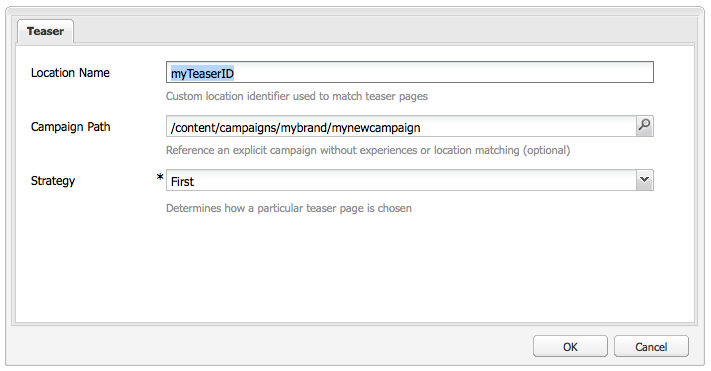

# 茶匙和策略{#teasers-and-strategies}

行銷活動通常使用茶匙作為機制，吸引特定訪客群體進入關注其興趣的內容。 為特定促銷活動定義一或多個茶匙。

>[!NOTE]
>
>AEM 6.2中已棄用Teaser元件。請使用 [目標元件](/help/sites-authoring/content-targeting-touch.md) 。

* **品牌頁面** 儲存在網站的「促銷活動」區段中。 品牌包含個別的促銷活動。
* **行銷活動頁面** 儲存在網站的「促銷活動」區段中。 每個促銷活動都有個別頁面，預告定義會保留在其中。 容器（或概觀）頁面也包含與個別宣傳預告頁面相關的特定資訊和統計資料。

AEM內的茶匙由幾部分組成：

* **預告頁面** 會儲存在適當的促銷活動頁面下，並保留每個特定促銷活動可用的預告段落定義。 顯示預告段落時會使用這些定義；包括內容變異，用於選取變異和提升因子的區段。
* 此 **Teaser元件** 現成可用，可讓您在內容頁面中建立特定預告段落的例項。 您可以從sidekick拖曳預告元件，然後指定您的預告定義以建立您自己的預告段落。 **注意：** AEM 6.2中已棄用Teaser元件。請使用 [目標元件](/help/sites-authoring/content-targeting-touch.md) 。
* **預告段落** 是內容頁面中您預告的實際例項。 這吸引了一部分遊客到關注他們興趣的內容。
* 將促銷活動內容集中在特定訪客群體上的頁面。 通常宣傳段落會將訪客導向至這類頁面。

## 策略 {#strategies}

將宣傳預告段落新增至頁面時，您需要定義 **策略**.

這是因為數個茶匙可供選取，因為其指派的區段都能成功解析。 此 **策略** 然後指定用於選取顯示的預告的額外條件：

* **點按流分數**，是根據訪客用戶端內容中保留的標籤和相關標籤點擊（顯示訪客點按包含個別標籤之頁面的頻率）。 會比較預告頁面上定義之標籤的點擊率。
* **隨機**，用於「隨機」選取；使用為頁面產生的隨機因素，這可以透過 [用戶上下文](/help/sites-administering/client-context.md).
* **第一個** 在解析的區段清單中。 順序是促銷活動容器頁面內的茶匙的順序。

此 [提升因子](/help/sites-administering/campaign-segmentation.md#boost-factor) 區段的區段也會影響選取。 這是新增至區段定義的加權因數，以增加/減少其被選取的相對可能性。

各種選擇標準的流程和相互關係最好以範例來說明（此方法也可用來確保您的茶具將觸及所需對象）。

如果已建立下列區段並指派其各自的提升系數：

| 區段 | 提升因子 |
|---|---|
| S1 | 0 |
| S2 | 0 |
| S3 | 10 |
| S4 | 30 |
| S5 | 0 |
| S6 | 100 |

我們使用下列宣傳預告定義：

<table>
 <tbody>
  <tr>
   <td>行銷活動</td>
   <td>Teaser</td>
   <td>指派的區段</td>
   <td>指派的標籤 </td>
  </tr>
  <tr>
   <td>C1</td>
   <td>T1</td>
   <td>S1、S2</td>
   <td>商業、行銷</td>
  </tr>
  <tr>
   <td>C1</td>
   <td>T2 </td>
   <td>S1</td>
   <td>  </td>
  </tr>
  <tr>
   <td>C1 </td>
   <td>T3</td>
   <td>S3、S4</td>
   <td>  </td>
  </tr>
  <tr>
   <td>C1 </td>
   <td>T4</td>
   <td>S2、S5</td>
   <td>  </td>
  </tr>
  <tr>
   <td>C1 </td>
   <td>T5</td>
   <td>S1、S2、S6</td>
   <td>行銷</td>
  </tr>
  <tr>
   <td>C1 </td>
   <td>T6</td>
   <td>S6</td>
   <td>商務  </td>
  </tr>
 </tbody>
</table>

如果我們將此套用至下列位置的訪客：

* **S1**, **S2** 和 **S6** 已成功解析

* 標籤 **行銷** 有3次點擊
* 標籤 **業務** 有6次點擊

我們可以看到結果：

* 符合成功 — 是否能為目前的訪客成功解析指派給預告的任何區段？
* 提升因子 — 所有適用區段的最高提升因子
* 點按資料流分數 — 所有適用標籤點擊的累積總計

策略前計算：

<table>
 <tbody>
  <tr>
   <td>行銷活動</td>
   <td>Teaser</td>
   <td>指派的區段</td>
   <td>標記 </td>
   <td>成功匹配？</td>
   <td>產生的提升因子</td>
   <td>產生的點按流分數 </td>
  </tr>
  <tr>
   <td>C1</td>
   <td>T1</td>
   <td>S1、S2</td>
   <td>商業、行銷</td>
   <td>是</td>
   <td>0</td>
   <td>9</td>
  </tr>
  <tr>
   <td>C1</td>
   <td>T2 </td>
   <td>S1</td>
   <td>  </td>
   <td>是</td>
   <td>0</td>
   <td>  </td>
  </tr>
  <tr>
   <td>C1 </td>
   <td>T3</td>
   <td>S3、S4</td>
   <td>  </td>
   <td>否</td>
   <td>  </td>
   <td>  </td>
  </tr>
  <tr>
   <td>C1 </td>
   <td>T4</td>
   <td>S2、S5</td>
   <td>  </td>
   <td>是  </td>
   <td>0  </td>
   <td>  </td>
  </tr>
  <tr>
   <td>C1 </td>
   <td>T5</td>
   <td>S1、S2、S6</td>
   <td>行銷</td>
   <td>是</td>
   <td>100</td>
   <td>3</td>
  </tr>
  <tr>
   <td>C1 </td>
   <td>T6</td>
   <td>S6</td>
   <td>商務</td>
   <td>是</td>
   <td>100</td>
   <td>6 </td>
  </tr>
 </tbody>
</table>

這些值可用來決定訪客將看到的預告，具體取決於 **策略** 適用於預告段落：

<table>
 <tbody>
  <tr>
   <td>策略</td>
   <td>產生的預告</td>
   <td>評論</td>
  </tr>
  <tr>
   <td>第一個</td>
   <td>T5</td>
   <td>只有T5和T6被視為它們的區段，所有區段都可解決 <i>和</i> 它們的提振系數最高。 返回的清單按T5、T6的順序排列；以便選擇並顯示T5。</td>
  </tr>
  <tr>
   <td>隨機</td>
   <td>T5或T6</td>
   <td>兩個茶匙都有各自解決的區段，且提升系數相同。 因此，兩茶匙以相同比例顯示。</td>
  </tr>
  <tr>
   <td>點按流分數</td>
   <td>T6</td>
   <td>
T1、T4、T5和T6的區段都會針對訪客解析。 T5和T6的升高因子則排除T1和T4。 最後，T6的點按資料流分數越高，系統便會選取此分數。
 </td>
  </tr>
 </tbody>
</table>

>[!NOTE]
>
>在上述解析度技術之後，如果有多個預告可供選擇，則內部選擇（隨機）將選擇一個預告供顯示。
>
>例如，如果策略是「點按流分數」，而T5的點按流分數與T6相同（即6而非3），則會使用內部選取（隨機）來選取這兩者之一。

「預告頁面/段落」可用來將特定訪客區段導向著重於其興趣的內容。 它們可以呈現一系列選項供訪客選擇，或僅顯示一個以特定訪客區段為基礎的預告段落；例如，顯示的預告段落可能取決於訪客的年齡。

預告頁面通常是會持續特定一段時間的臨時動作，直到被下一個預告頁面取代為止。

建立您的品牌和行銷活動後，您可以建立並設定您的預告體驗。

### 為您的Teaser建立接觸點 {#creating-a-touchpoint-for-your-teaser}

>[!NOTE]
>
>AEM 6.2中已棄用Teaser元件。請使用 [目標元件](/help/sites-authoring/content-targeting-touch.md) 。

1. 導覽至內容頁面，您想要放置將導向促銷活動頁面的預告段落。
1. 新增 **Teaser** 元件(在 **個人化** section of sidekick)。 首次建立時，它會顯示促銷活動路徑尚未設定：

   

1. 編輯宣傳預告元件以新增：

   * **促銷活動路徑**
包含個別宣傳預告頁面的促銷活動頁面路徑；區段會確切決定要顯示哪個預告。

   * **[策略](/help/sites-classic-ui-authoring/classic-personalization-campaigns.md#strategies)**
成功解析多個區段時用於選取的方法。
   

1. 按一下 **確定** 儲存。 根據您在預告上設定的區段，以及您目前登入的使用者設定檔，將會顯示適當的內容：

   

1. 將滑鼠移至預告段落上以顯示問號圖示（元件的右下角）。 按一下這個按鈕即可檢視套用的區段，以及這些區段目前是否已解析。

   

### Teaser概述 {#teaser-overview}

除了MCM中的促銷活動檢視外，促銷活動頁面也提供與其連接的茶匙的資訊：

1. 從 **網站** 主控台，開啟促銷活動頁面；例如：

   `https://localhost:4502/content/campaigns/geometrixx-outdoors/storefront/summer.html`

   這會顯示預告定義和檢視統計資料的概述：

   
