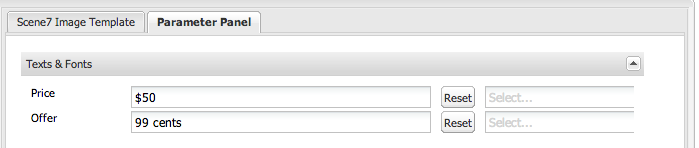

# 將Dynamic Media Classic(Scene7)功能新增至您的頁面{#adding-scene-features-to-your-page}

[Adobe Dynamic Media Classic(Scene7)](https://experienceleague.adobe.com/docs/dynamic-media-classic/using/home.html) 是托管解決方案，可管理、增強、發佈和傳遞多媒體資產至網路、行動裝置、電子郵件和網際網路連線的顯示器及列印。

您可以在各種檢視器中檢視發佈於Dynamic Media Classic(Scene7)的Experience Manager資產：

* 縮放
* 飛出
* 影片
* 影像範本
* 影像

您可以直接從Experience Manager發佈數位資產至Dynamic Media Classic(Scene7)，也可以從Dynamic Media Classic(Scene7)發佈數位資產至Experience Manager。

本檔案說明如何將數位資產從Experience Manager發佈至Dynamic Media Classic(Scene7)，反之則說明。 檢視器也會詳細說明。 如需為Dynamic Media Classic(Scene7)設定Experience Manager的詳細資訊，請參閱 [整合Dynamic Media Classic(Scene7)與Experience Manager](/help/sites-administering/scene7.md).

另請參閱 [新增影像地圖](/help/assets/image-maps.md).

如需搭配Experience Manager使用視訊元件的詳細資訊，請參閱下列內容：

* [影片](/help/sites-classic-ui-authoring/manage-assets-classic-s7-video.md)

>[!NOTE]
>
>如果Dynamic Media Classic(Scene7)資產未正確顯示，請確定Dynamic Media為 [停用](/help/assets/config-dynamic.md#disabling-dynamic-media) 然後重新整理頁面。

## 從Assets手動發佈至Dynamic Media Classic(Scene7) {#manually-publishing-to-scene-from-assets}

您可以從傳統UI的Assets主控台或直接從資產將數位資產發佈至Dynamic Media Classic(Scene7)。

>[!NOTE]
>
>Experience Manager會以非同步方式發佈至Dynamic Media Classic(Scene7)。 選取 **[!UICONTROL 發佈]**，您的資產可能需要數秒的時間才會發佈至Dynamic Media Classic(Scene7)。

### 從Assets主控台發佈 {#publishing-from-the-assets-console}

如果資產位於Dynamic Media Classic(Scene7)目標資料夾中，您可以從Assets控制台發佈至Dynamic Media Classic(Scene7)。

1. 在Experience Manager傳統UI中，選取 **[!UICONTROL 數位資產]** 存取數位資產管理器。

1. 從您要發佈至Dynamic Media Classic(Scene7)的目標資料夾中選取資產（或資產）或資料夾，然後按一下滑鼠右鍵並選取 **[!UICONTROL 發佈至Dynamic Media Classic(Scene7)]**. 或者，您也可以選取 **[!UICONTROL 發佈至Dynamic Media Classic(Scene7)]** 從 **[!UICONTROL 工具]** 功能表。

   

1. 前往Dynamic Media Classic(Scene7)，確認資產可供使用。

   >[!NOTE]
   >
   >如果資產不在Dynamic Media Classic(Scene7)同步資料夾中， **[!UICONTROL 發佈至Dynamic Media Classic(Scene7)]** 會顯示，但會停用。

### 從資產發佈 {#publishing-from-an-asset}

只要資產位於同步的Dynamic Media Classic(Scene7)資料夾內，您就可以手動發佈資產。

>[!NOTE]
>
>如果資產不在Dynamic Media Classic(Scene7)同步資料夾中，則連結會 **[!UICONTROL 發佈至Dynamic Media Classic(Scene7)]** 不會顯示。

若要直接從數位資產發佈至Dynamic Media Classic(Scene7):

1. 在Experience Manager中，選取 **[!UICONTROL 數位資產]** 存取數位資產管理器。

1. 按兩下以開啟資產。

1. 在資產詳細資訊窗格中，選取 **[!UICONTROL 發佈至Dynamic Media Classic(Scene7)]**.

   

1. 連結變更為 **[!UICONTROL 正在發佈……]** 然後 **[!UICONTROL 已發佈]**. 前往Dynamic Media Classic(Scene7)，確認資產可用。

   >[!NOTE]
   >
   >如果資產未正確發佈至Dynamic Media Classic(Scene7)，連結會變更為 **[!UICONTROL 發佈失敗]**. 如果資產已發佈至Dynamic Media Classic(Scene7)，連結會顯示 **[!UICONTROL 重新發佈至Dynamic Media Classic(Scene7)]**. 重新發佈可讓您變更Experience Manager中的資產並重新發佈。

### 從CQ目標資料夾外部發佈資產 {#publishing-assets-from-outside-the-cq-target-folder}

Adobe建議您只從Dynamic Media Classic(Scene7)目標資料夾內的資產發佈資產至Dynamic Media Classic(Scene7)。 不過，如果您必須從目標資料夾外部的資料夾上傳資產，您仍可將資產上傳至Dynamic Media Classic(Scene7)上的隨選資料夾，以執行此操作。 首先，針對您希望資產顯示的頁面設定雲端設定。 然後，將Dynamic Media Classic(Scene7)元件新增至頁面，並將資產拖放至元件上。 為該頁面設定頁面屬性後， **[!UICONTROL 發佈至Dynamic Media Classic(Scene7)]** 連結顯示，當選取時，會觸發上傳至Dynamic Media Classic(Scene7)。

>[!NOTE]
>
>隨需資料夾中的資產不會顯示在Dynamic Media Classic(Scene7)內容瀏覽器中。

**若要從CQ目標資料夾外部發佈資產：**

1. 在傳統UI的Experience Manager中，選取 **[!UICONTROL 網站]** 並導覽至您要新增尚未發佈至Dynamic Media Classic(Scene7)的數位資產的網頁。 （套用一般頁面繼承規則）。

1. 在sidekick中，選取 **[!UICONTROL 頁面]** 圖示並選取 **[!UICONTROL 頁面屬性]**.

1. 選擇 **[!UICONTROL Cloud Services]**.
1. 選擇 **[!UICONTROL 新增服務]**.
1. 選擇 **[!UICONTROL Dynamic Media Classic(Scene7)]**.
1. 在 **[!UICONTROL Adobe Dynamic Media Classic(Scene7)]** 下拉式清單，選取所需的設定，然後選取 **[!UICONTROL 確定]**.

   

1. 在網頁上，將Dynamic Media Classic(Scene7)元件新增至頁面上的所需位置。
1. 從內容尋找器，將數位資產拖曳至元件。 您會看到連結 **[!UICONTROL 檢查Dynamic Media Classic(Scene7)發佈狀態]**.

   >[!NOTE]
   >
   >如果數位資產位於CQ目標資料夾中，則不會連結至 **[!UICONTROL 檢查Dynamic Media Classic(Scene7)發佈狀態]** 框。 資產會放置在元件中。

   

1. 選擇 **[!UICONTROL 檢查Dynamic Media Classic(Scene7)發佈狀態]**. 如果未發佈資產，Experience Manager會將資產發佈至Dynamic Media Classic(Scene7)。 上傳資產後，即可在隨選資料夾中找到資產。 依預設，隨需資料夾位於 **[!UICONTROL name_of_the_company/CQ5_adhoc]**. 您可以 [視需要設定隨選資料夾](#configuringtheadhocfolder).

   >[!NOTE]
   >
   >如果資產不在Dynamic Media Classic(Scene7)同步資料夾中，且目前頁面沒有相關聯的Dynamic Media Classic(Scene7)雲端設定，上傳會失敗。

## Dynamic Media Classic(Scene7)元件 {#scene-components}

下列Dynamic Media Classic(Scene7)元件可在Experience Manager中使用：

* 縮放
* 彈出（縮放）
* 影像範本
* 影像
* 影片

>[!NOTE]
>
>預設情況下，這些元件不可用，在使用之前必須在「設計」模式下選取這些元件。

在「設計」模式中使用元件後，您可以像其他任何Experience Manager元件一樣將元件新增至頁面。 如果資產位於同步的資料夾、頁面或Dynamic Media Classic(Scene7)雲端設定，則尚未發佈至Dynamic Media Classic(Scene7)的資產會發佈至Dynamic Media Classic(Scene7)。

>[!NOTE]
>
>如果您要建立和開發自訂S7檢視器，並使用「內容尋找器」，您必須明確新增 `allowfullscreen` 參數。

### Flash 檢視器生命週期結束注意事項 {#flash-viewers-end-of-life-notice}

自2017年1月31日起，Adobe Dynamic Media Classic(Scene7)正式停止支援Flash檢視器平台。

### 新增Dynamic Media Classic(Scene7)元件至頁面 {#adding-a-scene-component-to-a-page}

將Dynamic Media Classic(Scene7)元件新增至頁面，與將元件新增至任何頁面相同。 Dynamic Media Classic(Scene7)元件在以下章節中詳細說明。

若要將Dynamic Media Classic(Scene7)元件/檢視器新增至傳統UI中的頁面：

1. 在Experience Manager中，開啟您要新增Dynamic Media Classic(Scene7)元件的頁面。

1. 如果沒有可用的Dynamic Media Classic(Scene7)元件，請選取sidekick中的尺標以輸入 **設計** 模式，選擇 **[!UICONTROL 編輯]** parsys，然後選取所有 **[!UICONTROL Dynamic Media Classic(Scene7)]** 元件以供使用。

1. 返回 **編輯** 模式，方法是選取sidekick中的鉛筆。

1. 從 **[!UICONTROL Dynamic Media Classic(Scene7)]** 在sidekick中群組至所需位置中的頁面。

1. 選擇***[!UICONTROL 編輯]** 以便開啟元件。

1. 視需要編輯元件並選取 **[!UICONTROL 確定]** 以儲存變更。

### 將互動式檢視體驗新增至回應式網站 {#adding-interactive-viewing-experiences-to-a-responsive-website}

資產的回應式設計表示資產會根據其顯示位置進行調整。 透過回應式設計，可在多部裝置上有效顯示相同的資產。

若要在傳統UI中將互動式檢視體驗新增至回應式網站：

1. 登入Experience Manager，並確定您已 [已設定Adobe Dynamic Media Classic(Scene7)Cloud Services](/help/sites-administering/scene7.md#configuring-scene-integration) 以及Dynamic Media Classic(Scene7)元件可供使用。

   >[!NOTE]
   >
   >如果Dynamic Media Classic(Scene7)WCM元件不可用，請務必透過設計模式啟用。

1. 在已啟用Dynamic Media Classic(Scene7)元件的網站中，拖曳 **[!UICONTROL 影像]** 檢視器。
1. 編輯元件並調整 **[!UICONTROL Dynamic Media Classic(Scene7)設定]** 標籤。

   

1. 確認檢視器正在回應性地調整大小，且所有互動都已針對桌上型電腦、平板電腦和行動裝置最佳化。

### 所有Dynamic Media Classic(Scene7)元件的共同設定 {#settings-common-to-all-scene-components}

雖然設定選項有所不同，但下列是所有Dynamic Media Classic(Scene7)元件的常見項目：

* **檔案參考** — 瀏覽到要引用的檔案。 檔案參考會顯示資產URL，而非完整的Dynamic Media Classic(Scene7)URL，包括URL命令和參數。 您無法在此欄位中新增Dynamic Media Classic(Scene7)URL命令和參數。 而是必須透過元件中的對應功能來新增。
* **寬度**  — 可讓您設定寬度。
* **高度**  — 可讓您設定高度。

您可以開啟（按兩下）Dynamic Media Classic(Scene7)元件來設定這些設定選項，例如當您開啟 **縮放** 元件：

### 縮放 {#zoom}

當您按下+按鈕時，「HTML5縮放」元件會顯示較大的影像。

資產底部有縮放工具。 選擇 **[!UICONTROL +]** 放大。 選擇 **[!UICONTROL -]** 減少。 選取 **[!UICONTROL x]** 或者，重置縮放箭頭將影像恢復為導入時的原始大小。 選取對角線箭頭，以使其成為全螢幕。 選擇 **[!UICONTROL 編輯]** 以便設定元件。 使用此元件，您可以設定 [所有Dynamic Media Classic(Scene7)元件的共同設定](#settings-common-to-all-scene-components).

### 飛出 {#flyout}

在「HTML5彈出」元件中，資產會顯示為分割畫面；將資產保留在指定大小；顯示縮放部分的右側。 選擇 **[!UICONTROL 編輯]** 以便設定元件。 使用此元件，您可以設定 [所有Dynamic Media Classic(Scene7)元件的共同設定](/help/sites-administering/scene7.md#settingscommontoallscene7components).

>[!NOTE]
>
>如果您的彈出元件使用自訂大小，則會使用該自訂大小，並停用元件的回應式設定。
>
>如果您的彈出元件使用預設大小（如「設計」視圖中設定），則使用預設大小。 元件會延伸以因應頁面版面大小，並啟用元件的回應式設定。 但請注意，元件的回應式設定有其限制。 當您使用具有回應式設定的彈出元件時，不應將其用於完整頁面延伸。 否則，飛出可能會延伸到頁面的右邊。

### 影像 {#image}

Dynamic Media Classic(Scene7)影像元件可讓您將Dynamic Media Classic(Scene7)功能新增至影像，例如Dynamic Media Classic(Scene7)修飾元、影像或檢視器預設集，以及銳利化。 Dynamic Media Classic(Scene7)影像元件類似於Experience Manager中具有特殊Dynamic Media Classic(Scene7)功能的其他影像元件。 在此範例中，影像具有Dynamic Media Classic(Scene7)URL修飾元， `&op_invert=1` 已套用。

**標題、替代文字**  — 在「高級」頁簽中，為影像添加標題，並為那些關閉圖形的用戶添加替代文本。

**URL，在中開啟**  — 您可以從設定資產，以開啟連結。 設定URL，然後在「開啟」中（在中）指出您要在相同視窗還是新視窗中開啟它。

**檢視器預設集**  — 從下拉式選單中選取現有的檢視器預設集。 如果您要尋找的檢視器預設集未顯示，您必須使其顯示。 請參閱管理檢視器預設集。 如果您使用影像預設集，則無法選取檢視器預設集，反之則無法選取。

**Dynamic Media Classic(Scene7)設定**  — 選取您要用來從SPS擷取作用中影像預設集的Dynamic Media Classic(Scene7)設定。

**影像預設集**  — 從下拉式選單中選取現有的影像預設集。 如果您要尋找的影像預設集未顯示，則必須使其可見。 請參閱管理影像預設集。 如果您使用影像預設集，則無法選取檢視器預設集，反之則無法選取。

**輸出格式**  — 選擇影像的輸出格式，例如jpeg。 視您選取的輸出格式而定，您可能有其他設定選項。 請參閱影像預設集最佳作法。

**銳利化**  — 選擇要如何銳化影像。 影像預設集最佳實務和銳利化最佳實務中會詳細說明銳利化。

**URL修飾元**  — 您可以提供其他S7影像命令來更改影像效果。 這些命令在「影像預設集」和「命令」參考中描述。

**斷點**  — 如果網站回應式，您要調整中斷點。 斷點必須用逗號(,)分隔。

### 影像範本 {#image-template}

Dynamic Media Classic(Scene7)影像範本是已匯入至Dynamic Media Classic(Scene7)的分層Photoshop內容，其中內容和屬性會因變數而參數化。 此 **[!UICONTROL 影像範本]** 元件可讓您以動態方式匯入影像並變更Experience Manager中的文字。 此外，您可以設定 **[!UICONTROL 影像範本]** 元件來使用用戶端內容的值，讓每個使用者以個人化的方式體驗影像。

選擇 **[!UICONTROL 編輯]**  — 設定元件。 您可以設定 [所有Dynamic Media Classic(Scene7)元件的共同設定](/help/sites-administering/scene7.md#settingscommontoallscene7components) 以及本節所述的其他設定。

**檔案參考、寬度、高度**  — 請參閱 [所有Dynamic Media Classic(Scene7)元件的共同設定](/help/sites-administering/scene7.md#settingscommontoallscene7components).

>[!NOTE]
>
>Dynamic Media Classic(Scene7)URL命令和參數無法直接新增至檔案參考URL。 它們只能在 **[!UICONTROL 參數]** 中。

**標題、替代文字**  — 在Dynamic Media Classic(Scene7)「影像範本」索引標籤中，為影像新增標題，並為關閉圖形的使用者新增替代文字。

**URL，在中開啟**  — 您可以從設定資產，以開啟連結。 設定URL，然後在「開啟」中（在中）指出您要在相同視窗還是新視窗中開啟它。

**參數面板**  — 匯入影像時，參數會預先填入影像的資訊。 如果沒有可動態變更的內容，此視窗為空。

#### 動態變更文字 {#changing-text-dynamically}

要動態更改文本，請在欄位中輸入新文本並選擇 **[!UICONTROL 確定]**. 在此範例中， **價格** 現在是50美元，運費是99美分。

影像中的文字會變更。 您可以選取「 」，將文字重設回原始值 **[!UICONTROL 重設]** 欄位旁邊。

#### 更改文本以反映客戶端上下文值的值 {#changing-text-to-reflect-the-value-of-a-client-context-value}

要將欄位連結到客戶端上下文值，請選擇 **[!UICONTROL 選擇]** 要開啟「客戶端 — 上下文」菜單，請選擇「客戶端上下文」，然後選擇 **[!UICONTROL 確定]**. 在此示例中，名稱會根據將名稱與配置檔案中的格式化名稱連結而改變。

文字會反映目前登入使用者的名稱。 您可以選取「 」，將文字重設回原始值 **[!UICONTROL 重設]** 欄位旁邊。

#### 將Dynamic Media Classic(Scene7)影像範本設為連結 {#making-the-scene-image-template-a-link}

您可以讓Dynamic Media Classic(Scene7)影像範本元件成為可點按的連結。

1. 在含有Dynamic Media Classic(Scene7)影像範本元件的頁面上，選取 **[!UICONTROL 編輯]**.
1. 在 **[!UICONTROL URL]** 欄位中，輸入使用者在點按影像時前往的URL。 在 **[!UICONTROL 在中開啟]** 欄位中，選擇是要開啟目標（新窗口還是同一窗口）。

   

1. 選擇 **[!UICONTROL 確定]**.

### 視訊元件 {#video-component}

Dynamic Media Classic(Scene7) **[!UICONTROL 影片]** 元件(可從sidekick的Dynamic Media Classic(Scene7)區段取得)使用裝置和頻寬偵測，將正確的視訊提供給每個畫面。 此元件為HTML5視訊播放器；是可跨頻道使用的單一檢視器。

它可用於最適化視訊集、單一MP4視訊或單一F4V視訊。

請參閱 [影片](/help/sites-classic-ui-authoring/manage-assets-classic-s7-video.md) 如需視訊如何與Dynamic Media Classic(Scene7)整合搭配運作的詳細資訊。 此外，請參閱 [the **Dynamic Media Classic(Scene7)影片** 元件與基礎 **影片** 元件](/help/sites-classic-ui-authoring/manage-assets-classic-s7-video.md).

### 視訊元件的已知限制 {#known-limitations-for-the-video-component}

AdobeDAM和WCM會顯示是否上傳了主要來源視訊。 它們不會顯示這些代理資產：

* Dynamic Media Classic(Scene7)編碼轉譯
* Dynamic Media Classic(Scene7)最適化視訊集

搭配Dynamic Media Classic(Scene7)視訊元件使用最適化視訊集時，必須調整元件大小以符合視訊的尺寸。

## Dynamic Media Classic(Scene7)內容瀏覽器 {#scene-content-browser}

Dynamic Media Classic(Scene7)內容瀏覽器可讓您直接在Experience Manager中檢視Dynamic Media Classic(Scene7)的內容。 若要存取內容瀏覽器，請在「內容尋找器」中，選取 **Dynamic Media Classic(Scene7)** 在觸控最佳化的使用者介面或 **S7** 圖示。 這兩個使用者介面的功能完全相同。

如果您有多個設定，依預設Experience Manager會顯示 [預設配置](/help/sites-administering/scene7.md#configuring-a-default-configuration). 您可以直接在Dynamic Media Classic(Scene7)內容瀏覽器的下拉式功能表中選取不同的設定。

>[!NOTE]
>
>* 隨需資料夾中的資產不會顯示在Dynamic Media Classic(Scene7)內容瀏覽器中。
>* 當 [安全預覽已啟用](/help/sites-administering/scene7.md#configuring-the-state-published-unpublished-of-assets-pushed-to-scene),Dynamic Media Classic(Scene7)上已發佈和未發佈的資產都會顯示在Dynamic Media Classic(Scene7)內容瀏覽器中。
>* 如果您沒有看到 **[!UICONTROL Dynamic Media Classic(Scene7)]** 或 **[!UICONTROL S7]** 圖示作為內容瀏覽器中的選項，您必須 [設定Dynamic Media Classic(Scene7)以搭配Experience Manager運作](/help/sites-administering/scene7.md).
>* 若是影片，Dynamic Media Classic(Scene7)內容瀏覽器支援：
   >   * 最適化視訊集：容器，以便在多個畫面間順暢播放所需的所有視訊轉譯
   >   * 單MP4視頻
   >   * 單一F4V影片

### 瀏覽內容 {#browsing-content-in-the-classic-ui}

透過選取 **[!UICONTROL S7]** 標籤。

您可以選取設定，以變更要存取的設定。 資料夾會根據您選取的組態而改變。

和資產的內容尋找器一樣，您可以搜尋資產並篩選結果。 不過，不同於「資產尋找器」，在 **S7** 頁簽，檔案名 **開頭為** 您輸入的字串，而不是 **包含** 檔案名稱中的關鍵字。

依預設，資產會依檔案名稱顯示。 不過，您也可以依資產類型篩選結果。

>[!NOTE]
>
>若是影片，WCM的Dynamic Media Classic(Scene7)內容瀏覽器支援：
>
>* 最適化視訊集：容器，以便在多個畫面間順暢播放所需的所有視訊轉譯
>* 單MP4視頻
>* 單一F4V影片
>

### 使用內容瀏覽器搜尋Dynamic Media Classic(Scene7)資產 {#searching-for-scene-assets-with-the-content-browser}

搜尋Dynamic Media Classic(Scene7)資產與搜尋Experience Manager資產類似。 例外情況是當您進行搜尋時，實際上會在Dynamic Media Classic(Scene7)系統中看到資產的遠端檢視，而非直接匯入Experience Manager。

您可以使用傳統UI或觸控最佳化UI來檢視和搜尋資產。 根據介面，您的搜尋方式會稍有不同。

在任一UI中搜尋時，您可以依下列條件進行篩選（如觸控最佳化UI中的此處所示）:

**輸入關鍵字**  — 您可以依名稱搜尋資產。 搜尋關鍵字時，您輸入的是檔案名稱的開頭。 例如，輸入&quot;swimming&quot;會尋找任何以該順序字母開頭的資產檔案名稱。 輸入詞語以尋找資產後，請務必選取「輸入」。

**資料夾/路徑**  — 資料夾的名稱是根據您選取的配置而定。 您可以選取資料夾圖示並選取子資料夾，然後選取核取標籤以選取，以深入鑽研至較低層級。

如果您輸入關鍵字並選取資料夾，Experience Manager會搜尋該資料夾和任何子資料夾。 不過，如果您在搜尋時未輸入任何關鍵字，選取資料夾只會顯示該資料夾中的資產，而不包含任何子資料夾。

依預設，Experience Manager會搜尋選取的資料夾和所有子資料夾。

**資產類型**  — 選取Dynamic Media Classic(Scene7)以瀏覽Dynamic Media Classic(Scene7)內容。 只有在已設定Dynamic Media Classic(Scene7)時，才可使用此選項。

**設定**  — 如果Cloud Services中已定義多個Dynamic Media Classic(Scene7)設定，您可以在此處選取。 因此，資料夾會根據您選擇的設定而變更。

**資產類型**  — 在Dynamic Media Classic(Scene7)瀏覽器中，您可以篩選結果以包含下列任一項目：影像、範本、影片和最適化影片集。 如果您未選取任何資產類型，依預設Experience Manager會搜尋所有資產類型。

>[!NOTE]
>
>* 在傳統UI中，您也可以搜尋 **Flash** 和 **FXG**. 不支援在觸控最佳化UI中篩選這兩個詞語。
>
>* 搜尋視訊時，會搜尋單一轉譯。 結果會傳回原始轉譯(僅限 &#42;.mp4)和編碼格式副本。
>* 搜尋適用性視訊集時，您會搜尋資料夾和所有子資料夾，但僅限於已新增關鍵字至搜尋時。 如果您尚未新增關鍵字，Experience Manager不會搜尋子資料夾。
>

**發佈狀態**  — 您可以根據發佈狀態篩選資產：未發佈或已發佈。 如果您未選取任何「發佈狀態」，依預設Experience Manager會搜尋所有發佈狀態。

