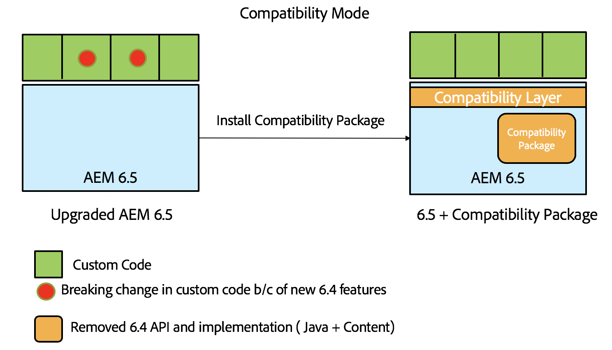

# AEM 6.5中的向後相容性{#backward-compatibility-in-aem}

## 概覽 {#overview}

>[!NOTE]
>
>如需不在「相容性套件」範圍內的內容和設定變更清單，請參閱「AEM中的 [儲存庫重組」](/help/sites-deploying/repository-restructuring.md)。

在AEM 6.5中，所有功能都已在開發時考慮到向後相容性。

在大多數情況下，執行AEM 6.3的客戶在進行升級時，不必變更程式碼或自訂設定。 對於AEM 6.1和6.2客戶，沒有比升級至6.3時所面臨的額外突破性變更。

如果功能無法保持向後相容，則可透過安裝6.4版相容性套件來緩解套件和內容的向後相容問題（請參閱以下如何設定，以取得下載位置的詳細資訊）。 在大部分情況下，此Compat套件將有助於恢復與AEM 6.4相容的應用程式的相容性。

「相容性套件」可讓您在相容性模式下執行AEM，並針對新的AEM功能延遲自訂開發：

>[!NOTE]
>
>請注意，相容性套件只是暫時性解決方案，可延遲AEM 6.5相容所需的開發，如果您無法在升級後立即透過開發解決相容性問題，建議將它當成最後一個選項。 強烈建議在您決定繼續以6.5為基礎的自訂開發並運用完整的6.5功能後，切換至原生模式並解除安裝相容性套件。

Compatibility Package有兩種模式：啟 **用路由** , **禁用路由**。

這可讓AEM 6.5以三種模式執行：

**原生模式：**

原生模式適用於想要使用AEM 6.5所有新功能並準備進行一些開發的客戶，讓他們的自訂功能可搭配所有新功能運作。

這表示在升級後，您可能需要立即對您的應用程式進行調整。

**相容模式：已安裝相容包並啟用了路由**

相容性模式適用於具有向後不相容介面的定製的客戶。 這可讓AEM在相容模式下執行，並針對與部分自訂程式碼不相容的新AEM功能，延遲所需的自訂開發。

**舊模式：已安裝相容包且禁用路由**

舊版模式適用於具有自訂介面的客戶，這些介面是根據AEM中已移出相容性套件的舊版或已過時代碼。

## 如何設定 {#how-to-set-up}

AEM 6.3相容性套件將可使用此連結上的「套件管理員」，以套件的形式 [安裝](https://www.adobeaemcloud.com/content/marketplace/marketplaceProxy.html?packagePath=/content/companies/public/adobe/packages/cq640/compatpack/aem-compat-cq64-to-cq63)。

在安裝Compatibility Package後，可以使用OSGI配置中的交換機啟用或禁用路由，如下所示：

安裝並設定相容性軟體包後，將根據選擇的相容性模式使用這些功能。
