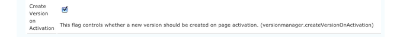

# 配置OSGi{#configuring-osgi}

[OSGi](https://www.osgi.org/) 是Adobe Experience Manager(AEM)技術堆疊中的基本元素。 它可用來控制AEM的複合套件組合及其設定。

OSGi &quot;*提供標準化基元，允許從小型、可重複使用和協作的元件構建應用程式。 這些元件可組成應用程式並部署*」。

這樣可以輕鬆管理捆綁包，因為它們可以單獨停止、安裝和啟動。 會自動處理互依性。 每個OSGi元件(請參閱 [OSGi規範](https://www.osgi.org/Specifications/HomePage))包含在其中一個不同套件組合中。

您可以透過以下任一方式管理此類套件組合的組態設定：

* 使用 [Adobe CQ Web主控台](#osgi-configuration-with-the-web-console)
* 使用 [組態檔](#osgi-configuration-with-configuration-files)
* 配置 [內容節點( `sling:OsgiConfig`)](#osgi-configuration-in-the-repository)

雖然有細微差異，但可使用任一方法，主要與 [執行模式](/help/sites-deploying/configure-runmodes.md):

* [Adobe CQ Web主控台](#osgi-configuration-with-the-web-console)

   * Web控制台是OSGi配置的標準介面。 它提供用於編輯各種屬性的UI，可從預先定義的清單中選取可能的值。

      因此，這是最簡單的使用方法。

   * 使用Web控制台進行的任何配置都立即應用並適用於當前實例，而不考慮當前運行模式，也不考慮後續對運行模式的任何更改。

* [組態檔](#osgi-configuration-with-configuration-files)

   * 包含Web主控台中定義的設定。
   * 可包含在內容套件中，以用於其他例項。

* [存放庫中的content-nodes(sling:osgiConfig)](#osgi-configuration-in-the-repository)

   * 需要使用CRXDE Lite手動配置。
   * 由於 `sling:OsgiConfig` 節點，您可以將設定連結至特定 [運行模式](/help/sites-deploying/configure-runmodes.md). 您甚至可以在同一儲存庫中保存多個運行模式的配置。
   * 會立即套用任何適當的設定（取決於執行模式）。

無論您使用何種方法，以下所有設定方法：

* 確保複製或複製儲存庫內容會重新建立相同的配置。
* 允許您將配置簽出到FileVault或Subversion;安全性或更新。
* 可在設定其他執行個體時儲存在套件中以供使用。
* 可讓您使用指令碼執行設定轉出，以傳播設定詳細資訊。

>[!NOTE]
>
>某些重要設定的詳細資訊列於 [OSGi組態設定。](/help/sites-deploying/osgi-configuration-settings.md)

## 使用Web控制台進行OSGi配置 {#osgi-configuration-with-the-web-console}

此 [Web主控台](/help/sites-deploying/web-console.md) 在AEM中提供用於設定套件組合的標準化介面。 此 **設定** tab可用來設定OSGi套件組合，因此是設定AEM系統參數的基礎機制。

所做的任何更改都會立即應用到相關的OSGi配置，無需重新啟動。

>[!NOTE]
>
>在Web主控台中所做的變更會儲存在存放庫中，作為 [組態檔](#osgi-configuration-with-configuration-files). 這些檔案可以包含在內容包中，以便在進一步安裝中重複使用。

>[!NOTE]
>
>在Web主控台上，任何提及預設設定的說明都與Sling預設值相關。
>
>Adobe Experience Manager有其專屬的預設值，因此設定的預設值可能與主控台記錄的預設值不同。

要使用Web控制台更新配置，請執行以下操作：

1. 存取 **設定** 頁簽，方法是：

   * 從 **工具 — >操作** 功能表。 登入主控台後，您可以使用下拉式功能表：

      **OSGi >**

   * 直接URL;例如：

      `http://localhost:4502/system/console/configMgr`
   隨即顯示清單。

1. 選擇要配置的包，方法為：

   * 按一下 **編輯** 圖示
   * 按一下 **名稱** 束

1. 對話框隨即開啟。 您可以在此視需要編輯。 例如，設定 **記錄層級** to `INFO`:

   

   >[!NOTE]
   >
   >更新會儲存在存放庫中，如 [組態檔](#osgi-configuration-with-configuration-files). 若要在之後找出這些檔案以納入內容套件中，以便用於其他例項，例如，請記下永久身分( `PID`)。

1. 按一下「**儲存**」。

   您的更改將立即應用到運行系統的相關OSGi配置，無需重新啟動。

   >[!NOTE]
   >
   >您現在可以找到 [組態檔](#osgi-configuration-with-configuration-files). 例如，納入內容套件以用於其他例項。

## OSGi配置配置配置檔案 {#osgi-configuration-with-configuration-files}

使用Web控制台進行的配置更改將作為配置檔案保存在儲存庫中( `.config`)底下：

`/apps`

這些檔案可以包含在內容包中，並可在其他實例上重複使用。

>[!NOTE]
>
>設定檔案的格式為特定 — 請參閱 [Sling Apache檔案](https://sling.apache.org/documentation/development/slingstart.html#default-configuration-format) 以取得完整詳細資訊。
>
>因此，建議您在Web主控台中進行實際變更，以建立和維護設定檔案。

Web控制台不顯示儲存庫中已保存更改的位置，但可以輕鬆找到更改：

1. 建立配置檔案的方法 [在web主控台中進行初始變更](#osgi-configuration-with-the-web-console).
1. 開啟CRXDE Lite。
1. 在 **工具** 菜單，選擇 **查詢……** .
1. 若要搜尋已更新之設定的PID，請提交的查詢 **類型** `SQL`.

   例如， **Apache Felix OSGi Management Console** 具有以下的永久標識(PID):

   `org.apache.felix.webconsole.internal.servlet.OsgiManager`

   因此，SQL查詢可以是：

   ```shell
   select * from nt:base where jcr:path like '/apps/%' and contains(*, 'org.apache.felix.webconsole.internal.servlet.OsgiManager')
   ```

1. 將顯示配置檔案節點。

   對於上述範例：

   `/apps/system/config/org.apache.felix.webconsole.internal.servlet.OsgiManager.config`

   >[!CAUTION]
   >
   >您可以開啟此檔案以檢視您的變更，但為避免輸入錯誤，建議您使用主控台進行實際變更。

1. 您現在可以建立包含此節點的內容套件，並視需要在其他執行個體上使用。

## 儲存庫中的OSGi配置 {#osgi-configuration-in-the-repository}

除了使用Web控制台外，您還可以在儲存庫中定義配置詳細資訊。 這麼做可讓您輕鬆設定不同的執行模式。

這些設定是透過建立 `sling:OsgiConfig` 儲存庫中的節點供系統參考。 這些節點反映OSGi配置，並形成用戶介面。 要更新配置資料，請更新節點屬性。

如果修改儲存庫中的配置資料，更改將立即應用到相關的OSGi配置。 就像是使用Web控制台進行了更改，並進行了適當的驗證和一致性檢查。 此工作流程也適用於複製設定的動作 `/libs/` to `/apps/`.

由於相同的配置參數位於多個位置，因此系統：

* 搜索所有類型的節點 `sling:OsgiConfig`
* 根據服務名稱進行篩選
* 根據運行模式進行篩選

>[!NOTE]
>
>另請閱讀 [如何僅為特定實例定義基於儲存庫的配置](https://experienceleague.adobe.com/docs/experience-cloud-kcs/kbarticles/KA-17500.html?lang=en).

### 將新配置添加到儲存庫 {#adding-a-new-configuration-to-the-repository}

#### 需知 {#what-you-need-to-know}

若要將配置添加到儲存庫，您必須知道以下資訊：

1. 此 **永久身份** (PID)。

   參考 **配置** 欄位。 此名稱會在套件名稱后面的方括弧中顯示(或 **配置資訊** 向下)。

   例如，建立節點 `com.day.cq.wcm.core.impl.VersionManagerImpl.` 設定 **AEM WCM Version Manager**.

   

1. 是特定 [運行模式](/help/sites-deploying/configure-runmodes.md) 必填？ 建立資料夾：

   * `config`  — 所有運行模式
   * `config.author`  — 適用於製作環境
   * `config.publish`  — 適用於發佈環境
   * `config.<run-mode>`  — 酌情

1. 是 **設定** 或 **工廠配置** 必要？
1. 要設定的個別參數，包括必須重新建立的任何現有參數定義。

   在Web主控台中參考個別參數欄位。 每個參數的名稱會以方括弧顯示。

   例如，建立屬性
   `versionmanager.createVersionOnActivation` 設定 **在啟動時建立版本**.

   

1. 中是否存在配置 `/libs`? 若要列出執行個體中的所有設定，請使用 **查詢** 工具以提交以下SQL查詢：

   `select * from sling:OsgiConfig`

   若存在，此設定可複製至 ` /apps/<yourProject>/`，然後在新位置中自訂。

#### 在儲存庫中建立配置 {#creating-the-configuration-in-the-repository}

若要實際將新設定新增至存放庫：

1. 使用CRXDE Lite導覽至：

   ` /apps/<yourProject>`

1. 如果不存在，請建立 `config` 資料夾( `sling:Folder`):

   * `config`  — 適用於所有運行模式
   * `config.<run-mode>`  — 特定於特定運行模式

1. 在此資料夾下，建立節點：

   * 類型: `sling:OsgiConfig`
   * 名稱：永久身份(PID);

      例如，AEM WCM Version Manager使用 `com.day.cq.wcm.core.impl.VersionManagerImpl`
   >[!NOTE]
   >
   >進行工廠配置附加時 `-<identifier>` 名稱。
   >
   >如下所示： `org.apache.sling.commons.log.LogManager.factory.config-<identifier>`
   >
   >其中 `<identifier>` 替換為自由文字，您（必須）輸入以識別執行個體（您無法忽略此資訊）;例如：
   >
   >`org.apache.sling.commons.log.LogManager.factory.config-MINE`

1. 針對您要設定的每個參數，在此節點上建立屬性：

   * 名稱：參數名稱，如Web控制台所示；名稱會以方括弧顯示在欄位說明的結尾。 例如， `Create Version on Activation` use `versionmanager.createVersionOnActivation`
   * 類型：視情況而定。
   * 值：視需要。

   您只需為要設定的參數建立屬性，其他參數仍採用AEM設定的預設值。

1. 儲存所有變更。

   當透過重新啟動服務來更新節點時，會套用變更（如同在Web主控台中所做的變更）。

>[!CAUTION]
>
>請勿變更 `/libs` 路徑。

>[!CAUTION]
>
>配置的完整路徑必須正確，才能在啟動時讀取。

## 配置詳細資訊 {#configuration-details}

### 啟動時的解析順序 {#resolution-order-at-startup}

使用下列優先順序：

1. 下方的儲存庫節點 `/apps/*/config...`.或類型 `sling:OsgiConfig` 或屬性檔案。

1. 類型的儲存庫節點 `sling:OsgiConfig` 在 `/libs/*/config...`. （現成可用的定義）。

1. 任何 `.config` 檔案 `<*cq-installation-dir*>/crx-quickstart/launchpad/config/...`. 在本地檔案系統上。

中的一般設定 `/libs` 中的專案特定設定可以遮罩 `/apps`.

### 運行時的解析順序 {#resolution-order-at-runtime}

在系統運行時所做的配置更改會使用修改的配置觸發重新載入。

然後，應用以下優先順序：

1. 在Web控制台中修改配置會立即生效，因為它在運行時優先。
1. 在中修改配置 `/apps` 立即生效。
1. 在中修改配置 `/libs` 會立即生效，除非它被中的配置遮罩 `/apps`.

### 解析多運行模式 {#resolution-of-multiple-run-modes}

對於特定於運行模式的配置，可以組合多種運行模式。 例如，您可以使用以下樣式建立配置資料夾：

`/apps/*/config.<runmode1>.<runmode2>/`

如果所有運行模式都與啟動時定義的運行模式匹配，則應用這些資料夾中的配置。

例如，如果執行個體是以執行模式啟動 `author,dev,emea`，配置節點 `/apps/*/config.emea`, `/apps/*/config.author.dev/`，和 `/apps/*/config.author.emea.dev/` 時， `/apps/*/config.author.asean/` 和 `/config/author.dev.emea.noldap/` 未套用。

如果同一PID的多個配置適用，則應用匹配運行模式數目最多的配置。

例如，如果執行個體是以執行模式啟動 `author,dev,emea`，和 `/apps/*/config.author/` 和 `/apps/*/config.emea.author/` 定義
`com.day.cq.wcm.core.impl.VersionManagerImpl`，中的設定 `/apps/*/config.emea.author/` 中所有規則的URL區段。

此規則的粒度為PID層級。
您無法在 `/apps/*/config.author/` 更具體的 `/apps/*/config.emea.author/` PID相同。
匹配運行模式數目最多的配置對整個PID都有效。

### 標準配置 {#standard-configurations}

下列清單顯示儲存庫中可用配置的一小部分（在標準安裝中）:

* 作者 — AEM WCM篩選器：

   `libs/wcm/core/config.author/com.day.cq.wcm.core.WCMRequestFilter`

* 發佈 — AEM WCM篩選器：

   `libs/wcm/core/config.publish/com.day.cq.wcm.core.WCMRequestFilter`

* 發佈 — AEM WCM頁面統計資料：

   `libs/wcm/core/config.publish/com.day.cq.wcm.core.stats.PageViewStatistics`

>[!NOTE]
>
>由於這些設定位於 `/libs` 不得直接編輯，而是複製到您的應用程式區域( `/apps`)。

若要列出執行個體中的所有設定節點，請使用 **查詢** CRXDE Lite中提交以下SQL查詢的功能：

`select * from sling:OsgiConfig`

### 配置持久性 {#configuration-persistence}

* 如果您透過Web主控台變更設定，通常會寫入存放庫(位於：

   `/apps/{somewhere}`

   * 依預設 `{somewhere}` is `system/config` 這樣配置就會寫入

      `/apps/system/config`

   * 不過，如果您編輯的設定最初來自存放庫的其他位置：例如：

      /libs/foo/config/someconfig

      然後將更新後的配置寫入原始位置；例如：

      `/apps/foo/config/someconfig`

* 變更者 `admin` 儲存於 `*.config` 檔案下：

   ```
      /crx-quickstart/launchpad/config
   ```

   * 此區域是OSGi配置管理員的專用資料，並包含指定的所有配置詳細資訊 `admin`，無論使用者如何進入系統。
   * 此區域是實作詳細資料，您絕不可直接編輯此目錄。
   * 但是，了解這些配置檔案的位置非常有用，這樣就可以為備份或多個安裝（或兩者）獲取副本：

      * Apache Felix OSGi Management Console

         `../crx/org/apache/felix/webconsole/internal/servlet/OsgiManager.config`

      * CRX Sling用戶端存放庫

         `../com/day/crx/sling/client/impl/CRXSlingClientRepository/<pid-nr>.config`

>[!CAUTION]
>
>切勿編輯以下資料夾或檔案：
>
>`/crx-quickstart/launchpad/config`
