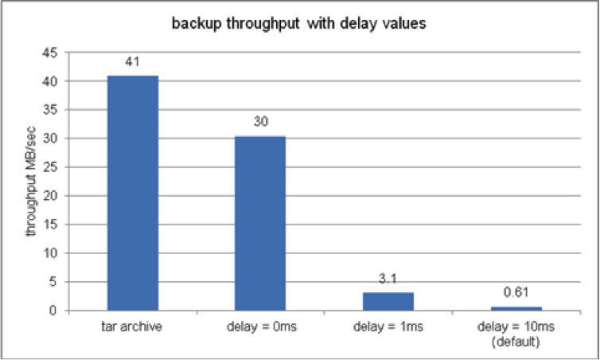

# 效能最佳化{#performance-optimization}

>[!NOTE]
>
>有關效能的一般准則，請閱讀「性 [能准則](/help/sites-deploying/performance-guidelines.md) 」頁。
>
>有關疑難排解和修復效能問題的詳細資訊，另請參閱 [效能樹](/help/sites-deploying/performance-tree.md)。
>
>此外，您還可以閱讀「效能調整提示」的「知識 [庫」文章。](https://helpx.adobe.com/experience-manager/kb/performance-tuning-tips.html)

關鍵問題是您的網站回應訪客要求所花的時間。 雖然此值會因每個請求而異，但可以定義平均目標值。 一旦這個值被證明是可實現和可維護的，它就可以用來監控網站的效能並指出潛在的問題。

您要針對的回應時間在作者和發佈環境上會有所不同，反映目標讀者的不同特性：

## 作者環境 {#author-environment}

此環境由作者輸入和更新內容使用。 當更新內容頁面和這些頁面上的個別元素時，它必須迎合少數使用者的需求，而每位使用者都會產生大量效能密集的要求。

## 發佈環境 {#publish-environment}

此環境包含您提供給使用者的內容。 在這裡，請求數量更大，速度也同樣重要，但由於請求的性質不那麼動態，因此可以應用額外的效能增強機制；例如快取內容或負載平衡。

>[!NOTE]
>
>* 在進行效能優化配置後，請按照 [Tough Day](/help/sites-developing/tough-day.md) （艱難日）中的步驟來測試大負載環境。
>* 另請參閱 [效能調整提示](https://helpx.adobe.com/experience-manager/kb/performance-tuning-tips.html)。
>


## 效能最佳化方法 {#performance-optimization-methodology}

CQ專案的效能最佳化方法可歸納為五個非常簡單的規則，可遵循這些規則以避免從一開始就發生效能問題：

1. [優化規劃](#planning-for-optimization)
1. [模擬真實](#simulate-reality)
1. [建立堅實的目標](#establish-solid-goals)
1. [保持相關性](#stay-relevant)
1. [敏捷迭代週期](#agile-iteration-cycles)

這些規則在很大程度上適用於Web專案，並與專案經理和系統管理員相關，以確保其專案在啟動時不會面臨效能挑戰。

### 優化規劃 {#planning-for-optimization}


在效能優化階段，應計畫大約10%的項目工作。 當然，實際的效能最佳化需求將取決於專案的複雜性程度以及開發團隊的經驗。 雖然您的專案可能（最終）不需要所有分配的時間，但建議地區的效能最佳化時務必進行規劃。

在可能的情況下，應先將專案軟式啟動給有限的觀眾群，以收集實際體驗並執行進一步的最佳化，而不需要在完整發佈後承受額外壓力。

一旦您「上線」，效能最佳化就不會結束。 這是您在系統上體驗「真實」負載的時間點。 在產品發佈後，請務必規劃其他調整。

由於系統負載變化，且系統的效能配置檔案會隨時間而改變，因此應以6-12個月的間隔計畫效能「調整」或「運行狀況檢查」。

### 模擬真實 {#simulate-reality}


如果您上線使用網站，並在發佈後發現您遇到效能問題，只有一個原因：您的負載和效能測試並不足以模擬實際情況。

模擬現實是困難的，而您在合理地想要投入多少精力來實現「真實」，取決於您專案的性質。 「真實」不僅指「真實程式碼」和「真實流量」，也指「真實內容」，尤其是關於內容大小和結構。 請記住，根據儲存庫的大小和結構，模板的行為可能完全不同。

### 建立堅實的目標 {#establish-solid-goals}


正確制定業績目標的重要性不容低估。 通常，一旦人們將注意力集中在具體的績效目標上，就很難在以後改變這些目標，即使這些目標基於瘋狂的假設。

建立良好、穩固的效能目標，確實是最棘手的領域之一。 通常最好從可比網站（例如新網站的前代網站）收集實際日誌和基準。

### 保持相關性 {#stay-relevant}


一次優化一個瓶頸非常重要。 如果您嘗試在不驗證單一最佳化影響的情況下並行執行，您將無法追蹤哪個最佳化度量真正有幫助。

### 敏捷迭代週期 {#agile-iteration-cycles}


效能調整是一個反覆進行的程式，包括測量、分析、最佳化和驗證，直到達到目標為止。 為了正確考慮這一方面，在優化階段實施敏捷的驗證過程，而不是在每次迭代後進行更重量的測試過程。

這主要表示實施最佳化的開發人員應快速判斷最佳化是否已達到目標。 這是有價值的資訊，因為當達到目標時，優化就結束了。

## 基本效能指引 {#basic-performance-guidelines}

一般而言，請將未快取的html要求保留在100毫秒以內。 更具體地說，以下可能是准則：

* 70%的頁面要求應在100毫秒內回覆。
* 25%的頁面要求應在100ms-300ms內收到回應。
* 4%的頁面要求應在300毫秒-500毫秒內收到回應。
* 1%的頁面要求應在500ms-1000ms內收到回應。
* 任何頁面的回應速度都不應慢於1秒。

上述數字假設下列條件：

* 在發佈時測量（沒有與編寫環境相關的間接費用）
* 在伺服器上測量（無網路開銷）
* 未快取（無CQ輸出快取，無Dispatcher快取）
* 僅適用於具有許多相依性的複雜項目(HTML、JS、PDF、...)
* 系統上沒有其他負載

有些問題經常導致效能問題。 這些主要圍繞：

* 調度程式快取效率低
* 在一般顯示範本中使用查詢。

JVM和OS層級調整通常不會導致效能大幅提升，因此應在最佳化週期的最後執行。

內容儲存庫的結構方式也會影響效能。 為獲得最佳效能，內容儲存庫中附加到單個節點的子節點數不應超過1,000（作為一般規則）。

在通常的效能最佳化練習中，您最好的朋友包括：

* the `request.log`
* 基於元件的定時
* 最後，但至少是java設定器。

### 載入和編輯數位資產時的效能 {#performance-when-loading-and-editing-digital-assets}

由於載入和編輯數位資產時涉及大量資料，因此效能可能成為問題。

以下兩點會影響效能：

* CPU —— 多核可讓轉碼時工作更順暢
* 硬碟——並行RAID磁碟實現相同

若要改善效能，您可考慮下列事項：

* 每天要上傳多少個資產？ 可以基於以下因素進行良好估計：


* 進行編輯的時間範圍（通常是工作日的時間長度，國際作業則更多）。
* 上傳的影像平均大小（以及每個影像產生的轉譯大小）（以MB為單位）。
* 確定平均資料速率：


* 80%的編輯都會在20%的時間內完成，因此在高峰時期，您的資料速率是平均數的4倍。 這是您的績效目標。

## 效能監控 {#performance-monitoring}

效能（或缺乏效能）是您的使用者最先注意到的事項之一，因此，如同使用者介面的應用程式，效能至關重要。 若要最佳化CQ安裝的效能，您需要監控執行個體的各種屬性及其行為。

有關如何執行效能監視的資訊，請參 [閱監視效能](/help/sites-deploying/monitoring-and-maintaining.md#monitoring-performance)。

導致效能問題的問題通常很難追蹤，即使其效果很容易看到。

基本起點是系統正常運行時對系統的良好瞭解。 除非您知道環境在正常運行時的「外觀」和「行為」，否則在效能惡化時很難找到問題所在。 這表示，在系統正常運行時，您應該花一些時間調查系統，並確保收集效能資訊是一項持續的任務。 如果效能不佳，這將提供您比較的基礎。

下圖說明CQ內容請求可採取的路徑，因此說明了影響效能的不同元素數目。


效能也是卷和容量之間的平衡：

**卷** ：系統處理和傳送的輸出量。

**容量** ：系統提供容量的能力。

這可以在整個Web鏈的不同位置加以說明。


有幾個功能領域通常會影響效能：

* 快取
* 應用程式（您的專案）程式碼
* 搜尋功能

### 關於績效的基本規則 {#basic-rules-regarding-performance}

在最佳化效能時，應牢記某些規則：

* 效能調 *整必須* 是每個專案的一部分。
* 請勿在開發週期初期進行最佳化。
* 效能僅與最薄弱的環節一樣好。
* 請務必考慮容量與容量。
* 首先優化重要事物。
* 沒有現實的目標， *絕不* 能最佳化。

>[!NOTE]
>
>請記住，您用來測量效能的機制通常會影響您嘗試測量的內容。 你應該總是設法解決這些差異，盡可能消除它們的影響；尤其是瀏覽器外掛程式應盡可能取消啟動。

## 效能配置 {#configuring-for-performance}

CQ（和／或基礎CRX）的某些方面可以配置為優化效能。 以下是可能性和建議，您必須先確定是否或如何使用相關功能，才能進行變更。

>[!NOTE]
>
>如需詳細資訊，請參閱知識 [庫文章](https://helpx.adobe.com/experience-manager/kb/performance-tuning-tips.html)。

### 搜尋索引 {#search-indexing}

從AEM 6.0開始，Adobe Experience manager使用Oak資料庫架構。

您可以在以下位置找到更新的索引資訊：

* [查詢和索引的最佳做法](/help/sites-deploying/best-practices-for-queries-and-indexing.md)
* [查詢和索引](/help/sites-deploying/queries-and-indexing.md)

### 併發工作流處理 {#concurrent-workflow-processing}

限制同時執行的工作流程進程數，以提升效能。 預設情況下，工作流引擎並行處理的工作流數量與Java VM可用的處理器數量相同。 當工作流程步驟需要大量的處理資源（RAM或CPU）時，並行執行其中數個工作流程可能會對可用伺服器資源產生高需求。

例如，當上傳影像（或一般為DAM資產）時，工作流程會自動將影像匯入DAM。 影像通常是高解析度的，而且處理時可輕鬆耗用數百MB的堆積。 並行處理這些影像會給儲存子系統和垃圾收集器帶來高負載。

工作流引擎使用Apache Sling作業佇列來處理和排程工作項目處理。 下列工作佇列服務已依預設從Apache Sling Job Queue Configuration服務工廠建立，以處理工作流程工作：

* Granite工作流程佇列：大部分的工作流程步驟（例如處理DAM資產的步驟）都使用Granite Workflow Queue服務。
* Granite工作流外部進程作業隊列：此服務用於特殊的外部工作流步驟，通常用於聯繫外部系統和輪詢結果。 例如，InDesign「媒體擷取程式」步驟會實作為外部程式。 工作流程引擎使用外部佇列來處理輪詢。 (請參 [閱com.day.cq.workflow.exec.WorkflowExternalProcess](https://helpx.adobe.com/experience-manager/6-5/sites/developing/using/reference-materials/javadoc/com/day/cq/workflow/exec/WorkflowExternalProcess.html)。)

配置這些服務以限制併發運行的工作流進程的最大數量。

**** 注意：配置這些作業隊列會影響所有工作流，除非您為特定工作流模型建立了作業隊列(請參閱下面的 [Configure the Queue for a Specific Workflow Model](/help/sites-deploying/configuring-performance.md#configure-the-queue-for-a-specific-workflow) )。

**儲存庫中的配置**

如果您使用sling:OsgiConfig [節點設定服務](/help/sites-deploying/configuring-osgi.md#adding-a-new-configuration-to-the-repository)，則需要尋找現有服務的PID，例如：org.apache.sling.event.jobs.QueueConfiguration.370aad73-d01b-4a0b-abe4-20198d85f705。 您可以使用Web控制台來發現PID。

您需要配置名為queue.maxparallel的屬性。

**Web控制台中的配置**

若要使用Web Console [來設定這些服務](/help/sites-deploying/configuring-osgi.md#osgi-configuration-with-the-web-console)，請在Apache Sling Job Queue Configuration服務工廠下方找出現有的設定項目。

您需要配置名為「最大並行作業數」的屬性。

### 為特定工作流配置隊列 {#configure-the-queue-for-a-specific-workflow}

為特定工作流模型建立作業隊列，以便您可以為該工作流模型配置作業處理。 這樣，您的配置會影響特定工作流的處理，而預設的「Granite工作流隊列」的配置則控制其他工作流的處理。

當工作流程模型執行時，他們會針對特定主題建立Sling工作。 預設情況下，該主題與為常規Granite Workflow Queue或Granite Workflow External Process Job queue配置的主題匹配：

* com/adobe/granite/workflow/job&amp;ast;
* com/adobe/granite/workflow/external/job&amp;ast;

工作流模型生成的實際作業主題包括模型特定的尾碼。 例如，「DAM更新資產」工作流程模型會產生具有下列主題的工作：

com/adobe/granite/workflow/job/etc/workflow/models/dam/update_asset/jcr_content/model

因此，您可以為主題建立與工作流模型的作業主題匹配的作業隊列。 配置隊列的效能相關屬性只影響生成與隊列主題匹配的作業的工作流模型。

以下過程使用DAM更新資產工作流為例，為工作流建立作業隊列。

1. 執行要為其建立作業隊列的工作流模型，以便生成主題統計資訊。 例如，將影像新增至「資產」以執行「DAM更新資產」工作流程。
1. 開啟Sling Jobs主控台。 ([http://localhost:4502/system/console/slingevent](http://localhost:4502/system/console/slingevent))
1. 在主控台中探索與工作流程相關的主題。 對於DAM更新資產，可找到下列主題：

   * com/adobe/granite/workflow/external/job/etc/workflow/models/dam/update_asset/jcr_content/model
   * com/adobe/granite/workflow/job/etc/workflow/models/dam/update_asset/jcr_content/model
   * com/adobe/granite/workflow/job/etc/workflow/models/dam-xmp-writeback/jcr_content/model

1. 為每個主題建立一個作業隊列。 若要建立工作佇列，請建立Apache Sling Job Queue factory服務的工廠設定。

   工廠配置與「併發工作流處理」中描述的「Granite工作流隊列」類似 [](/help/sites-deploying/configuring-performance.md#concurrent-workflow-processing)，但「主題」屬性與工作流作業的主題匹配。

### CQ5 DAM資產同步服務 {#cq-dam-asset-synchronization-service}

用於 `AssetSynchronizationService` 同步來自掛載儲存庫（包括LiveLink 、 Documentum等）的資產。 預設情況下，每300秒（5分鐘）進行一次常規檢查，因此，如果不使用掛載資料庫，則可禁用此服務。

這是通過配 [置OSGi服務](/help/sites-deploying/configuring-osgi.md)**CQ DAM Asset Synchronization Service** ，將同步期間( ****`scheduler.period`)設定為（最小值為）1年（以秒為單位）來完成的。

### 多個DAM例項 {#multiple-dam-instances}

部署多個DAM實例有助於在以下情況下的效能：

* 由於為作者環境定期上傳大量資產，所以負載較高；這裡可以有個別的DAM例項專門用於為作者服務。
* 您在全球各地擁有多個團隊（例如美國、歐洲、亞洲）。

其他考量事項包括：

* 將「進行中的作品」與「最終的」出版分開
* 將作者的內部使用者與發佈時的外部訪客／使用者分開（例如代理、新聞代表、客戶、學生等）。

## 質量保證的最佳做法 {#best-practices-for-quality-assurance}

效能對您的發佈環境至關重要。 因此，在實施專案時，您必須仔細規劃並分析要針對發佈環境進行的效能測試。

本節旨在標準化概述在發佈環境中為效能測試專門定義測試概念所涉及的 *問題* 。 QA工程師、項目經理和系統管理員對此感興趣。

以下說明在 *Publish環境中針對CQ應用程式進行效能測試的標準* 化方法。 這包括下列5個階段：

* [知識驗證](#verification-of-knowledge)
* [範圍定義](#scope-definition)
* [測試方法](#test-methodologies)
* [績效目標的定義](#defining-the-performance-goals)
* [最佳化](#optimization)

控制是一個附加的、全方位的過程——這是必要的，但不限於測試。

### 知識驗證 {#verification-of-knowledge}

第一步是記錄您在開始測試之前需要知道的基本資訊：

* 測試環境的架構
* 詳細說明需要測試的內部元素的應用程式地圖（分離和組合）

#### 測試架構 {#test-architecture}

您應清楚記錄用於效能測試的測試環境的體系結構。

您需要與Dispatcher和Load Balancer一起複製您計畫的生產Publish環境。

#### 應用程式地圖 {#application-map}

若要取得清楚的概觀，您可以建立整個應用程式的地圖（您很可能會從作者環境的測試中取得此地圖）。

以圖形表示應用程式的內部元素，可以給出測試需求的概述；使用色彩編碼，也可做為報告的基礎。

### 範圍定義 {#scope-definition}

應用程式通常會有一系列使用案例。 有些將非常重要，有些則不那麼重要。

若要將效能測試的範圍集中在發佈上，建議您定義：

* 最重要的業務使用案例
* 最關鍵的技術使用案例

使用案例的數量由您決定，但應限制為易於管理的數量（例如5到10）。

在選取關鍵使用案例後，就可針對每個案例定義關鍵績效指標(KPI)和用來測量它們的工具。 常見KPI的範例包括：

* 端到端響應時間
* Servlet響應時間
* 單一元件的回應時間
* 服務的回應時間
* 線程池中的空閒線程數
* 空閒連接數
* 系統資源，例如CPU和I/O訪問

### 測試方法 {#test-methodologies}

此概念有4種用於定義和測試效能目標的方案：

* 單一元件測試
* 組合元件測試
* *「上線* 」藍本
* 錯誤方案

根據以下原則：

**元件中斷點**

* 每個元件在與效能相關時都有特定的中斷點。 這表示元件可以顯示良好的效能，直到達到特定點為止，然後效能就會迅速降低。
* 若要取得應用程式的完整概觀，您必須先驗證元件，以決定何時到達每個元件的中斷點。
* 要查找斷點，可以執行載入測試，在一段時間內，要增加建立載入的用戶數。 透過監控此負載和元件的回應，當元件的中斷點到達時，您會遇到特定的效能行為。 該點可以按每秒併發事務處理數以及併發用戶數來限定（如果元件對此KPI很敏感）。
* 然後，這些資訊可做為改進的基準，指出所使用測量的效率，並協助定義測試藍本。

**交易**

* 術語事務用於表示完整網頁的請求，包括頁面本身和所有後續呼叫；例如頁面要求、任何AJAX呼叫、影像和其他物件。**請求追溯**
* 若要完全分析每個請求，您可以代表呼叫堆疊的每個元素，然後合計每個請求的平均處理時間。

### 定義績效目標 {#defining-the-performance-goals}

定義範圍和相關KPI後，即可設定特定的績效目標。 這包括設計測試藍本和目標值。

您需要在平均和峰值條件下測試效能。 此外，您還需要「上線」藍本測試，以確保在網站首次推出時，您可以迎合對網站的興趣。

您從現有網站收集的任何經驗或統計資料，在決定未來目標時也會很有用；例如，來自您即時網站的熱門流量。

#### 單一元件測試 {#single-component-tests}

關鍵元件需要在平均和峰值條件下進行測試。

在這兩種情況下，當預先定義的使用者數目使用系統時，您都可以定義每秒的預期交易數。

| 元件 | 測試類型 | #使用者 | Tx/秒（預期） | Tx/秒（已測試） | 說明 |
|---|---|---|---|---|---|
| 首頁單一使用者 | 平均 | 1 | 1 |  |  |
|  | 峰 | 1 | 3 |  |  |
| 首頁100位使用者 | 平均 | 100 | 3 |  |  |
|  | 峰 | 100 | 3 |  |

#### 組合元件測試 {#combined-component-tests}

組合測試元件可更詳細地反映應用程式的行為。 必須再次測試平均和峰值條件。

| 藍本 | 元件 | #使用者 | Tx/秒（預期） | Tx/秒（已測試） | 說明 |
|---|---|---|---|---|---|
| 混合平均 | 首頁 | 10 | 1 |  |  |
|  | 搜尋 | 10 | 1 |  |  |
|  | 新聞 | 10 | 2 |  |  |
|  | 事件 | 10 | 1 |  |  |
|  | 啟動 | 10 | 3 |  | 作者行為模擬。 |
| 混合峰 | 首頁 | 100 | 5 |  |  |
|  | 搜尋 | 50 | 5 |  |  |
|  | 新聞 | 100 | 10 |  |  |
|  | 事件 | 100 | 10 |  |  |
|  | 啟動 | 20 | 20 |  | 作者行為模擬。 |

#### 進行即時測試 {#going-live-tests}

在您的網站推出後的頭幾天，您會預期興趣會提高。 這可能比您測試的峰值還大。 強烈建議測試「上線」藍本，以確保系統能夠滿足此情況。

| 藍本 | 測試類型 | #使用者 | Tx/秒（預期） | Tx/秒（已測試） | 說明 |
|---|---|---|---|---|---|
| Going Live peak | 首頁 | 200 | 20 |  |  |
|  | 搜尋 | 100 | 10 |  |  |
|  | 新聞 | 200 | 20 |  |  |
|  | 事件 | 200 | 20 |  |  |
|  | 啟動 | 20 | 20 |  | 作者行為模擬。 |

#### 錯誤藍本測試 {#error-scenario-tests}

還必須測試錯誤情況，以確保系統能正確、正確地反應。 不僅在於錯誤本身的處理方式，還在於它對效能的影響。 例如：

* 當使用者嘗試在搜尋方塊中輸入無效的搜尋詞時，會發生什麼情況
* 當搜尋詞泛泛到傳回過多結果時，會發生什麼

在設計這些測試時，應該記住並非所有的情況都會定期發生。 但是，它們對整個系統的影響很重要。

| 錯誤藍本 | 錯誤類型 | #使用者 | Tx/秒（預期） | Tx/秒（已測試） | 說明 |
|---|---|---|---|---|---|
| 搜尋元件過載 | 搜尋全域萬用字元（星號） | 10 | 1 |  | 只有&amp;ast;&amp;ast;&amp;ast;的子菜單。 |
|  | 停止字詞 | 20 | 2 |  | 正在搜尋停止字詞。 |
|  | 空字串 | 10 | 1 |  | 搜索空字串。 |
|  | 特殊字元 | 10 | 1 |  | 搜尋特殊字元。 |

#### 耐力測試 {#endurance-tests}

系統連續運行一段時間後，才會遇到某些問題；不管是幾個小時，甚至幾天。 使用耐久性測試來測試在所需時間段內的恆定平均載荷。 然後，可以分析任何效能降級。

| 藍本 | 測試類型 | #使用者 | Tx/秒（預期） | Tx/秒（已測試） | 說明 |
|---|---|---|---|---|---|
| 耐力測試（72小時） | 首頁 | 10 | 1 |  |  |
|  | 搜尋 | 10 | 1 |  |  |
|  | 新聞 | 20 | 2 |  |  |
|  | 事件 | 10 | 1 |  |  |
|  | 啟動 | 1 | 3 |  | 作者行為模擬。 |

### 最佳化 {#optimization}

在實作的後期階段，您需要最佳化應用程式，以達成／最大化效能目標。

所做的任何最佳化都必須經過測試，以確保它們具備：

* 不影響功能
* 已通過負載測試進行驗證，然後才發佈

提供多種工具，幫助您進行負載生成、效能監控和／或結果分析：

* [JMeter](https://jakarta.apache.org/jmeter/)
* [載入運行者](https://www.microfocus.com/en-us/products/loadrunner-load-testing/overview)
* [Determyne](https://www.determyne.com/) InsideApps
* [InfraRED](https://www.infraredsoftware.com/)
* [Java Interactive Profile](https://jiprof.sourceforge.net/)
* 還有更多……

在最佳化後，您需要再次測試以確認影響。

### 報告 {#reporting}

需要不斷的報告，以便讓所有人知道情況；如前所述，對體系結構圖進行顏色編碼，可用於此。

完成所有測試後，您將要報告：

* 遇到任何嚴重錯誤
* 需要進一步調查的非關鍵問題
* 在測試期間所做的任何假設
* 任何因測試而產生的建議

## 使用Dispatcher時的效能優化 {#optimizing-performance-when-using-the-dispatcher}

Dispatcher [](https://helpx.adobe.com/experience-manager/dispatcher/using/dispatcher.html) 是Adobe的快取和／或負載平衡工具。 使用Dispatcher時，您應考慮最佳化您的網站，以獲得快取效能。

>[!NOTE]
>
>Dispatcher版本與AEM無關，但Dispatcher檔案已內嵌在AEM檔案中。 請務必使用檔案中內嵌的Dispatcher檔案，以取得最新版的AEM。
>
>如果您依循連結至 Dispatcher 文件，且該連結內嵌於舊版 AEM 的文件中，您可能會被重新導向至本頁。

Dispatcher提供許多內建機制，如果您的網站利用這些機制，您可使用這些機制來最佳化效能。 本節會告訴您如何設計網站，以充份發揮快取的優點。

>[!NOTE]
>
>它可能有助於您記住Dispatcher將快取儲存在標準Web伺服器上。 這表示您：
>
>* 可以快取您可儲存為頁面並使用URL要求的所有項目
>* 無法儲存其他項目，例如Cookie、作業資料和表單資料。
>
>
一般而言，許多快取策略都需要選取好的URL，而不需仰賴此額外資料。
>
>使用Dispatcher 4.1.11版，您也可以快取回應標題，請參閱快 [取HTTP回應標題](https://helpx.adobe.com/experience-manager/dispatcher/using/dispatcher-configuration.html#configuring-the-dispatcher-cache-cache)。


### 計算Dispatcher快取比 {#calculating-the-dispatcher-cache-ratio}

快取比率公式估計快取處理的請求佔進入系統的請求總數的百分比。 要計算快取比率，您需要以下各項：

* 請求總數。 Apache中提供了此資訊 `access.log`。 如需詳細資訊，請參閱 [Apache正式檔案](https://httpd.apache.org/docs/2.4/logs.html#accesslog)。

* Publish例項所提供的請求數。 此資訊可在實例中 `request.log` 獲得。 如需詳細資訊，請 [參閱解譯request.log](/help/sites-deploying/monitoring-and-maintaining.md#interpreting-the-request-log)[和尋找記錄檔](/help/sites-deploying/monitoring-and-maintaining.md#finding-the-log-files)。

計算快取比率的公式為：

* (請求總數減去 **發佈** (Publish)上的請求數 **除以請** 求總數。

例如，如果請求總數為129491，而Publish實例所提供的請求數為58959，則快取比率為： **(129491 - 58959)/129491= 54.5%**。

如果您沒有一對一的發佈者／發佈者配對，您將需要新增所有發佈者和發佈者的請求，以取得精確的測量。 另請參閱 [建議的部署](/help/sites-deploying/recommended-deploys.md)。

>[!NOTE]
>
>為獲得最佳效能，Adobe建議快取比率為90%至95%。

#### 使用一致的頁面編碼 {#using-consistent-page-encoding}

使用Dispatcher 4.1.11版，您可以快取回應標題。 如果您不是Dispatcher上的快取回應標題，則如果您將頁面編碼資訊儲存在標題中，可能會發生問題。 在這種情況下，當Dispatcher從快取中服務頁面時，該頁面將使用Web伺服器的預設編碼。 要避免此問題，有兩種方法：

* 如果您只使用一個編碼，請確定網頁伺服器上使用的編碼與AEM網站的預設編碼相同。
* 在HTML `<META>` 區段中使用標 `head` 記來設定編碼，如下列範例所示：

```xml
        <META http-equiv="Content-Type" content="text/html; charset=EUC-JP">
```

#### 避免URL參數 {#avoid-url-parameters}

如果可能，請避免您要快取之頁面的URL參數。 例如，如果您有圖片收藏館，則不會快取下列URL(除非已據以設 [定Dispatcher](https://helpx.adobe.com/experience-manager/dispatcher/using/dispatcher-configuration.html#configuring-the-dispatcher-cache-cache)):

```xml
www.myCompany.com/pictures/gallery.html?event=christmas&amp;page=1
```

不過，您可以將這些參數放入頁面URL中，如下所示：

```xml
www.myCompany.com/pictures/gallery.christmas.1.html
```

>[!NOTE]
>
>此URL會呼叫與gallery.html相同的頁面和範本。 在範本定義中，您可以指定要轉譯頁面的指令碼，或對所有頁面使用相同的指令碼。

#### 依URL自訂 {#customize-by-url}

如果您允許使用者變更字型大小（或任何其他版面自訂），請確定URL中會反映不同的自訂。

例如，Cookie不會快取，因此如果您將字型大小儲存在Cookie（或類似機制）中，則快取頁面不會保留字型大小。 因此，Dispatcher會隨機傳回任何字型大小的檔案。

在URL中加入字型大小做為選取器，可避免此問題：

```xml
www.myCompany.com/news/main.large.html
```

>[!NOTE]
>
>對於大部分的版面配置，您也可以使用樣式表和／或用戶端指令碼。 這些功能通常在快取時非常有效。
>
>這對於列印版本也很有用，您可在其中使用URL，例如：&quot;
>
>`www.myCompany.com/news/main.print.html`
>
>使用範本定義的指令碼全域化，您可以指定個別的指令碼，以轉譯列印頁面。

#### 使用作標題的影像檔案無效化 {#invalidating-image-files-used-as-titles}

如果您將頁面標題或其他文字轉譯為圖片，則建議儲存檔案，以便在頁面內容更新時刪除這些檔案：

1. 將影像檔案放置在與頁面相同的檔案夾中。
1. 對影像檔案使用下列命名格式：

   `<page file name>.<image file name>`

例如，您可將頁面的標題myPage.html儲存在myPage.title.gif檔案中。 如果頁面已更新，此檔案會自動刪除，因此頁面標題的任何變更都會自動反映在快取中。

>[!NOTE]
>
>影像檔案不一定實際存在於AEM例項上。 您可以使用動態建立影像檔案的指令碼。 然後，Dispatcher將檔案儲存在Web伺服器上。

#### 使用於導覽的影像檔無效化 {#invalidating-image-files-used-for-navigation}

如果您使用圖片來輸入導覽項目，這個方法基本上就和標題一樣，只是稍微複雜一點。 將所有導覽影像與目標頁面一起儲存。 如果您使用兩張圖片來處理正常和活動，則可使用下列指令碼：

* 顯示頁面的指令碼，正常顯示。
* 處理&quot;。normal&quot;請求並傳回正常圖片的指令碼。
* 處理&quot;。active&quot;請求並傳回已啟動圖片的指令碼。

請務必使用與頁面相同的命名控制代碼來建立這些圖片，以確保內容更新會同時刪除這些圖片和頁面。

對於未修改的頁面，圖片仍保留在快取中，儘管頁面本身通常會自動失效。

#### 個性化 {#personalization}

Dispatcher無法快取個人化資料，因此建議您將個人化限制在必要的位置。 為說明原因：

* 如果您使用可自由自訂的開始頁面，則必須在使用者每次要求時合成該頁面。
* 相反地，如果您提供10種不同的開始頁面選擇，則可以快取每個頁面，從而提升效能。

>[!NOTE]
>
>如果您個人化每個頁面（例如將使用者名稱放入標題列），則無法快取它，這可能會對效能造成重大影響。
>
>不過，如果您必須這麼做，您可以：
>
>* 使用iFrames將頁面分割為一個對所有用戶都相同的部分，以及對用戶所有頁面都相同的部分。 然後，您可以快取這兩個部件。
>* 使用用戶端JavaScript來顯示個人化資訊。 不過，您必須確保在使用者關閉JavaScript時，頁面仍能正確顯示。
>


#### 自黏連線 {#sticky-connections}

[嚴格連線](https://helpx.adobe.com/experience-manager/dispatcher/using/dispatcher.html#the-benefits-of-load-balancing) ，確保一個使用者的檔案都是在同一部伺服器上撰寫。 如果使用者離開此資料夾，並稍後返回，連線仍會持續。 定義一個檔案夾，以存放所有需要網站嚴格連線的檔案。 請盡量不要在其中加入其他檔案。 如果您使用個人化頁面和作業資料，這會影響負載平衡。

#### MIME Types {#mime-types}

瀏覽器有兩種方式可決定檔案類型：

1. 其延伸(例如.html、.gif、.jpg等)
1. 由伺服器隨檔案發送的MIME類型。

對於大多數檔案，MIME類型隱含在檔案副檔名中。 即：

1. 其延伸(例如.html、.gif、.jpg等)
1. 由伺服器隨檔案發送的MIME類型。

如果檔案名沒有副檔名，則顯示為純文字檔案。

使用Dispatcher 4.1.11版，您可以快取回應標題。 如果您未在Dispatcher上快取響應標頭，請注意MIME類型是HTTP標頭的一部分。 因此，如果您的AEM應用程式傳回的檔案沒有識別的檔案結尾，而是依賴MIME類型，這些檔案可能會不正確顯示。

若要確定檔案已正確快取，請遵循下列准則：

* 請確定檔案的副檔名一律正確。
* 請避免使用一般檔案伺服指令碼，這些指令碼具有URL，例如download.jsp?file=2214。 重寫指令碼，使用包含檔案規範的URL;在上一個範例中，此為download.2214.pdf。

## 備份效能 {#backup-performance}

本節介紹一系列基準，用於評估CQ備份的效能以及備份活動對應用程式效能的影響。 CQ備份在運行時對系統造成很大的負載，我們測量了這一點，以及嘗試調制這些效果的備份延遲設定的影響。 其目標是提供一些關於實際配置和生產資料量中備份預期效能的參考資料，並就如何估計計畫系統的備份時間提供指導。

### 參考環境 {#reference-environment}

#### 物理系統 {#physical-system}

本文中所報告的結果是從參考環境中運行的基準（具有以下配置）獲得的。 此配置設計為類似於資料中心中的典型生產環境：

* H-P proLiant DL380 G6,8個CPU x 2.533 GHz
* 串列連接SCSI 300GB 10,000RPM驅動器
* 硬體RAID控制器；RAID0+5陣列中有8個驅動器
* VMware映像CPU x 2 Intel Xeon E5540 @ 2.53GHz
* RedHat Linux 2.6.18-194.el5;Java 1.6.0_29
* 執行CQ 5.5 GM的單一作者例項。

此伺服器上的磁碟子系統速度相當快，代表了生產伺服器中可能使用的高效能RAID配置。 備份效能對磁碟效能可以很敏感，而此環境的結果反映了在非常快的RAID配置上的效能。 VMWare映像配置為在RAID陣列上具有物理駐留在本地磁碟儲存中的單個大磁碟卷。

CQ配置將儲存庫和資料儲存庫與所有作業系統和CQ軟體放在同一邏輯卷上。 備份的目標目錄也駐留在此邏輯檔案系統上。

#### 資料卷 {#data-volumes}

下表說明了備份基準中使用的資料卷的大小。 首先安裝初始基準內容，然後添加額外的已知資料量以增加備份內容的大小。 備份將以特定的增量建立，以代表內容和一天內可能產生的內容大幅增加。 內容（頁面、影像、標籤）的分發大致會以實際的製作資產組合為基礎。 頁面、影像和標籤最多可限制為800個子頁面。 每個頁面都包含標題、Flash、文字／影像、視訊、投影片、表格、表格、雲端和轉盤元件。 將從400個大小從37 kB到594 kB的唯一檔案池上傳映像。

<table>
 <tbody>
  <tr>
   <td><strong>內容</strong></td>
   <td><strong>節點</strong></td>
   <td><strong>頁面</strong></td>
   <td><strong>影像</strong></td>
   <td><strong>標記</strong></td>
  </tr>
  <tr>
   <td>基本安裝</td>
   <td>69,610</td>
   <td>562</td>
   <td>256</td>
   <td>237</td>
  </tr>
  <tr>
   <td>小型內容，用於增量備份</td>
   <td><br type="_moz" /> </td>
   <td>+100</td>
   <td>+2</td>
   <td>+2</td>
  </tr>
  <tr>
   <td>大型內容，可完整備份</td>
   <td><br type="_moz" /> </td>
   <td>+10,000</td>
   <td>+100</td>
   <td>+100</td>
  </tr>
 </tbody>
</table>

備份基準與每次重複時添加的附加內容集重複。

#### 基準藍本 {#benchmark-scenarios}

備份基準包括兩個主要情況：備份時，備份系統處於大量應用程式負載，備份時，備份時，備份時，備份時，備份時，備份時，備份時，備份時，備份時，備份時，備份時，備份時，備份時，備份時，備份時，備份時，備份時，備份時，備份時，備份時，備份時，備份時，備份時，備份時。 雖然一般建議在CQ系統盡可能空閒時執行備份，但有時需要在系統負載時運行備份。

**在CQ上執行空閒狀態** 「備份」時不會執行任何其他活動。

**在「Load** Backups（載入備份）」下，當系統從聯機進程載入不足80%時執行備份。 備份延遲會隨著負載變化而變化。

從CQ伺服器日誌獲取備份時間和結果備份的大小。 通常建議在CQ空閒時（如半夜）將備份安排為關閉時間。 此方案代表建議的方法。

載入將由頁面建立／刪除、遍歷和查詢組成，其中大部分載入來自頁面遍歷和查詢。 新增和移除太多頁面會持續增加工作區大小，並防止備份完成。 指令碼將使用的載入分佈為75%的頁面遍歷、24%的查詢和1%的頁面建立（單一層級，無巢狀子頁面）。 在空閒系統上，每秒的峰值平均事務數是通過4個併發線程實現的，這是在負載下測試備份時將使用的。

負載對備份效能的影響可以通過使用和不使用此應用程式負載時的效能差異來估計。 備份對應用程式吞吐量的影響是通過比較每小時在進行併發備份時和沒有進行並行備份時的事務中的場景吞吐量，以及使用不同的「備份延遲」設定運行的備份來發現的。

**延遲設定** ：對於多種情況，我們還使用10毫秒（預設）、1毫秒和0毫秒的值更改備份延遲設定，以瞭解此設定如何影響備份效能。

**備份類型** ：所有備份都是儲存庫的外部備份，這些備份都是儲存庫建立到備份目錄而不建立zip，但是在一次比較中，直接使用tar命令的情況除外。 由於增量備份不能建立到zip檔案，或者當前的完全備份是zip檔案時，備份目錄方法是生產情況中最常使用的方法。

### 結果摘要 {#summary-of-results}

#### 備份時間和吞吐量 {#backup-time-and-troughput}

這些基準的主要結果是顯示備份時間隨備份類型和資料總量而變化。 下表顯示了使用預設備份配置獲得的備份時間，這是頁數總數的函式。


空閒實例的備份時間相當一致，平均為0.608 MB/s ，而不考慮完整備份或增量備份（請參見下圖）。 備份時間只是備份資料量的函式。 完成完整備份的時間會隨著頁面總數的增加而明顯增加。 完成增量備份的時間也會隨著頁數總數而增加，但速度要低得多。 由於備份的資料量相對較少，完成增量備份所花的時間要短得多。

生成的備份的大小是完成備份所花費時間的主要決定因素。 下表顯示了作為最終備份大小的函式所花費的時間。


此圖表說明增量備份和完整備份都遵循一種簡單的大小與時間模式，我們可以將其作為吞吐量來衡量。 空閒實例的備份時間相當一致，平均為0.61 MB/秒，而不考慮基準環境中的完整或增量備份。

#### 備份延遲 {#backup-delay}

提供備份延遲參數以限制備份可能干擾生產工作負載的程度。 該參數指定以毫秒為單位的等待時間，該等待時間會逐個插入到備份操作中。 整體效果部分取決於受影響的檔案大小。 以MB/秒為單位測量備份效能提供了比較延遲對備份的影響的合理方法。

* 同時運行常規應用程式負載的備份將對常規負載的吞吐量產生負面影響。
* 其影響可能很小，只有5%，或可能非常顯著，導致吞吐量下降75%，這可能更多地取決於應用程式。
* 備份對CPU的負載不大，因此與I/O密集型工作負載相比，對CPU密集型生產工作負載的影響較小。



為了比較使用檔案系統備份（使用&#39;tar&#39;）備份同一儲存庫檔案時獲得的吞吐量。 tar的效能相當，但略高於將延遲設定為零的備份。 即使設定小的延遲也會大大降低備份吞吐量，而預設延遲10毫秒會導致吞吐量大大降低。 如果備份計畫在應用程式整體使用率很低或應用程式完全空閒時進行，則可能需要將延遲降低到預設值以下，以便允許備份更快進行。

持續備份的應用程式吞吐量的實際影響取決於應用程式和基礎架構的詳細資訊。 延遲值的選擇應通過應用程式的經驗分析進行，但應盡可能小，以便盡快完成備份。 由於延遲值的選擇與對應用程式吞吐量的影響之間只存在微弱的關聯，因此選擇延遲應該有利於縮短總體備份時間，以最大限度地減少備份的整體影響。 完成備份需要8小時，但對吞吐量的影響是-20%，與完成備份需要2小時，但對吞吐量的影響是-30%的備份相比，備份的整體影響可能更大。

### 引用 {#references}

* [管理——備份和還原](/help/sites-administering/backup-and-restore.md)
* [管理——容量和卷](/help/managing/best-practices-further-reference.md#capacity-and-volume)

