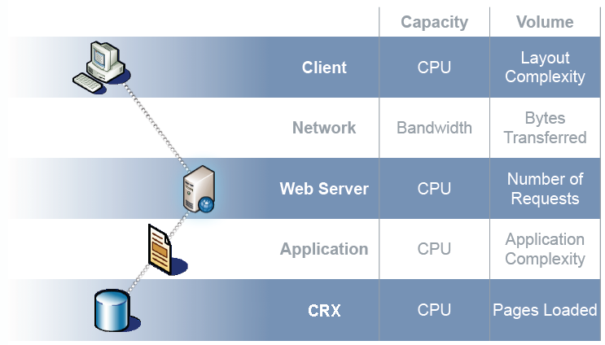

# 效能最佳化 {#performance-optimization}

>[!NOTE]
>
>有關效能的一般准則，請閱讀[效能准則](/help/sites-deploying/performance-guidelines.md)頁。
>
>有關故障排除和修復效能問題的詳細資訊，另請參閱[效能樹](/help/sites-deploying/performance-tree.md)。
>
>此外，您還可以閱讀[效能調整提示的知識庫文章。](https://helpx.adobe.com/experience-manager/kb/performance-tuning-tips.html)

一個主要問題是您的網站回應訪客請求所花的時間。 雖然此值會因每個請求而異，但可定義平均目標值。 一旦此值被證實可達且可維護，即可用來監控網站的效能，並指出潛在問題的發展。

您要針對的回應時間在製作和發佈環境上會有所不同，反映目標對象的不同特性：

## 製作環境 {#author-environment}

作者可輸入及更新內容，即可使用此環境。 更新內容頁面和這些頁面上的個別元素時，這必須適用於個別產生大量效能密集型請求的少數使用者。

## 發佈環境 {#publish-environment}

此環境包含您可供使用者使用的內容。 在這裡，請求數量更大，速度也同樣重要，但由於請求的性質不那麼動態，因此可以應用額外的效能增強機制；例如快取內容或負載平衡。

>[!NOTE]
>
>* 為效能最佳化進行配置後，請按照[Tough Day](/help/sites-developing/tough-day.md)中的過程來測試負載較重的環境。
>* 另請參閱[效能調整提示。](https://helpx.adobe.com/experience-manager/kb/performance-tuning-tips.html)


## 效能最佳化方法 {#performance-optimization-methodology}

AEM專案的效能最佳化方法可歸納為五個非常簡單的規則，可依循這些規則，從一開始就避免效能問題：

1. [優化計畫](#planning-for-optimization)
1. [模擬現實](#simulate-reality)
1. [建立堅實的目標](#establish-solid-goals)
1. [保持相關性](#stay-relevant)
1. [敏捷迭代循環](#agile-iteration-cycles)

這些規則在很大程度上適用於一般的Web項目，並且與項目經理和系統管理員相關，以確保其項目在啟動時不會面臨效能挑戰。

### 優化計畫 {#planning-for-optimization}


在效能最佳化階段，應計畫大約10%的專案工作。 當然，實際的效能最佳化需求將取決於項目的複雜性以及開發團隊的經驗。 雖然您的專案可能（最終）不需要所有分配的時間，但最好一律在建議的區域規劃效能最佳化。

如有可能，應先對有限的對象軟性啟動專案，以收集實際體驗並執行進一步的最佳化，而不必承受完整公告後帶來的額外壓力。

一旦您「上線」，效能最佳化就不會結束。 這是您在系統上遇到「實際」負載的時間點。 在啟動後，請務必規劃其他調整。

由於系統負載更改且系統的效能配置檔案隨時間變化，因此應將效能「調整」或「運行狀況檢查」安排為6-12個月間隔。

### 模擬現實 {#simulate-reality}


如果您與網站上線，並在啟動後發現您遇到效能問題，原因只有一個：您的負載和效能測試並沒有充分模擬現實。

模擬現實是困難的，而您在獲得「真實」方面有多大的投入，取決於您項目的性質。 「真實」不僅代表「真實程式碼」和「真實流量」，也代表「真實內容」，尤其是關於內容大小和結構。 請記住，根據儲存庫的大小和結構，範本的行為可能會完全不同。

### 建立堅實的目標 {#establish-solid-goals}


正確制定業績目標的重要性不容低估。 通常，一旦人們專注於特定的績效目標，就很難在之後改變這些目標，即使這些目標是基於瘋狂的假設。

建立良好、穩健的績效目標，是最棘手的領域之一。 通常最好從可比網站（例如新網站的前身）收集真實記錄和基準。

### 保持相關性 {#stay-relevant}


一次優化一個瓶頸非常重要。 如果您嘗試在未驗證單一最佳化影響的情況下同時執行操作，將無法追蹤到哪個最佳化測量實際上有幫助。

### 敏捷迭代循環 {#agile-iteration-cycles}


效能調整是一個迭代過程，涉及、測量、分析、優化和驗證，直到達到目標。 為了正確考慮這一方面，在優化階段實施敏捷的驗證過程，而不是在每次迭代後執行更重量的測試過程。

這基本上表示實作最佳化的開發人員應該有快速的方法，來判斷最佳化是否已達到目標。 這是有價值的資訊，因為當達到目標時，最佳化就會結束。

## 基本效能指南 {#basic-performance-guidelines}

一般而言，請將未連結的html請求保留在100毫秒以內。 更具體來說，以下可能是指引：

* 70%的頁面請求應在100毫秒內回應。
* 25%的頁面要求應會在100毫秒至300毫秒內收到回應。
* 4%的頁面要求應會在300毫秒至500毫秒內收到回應。
* 1%的頁面要求應會在500ms-1000ms內收到回應。
* 任何頁面的回應速度都不應低於1秒。

上述數字假設下列條件：

* 在發佈時測量（沒有與製作環境相關的開支）
* 在伺服器上測量（無網路開銷）
* 未快取(無AEM輸出快取、無Dispatcher快取)
* 僅適用於具有許多相依性的複雜項目(HTML、JS、PDF、...)
* 系統上沒有其他負載

某些問題經常導致效能問題。 這些主要圍繞：

* Dispatcher快取效率低下
* 在一般顯示範本中使用查詢。

JVM和作業系統級別調整通常不會導致效能大幅提升，因此應在最佳化週期的最後階段執行。

內容存放庫的結構方式也會影響效能。 為獲得最佳效能，內容儲存庫中連接到單個節點的子節點數不應超過1,000個（作為一般規則）。

在通常的效能最佳化練習中，您最好的朋友是：

* `request.log`
* 基於元件的定時
* 最後，但不是最不重要的是Java探查器。

### 載入和編輯數位資產時的效能 {#performance-when-loading-and-editing-digital-assets}

由於載入和編輯數位資產時涉及大量資料，因此效能可能會成為問題。

以下兩件事會影響效能：

* CPU — 多核可讓轉碼時工作更順暢
* 硬碟 — 並行RAID磁碟實現相同

若要改善效能，您可以考慮下列事項：

* 每天要上傳多少資產？ 最佳估計可以基於：


* 進行編輯的時間範圍（通常為工作日的長度，國際作業則更多）。
* 上傳的影像平均大小（以及每個影像產生的轉譯大小）(MB)。
* 確定平均資料率：


* 80%的所有編輯都會在20%的時間完成，因此在峰值時間，您的資料速率將是平均資料速率的4倍。 這是您的績效目標。

## 效能監控 {#performance-monitoring}

效能（或缺少效能）是使用者首先注意到的事項之一，因此，與任何具有使用者介面的應用程式一樣，效能至關重要。 若要最佳化AEM安裝的效能，您必須監控執行個體的各種屬性及其行為。

有關如何執行效能監視的資訊，請參閱[監視效能](/help/sites-deploying/monitoring-and-maintaining.md#monitoring-performance)。

導致效能問題的問題往往很難追蹤，即使它們的效果很容易看到。

基本起點是系統正常運行時對系統的充分了解。 除非您知道環境在正常執行時「外觀」和「行為」如何，否則在效能惡化時很難找到問題。 這意味著，在系統正常運行時，您應該花一些時間調查系統，並確保收集效能資訊是一項持續的任務。 如果效能受到影響，這將為您提供比較的基礎。

下圖說明AEM內容要求可採取的路徑，因此可影響效能的不同元素數目。


效能也是容量和容量之間的平衡：

* **卷**  — 系統處理和傳送的輸出量。
* **容量**  — 系統傳送卷的能力。

這可以在整個Web鏈的不同位置中說明。



有幾個功能領域通常是影響效能的原因：

* 快取
* 應用程式（您的專案）代碼
* 搜尋功能

### 關於效能的基本規則 {#basic-rules-regarding-performance}

在最佳化效能時，應謹記某些規則：

* 效能調整&#x200B;*必須*&#x200B;是每個項目的一部分。
* 請勿在開發週期初期最佳化。
* 效能僅與最薄弱的環節一樣好。
* 始終考慮容量與容量。
* 首先優化重要內容。
* 若沒有&#x200B;*實際*&#x200B;目標，絕不最佳化。

>[!NOTE]
>
>請記住，您用來測量效能的機制通常會影響您嘗試測量的內容。 您應該總是努力解決這些差異，並盡可能消除其影響；尤其是瀏覽器外掛程式應盡可能取消啟用。

## 效能配置 {#configuring-for-performance}

AEM的某些方面（和/或基礎存放庫）可進行設定，以最佳化效能。 以下是可能性和建議，您必須先確定是否或如何使用相關功能，才能進行變更。

>[!NOTE]
>
>有關其他資訊，請參閱[KB文章](https://helpx.adobe.com/experience-manager/kb/performance-tuning-tips.html)。

### 搜尋索引 {#search-indexing}

從AEM 6.0開始，Adobe Experience Manager使用Oak型存放庫架構。

您可以在此處找到更新的索引資訊：

* [查詢和建立索引的最佳實務](/help/sites-deploying/best-practices-for-queries-and-indexing.md)
* [查詢和索引](/help/sites-deploying/queries-and-indexing.md)

### 同時處理工作流程 {#concurrent-workflow-processing}

限制並行運行的工作流進程的數量以提高效能。 依預設，工作流引擎會並行處理許多工作流，與Java VM可用的處理器一樣多。 當工作流步驟需要大量處理資源（RAM或CPU）時，並行運行其中幾個工作流可能會對可用伺服器資源帶來高需求。

例如，上傳影像（或一般的DAM資產）時，工作流程會自動將影像匯入DAM。 影像通常是高解析度的，並且可以輕鬆地佔用數百MB的堆進行處理。 並行處理這些影像會給儲存器子系統和垃圾收集器帶來高負載。

工作流程引擎使用Apache Sling工作佇列來處理和排程工作項目處理。 下列作業佇列服務依預設已從Apache Sling Job Queue Configuration Service Factory建立，用於處理工作流程作業：

* Granite工作流程佇列：大部分的工作流程步驟（例如處理DAM資產的步驟）都會使用Granite工作流程佇列服務。
* Granite工作流外部進程作業隊列：此服務用於特殊的外部工作流步驟，通常用於聯繫外部系統和輪詢結果。 例如，InDesign媒體擷取程式步驟會實作為外部程式。 工作流程引擎使用外部佇列來處理輪詢。 (請參閱[com.day.cq.workflow.exec.WorkflowExternalProcess](https://helpx.adobe.com/experience-manager/6-5/sites/developing/using/reference-materials/javadoc/com/day/cq/workflow/exec/WorkflowExternalProcess.html)。)

配置這些服務以限制並行運行的工作流進程的最大數量。

>[!NOTE]
>
>配置這些作業隊列會影響所有工作流，除非您已為特定工作流模型建立了作業隊列（請參閱下面的[為特定工作流模型配置隊列](/help/sites-deploying/configuring-performance.md#configure-the-queue-for-a-specific-workflow)）。

#### 儲存庫中的設定 {#configuration-in-the-repo}

如果您使用sling:OsgiConfig節點](/help/sites-deploying/configuring-osgi.md#adding-a-new-configuration-to-the-repository)來設定服務[，則需要找到現有服務的PID，例如：org.apache.sling.event.jobs.QueueConfiguration.370aad73-d01b-4a0b-abe4-20198d85f705。 您可以使用Web控制台來發現PID。

您需要配置名為`queue.maxparallel`的屬性。

#### Web主控台中的設定 {#configuration-in-the-web-console}

若要使用Web控制台](/help/sites-deploying/configuring-osgi.md#osgi-configuration-with-the-web-console)配置這些服務[，請在Apache Sling Job Queue Configuration Service工廠下方找到現有配置項。

您需要配置名為「最大並行作業數」的屬性。

### 配置特定工作流的隊列 {#configure-the-queue-for-a-specific-workflow}

為特定工作流模型建立作業隊列，以便為該工作流模型配置作業處理。 如此一來，您的設定會影響特定工作流程的處理，而預設Granite工作流程佇列的設定則會控制其他工作流程的處理。

執行工作流程模型時，會針對特定主題建立Sling作業。 依預設，主題會符合為一般Granite工作流程佇列或Granite工作流程外部程式工作佇列所設定的主題：

* `com/adobe/granite/workflow/job*`
* `com/adobe/granite/workflow/external/job*`

工作流模型生成的實際作業主題包括模型特定尾碼。 例如， **DAM更新資產**&#x200B;工作流程模型會產生具有下列主題的作業：

`com/adobe/granite/workflow/job/etc/workflow/models/dam/update_asset/jcr_content/model`

因此，您可以為主題建立與工作流模型的作業主題匹配的作業隊列。 配置隊列的效能相關屬性只會影響生成與隊列主題匹配的作業的工作流模型。

以下過程使用&#x200B;**DAM更新資產**&#x200B;工作流建立工作流的作業隊列。

1. 執行要為其建立作業隊列的工作流模型，以便生成主題統計資訊。 例如，將影像新增至「資產」以執行&#x200B;**DAM更新資產**&#x200B;工作流程。
1. 開啟Sling作業主控台(`https://<host>:<port>/system/console/slingevent`)。
1. 探索主控台中與工作流程相關的主題。 若為DAM更新資產，會找到下列主題：

   * `com/adobe/granite/workflow/external/job/etc/workflow/models/dam/update_asset/jcr_content/model`
   * `com/adobe/granite/workflow/job/etc/workflow/models/dam/update_asset/jcr_content/model`
   * `com/adobe/granite/workflow/job/etc/workflow/models/dam-xmp-writeback/jcr_content/model`

1. 為每個主題建立一個作業隊列。 若要建立作業佇列，請為Apache Sling Job Queue工廠服務建立工廠設定。

   工廠配置類似於[併發工作流處理](/help/sites-deploying/configuring-performance.md#concurrent-workflow-processing)中描述的Granite工作流隊列，但主題屬性與工作流作業的主題匹配。

### AEM DAM Asset Synchronization Service {#cq-dam-asset-synchronization-service}

`AssetSynchronizationService`用於從掛載的儲存庫（包括LiveLink、Documentum等）同步資產。 預設情況下，每300秒（5分鐘）會進行一次定期檢查，因此，如果您不使用已裝載的儲存庫，則可以禁用此服務。

這是透過[設定OSGi服務](/help/sites-deploying/configuring-osgi.md) **CQ DAM資產同步服務**&#x200B;來完成，以將&#x200B;**同步期間**(`scheduler.period`)設為（最少1年）（以秒為單位定義）。

### 多個DAM例項 {#multiple-dam-instances}

部署多個DAM例項可在下列情況下提供效能：

* 因為經常為製作環境上傳大量資產，導致負載過高；此處可將個別的DAM例項專用於為作者提供服務。
* 您在全球各地擁有多個團隊（例如美國、歐洲、亞洲）。

其他考量事項包括：

* 將作者的「進行中的工作」與發佈的「最終」分開
* 將作者的內部使用者與發佈時的外部訪客/使用者分開（例如代理、新聞代表、客戶、學生等）。

## 品質保證最佳實務 {#best-practices-for-quality-assurance}

效能對您的發佈環境至關重要。 因此，在實作專案時，您必須仔細規劃和分析針對發佈環境所進行的效能測試。

本節旨在標準化概述在&#x200B;*publish*&#x200B;環境中為效能測試專門定義測試概念時所涉及的問題。 這主要是QA工程師、項目經理和系統管理員感興趣的。

以下內容涵蓋在&#x200B;*Publish*&#x200B;環境中針對AEM應用程式進行效能測試的標準化方法。 這包括下列5個階段：

* [知識驗證](#verification-of-knowledge)
* [範圍的定義](#scope-definition)
* [測試方法](#test-methodologies)
* [績效目標的定義](#defining-the-performance-goals)
* [最佳化](#optimization)

控制是一個附加的、包羅永珍的過程 — 必要但不限於測試。

### 知識驗證 {#verification-of-knowledge}

第一步是記錄您在開始測試之前需要知道的基礎資訊：

* 測試環境的架構
* 詳細說明需要測試的內部元素的應用程式映射（隔離和組合）

#### 測試架構 {#test-architecture}

您應清楚記錄用於效能測試的測試環境的架構。

您需要重制您的計畫生產發佈環境，以及Dispatcher和負載平衡器。

#### 應用程式圖 {#application-map}

若要取得清楚的概觀，您可以建立整個應用程式的地圖（您很可能會透過製作環境上的測試取得）。

應用程式內部元素的圖表表示，可提供測試需求的概述；使用顏色編碼，還可以作為報告的基礎。

### 範圍定義 {#scope-definition}

應用程式通常會有一系列使用案例。 有些將非常重要，有些則不那麼重要。

若要將效能測試的範圍集中在發佈上，建議您定義：

* 最重要的業務使用案例
* 最關鍵的技術使用案例

使用案例的數量由您決定，但應限制在可輕鬆管理的數量（例如5到10之間）。

選取關鍵使用案例後，就可針對每個案例定義關鍵績效指標(KPI)和用來測量它們的工具。 常見KPI的範例包括：

* 端到端響應時間
* Servlet回應時間
* 單一元件的回應時間
* 服務的響應時間
* 線程池中的空閒線程數
* 空閒連接數
* 系統資源，如CPU和I/O訪問

### 測試方法 {#test-methodologies}

此概念有4種用於定義和測試效能目標的方案：

* 單元測試
* 組合元件測試
* *正在發* 生
* 錯誤情況

根據以下原則。

#### 元件斷點 {#component-breakpoints}

* 每個元件在與效能相關時都有特定的中斷點。 這表示元件在達到特定點之前，會顯示良好的效能，之後效能會快速降低。
* 要獲取應用程式的完整概覽，必須首先驗證元件以確定到達每個斷點的時間。
* 要查找斷點，可以執行負載測試，在一段時間內，可以增加用戶數以建立不斷增加的負載。 透過監控此負載和元件的回應，您將在達到元件的中斷點時遇到特定的效能行為。 該點可依每秒的同時交易數，以及同時使用者的數量（如果元件對此KPI很敏感）來限定。
* 然後，這些資訊可作為改進的基準，指出所使用測量的效率，並有助於定義測試情況。

#### 交易 {#transactions}

* 術語事務用於表示完整網頁的請求，包括頁面本身和所有後續呼叫；即頁面要求、任何AJAX呼叫、影像和其他物件。**請求向下切入**
* 若要完全分析每個請求，您可以代表呼叫堆疊的每個元素，然後匯總每個請求的平均處理時間。

### 定義績效目標 {#defining-the-performance-goals}

定義範圍和相關KPI後，即可設定特定的績效目標。 這包括設計測試案例和目標值。

您需要在平均和峰值條件下測試效能。 此外，您還需要「上線」案例測試，以確保您能在網站首次開放時，迎合對您網站的興趣。

您從現有網站收集到的任何體驗或統計資料，在決定未來目標時也可能有用；例如來自您已上線網站的最上層流量。

#### 單一元件測試 {#single-component-tests}

關鍵元件需要在平均和峰值條件下進行測試。

在這兩種情況下，當預定義的用戶數使用系統時，您可以定義每秒的預期事務數。

| 元件 | 測試類型 | 否. 使用者 | Tx/秒（預期） | Tx/秒（已測試） | 說明 |
|---|---|---|---|---|---|
| 首頁單一使用者 | 平均 | 1 | 3 |  |  |
|  | 峰值 | 3 | 3 |  |  |
| 首頁100個用戶 | 平均 | 100 | 3 |  |  |
|  | 峰值 | 100 | 3 |  |

#### 組合元件測試 {#combined-component-tests}

組合測試元件可更密切地反映應用程式行為。 必須再次測試平均和峰值條件。

| 藍本 | 元件 | 否. 使用者 | Tx/秒（預期） | Tx/秒（已測試） | 說明 |
|---|---|---|---|---|---|
| 混合平均 | 首頁 | 10 | 3 |  |  |
|  | 搜尋 | 10 | 3 |  |  |
|  | 新聞 | 10 | 2 |  |  |
|  | 事件 | 10 | 3 |  |  |
|  | 啟用 | 10 | 3 |  | 作者行為模擬。 |
| 混合峰 | 首頁 | 100 | 5 |  |  |
|  | 搜尋 | 50 | 5 |  |  |
|  | 新聞 | 100 | 10 |  |  |
|  | 事件 | 100 | 10 |  |  |
|  | 啟用 | 20 | 20 |  | 作者行為模擬。 |

#### 正在進行即時測試 {#going-live-tests}

在網站推出後的頭幾天，您會預期興趣會增加。 這可能會比您測試的峰值還要大。 強烈建議測試「上線」案例，以確保系統可應付此情況。

| 藍本 | 測試類型 | 否. 使用者 | Tx/秒（預期） | Tx/秒（已測試） | 說明 |
|---|---|---|---|---|---|
| 正在達到高峰 | 首頁 | 200 | 20 |  |  |
|  | 搜尋 | 100 | 10 |  |  |
|  | 新聞 | 200 | 20 |  |  |
|  | 事件 | 200 | 20 |  |  |
|  | 啟用 | 20 | 20 |  | 作者行為模擬。 |

#### 錯誤方案測試 {#error-scenario-tests}

還必須測試錯誤情況，以確保系統能正確和適當地反應。 不僅在於錯誤本身的處理方式，而且可能對效能造成的影響。 例如：

* 當使用者嘗試在搜尋方塊中輸入無效的搜尋詞時，會發生什麼事
* 當搜尋詞非常一般，以致傳回過多結果時，會發生什麼事

在設計這些測試時，應記住並非所有情況都會定期發生。 但是，它們對整個系統的影響很重要。

| 錯誤方案 | 錯誤類型 | 否. 使用者 | Tx/秒（預期） | Tx/秒（已測試） | 說明 |
|---|---|---|---|---|---|
| 搜尋元件過載 | 搜索全局通配符（星號） | 10 | 3 |  | 僅&amp;ast;&amp;ast;&amp;ast;中。 |
|  | 停止字 | 20 | 2 |  | 正在搜索停止詞。 |
|  | 空字串 | 10 | 3 |  | 正在搜索空字串。 |
|  | 特殊字元 | 10 | 3 |  | 搜尋特殊字元。 |

#### 耐力測試 {#endurance-tests}

只有在系統連續運行一段時間後，才會遇到某些問題；無論是幾小時，甚至幾天。 使用耐久性測試來測試在所需時間週期內的恆定平均負載。 然後，可以分析任何效能降低。

| 藍本 | 測試類型 | 否. 使用者 | Tx/秒（預期） | Tx/秒（已測試） | 說明 |
|---|---|---|---|---|---|
| 耐力測試（72小時） | 首頁 | 10 | 3 |  |  |
|  | 搜尋 | 10 | 3 |  |  |
|  | 新聞 | 20 | 2 |  |  |
|  | 事件 | 10 | 3 |  |  |
|  | 啟用 | 3 | 3 |  | 作者行為模擬。 |

### 最佳化 {#optimization}

在實施的後續階段，您需要優化應用程式，以實現/最大化效能目標。

您必須測試所做的任何最佳化，以確保具備：

* 不影響功能
* 已通過負載測試驗證，然後才釋放

提供一系列工具，可幫助您進行負載生成、效能監控和/或結果分析：

* [JMeter](https://jakarta.apache.org/jmeter/)
* [載入運行器](https://www.microfocus.com/en-us/products/loadrunner-load-testing/overview)
* [](https://www.determyne.com/) DetrymyneInsideApps
* [InfraRED](https://www.infraredsoftware.com/)
* [Java互動式設定檔](https://jiprof.sourceforge.net/)
* 還有更多……

最佳化後，您需要再次測試以確認影響。

### 報告 {#reporting}

需要持續報告，才能讓每個人都知道狀態，如前所述，架構圖可用色彩編碼來完成。

完成所有測試後，您將要報告：

* 遇到任何嚴重錯誤
* 仍需進一步調查的非關鍵問題
* 測試期間所作的任何假設
* 測試產生的任何建議

## 使用Dispatcher時最佳化效能 {#optimizing-performance-when-using-the-dispatcher}

[Dispatcher](https://helpx.adobe.com/experience-manager/dispatcher/using/dispatcher.html)是Adobe的快取和/或負載平衡工具。 使用Dispatcher時，您應考慮針對快取效能最佳化您的網站。

>[!NOTE]
>
>Dispatcher版本與AEM無關，但AEM檔案內嵌有Dispatcher檔案。 請一律使用檔案中內嵌的Dispatcher檔案，以取得最新版AEM。
>
>如果您依循連結至 Dispatcher 文件，且該連結內嵌於舊版 AEM 的文件中，您可能會被重新導向至本頁。

Dispatcher提供許多內建機制，如果您的網站善用這些機制，您可以用它來最佳化效能。 本節說明如何設計您的網站，以發揮快取的最大效益。

>[!NOTE]
>
>這可協助您記住，Dispatcher會將快取儲存在標準Web伺服器上。 這表示您：
>
>* 可以使用URL將您可儲存為頁面並要求的所有內容快取
>* 無法儲存其他項目，例如Cookie、工作階段資料和表單資料。

>
>一般而言，許多快取策略都需要選取好的URL，而不需仰賴這些額外資料。
>
>若使用Dispatcher 4.1.11版，您也可以快取回應標題，請參閱「快取HTTP回應標題」](https://helpx.adobe.com/experience-manager/dispatcher/using/dispatcher-configuration.html#configuring-the-dispatcher-cache-cache)。[

### 計算Dispatcher快取比率 {#calculating-the-dispatcher-cache-ratio}

快取比率公式估計快取處理的請求數百分比，佔進入系統的請求總數。 要計算快取比率，需要執行以下操作：

* 請求總數。 此資訊可在Apache `access.log`中找到。 如需詳細資訊，請參閱[官方Apache檔案](https://httpd.apache.org/docs/2.4/logs.html#accesslog)。

* Publish例項所提供的請求數。 此資訊可在執行個體的`request.log`中取得。 如需詳細資訊，請參閱[解譯request.log](/help/sites-deploying/monitoring-and-maintaining.md#interpreting-the-request-log)和[尋找記錄檔](/help/sites-deploying/monitoring-and-maintaining.md#finding-the-log-files)。

計算快取比率的公式為：

* （請求總數&#x200B;**減去**&#x200B;發佈時的請求數）**除以**&#x200B;請求總數。

例如，如果請求總數為129491，而Publish例項提供的請求數為58959，則快取比率為：**(129491 - 58959)/129491= 54.5%**。

如果您沒有一對一的發佈者/Dispatcher配對，則需要將來自所有Dispatcher和發佈者的請求新增到一起，才能取得精確的測量。 另請參閱[建議部署](/help/sites-deploying/recommended-deploys.md)。

>[!NOTE]
>
>為獲得最佳效能，Adobe建議快取比率為90%到95%。

#### 使用一致的頁面編碼 {#using-consistent-page-encoding}

使用Dispatcher 4.1.11版，您可以快取回應標題。 如果您不是在Dispatcher上快取回應標題，則如果您將頁面編碼資訊儲存在標題中，就會發生問題。 在此情況下，當Dispatcher從快取中提供頁面時，頁面會使用Web伺服器的預設編碼。 有兩種方法可以避免此問題：

* 如果您只使用一種編碼，請確定Web伺服器上使用的編碼與AEM網站的預設編碼相同。
* 在HTML `head`區段中使用`<META>`標籤來設定編碼，如下列範例所示：

```xml
        <META http-equiv="Content-Type" content="text/html; charset=EUC-JP">
```

#### 避免URL參數 {#avoid-url-parameters}

如有可能，請避免要快取之頁面的URL參數。 例如，如果您有圖片庫，則不會快取下列URL（除非Dispatcher已相應地設定[](https://helpx.adobe.com/experience-manager/dispatcher/using/dispatcher-configuration.html#configuring-the-dispatcher-cache-cache)）:

```xml
www.myCompany.com/pictures/gallery.html?event=christmas&amp;page=1
```

不過，您可以將這些參數放入頁面URL中，如下所示：

```xml
www.myCompany.com/pictures/gallery.christmas.1.html
```

>[!NOTE]
>
>此URL會呼叫與`gallery.html`相同的頁面和範本。 在範本定義中，您可以指定哪個指令碼轉譯頁面，或對所有頁面使用相同的指令碼。

#### 依URL自訂 {#customize-by-url}

如果您允許使用者變更字型大小（或任何其他版面自訂），請確定URL中反映不同的自訂。

例如，系統不會快取Cookie，因此若您將字型大小儲存在Cookie中（或類似的機制），則不會為快取頁面保留字型大小。 因此，Dispatcher會隨機傳回任何字型大小的檔案。

在URL中加入字型大小作為選取器可避免此問題：

```xml
www.myCompany.com/news/main.large.html
```

>[!NOTE]
>
>對於大多數的版面方面，也可以使用樣式表和/或用戶端指令碼。 這些功能在快取方面通常非常有效。
>
>在列印版本中，這也很實用，您可以在其中使用URL，例如：
>
>`www.myCompany.com/news/main.print.html`
>
>使用模板定義的指令碼全域功能，可以指定一個單獨的指令碼來呈現打印頁。

#### 使用作標題的影像檔案失效 {#invalidating-image-files-used-as-titles}

如果您將頁面標題或其他文字呈現為圖片，則建議儲存這些檔案，以便在頁面上的內容更新時刪除這些檔案：

1. 將影像檔案放置在與頁面相同的資料夾中。
1. 對影像檔案使用以下命名格式：

   `<page file name>.<image file name>`

例如，您可以將頁面的標題`myPage.html`儲存在`file myPage.title.gif`中。 如果頁面更新，則會自動刪除此檔案，因此對頁面標題所做的任何變更都會自動反映在快取中。

>[!NOTE]
>
>影像檔案不一定實際存在於AEM例項上。 您可以使用動態建立影像檔案的指令碼。 Dispatcher接著會將檔案儲存在Web伺服器上。

#### 使用於導航的影像檔案失效 {#invalidating-image-files-used-for-navigation}

如果您使用圖片作為導航條目，則方法與標題基本相同，只是略微複雜。 將所有導航影像與目標頁面一起儲存。 如果您將兩張圖片用於正常和活動，則可以使用以下指令碼：

* 正常顯示頁面的指令碼。
* 處理「.normal」請求並傳回一般圖片的指令碼。
* 處理「.active」請求並返回激活圖片的指令碼。

請務必使用與頁面相同的命名控制代碼建立這些圖片，以確保內容更新會刪除這些圖片和頁面。

對於未修改的頁面，圖片仍會保留在快取中，儘管頁面本身通常會自動失效。

#### 個性化 {#personalization}

建議您將個人化限制在必要的位置。 說明原因：

* 如果您使用可自由自訂的開始頁面，則每次使用者要求時，都必須組成該頁面。
* 相較之下，如果您提供10個不同的開始頁面選項，則可以快取其中每一個頁面，從而提高效能。

>[!TIP]
>如需設定Dispatcher快取的詳細資訊，請參閱[AEM Dispatcher快取教學課程](https://experienceleague.adobe.com/docs/experience-manager-learn/dispatcher-tutorial/overview.html)及其關於[快取保護內容的區段。](https://experienceleague.adobe.com/docs/experience-manager-learn/dispatcher-tutorial/chapter-1.html#dispatcher-tips-and-tricks)

如果您個人化每個頁面（例如將使用者名稱放入標題列），可能會影響效能。

>[!TIP]
>有關快取安全內容的資訊，請參閱Dispatcher指南中的[快取安全內容](https://experienceleague.adobe.com/docs/experience-manager-dispatcher/using/configuring/permissions-cache.html)。

若要在單一頁面上混合限制內容和公開內容，您可以考慮採用在Dispatcher中納入伺服器端，或在瀏覽器中透過Ajax納入用戶端的策略。

>[!TIP]
>
>如需處理混合的公用和受限內容，請參閱[設定Sling Dynamic Include。](https://experienceleague.adobe.com/docs/experience-manager-learn/foundation/development/set-up-sling-dynamic-include.html)

#### 黏著連線 {#sticky-connections}

[黏著](https://helpx.adobe.com/experience-manager/dispatcher/using/dispatcher.html#the-benefits-of-load-balancing) 連線，確保同一個使用者的檔案都是在同一台伺服器上撰寫。如果使用者離開此資料夾，稍後返回該資料夾，連線仍會持續。 定義一個資料夾，以保留網站需要黏著連線的所有檔案。 請盡量不要有其他檔案。 如果您使用個人化頁面和工作階段資料，這會影響負載平衡。

#### MIME類型 {#mime-types}

瀏覽器有兩種方式可判斷檔案類型：

1. 透過其擴充功能(例如`.html`、`.gif`、`.jpg`等)
1. 由伺服器隨檔案傳送的MIME類型。

對於大多數檔案，副檔名中隱含MIME類型。 i.e.:

1. 透過其擴充功能(例如`.html`、`.gif`、`.jpg`等)
1. 由伺服器隨檔案傳送的MIME類型。

如果檔案名沒有副檔名，則會顯示為純文字。

使用Dispatcher 4.1.11版，您可以快取回應標題。 如果您沒有在Dispatcher上快取回應標題，請注意MIME類型是HTTP標題的一部分。 因此，如果AEM應用程式傳回的檔案未辨識為結尾，而是仰賴MIME類型，這些檔案可能會不正確顯示。

要確保正確快取檔案，請遵循以下准則：

* 請確定檔案的副檔名一律正確。
* 避免一般檔案伺服指令碼，這些指令碼具有`download.jsp?file=2214`等URL。 重寫指令碼以使用包含檔案規範的URL。 在上一個範例中，這會是`download.2214.pdf`。

## 備份效能 {#backup-performance}

本節介紹一系列基準，用於評估AEM備份的效能以及備份活動對應用程式效能的影響。 AEM備份在運行時會給系統帶來很大負載，我們會測量這一情況，以及嘗試調制這些效果的備份延遲設定的影響。 其目標是提供一些參考資料，說明在實際配置和生產資料數量中備份的預期效能，並就如何估計計畫系統的備份時間提供指導。

### 參考環境 {#reference-environment}

#### 物理系統 {#physical-system}

本文檔中報告的結果來自在參考環境中運行的基準，其配置如下。 此配置的設計與資料中心中的典型生產環境類似：

* H-P ProLiant DL380 G6,8個CPU x 2.533 GHz
* 串列連接SCSI 300GB 10,000RPM驅動器
* 硬體RAID控制器；RAID0+5陣列中有8個驅動器
* VMware映像CPU x 2英特爾至強E5540 @ 2.53GHz
* RedHat Linux 2.6.18-194.el5;Java 1.6.0_29
* 單一製作例項

此伺服器上的磁碟子系統速度相當快，它代表了可能用於生產伺服器的高效能RAID配置。 備份效能對磁碟效能很敏感，而此環境中的結果反映了在非常快的RAID配置上的效能。 VMWare映像配置為在RAID陣列上具有物理駐留在本地磁碟儲存中的單個大磁碟卷。

AEM設定會將存放庫和資料存放區放置在相同的邏輯卷上，並與所有作業系統和AEM軟體一起。 用於備份的目標目錄也駐留在此邏輯檔案系統上。

#### 資料卷 {#data-volumes}

下表說明了備份基準中使用的資料卷的大小。 首先安裝初始基線內容，然後添加額外的已知資料量以增加備份內容的大小。 系統會以特定增量建立備份，以代表內容大幅增加，以及一天內可能產生的內容。 內容（頁面、影像、標籤）的分配將大致以真實的生產資產構成為基礎。 頁面、影像和標籤最多將限制為800個子頁面。 每個頁面都包含標題、Flash、文字/影像、影片、投影片、表單、表格、雲端和轉盤元件。 映像將從400個不重複檔案的池中上載，大小從37千位到594千位。

| 內容 | 節點 | 頁面 | 影像 | 標記 |
|---|---|---|---|---|
| 基本安裝 | 69 610 | 562 | 256 | 237 |
| 用於增量備份的小內容 |  | +100 | +2 | +2 |
| 用於完整備份的大內容 |  | +10 000 | +100 | +100 |

每次重複時添加的附加內容集會重複備份基準。

#### 基準方案 {#benchmark-scenarios}

備份基準包括兩種主要情形：在系統處於嚴重應用程式負載下時進行備份，在系統空閒時進行備份。 雖然一般建議在AEM盡可能空閒時執行備份，但在某些情況下，系統負載不足時必須運行備份。

* **空閒狀態**  — 執行備份時，AEM上沒有其他活動。
* **在負載下**  — 當系統從聯機進程中的負載低於80%時執行備份。備份延遲變化，以查看對負載的影響。

從AEM伺服器記錄檔中取得備份時間和產生的備份大小。 通常建議在AEM空閒時（如半夜）將備份安排為非時間。 這種情況是建議方法的代表。

Load將包含頁面建立/刪除、周遊和查詢，其中大部分的載入來自頁面周遊和查詢。 新增和移除太多頁面會持續增加工作區大小，使備份無法完成。 指令碼將使用的載入分佈為75%的頁面周遊、24%的查詢和1%的頁面建立（沒有巢狀子頁面的單級）。 空閒系統上每秒的峰值平均事務數是通過4個併發線程實現的，這是在負載下測試備份時將使用的線程數。

負載對備份效能的影響可以通過使用和不使用此應用程式負載時的效能之間的差異來估計。 通過比較每小時事務中的方案吞吐量，以及當前和未進行並行備份，以及備份以不同的「備份延遲」設定運行，可以發現備份對應用程式吞吐量的影響。

* **延遲設定**  — 在幾種情況下，我們還使用10毫秒（預設值）、1毫秒和0毫秒來更改備份延遲設定，以探討此設定如何影響備份的效能。
* **備份類型**  — 所有備份都是儲存庫的外部備份，但不建立zip，除非在比較時直接使用tar命令。由於增量備份不能建立到zip檔案，或者當以前的完整備份是zip檔案時，備份目錄方法是生產情況中最常使用的方法。

### 結果摘要 {#summary-of-results}

#### 備份時間和吞吐量 {#backup-time-and-throughput}

這些基準的主要結果是顯示備份時間隨備份類型和資料總量的變化情況。 下圖顯示了使用預設備份配置獲得的備份時間，其形式是總頁數的函式。


空閒實例上的備份時間相當一致，平均為0.608 MB/s，而不考慮完整備份或增量備份（請參見下圖）。 備份時間只是備份資料量的函式。 完成完整備份的時間會隨著頁面總數而明顯增加。 完成增量備份的時間也隨著頁面總數而增加，但速度要慢得多。 由於備份的資料量相對較少，完成增量備份所花的時間要短得多。

備份的大小是完成備份所花費時間的主要決定因素。 下圖顯示了最終備份大小所花費的時間。


此圖表說明，增量備份和完整備份都遵循簡單的大小與時間模式，我們可以將這些模式作為吞吐量進行衡量。 空閒實例上的備份時間相當一致，平均為0.61 MB/秒，而不考慮基準環境中的完整備份或增量備份。

#### 備份延遲 {#backup-delay}

提供備份延遲參數以限制備份可能干擾生產工作負載的程度。 參數指定了以毫秒為單位的等待時間，該時間會逐個插入到備份操作中。 整體效果部分取決於受影響的檔案大小。 以MB/秒衡量備份效能提供了比較延遲對備份的影響的合理方法。

* 與常規應用程式負載同時運行備份將對常規負載的吞吐量產生負面影響。
* 影響可能很小（僅為5%），也可能非常顯著，導致吞吐量下降75%，而這可能取決於應用程式而非任何內容。
* 備份在CPU上不是很重的負載，因此，與I/O密集型工作負載相比，備份對CPU密集型生產工作負載的影響較小。


要比較使用檔案系統備份（使用&#39;tar&#39;）備份同一儲存庫檔案時獲得的吞吐量。 tar的效能可比，但略高於將延遲設為零的備份。 即使設定一個小延遲，也會大大降低備份吞吐量，而10毫秒的預設延遲將大大降低吞吐量。 在備份可能在總體應用程式使用率很低或應用程式完全空閒時進行計畫的情況下，最好將延遲降低到預設值以下，以便允許備份更快地進行。

持續備份的應用程式吞吐量的實際影響取決於應用程式和基礎架構的詳細資訊。 延遲值的選擇應通過應用程式的經驗分析進行，但應盡可能小，以便備份能盡快完成。 由於延遲值的選擇與對應用程式吞吐量的影響之間只存在微弱的關聯，因此選擇延遲應有利於縮短總體備份時間，以最大限度地減少備份的整體影響。 備份需要8小時才能完成，但對吞吐量的影響是–20%，其總體影響可能比完成需要2小時但對吞吐量的影響是–30%的備份大。

### 引用 {#references}

* [管理 — 備份和還原](/help/sites-administering/backup-and-restore.md)
* [管理 — 容量和卷](/help/managing/best-practices-further-reference.md#capacity-and-volume)
