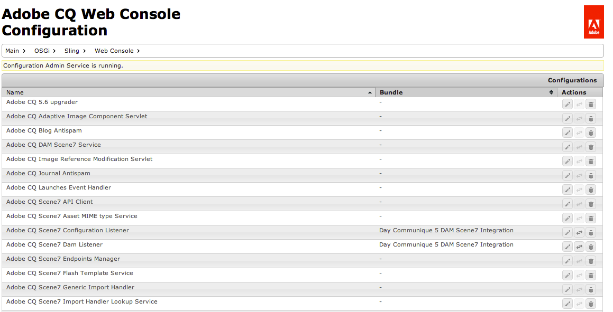
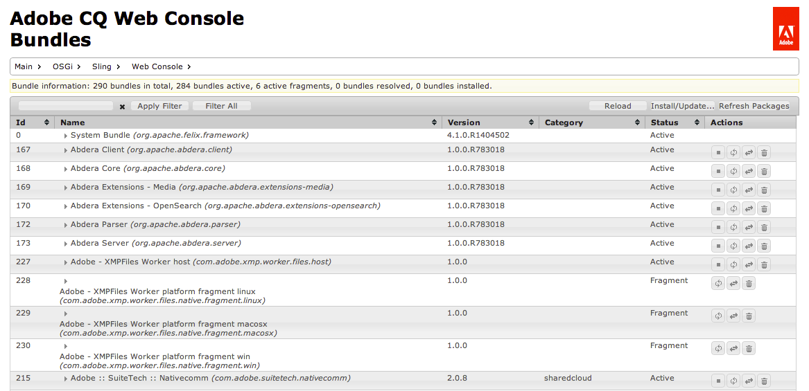

# Web 控制台{#web-console}

AEM中的Web主控台以 [Apache Felix Web Management Console為基礎](https://felix.apache.org/documentation/subprojects/apache-felix-web-console.html)。 Apache Felix是建置OSGi R4服務平台的社群努力，此平台包含OSGi架構和標準服務。

>[!NOTE]
>
>在Web主控台上，任何提及預設設定的說明都與Sling預設值相關。
>
>AEM有其專屬的預設值，因此預設集可能與主控台上記載的不同。

Web控制台提供一系列標籤，以維護OSGi捆綁包，包括：

* [配置](#configuration):用於設定OSGi組合，因此是設定AEM系統參數的基礎機制
* [組合](#bundles):用於安裝捆綁
* [元件](#components):用於控制AEM所需元件的狀態

所做的任何更改都會立即應用於運行的系統。 不需要重新啟動。

控制台可從 `../system/console`;例如：

`http://localhost:4502/system/console/components`

## 設定 {#configuration}

「 **Configuration** 」（設定）標籤可用來設定OSGi叢集，因此是設定AEM系統參數的基礎機制。

>[!NOTE]
>
>如需詳 [細資訊，請參閱OSGi Configuration with the Web Console](/help/sites-deploying/configuring-osgi.md#osgi-configuration-with-the-web-console) 。

Configuration **(配置** )頁籤可通過以下任一方式訪問：

* 下拉式功能表：

   **OSGi >**

* 網址；例如：

   `http://localhost:4502/system/console/configMgr`

將顯示配置清單：

此螢幕上的下拉清單提供兩種配置類型：

* **設定**

   允許您更新現有配置。 這些識別碼具有永久性識別碼(PID)，可以是：

   * AEM的標準與整體；如果刪除，則需要這些值，這些值將返回預設設定。
   * 從工廠配置建立的實例；這些實例由用戶建立，刪除操作會刪除實例。

* **工廠配置**

   允許您建立所需功能對象的實例。

   這將被分配為「永久身份」，然後列在「配置」下拉清單中。

從清單中選擇任何條目將顯示與該配置相關的參數：

然後，您可以視需要更新參數，以及：

* **儲存**

   儲存所做的變更。

   對於工廠配置，這將建立具有持久身份的新實例。 然後，新實例將列在「配置」下。

* **重設**

   將螢幕上顯示的參數重置為上次保存的參數。

* **刪除**

   刪除當前配置。 如果為標準，則參數會返回到預設設定。 如果從「工廠配置」建立，則刪除特定實例。

* **解除系結**

   從包中解除綁定當前配置。

* **取消**

   取消任何目前的變更。

## 組合 {#bundles}

「 **Bundles** 」(Bundles)頁籤是安裝AEM所需OSGi捆綁的機制。 該頁籤可通過以下任一方法訪問：

* 下拉式功能表：

   **OSGi >**

* 網址；例如：

   `http://localhost:4502/system/console/bundles`

將顯示捆綁的清單：

使用此頁籤，您可以：

* **安裝或更新**

   您可以 **瀏覽** ，以尋找包含您的套件的檔案，並指定是否應立即開始 **，以及開始** 層級 ****。

* **重新載入**

   重新整理顯示的清單。

* **刷新包**

   這將檢查所有包的引用並根據需要刷新。

   例如，在更新後，舊版和新版可能仍會因先前的參考而執行。 此選項將檢查並移動對新版本的所有引用，使舊版本停止。

* **啟動**

   根據指定的開始級別啟動包。

* **停止**

   停止打包。

* **解除安裝**

   從系統中卸載包。

* **查看狀態**

   該清單指定了包的當前狀態；按一下特定包的名稱並顯示詳細資訊。

>[!NOTE]
>
>在更 **新後** ，建議執行刷新 **包**。

## 元件 {#components}

「組 **件** 」(Components)頁籤允許您啟用和／或禁用各種元件。 您可以透過下列其中一種方式存取：

* 下拉式功能表：

   **主要 >**

* 網址；例如：

   `http://localhost:4502/system/console/components`

將會顯示元件清單。 您可使用各種圖示來啟用、停用或（視情況）開啟特定元件的設定詳細資訊。

按一下特定元件的名稱，將會顯示其狀態的詳細資訊。 您也可以在這裡啟用、停用或重新載入元件。

>[!NOTE]
>
>啟用或停用時，元件只會套用到AEM/CRX重新啟動。
>
>啟動狀態在元件描述符中定義，該描述符在開發期間生成，並在包建立時儲存在包中。

