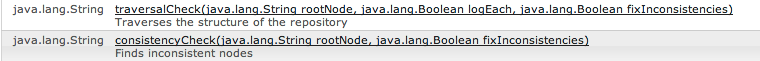

# 一致性和遍歷檢查{#consistency-and-traversal-checks}

升級時，工作區不一致可能會造成問題。 您可以執行測試升級以查看這是否是問題，或執行一致性檢查作為預防性操作。

如果您執行因工作區不一致而失敗的測試升級，您會看到類似crx-quickstart/logs/crx/error.log中的下列項目：

```xml
*ERROR* TarPersistenceManager: No bundle found for uuid 'deadbeef-cafe-babe-cafe-babecafebabe'
 ...
*ERROR* RepositoryImpl: Failed to initialize workspace 'crx.default'
javax.jcr.RepositoryException: Error indexing workspace: Error indexing workspace: Error indexing workspace
...
```

## 執行一致性檢查 {#perform-a-consistency-check}

要執行一致性檢查，請導覽至JMX Mbean** com.adobe.granite（資料庫）**的管理頁面。 從AEM主畫面，前往：

**「工具> Web Console >主要（在功能表列上）> JMX > com.adobe.granite（儲存庫）」**

**[在預設安裝中，它位於：  |顯示我|](http://localhost:4502/system/console/jmx/com.adobe.granite%3Atype%3DRepository)**

在頁面 **的** 「操作」區段中，您會找到兩種方法： **`traversalCheck`** 和 **`consistencyCheck`**。 要執行檢查，請按一下操作並輸入所需參數。



