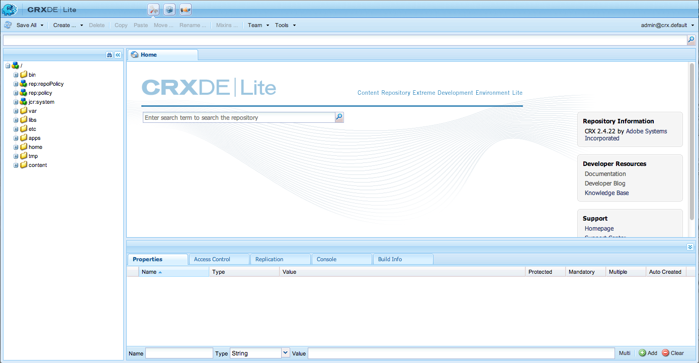

# 自訂獨立安裝{#custom-standalone-install}

本節說明安裝獨立AEM例項時可用的選項。 您也可以閱讀 [Storage Elements](/help/sites-deploying/storage-elements-in-aem-6.md) ，以取得在剛安裝AEM 6後選擇後端儲存類型的詳細資訊。

## 通過更名檔案更改埠號 {#changing-the-port-number-by-renaming-the-file}

AEM的預設埠為4502。 如果該埠不可用或已在使用中，Quickstart會自動配置自己使用第一個可用埠號，如下所示：4502、8080、8081、8082、8083、8084、8085、8888、9362 `<*random*>`。

您也可以通過更名快速啟動jar檔案來設定埠號，使檔案名包括埠號；例如， `cq5-publish-p4503.jar` 或 `cq5-author-p6754.jar`。

更名快速啟動jar檔案時，應遵循多種規則：

* 更名檔案時，它必須以中 `cq;` 的開頭 `cq5-publish-p4503.jar`。

* 建議您務必在端 *口號* 前加上-p;如cq5-publish-p4503.jar或cq5-author-p6754.jar中。

>[!NOTE]
>
>這是為了確保您無需擔心是否要填寫用於提取埠號的規則：
>
>* 埠號必須為4或5位數
>* 這些數字必須在破折號之後
>* 如果檔案名中有其他位，則埠號必須加上前置詞 `-p`
>* 檔案名稱開頭的&quot;cq5&quot;首碼會被忽略
>


>[!NOTE]
>
>您也可以使用start命令中的選項 `-port` 更改埠號。

### Java 11考量事項 {#java-considerations}

如果您正在執行Oracle Java 11（或通常8以上的Java版本），則啟動AEM時，需要將其他開關添加到命令行中。

* 以下——需 `-add-opens` 要添加交換機，以防止在 `stdout.log`

```shell
--add-opens=java.desktop/com.sun.imageio.plugins.jpeg=ALL-UNNAMED --add-opens=java.base/sun.net.www.protocol.jrt=ALL-UNNAMED --add-opens=java.naming/javax.naming.spi=ALL-UNNAMED --add-opens=java.xml/com.sun.org.apache.xerces.internal.dom=ALL-UNNAMED --add-opens=java.base/java.lang=ALL-UNNAMED --add-opens=java.base/jdk.internal.loader=ALL-UNNAMED --add-opens=java.base/java.net=ALL-UNNAMED -Dnashorn.args=--no-deprecation-warning
```

* 此外，您需要使用交換機來 `-XX:+UseParallelGC` 緩解任何潛在的效能問題。

以下範例說明在Java 11上啟動AEM時，其他JVM參數的外觀：

```shell
-XX:+UseParallelGC --add-opens=java.desktop/com.sun.imageio.plugins.jpeg=ALL-UNNAMED --add-opens=java.base/sun.net.www.protocol.jrt=ALL-UNNAMED --add-opens=java.naming/javax.naming.spi=ALL-UNNAMED --add-opens=java.xml/com.sun.org.apache.xerces.internal.dom=ALL-UNNAMED --add-opens=java.base/java.lang=ALL-UNNAMED --add-opens=java.base/jdk.internal.loader=ALL-UNNAMED --add-opens=java.base/java.net=ALL-UNNAMED -Dnashorn.args=--no-deprecation-warning
```

最後，如果您執行的是從AEM 6.3升級的例項，請確定下列屬性已設為 **true** ，在 `sling.properties`:

* `felix.bootdelegation.implicit`

## 執行模式 {#run-modes}

**執行模式** ，可讓您針對特定用途調整AEM實例；例如，製作或發佈、測試、開發、內部網路等。 這些模式也可讓您控制範例內容的使用。 此示例內容是在構建快速入門之前定義的，可包括包、配置等。 當您想要保持安裝精簡，而且不需要範例內容時，這對於生產就緒型安裝特別有用。 如需詳細資訊，請參閱：

* [執行模式](/help/sites-deploying/configure-runmodes.md)

## 添加檔案安裝提供程式 {#adding-a-file-install-provider}

依預設，檔案夾 `crx-quickstart/install` 會受到監視。
此資料夾不存在，但只需在執行時期即可建立。

如果將包、配置或內容包放入此目錄中，則會自動拾取並安裝它。 如果移除，則會解除安裝。
這是將捆綁包、內容包或配置放入儲存庫的另一種方法。

這對於幾個使用案例特別有趣：

* 在開發期間，將某些內容放入檔案系統可能會比較容易。
* 如果出現問題，則無法訪問Web控制台和儲存庫。 使用此功能，您可將其他捆綁包放入此目錄中，並應安裝這些捆綁包。
* 可 `crx-quickstart/install` 以在啟動快速啟動之前建立資料夾，並可將其他軟體包放在那裡。

>[!NOTE]
>
>另請參 [閱如何在伺服器啟動時自動安裝CRX套件](https://helpx.adobe.com/experience-manager/kb/HowToInstallPackagesUsingRepositoryInstall.html) ，以取得範例。

## 以Windows服務的形式安裝和啟動Adobe Experience Manager {#installing-and-starting-adobe-experience-manager-as-a-windows-service}

>[!NOTE]
>
>以管理員身份登錄時，請務必執行以下過程，或使用「以管理員身份運行 **** 」上下文菜單選項啟動／運行這些步驟。
>
>以具有管理員權限的用戶身份登錄不 **夠**。 如果您在完成這些步驟時未以管理員身份登錄，則會收到「訪 **問拒絕** 」錯誤。

若要安裝AEM並啟動為Windows服務：

1. 在文字編輯器中開啟crx-quickstart\opt\helpers\instsrv.bat檔案。
1. 如果要配置64位Windows伺服器，請根據您的作業系統，使用以下命令之一替換prunsrv的所有實例：

   * prunsrv_amd64
   * prunsrv_ia64
   此命令調用在64位Java（而非32位Java）中啟動Windows服務守護程式的相應指令碼。

1. 為防止進程陷入多個進程，請增加最大堆大小和PermGen JVM參數。 找到該 `set jvm_options` 命令並按如下方式設定值：

   `set jvm_options=-XX:MaxPermSize=256M;-Xmx1792m`

1. 開啟「命令提示」，將目前的目錄變更為AEM安裝的crx-quickstart/opt/helpers資料夾，然後輸入下列命令以建立服務：

   `instsrv.bat cq5`

   要驗證是否建立了服務，請在「管理工具」控制面板中開啟服務，或在「命令提 `start services.msc` 示符」中鍵入。 cq5服務會出現在清單中。

1. 通過執行下列操作之一啟動服務：

   * 在「服務」控制面板中，按一下cq5，然後按一下「開始」。
   

   * 在命令行中鍵入net start cq5。
   

1. Windows表示服務正在運行。 AEM啟動，並且prunsrv可執行檔會出現在「任務管理器」中。 在您的網頁瀏覽器中，導覽至AEM，例如， `https://localhost:4502` 開始使用AEM。

   

>[!NOTE]
>
>建立Windows服務時，將使用instsrv.bat檔案中的屬性值。 如果您在instsrv.bat中編輯屬性值，則必須先解除安裝，然後再重新安裝服務。

>[!NOTE]
>
>當將AEM安裝為服務時，您必須從Configuration Manager中提供記錄檔目錄的 `com.adobe.xmp.worker.files.ncomm.XMPFilesNComm` 絕對路徑。

要卸載服務，請在「服務 **」控制面板或命令行中按一下「停止** 」 ，導航到資料夾並鍵入 ****`instsrv.bat -uninstall cq5`。 當您鍵入時，服務會從 **Services控制面板的清單或命令行的清單中刪除**`net start`。

## 重新定義臨時工作目錄的位置 {#redefining-the-location-of-the-temporary-work-directory}

java電腦的臨時資料夾的預設位置為 `/tmp`。 AEM也使用此資料夾，例如在建立套件時。

如果要更改臨時資料夾的位置（例如，如果需要具有更多可用空間的目錄），則通過添加JVM參數來定義* `<new-tmp-path>`*:

`-Djava.io.tmpdir="/<*new-tmp-path*>"`

至以下任一項：

* 伺服器啟動命令行
* serverctl或start指令碼中的CQ_JVM_OPTS環境參數

## Quickstart檔案中提供的其他選項 {#further-options-available-from-the-quickstart-file}

Quickstart幫助檔案（可通過-help選項提供）中介紹了更多選項和更名約定。 要訪問幫助，請鍵入：

* `java -jar cq5-<*version*>.jar -help`

```shell
Loading quickstart properties: default
Loading quickstart properties: instance
Setting properties from filename '/Users/Desktop/AEM/cq-quickstart-5.6.0.jar'
--------------------------------------------------------------------------------
Adobe Experience Manager Quickstart (build 20130129)
--------------------------------------------------------------------------------
Usage:
 Use these options on the Quickstart command line.
--------------------------------------------------------------------------------

-help (--help,-h)
         Show this help message
-quickstart.server.port (-p,-port) <port>
         Set server port number
-contextpath (-c,-org.apache.felix.http.context_path) <contextpath>
         Set context path
-debug <port>
         Enable Java Debugging on port number; forces forking
-gui
         Show GUI if running on a terminal
-nobrowser (-quickstart.nobrowser)
         Do not open browser at startup
-unpack
         Unpack installation files only, do not start the server (implies
         -verbose)
-v (-verbose)
         Do not redirect stdout/stderr to files and do not close stdin
-nofork
         Do not fork the JVM, even if not running on a console
-fork
         Force forking the JVM if running on a console, using recommended
         default memory settings for the forked JVM.
-forkargs <args> [<args> ...]
         Additional arguments for the forked JVM, defaults to '-Xmx1024m
         -XX:MaxPermSize=256m '.  Use -- to specify values starting with -,
         example: '-forkargs -- -server'
-a (--interface) <interface>
         Optional IP address (interface) to bind to
-pt <string>
         Process type (main/fork) - do not use directly, used when forking a
         process
-r <string> [<string> [<string> [<string> [<string> [<string> [<string> [<string> [<string> [<string>]]]]]]]]]
         Runmode(s) - Use this to define the run mode(s)
-b <string>
         Base folder - defines the path under which the quickstart work folder
         is created
-low-mem-action <string>
         Low memory action - what to do if memory is insufficient at startup
-use-control-port
         Start a control port
-ll <level>
         Define launchpad log level (1 = error...4 = debug)
--------------------------------------------------------------------------------
Quickstart filename options
--------------------------------------------------------------------------------
Usage:
 Rename the jar file, including one of the patterns shown below, to set the
corresponding option. Command-line options have priority on these filename
patterns.
--------------------------------------------------------------------------------

-NNNN
         Include -NNNN.jar or -pNNNN in the renamed jar filename to run on port
         NNNN, for example: quickstart-8085.jar
-nobrowser
         Include -nobrowser in the renamed jar filename to avoid opening the
         browser at startup, example: quickstart-nobrowser-8085.jar
-publish
         Include -publish in the renamed jar filename to run cq5 in "publish"
         mode, example: cq5-publish-7502.jar
--------------------------------------------------------------------------------
The license.properties file
--------------------------------------------------------------------------------
  The license.properties file stores licensing information, created from the
  licensing form displayed on first startup and stored in the folder from where
  Quickstart is run.
--------------------------------------------------------------------------------
Log files
--------------------------------------------------------------------------------
  Once Quickstart has been unpacked and started, log files can be found under
  ./crx-quickstart/logs.
--------------------------------------------------------------------------------
```

## 在Amazon EC2環境中安裝AEM {#installing-aem-in-the-amazon-ec-environment}

在Amazon Elastic Compute Cloud(EC2)例項上安裝AEM時，如果您在EC2例項上同時安裝作者和發佈，則Author例項會依照 [Installing Instances of AEM Manager](#installinginstancesofaemmanager);不過，「發佈」例項會變成「作者」。

在EC2環境上安裝Publish實例之前，請執行以下操作：

1. 首次啟動Publish實例之前，先解壓縮該實例的jar檔案。 要解壓縮檔案，請使用以下命令：

   ```xml
   java -jar quickstart.jar -unpack
   ```

   >[!NOTE]
   >
   >如果您在第一次啟 **動例項** 後變更模式，則無法變更執行模式。

1. 執行以啟動例項：

   ```xml
   java -jar quickstart.jar -r publish
   ```

   >[!CAUTION]
   >
   >請務必在解壓縮實例後，先運行上述命令。 否則，將不生成quickstart.properties填充。 若沒有此檔案，任何未來的AEM升級都將失敗。

1. 在 **bin資料夾** ，開啟 **start** 指令碼並勾選下列區段：

   ```xml
   # runmode(s)
   if [ -z "$CQ_RUNMODE" ]; then
    CQ_RUNMODE='author'
   fi
   ```

1. 變更執行模式 **以發** 布並儲存檔案。

   ```xml
   # runmode(s)
   if [ -z "$CQ_RUNMODE" ]; then
    CQ_RUNMODE='publish'
   fi
   ```

1. 停止實例並通過運行啟動指令碼重 **新啟動** 。

## 驗證安裝 {#verifying-the-installation}

以下連結可用於驗證您的安裝是否可操作（所有示例都基於在localhost的埠8080上運行實例，在/crx和／下安裝CRX和Launchpad）:

* `https://localhost:8080/crx/de`
CRXDE Lite主控台。

* `https://localhost:8080/system/console`
Web Console。

## 安裝後的動作 {#actions-after-installation}

雖然有許多可能設定AEM WCM，但是應該採取某些動作，或至少在安裝後立即檢視：

* 請參閱安 [全檢查清單](/help/sites-administering/security-checklist.md) ，瞭解確保系統安全所需的任務。
* 檢視隨AEM WCM安裝的預設使用者和群組清單。 檢查您是否要對任何其他帳戶採取行動——如需詳細資 [訊，請參閱安全性和使用者管理](/help/sites-administering/security.md) 。

## 訪問CRXDE Lite和Web控制台 {#accessing-crxde-lite-and-the-web-console}

AEM WCM啟動後，您也可以存取：

* [CRXDE Lite](#accessing-crxde-lite) —— 用於訪問和管理儲存庫
* [Web Console](#accessing-the-web-console) —— 用於管理或配置OSGi捆綁包（也稱為OSGi Console）

### 訪問CRXDE Lite {#accessing-crxde-lite}

若要開啟CRXDE Lite，您可從歡迎畫面 **選取CRXDE Lite** ，或使用您的瀏覽器導覽至

```
 https://<<i>host</i>>:<<i>port</i>>/crx/de/index.jsp
```

例如：
`https://localhost:4502/crx/de/index.jsp`



#### 訪問Web控制台 {#accessing-the-web-console}

若要存取Adobe CQ Web Console，您可從歡迎畫面選取 **OSGi Console** ，或使用您的瀏覽器導覽至

```
 https://<host>:<port>/system/console
```

例如：或`https://localhost:4502/system/console`是「組合」頁`https://localhost:4502/system/console/bundles`


如需詳 [細資訊，請參閱OSGi Configuration with the Web Console](/help/sites-deploying/configuring-osgi.md#osgi-configuration-with-the-web-console) 。

## 疑難排解 {#troubleshooting}

有關處理安裝過程中可能出現的問題的資訊，請參見：

* [疑難排解](/help/sites-deploying/troubleshooting.md)

## 解除安裝Adobe Experience Manager {#uninstalling-adobe-experience-manager}

由於AEM會安裝在單一目錄中，所以不需要解除安裝公用程式。 解除安裝可能就像刪除整個安裝目錄一樣簡單，不過解除安裝AEM的方式取決於您要達到的目的，以及您使用的永續儲存空間。

如果永久儲存嵌入安裝目錄（例如，在預設TarPM安裝中），則刪除資料夾也會刪除資料。

>[!NOTE]
>
>Adobe強烈建議您在刪除AEM之前先備份儲存庫。 如果刪除整個&lt;cq-installation-directory>，將刪除儲存庫。 要保留儲存庫資料，請在刪除其他資料夾之前，將&lt;cq-installation-directory>/crx-quickstart/repository資料夾移動或複製到其他位置。

如果您的AEM安裝使用外部儲存（例如資料庫伺服器），移除資料夾並不會自動移除資料，但會移除儲存設定，因此很難還原JCR內容。
