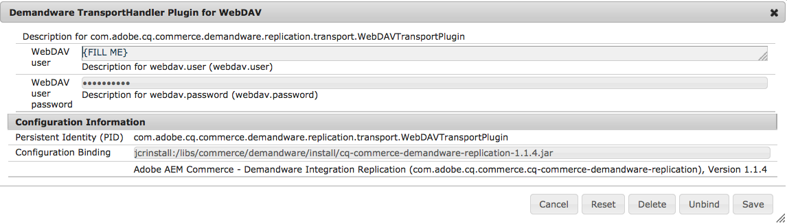

# Salesforce Commerce Cloud{#salesforce-commerce-cloud}

部署必要的電子商務套件將提供電子商務架構的完整功能，以及Salesforce Commerce Cloud / Demandware實作（包括展示目錄）所提供的電子商務功能參考實作。

## 使用Salesforce Commerce Cloud {#packages-needed-for-ecommerce-with-salesforce-commerce-cloud}進行電子商務所需的套件

若要安裝電子商務功能，您需要：

* AEM eCommerce架構：

   * 這是標準AEM安裝的一部分

* AEM Demandware商務內容套件

   * cq-6.4.0-featurepack-10262

>[!NOTE]
>
>此整合支援設定為使用OCAPI 17.6版或更新版本的Salesforce Commerce Cloud / Demandware例項。

### 使用Salesforce Commerce Cloud安裝電子商務{#installation-of-ecommerce-with-salesforce-commerce-cloud}

若要安裝具有Demandware Commerce整合設定的AEM（使用展示目錄Geometrixx Outdoors），基本步驟為：

1. [安裝AEM](/help/sites-deploying/deploy.md)。
1. 使用[package manager](/help/sites-administering/package-manager.md)安裝內容套件：
1. [在](/help/sites-authoring/page-authoring.md) AEM中編寫您需要的任何補充頁面。

>[!NOTE]
>
>要下載軟體包，請導航至[軟體包共用](/help/sites-administering/package-manager.md#package-share)。

AEM和Demandware沙盒之間的伺服器連線需要設定。 大部分的組態都已預先設定好可使用預設路徑、程式庫等提供的SiteGenisis示範內容套件。 如果此連接器與其他站點和庫一起使用，則需要更新此配置。

1. 導覽至[https://localhost:4502/system/console/configMgr](https://localhost:4502/system/console/configMgr)。
1. 按一下&#x200B;**Demandware Client**。
1. 根據需要輸入&#x200B;**實例端點ip或hostname**。

   

1. 按一下&#x200B;**「儲存」**。
1. 按一下&#x200B;**Demandware TransportHandler Plugin for WebDAV**。
1. 設定&#x200B;**WebDAV用戶**&#x200B;和&#x200B;**WebDAV用戶密碼**。

   

1. 按一下&#x200B;**「儲存」**。

#### 複寫 {#replication}

應在軟體包安裝後啟用複製，您可以在此處驗證：[https://localhost:4502/etc/replication/agents.author/demandware.html](https://localhost:4502/etc/replication/agents.author/demandware.html)

>[!NOTE]
>
>預設情況下，複製代理配置為資訊日誌級別。 如果您想要取得更多資訊，可將記錄檔層級切換為除錯。

#### OAuth {#oauth}

OAuth用戶端已設定為可搭配Demandware沙盒執行個體運作。 為了測試目的，不需要進行任何變更。

對於測試和製作系統，OAuth用戶端必須設定適當的用戶端ID和密碼。

1. 導覽至[https://localhost:4502/system/console/configMgr](https://localhost:4502/system/console/configMgr)。
1. 按一下&#x200B;**Demandware Access Token提供程式**。

   

1. 根據需要修改值，然後按一下「保存」。****

### Salesforce Commerce Cloud沙盒{#salesforce-commerce-cloud-sandbox}

必須將Demandware沙盒設定為執行新的Velocity範本引擎。

>[!NOTE]
>
>下列精靈不屬於AEM Demandware連接器。 它依原樣提供，以協助快速設定SiteGenesis示範頁面。

1. 導覽至[https://localhost:4502/etc/demandware/init.html](https://localhost:4502/etc/demandware/init.html)。
1. 按一下「編輯」。****
1. 驗證值並按一下&#x200B;**確定**。
1. 按一下&#x200B;**Initialize**。
1. 前往WebDAV資料夾並檢查已發佈的範本檔案，例如`adobe01-tech-prtnr-na01-dw.demandware.net/on/demandware.servlet/webdav/Sites/Dynamic/SiteGenesis`下。

   >[!NOTE]
   >
   >分機號為`.vs`。

1. 也檢查匯出的JS和CSS檔案，例如`adobe01-tech-prtnr-na01-dw.demandware.net/on/demandware.servlet/webdav/Sites/Libraries/SiteGenesisSharedLibrary`下。

