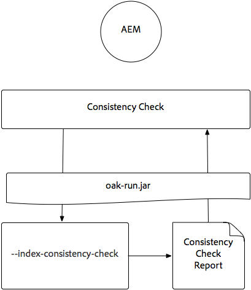
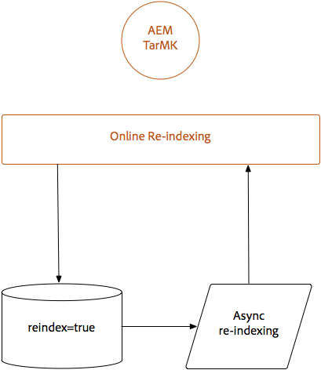
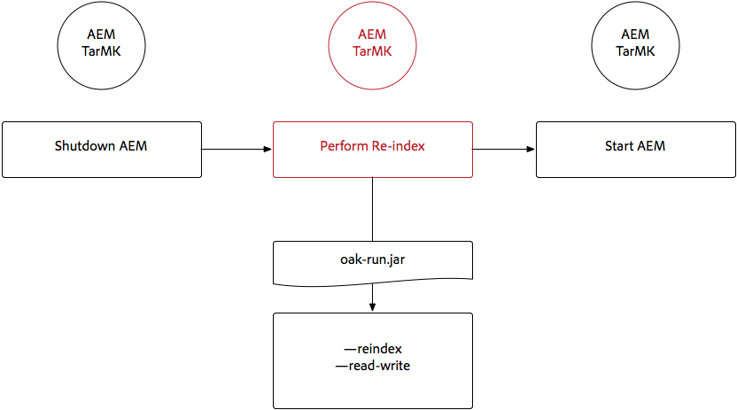
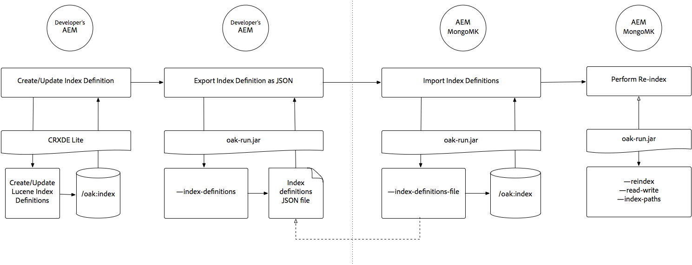

# 透過Oak-run Jar建立索引 {#indexing-via-the-oak-run-jar}

Oak-run支援命令列上的所有索引使用案例，不需從JMX層級操作。 oak-run方法的優點包括：

1. 這是AEM 6.4的新索引工具集
1. 它減少了重新索引的時間，這有益地影響大型儲存庫的重新索引時間
1. 它正在減少AEM中重新索引期間的資源耗用量，為其他AEM活動帶來更佳的系統效能
1. Oak-run提供帶外支援：如果生產條件不允許在生產實例上運行重新索引，則可以使用克隆的環境進行重新索引，以避免對效能造成嚴重影響。

下面將列出在通過`oak-run`工具執行索引操作時可利用的使用案例清單。

## 索引一致性檢查 {#indexconsistencychecks}

>[!NOTE]
>
>有關此情況的更多詳細資訊，請參閱[使用案例1 — 索引一致性檢查](/help/sites-deploying/oak-run-indexing-usecases.md#usercase1indexconsistencycheck)。

* `oak-run.jar`快速判斷Lucene oak索引是否已損毀。
* 在使用中的AEM例項上執行以進行一致性檢查層級1和2是安全的。

## 索引統計資訊 {#indexstatistics}

>[!NOTE]
>
>有關此情況的詳細資訊，請參閱[使用案例2 — 索引統計資訊](/help/sites-deploying/oak-run-indexing-usecases.md#usecase2indexstatistics)

* `oak-run.jar` 轉儲離線分析的所有索引定義、重要索引統計資訊和索引內容。
* 可在使用中的AEM例項上執行。

## 重新索引方法決策樹 {#reindexingapproachdecisiontree}

此圖表是決定何時應使用各種重新索引方法的決策樹。

## 重新索引MongoMK / RDMBMK {#reindexingmongomk}

>[!NOTE]
>
>有關此情境的詳細資訊，請參閱[使用案例3 — 重新索引](/help/sites-deploying/oak-run-indexing-usecases.md#usecase3reindexing)。

### SegmentNodeStore和DocumentNodeStore的文字預先擷取 {#textpre-extraction}

[文字預先擷取](/help/sites-deploying/best-practices-for-queries-and-indexing.md#how-to-perform-text-pre-extraction) (AEM 6.3中已存在的功能)可用來縮短重新索引的時間。文本預取可與所有重新索引方法結合使用。

根據`oak-run.jar`索引方法，下圖中「執行重新索引」步驟的兩側會有各種步驟。

>[!NOTE]
>
>橘色表示AEM必須位於維護視窗中的活動。

### 使用oak-run.jar為MongoMK或RDBMK線上重新索引 {#onlinere-indexingformongomk}

>[!NOTE]
>
>有關此情況的更多詳細資訊，請參閱[重新索引 — DocumentNodeStore](/help/sites-deploying/oak-run-indexing-usecases.md#reindexdocumentnodestore)。

這是重新索引MongoMK（和RDBMK）AEM安裝的建議方法。 不應使用其他方法。

此程式只需對叢集中的單一AEM執行個體執行。

## 重新索引TarMK {#re-indexingtarmk}

>[!NOTE]
>
>有關此情況的詳細資訊，請參閱[重新索引 — SegmentNodeStore](/help/sites-deploying/oak-run-indexing-usecases.md#reindexsegmentnodestore)。

* **冷備考量事項(TarMK)**

   * 冷備無特殊考慮；冷待機實例將照常同步更改。

* **AEM發佈伺服器陣列（AE發佈伺服器陣列應一律為TarMK）**

   * 對於發佈伺服器陣列，必須針對所有OR執行單一發佈上的步驟，然後複製其他伺服器的設定(複製AEM例項時，請採取所有通常的操作);sling.id — 應連結至此處的項目)

### TarMK的線上重新索引 {#onlinere-indexingfortarmk}

>[!NOTE]
>
>有關此情況的詳細資訊，請參閱[Online Reindex - SegmentNodeStore](/help/sites-deploying/oak-run-indexing-usecases.md#onlinereindexsegmentnodestore)。

這是導入oak-run.jar新索引功能前所使用的方法。 若要這麼做，請在Oak索引上設定`reindex=true`屬性。

如果索引的時間和效能影響是客戶可接受的，則可以使用此方法。 中小型AEM安裝通常會採用此方式。

### 使用oak-run.jar線上重新索引TarMK {#onlinere-indexingtarmkusingoak-run-jar}

>[!NOTE]
>
>有關此情況的詳細資訊，請參閱[聯機重新索引 — SegmentNodeStore - AEM實例正在運行](/help/sites-deploying/oak-run-indexing-usecases.md#onlinereindexsegmentnodestoretheaeminstanceisrunning)。

使用oak-run.jar線上重新索引TarMK的速度比上述[ TarMK](#onlinere-indexingfortarmk)線上重新索引的速度快。 但是，在維護窗口期間也需要執行；提到窗口將更短，需要執行更多步驟來重新索引。

>[!NOTE]
>
>橙色表示必須在維護期間執行AEM的操作。

### 使用oak-run.jar離線重新索引TarMK {#offlinere-indexingtarmkusingoak-run-jar}

>[!NOTE]
>
>有關此情況的詳細資訊，請參閱[Online Reindex - SegmentNodeStore - The AEM Instance is Shut](/help/sites-deploying/oak-run-indexing-usecases.md#onlinereindexsegmentnodestoreaeminstanceisdown)。

TarMK的離線重新索引是TarMK最簡單的`oak-run.jar`型重新索引方法，因為它需要單一`oak-run.jar`注釋。 但是，它需要關閉AEM例項。

>[!NOTE]
>
>紅色表示必須關閉AEM的操作。

### 使用oak-run.jar進行帶外重新索引TarMK  {#out-of-bandre-indexingtarmkusingoak-run-jar}

>[!NOTE]
>
>有關此情況的詳細資訊，請參閱[帶外重新索引 — SegmentNodeStore](/help/sites-deploying/oak-run-indexing-usecases.md#outofbandreindexsegmentnodestore)。

帶外重新索引可將重新索引對使用中AEM例項的影響降至最低。

>[!NOTE]
>
>紅色表示可能關閉AEM的操作。

## 更新索引定義 {#updatingindexingdefinitions}

>[!NOTE]
>
>有關此情況的詳細資訊，請參閱[使用案例4 — 更新索引定義](/help/sites-deploying/oak-run-indexing-usecases.md#usecase4updatingindexdefinitions)。

### 使用ACS在TarMK上建立和更新索引定義確保索引 {#creatingandupdatingindexdefinitionsontarmkusingacsensureindex}

>[!NOTE]
>
>ACS Ensure Index是社區支援的項目，不受Adobe支援。

這允許通過內容包進行發送索引定義，後者通過將重新索引標誌設定為`true`而導致重新索引。 這適用於較小的設定，其中重新索引不需要很長時間。

有關詳細資訊，請參閱[ACS Ensure Index文檔](https://adobe-consulting-services.github.io/acs-aem-commons/features/ensure-oak-index/index.html)以了解詳細資訊。

### 使用oak-run.jar在TarMK上建立和更新索引定義 {#creatingandupdatingindexdefinitionsontarmkusingoak-run-jar}

如果使用非`oak-run.jar`方法重新索引對時間或效能的影響太大，則可使用以下基於`oak-run.jar`的方法來導入和重新索引基於TarMK的AEM安裝中的Lucene索引定義。

### 使用oak-run.jar在MonogMK上建立和更新索引定義 {#creatingandupdatingindexdefinitionsonmonogmkusingoak-run-jar}

如果使用非`oak-run.jar`方法重新索引對時間或效能的影響太大，則可使用以下基於`oak-run.jar`的方法來導入和重新索引基於MongoMK的AEM安裝中的Lucene索引定義。

