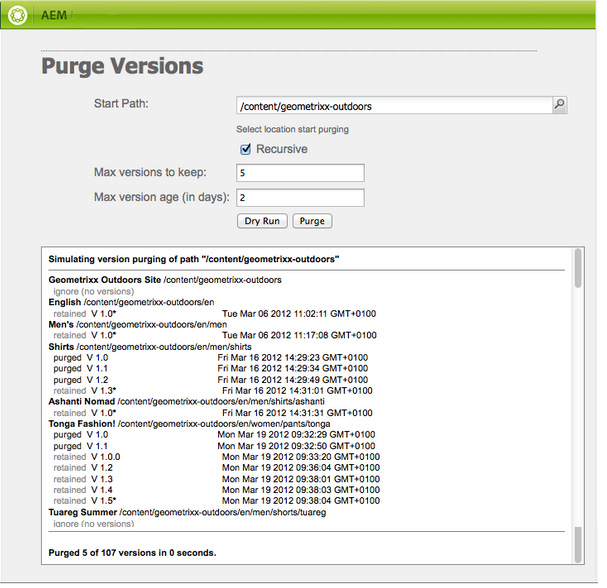

# 監視和維護您的AEM例項{#monitoring-and-maintaining-your-aem-instance}

部署AEM執行個體後，將需要執行某些任務來監控和維護其操作、效能和完整性。

這裡的一個關鍵因素是，要識別潛在問題，您需要了解系統在正常條件下的外觀和行為。 最好通過監視系統並收集一段時間內的資訊來完成這一任務。

| 檢查 | 考量事項 | 註解/動作 |
|---|---|---|
| 備份計畫。 |  | 了解如何 [備份您的實例](/help/sites-deploying/monitoring-and-maintaining.md#backups). |
| 災難恢復計畫。 | 貴公司的災難恢復指南。 |  |
| 錯誤跟蹤系統可用於報告問題。 | 例如， [布吉拉](https://www.bugzilla.org/), [吉拉](https://www.atlassian.com/software/jira/)，或其他許多項目之一。 |  |
| 正在監視檔案系統。 | 如果可用磁碟空間不足，CRX存放庫將「凍結」。 一旦空間可用，就會繼續。 | &quot; `*ERROR* LowDiskSpaceBlocker`「可用空間變低時，可在日誌檔案中看到消息。 |
| [記錄檔](/help/sites-deploying/monitoring-and-maintaining.md#working-with-audit-records-and-log-files) 正在被監視。 |  |  |
| 系統監視（持續）在後台運行。 | 包括CPU、記憶體、磁碟和網路使用。 例如，使用iostat / vmstat / perfmon。 | 記錄的資料會視覺化，可用於追蹤效能問題。 也可存取原始資料。 |
| [AEM效能正在受到監控](/help/sites-deploying/monitoring-and-maintaining.md#monitoring-performance). | 包括 [請求計數器](/help/sites-deploying/monitoring-and-maintaining.md#request-counters) 來監控流量層級。 | 如果出現重大或長期業績損失，應進行詳細調查。 |
| 您正在監控 [復寫代理](/help/sites-deploying/monitoring-and-maintaining.md#monitoring-your-replication-agents). |  |  |
| 定期清除工作流實例。 | 存放庫大小和工作流程效能。 | 請參閱 [定期清除工作流實例](/help/sites-administering/workflows-administering.md#regular-purging-of-workflow-instances). |

## 備份 {#backups}

備份：

* 您的軟體安裝 — 配置發生重大更改之前/之後
* 存放在存放庫內的內容 — 定期

貴公司可能會有備份策略，您需要遵守此策略，並對備份內容以及備份時間進行其他考慮：

* 系統和資料的關鍵程度。
* 對軟體或資料進行更改的頻率。
* 資料量；容量有時可能是問題，執行備份所需的時間也是問題。
* 用戶聯機時能否備份；如果可能，效能影響是什麼。
* 用戶的地理分佈；即何時是備份的最佳時機（以最大限度地減少影響）?
* 您的災難恢復策略；是否有必要儲存備份資料的指導原則（例如異地、特定介質等）。

通常，完整備份會定期執行（例如每日、每週或每月），增量備份介於之間（例如每小時、每日或每週）。

>[!CAUTION]
>
>實施生產實例的備份時，請測試 *必須* 進行，以確保可成功還原備份。
>
>若沒有這一點，備份可能就毫無用處（最壞情況）。

>[!NOTE]
>
>有關備份效能的詳細資訊，請閱讀 [備份效能](/help/sites-deploying/configuring-performance.md#backup-performance) 區段。

### 備份軟體安裝 {#backing-up-your-software-installation}

安裝後或配置發生重大更改後，請備份軟體安裝。

要做到這一點，你需要 [備份整個儲存庫](#backing-up-your-repository) 然後：

1. 停止AEM。
1. 備份整個 `<cq-installation-dir>` 從檔案系統。

>[!CAUTION]
>
>如果您正在操作第三方應用程式伺服器，則其他資料夾可能位於不同的位置，並且可能需要備份。 請參閱 [如何與應用程式伺服器安裝AEM](/help/sites-deploying/application-server-install.md) ，了解有關安裝應用程式伺服器的資訊。

>[!CAUTION]
>
>支援檔案資料儲存的增量備份；對其他元件（如Lucene索引）使用增量備份時，請確保在備份中也將已刪除的檔案標籤為已刪除。

>[!NOTE]
>
>磁碟鏡像也可用作備份機制。

### 備份儲存庫 {#backing-up-your-repository}

此 [備份和還原](/help/sites-administering/backup-and-restore.md) CRX檔案的一節涵蓋了與備份CRX儲存庫相關的所有問題。

有關建立線上「熱」備份的完整詳細資訊，請參見 [建立線上備份](/help/sites-administering/backup-and-restore.md#online-backup).

## 版本清除 {#version-purging}

此 **清除版本** 工具的用途是清除儲存庫中節點版本或節點階層。 其主要用途是透過移除舊版節點，協助您縮小存放庫的大小。

本節介紹與AEM版本化功能相關的維護操作。 此 **清除版本** 工具的用途是清除儲存庫中節點版本或節點階層。 其主要用途是透過移除舊版節點，協助您縮小存放庫的大小。

### 總覽 {#overview}

此 **清除版本** 工具可作為每週維護任務使用。 需要先新增，然後再設定，才能首次使用。 之後可依要求或每週執行。

### 清除網站版本 {#purging-versions-of-a-web-site}

要清除網站的版本，請按以下步驟進行：

1. 導覽至 **[工具](/help/sites-administering/tools-consoles.md)** **主控台**，選取 **操作**, **維護**，然後 **每週維護窗口**.

1. 選擇 **+新增** 的上界。

   

1. 選擇 **版本清除** 從 **添加新任務** 對話框。 然後 **儲存**.

   

1. 此 **版本清除** 任務。 使用卡片動作可：
   * 選取 — 將在頂端工具列中顯示其他動作
   * 運行 — 立即運行配置的清除
   * 配置 — 配置每週清除任務

   

1. 選取 **設定** 為開啟Web控制台的操作 **Day CQ WCM版本清除任務**，您可於此設定：

   

   * **清除路徑**
設定要清除的內容的開始路徑；例如， 
`/content/wknd`。

      >[!CAUTION]
      >
      >強烈建議您為每個網站定義多個路徑。
      >
      >定義包含太多子項的路徑可以顯著延長執行清除所需的時間。

   * **遞歸清除版本**

      * 取消選取是否要僅清除路徑定義的節點。
      * 選擇是否要清除路徑及其子體定義的節點。
   * **最大版本數**
設定要保留的最大版本數（針對每個節點）。 保留為空，不使用此設定。

   * **最低版本數**
設定您要保留的最低版本數（針對每個節點）。 保留為空，不使用此設定。

   * **最大版本年齡**
設定您要保留的最大版本年齡（針對每個節點），單位為天。 保留為空，不使用此設定。
   然後 **儲存**.

1. 導覽/返回 **每週維護窗口** 窗口和選擇 **執行** 立即啟動程式。

>[!CAUTION]
>
>您可以使用傳統UI對話方塊來執行 [乾流](#analyzing-the-console) 配置：
>
>* http://localhost:4502/etc/versioning/purge.html
>
>如果未還原儲存庫，則無法還原已清除的節點。 您應處理您的設定，因此我們建議您一律執行乾式執行，然後再清除。

#### 乾式運行 — 分析控制台 {#analyzing-the-console}

傳統UI提供 **乾流** 選項：

* http://localhost:4502/etc/versioning/purge.html

進程會列出所有已處理的節點。 在過程中，節點可以具有以下狀態之一：

* `ignore (not versionnable)`:節點不支援版本設定，且在處理期間會忽略。

* `ignore (no version)`:節點沒有任何版本，在處理期間會被忽略。

* `retained`:未清除該節點。
* `purged`:已清除節點。

此外，主控台還提供版本的實用資訊：

* `V 1.0`:版本號碼。
* `V 1.0.1`&#42;:星號表示版本是當前（基本）版本，無法清除。

* `Thu Mar 15 2012 08:37:32 GMT+0100`:版本日期。

在下一個範例中：

* 此 **[!DNL Shirts]** 版本會清除，因為其版本年齡超過2天。
* 此 **[!DNL Tonga Fashions!]** 版本會清除，因為其版本數大於5。



## 使用審核記錄和日誌檔案 {#working-with-audit-records-and-log-files}

您可以在不同位置找到與Adobe Experience Manager(AEM)相關的稽核記錄和記錄檔。 以下提供您可在何處找到的概觀。

### 使用記錄檔 {#working-with-logs}

AEM WCM記錄詳細記錄。 開啟快速入門程式後，您可以在中找到日誌：

* `<cq-installation-dir>/crx-quickstart/logs/`

* `<cq-installation-dir>/crx-quickstart/repository/`

#### 記錄檔旋轉 {#log-file-rotation}

日誌檔案旋轉是指通過定期建立新檔案來限制檔案增長的過程。 在AEM中，記錄檔名為 `error.log` 會根據指定規則每天旋轉一次：

* 此 `error.log` 檔案根據模式{original_filename}重新命名 `.yyyy-MM-dd`. 例如，在2010年7月11日，目前的記錄檔已重新命名 `error.log-2010-07-10`，然後是新 `error.og` 中所有規則的URL區段。

* 以前的日誌檔案不會被刪除，因此您有責任定期清除舊的日誌檔案以限制磁碟的使用。

>[!NOTE]
>
>如果您升級AEM安裝，請注意，AEM不再使用的任何現有記錄檔都會保留在磁碟上。 你可以不冒險地移走它們。 所有新日誌條目都將寫入新日誌檔案中。

### 查找日誌檔案 {#finding-the-log-files}

安裝AEM的檔案伺服器上會保留各種記錄檔：

* `<cq-installation-dir>/crx-quickstart/logs`

   * `access.log`
對AEM WCM和存放庫的所有存取請求都會在此處註冊。

   * `audit.log`
協調動作會在此處註冊。

   * `error.log`
此處將註冊錯誤消息（嚴重性級別不同）。

   * [ `ImageServer-<PortId>-yyyy>-<mm>-<dd>.log`](https://experienceleague.adobe.com/docs/dynamic-media-developer-resources/image-serving-api/image-serving-api/config-admin/server-logging/c-image-server-log.html)
只有在 [!DNL Dynamic Media] 啟用。 它提供用於分析內部ImageServer進程的行為的統計資訊和分析資訊。

   * `request.log`
每個存取請求都會與回應一併註冊。

   * [ `s7access-<yyyy>-<mm>-<dd>.log`](https://experienceleague.adobe.com/docs/dynamic-media-developer-resources/image-serving-api/image-serving-api/config-admin/server-logging/c-access-log.html)
只有在 [!DNL Dynamic Media] 啟用。 s7access記錄會記錄對 [!DNL Dynamic Media] through `/is/image` 和 `/is/content`.

   * `stderr.log`
保留在啟動期間生成的錯誤消息，其嚴重性級別也不同。 依預設，記錄層級設為 
`Warning` ( `WARN`)

   * `stdout.log`
保留指示啟動期間事件的日誌消息。

   * `upgrade.log`
提供從 
`com.day.compat.codeupgrade` 和 `com.adobe.cq.upgradesexecutor` 套件。

* `<cq-installation-dir>/crx-quickstart/repository`

   * `revision.log`
修訂日誌資訊。

>[!NOTE]
>
>**Download Full **包中不包含ImageServer和s7access日誌，該包是從**system/console/status-Bundlist **頁生成的。 為了支援目的，若您有 [!DNL Dynamic Media] 問題，請在您連絡客戶支援時附加ImageServer和s7access記錄。

### 啟用偵錯記錄層級 {#activating-the-debug-log-level}

預設記錄層級([Apache Sling記錄設定](/help/sites-deploying/osgi-configuration-settings.md#apacheslingloggingconfiguration))是資訊，因此不會記錄除錯訊息。

要激活記錄器的調試日誌級別，請設定屬性 `org.apache.sling.commons.log.level` 以在存放庫中除錯。 例如，在 `/libs/sling/config/org.apache.sling.commons.log.LogManager` 若要設定 [全域Apache Sling記錄](/help/sites-deploying/osgi-configuration-settings.md#apacheslingloggingconfiguration).

>[!CAUTION]
>
>請勿讓除錯記錄層級的記錄超過必要時間，因為它會產生許多記錄項目，因而耗用資源。

除錯檔案中的一行通常以DEBUG開頭，然後提供記錄層級、安裝程式動作和記錄訊息。 例如：

```shell
DEBUG 3 WebApp Panel: WebApp successfully deployed
```

記錄層級如下：

| 0 | 錯誤 | 操作失敗，安裝程式無法繼續。 |
|---|---|---|
| 1 | 錯誤 | 操作失敗。 安裝繼續，但AEM WCM的一部分未正確安裝，因此無法正常運作。 |
| 2 | 警告 | 操作已成功，但遇到問題。 AEM WCM可能或無法正常運作。 |
| 3 | 資訊 | 操作成功。 |

### 建立自訂記錄檔 {#create-a-custom-log-file}

>[!NOTE]
>
>使用Adobe Experience Manager時，有數種方法可管理這類服務的組態設定；請參閱 [配置OSGi](/help/sites-deploying/configuring-osgi.md) 以取得詳細資訊和建議的實務。

在某些情況下，您可能想要建立具有不同記錄層級的自訂記錄檔。 您可以在存放庫中執行此作業：

1. 如果尚未存在，請建立新的配置資料夾( `sling:Folder`) `/apps/<project-name>/config`.
1. 在 `/apps/<project-name>/config`，請為新 [Apache Sling Logging Logger Configuration](/help/sites-deploying/osgi-configuration-settings.md#apacheslingloggingloggerconfigurationfactoryconfiguration):

   * 名稱： `org.apache.sling.commons.log.LogManager.factory.config-<identifier>` （因為這是記錄器）

      其中 `<identifier>` 替換為您（必須）輸入以識別執行個體的自由文字（您無法忽略此資訊）。

      例如， `org.apache.sling.commons.log.LogManager.factory.config-MINE`

   * 類型: `sling:OsgiConfig`
   >[!NOTE]
   >
   >雖然不是技術要求，但建議 `<identifier>` 唯一。

1. 在此節點上設定以下屬性：

   * 名稱: `org.apache.sling.commons.log.file`

      類型：字串

      值：指定日誌檔案；例如， `logs/myLogFile.log`

   * 名稱: `org.apache.sling.commons.log.names`

      類型：字串[] （字串+多個）

      值：指定記錄器要為其記錄消息的OSGi服務；例如，下列所有項目：

      * `org.apache.sling`
      * `org.apache.felix`
      * `com.day`
   * 名稱: `org.apache.sling.commons.log.level`

      類型：字串

      值：指定所需的記錄層級( `debug`, `info`, `warn` 或 `error`);例如 `debug`

   * 視需要設定其他參數：

      * 名稱: `org.apache.sling.commons.log.pattern`

         類型: `String`

         值：根據需要指定日誌消息的模式；例如，

         `{0,date,dd.MM.yyyy HH:mm:ss.SSS} *{4}* [{2}] {3} {5}`
   >[!NOTE]
   >
   >`org.apache.sling.commons.log.pattern` 最多支援6個引數。
   >
   >{0}類型的時間戳 `java.util.Date`
   >
   >{1}日誌標籤
   >
   >{2}當前線程的名稱
   >
   >{3}記錄器的名稱
   >
   >{4}日誌級別
   >
   >{5}日誌消息
   >
   >如果記錄呼叫包含 `Throwable` stacktrace會附加至訊息。

   >[!CAUTION]
   >
   >org.apache.sling.commons.log.names必須有值。

   >[!NOTE]
   >
   >日誌寫入器路徑與 `crx-quickstart` 位置。
   >
   >因此，將日誌檔案指定為：
   >
   >`logs/thelog.log`
   >
   >寫入：
   >
   >`<cq-installation-dir>/crx-quickstart/logs/thelog.log`。
   >
   >以及指定為的日誌檔案：
   >
   >`../logs/thelog.log`
   >
   >寫入目錄：
   >
   >`<cq-installation-dir>/logs/`\
   >(即 `<cq-installation-dir>/crx-quickstart/`)

1. 只有在需要新寫入程式時（即配置與預設寫入程式不同時），才需要執行此步驟。

   >[!CAUTION]
   >
   >只有當現有預設值不適合時，才需要新的記錄寫入器配置。
   >
   >如果未配置任何顯式寫入程式，則系統將根據預設自動生成隱式寫入程式。

   在 `/apps/<project-name>/config`，請為新 [Apache Sling Logging Writer設定](/help/sites-deploying/osgi-configuration-settings.md#apacheslingloggingwriterconfigurationfactoryconfiguration):

   * 名稱： `org.apache.sling.commons.log.LogManager.factory.writer-<identifier>` （因為這是作者）

      跟記錄器一樣， `<identifier>` 替換為您（必須）輸入以識別執行個體的自由文字（您無法忽略此資訊）。 例如， `org.apache.sling.commons.log.LogManager.factory.writer-MINE`

   * 類型: `sling:OsgiConfig`
   >[!NOTE]
   >
   >雖然不是技術要求，但建議 `<identifier>` 唯一。

   在此節點上設定以下屬性：

   * 名稱: `org.apache.sling.commons.log.file`

      類型: `String`

      值：指定日誌檔案，使其與記錄器中指定的檔案匹配；

      在此範例中， `../logs/myLogFile.log`.

   * 視需要設定其他參數：

      * 名稱: `org.apache.sling.commons.log.file.number`

         類型: `Long`

         值：指定要保留的日誌檔案數；例如， `5`

      * 名稱: `org.apache.sling.commons.log.file.size`

         類型: `String`

         值：按大小/日期指定控制檔案旋轉；例如， `'.'yyyy-MM-dd`
   >[!NOTE]
   >
   >`org.apache.sling.commons.log.file.size` 通過設定以下任一項控制日誌檔案的旋轉：
   >
   >* 檔案大小上限
   >* 時間/日期排程

   >
   >以指出將於何時建立新檔案（而現有檔案會根據名稱模式重新命名）。
   >
   >* 可以使用數字指定大小限制。 如果沒有提供大小指示器，則此指示器被視為位元組數，或者您可以添加一個大小指示器 —  `KB`, `MB`，或 `GB` （忽略大小寫）。
   >* 時間/日期排程可指定為 `java.util.SimpleDateFormat` 模式。 這會定義檔案旋轉的時段；尾碼也附加至旋轉的檔案（用於識別）。

   >
   >預設值為「。」yyyy-MM-dd（用於每日日誌輪換）。
   >
   >因此，例如，在2010年1月20日的午夜（或發生此事件後的第一個記錄訊息時需精確）,../logs/error.log將重新命名為../logs/error.log.2010-01-20。 1月21日的記錄會輸出為（新的和空白的）../logs/error.log，直到下次變更時才滾動。
   >
   >| `'.'yyyy-MM` | 每月初輪值 |
   >|---|---|
   >| `'.'yyyy-ww` | 每週的第一天輪換（取決於地區）。 |
   >| `'.'yyyy-MM-dd` | 每天午夜輪流。 |
   >| `'.'yyyy-MM-dd-a` | 每天午夜和中午輪流。 |
   >| `'.'yyyy-MM-dd-HH` | 每小時的頂端輪流。 |
   >| `'.'yyyy-MM-dd-HH-mm` | 每分鐘一開始輪流。 |
   >
   >注意：指定時間/日期時：
   > 1. 您應在一對單引號(「)中「逸出」文字；
      >
      >     這是為了避免某些字元被解釋為模式字母。
   >
   >  1. 只允許在選項中任意位置使用有效檔案名的字元。


1. 使用您選擇的工具讀取新日誌檔案。

   由此示例建立的日誌檔案將是 `../crx-quickstart/logs/myLogFile.log`.

Felix Console也提供Sling記錄支援的相關資訊，位於 `../system/console/slinglog`;例如 `https://localhost:4502/system/console/slinglog`.

### 查找審核記錄 {#finding-the-audit-records}

保留審計記錄，以便提供記錄，記錄誰做了什麼和何時做了什麼。 會為AEM WCM和OSGi事件產生不同的稽核記錄。

#### AEM WCM稽核記錄在頁面編寫時顯示 {#aem-wcm-audit-records-shown-when-page-authoring}

1. 開啟頁面。
1. 從sidekick中，您可以選取含有鎖定圖示的標籤，然後連按兩下 **審核日誌……**
1. 將會開啟一個新視窗，顯示目前頁面的稽核記錄清單。

   

1. 按一下 **確定** 時，才能關閉窗口。

#### AEM WCM稽核存放庫內的記錄 {#aem-wcm-auditing-records-within-the-repository}

在 `/var/audit` 資料夾，根據資源保留審計記錄。 您可以深入研究，直到看到個別記錄及其包含的資訊為止。

這些條目包含的資訊與編輯頁面時顯示的資訊相同。

#### 從Web控制台審核OSGi記錄 {#osgi-audit-records-from-the-web-console}

OSGi事件也會產生稽核記錄，可從 **配置狀態** tab -> **記錄檔** 標籤(在AEM Web控制台中):


## 監視複製代理 {#monitoring-your-replication-agents}

您可以監視 [複製隊列](/help/sites-deploying/replication.md) 檢測隊列是否關閉或被阻止（這反過來又可能表示發佈實例或外部系統出現問題）:

* 是否所有必要隊列都啟用？
* 是否仍需要禁用的隊列？
* all `enabled` 隊列應具有狀態 `idle` 或 `active`，表示正常操作；不應有隊列 `blocked`，這通常是接收方問題的一個跡象。

* 如果隊列的大小隨著時間而增大，這可能表示已阻止的隊列。

要監視複製代理，請執行以下操作：

1. 存取 **工具** 標籤。
1. 按一下 **復寫**.
1. 按兩下相應環境（左窗格或右窗格）的指向代理的連結；例如 **作者代理**.

   產生的視窗會顯示製作環境中所有復寫代理的概述，包括其目標和狀態。

1. 按一下相應的代理名稱（即連結）以顯示有關該代理的詳細資訊：

   

   您可以在此：

   * 查看是否啟用了代理。
   * 查看任何複製的目標。
   * 查看複製隊列當前是否處於活動狀態（已啟用）。
   * 查看隊列中是否有任何項。
   * **重新整理** 或 **清除** 更新隊列條目的顯示；這可協助您查看項目進入並離開佇列。

   * **檢視記錄** 訪問複製代理的任何操作日誌。
   * **測試連線** 到目標例項。
   * **強制重試** 在任何佇列項目上（如果需要）。

   >[!CAUTION]
   >
   >請勿在發佈執行個體上對「反向復寫寄件匣」使用「測試連線」連結。
   >
   >如果對發件箱隊列執行複製測試，則任何早於測試複製的項目都會隨著每次反向複製而重新處理。
   >
   >如果隊列中已存在此類項，則可以使用以下XPath JCR查詢找到這些項，並應將其刪除。
   >
   >`/jcr:root/var/replication/outbox//*[@cq:repActionType='TEST']`

您也可以開發一個解決方案來偵測所有復寫代理(位於 `/etc/replication/author` 或 `/etc/replication/publish`)，然後檢查代理的狀態( `enabled`, `disabled`)和基礎佇列( `active`, `idle`, `blocked`)。

## 監控效能 {#monitoring-performance}

[效能最佳化](/help/sites-deploying/configuring-performance.md) 是互動式程式，在開發期間會受到重視。 部署後，通常會在特定間隔或事件後加以檢視。

在收集資訊以進行最佳化時使用的方法也可用於持續監控。

>[!NOTE]
>
>特定 [可用於提高效能的配置](/help/sites-deploying/configuring-performance.md#configuring-for-performance) 也可以檢查。

下面列出了發生的常見業績問題，以及如何發現和消除這些問題的建議。

| 區域 | 症狀 | 要增加容量…… | 要減少卷…… |
|---|---|---|---|
| 用戶端 | 客戶端CPU使用率高。 | 安裝效能更高的客戶端CPU。 | 簡化(HTML)版面。 |
|  | 伺服器CPU使用率低。 | 升級至更快的瀏覽器。 | 改善用戶端快取。 |
|  | 有些客戶很快，有些很慢。 |  |  |
| 伺服器 |  |  |  |
| 網路 | 伺服器和客戶端上的CPU使用率都很低。 | 消除任何網路瓶頸。 | 改善/最佳化用戶端快取的設定。 |
|  | 在伺服器上本機瀏覽的速度（相對而言）較快。 | 增加網路頻寬。 | 減少網頁的「重量」(例如減少影像、最佳化HTML)。 |
| Web伺服器 | Web伺服器上的CPU使用率很高。 | 將Web伺服器集群。 | 減少每頁點擊（造訪）。 |
|  |  | 使用硬體負載平衡器。 |  |
| 應用程式 | 伺服器CPU使用率很高。 | 將AEM例項叢集。 | 搜索並消除CPU和記憶體掛起（使用代碼審核、定時輸出等）。 |
|  | 記憶體消耗高。 |  | 改善所有層級的快取。 |
|  | 響應時間很短。 |  | 最佳化範本和元件（例如結構、邏輯）。 |
| 存放庫 |  |  |  |
| 快取 |  |  |  |

效能問題可能源於許多與網站無關的原因，包括連線速度、CPU負載等暫時性緩慢。

這也可能會影響所有訪客，或僅影響其子集。

所有這些資訊都需要獲得、排序和分析，然後才能優化一般效能或解決特定問題。

* 發生效能問題之前：

   * 收集盡可能多的資訊，以建立正常情況下系統的良好工作知識

* 發生效能問題時：

   * 嘗試用一個（或更多個）標準Web瀏覽器在您知道具有良好一般效能的不同客戶端上和/或在伺服器本身（如果可能）上複製它
   * 檢查是否在適當的時間空間內有任何更改（與系統相關），以及這些更改中是否有任何更改可能影響效能
   * 提出下列問題：

      * 問題是否只會在特定時間發生？
      * 問題是否只會發生在特定頁面上？
      * 其他請求是否受到影響？
   * 收集盡可能多的資訊，以便與您在正常情況下對系統的知識進行比較：


### 監控和分析效能的工具 {#tools-for-monitoring-and-analyzing-performance}

以下提供一些可用於監控和分析效能的工具的簡要概述。

其中一些取決於您的作業系統。

<table>
 <tbody>
  <tr>
   <td>工具</td>
   <td>用於分析……</td>
   <td>使用狀況/更多資訊……</td>
  </tr>
  <tr>
   <td>request.log</td>
   <td>回應時間和並行。</td>
   <td><a href="#interpreting-the-request-log">解譯request.log</a>.</td>
  </tr>
  <tr>
   <td>桁架/架</td>
   <td>頁面載入</td>
   <td><p>Unix/Linux命令，以跟蹤系統調用和信號。 將記錄層級提高至 <code>INFO</code>.</p> <p>分析每個請求的頁面載入次數，以及哪些頁面等。</p> </td>
  </tr>
  <tr>
   <td>線程轉儲</td>
   <td>觀察JVM線程。 確定爭議、鎖和長跑者。</td>
   <td><p>取決於作業系統：<br /> - Unix/Linux: <code>kill -QUIT &lt;<em>pid</em>&gt;</code><br /> - Windows（控制台模式）:Ctrl-Break<br /> </p> <p>也提供分析工具，例如 <a href="https://java.net/projects/tda/">TDA</a>.<br /> </p> </td>
  </tr>
  <tr>
   <td>堆轉儲</td>
   <td>記憶體不足，導致效能緩慢。</td>
   <td><p>新增：<br /> <code>-XX:+HeapDumpOnOutOfMemoryError</code><br /> 選項呼叫AEM。</p> <p>請參閱 <a href="https://java.sun.com/javase/6/webnotes/trouble/TSG-VM/html/clopts.html#gbzrr">Java SE 6與熱點VM的故障排除指南</a>.</p> </td>
  </tr>
  <tr>
   <td>系統呼叫</td>
   <td>識別時間問題。</td>
   <td><p>呼叫 <code>System.currentTimeMillis()</code> 或 <code>com.day.util</code>.計時可用來從程式碼產生時間戳記，或透過 <a href="#html-comments">HTML注釋</a>.</p> <p><strong>注意：</strong> 應實作這些功能，以便視需要啟用/停用；當系統順利運行時，不需要收集統計資料的開銷。</p> </td>
  </tr>
  <tr>
   <td>阿帕奇板凳</td>
   <td>識別記憶體洩漏，有選擇地分析響應時間。</td>
   <td><p>基本用法為：</p> <p><code>ab -k -n &lt;<em>requests</em>&gt; -c &lt;<em>concurrency</em>&gt; &lt;<em>url</em>&gt;</code></p> <p>請參閱 <a href="#apache-bench">阿帕奇板凳</a> 和 <a href="https://httpd.apache.org/docs/2.2/programs/ab.html">ab手冊頁</a> 以取得完整詳細資訊。</p> </td>
  </tr>
  <tr>
   <td>搜尋分析</td>
   <td> </td>
   <td>離線執行搜索查詢，識別查詢的響應時間，測試並確認結果集。<br /> </td>
  </tr>
  <tr>
   <td>JMeter</td>
   <td>負載和功能測試。</td>
   <td><a href="https://jakarta.apache.org/jmeter/">https://jakarta.apache.org/jmeter/</a></td>
  </tr>
  <tr>
   <td>JProfiler</td>
   <td>深入的CPU和記憶體效能分析。</td>
   <td><a href="https://www.ej-technologies.com/">https://www.ej-technologies.com/</a></td>
  </tr>
  <tr>
   <td>JConsole</td>
   <td>觀察JVM度量和線程。</td>
   <td><p>用法：jconsole</p> <p>請參閱 <a href="https://java.sun.com/developer/technicalArticles/J2SE/jconsole.html">jconsole</a> 和 <a href="#monitoring-performance-using-jconsole">使用JConsole監控效能</a>.</p> <p><strong>注意：</strong> 使用JDK 1.6,JConsole可通過插件進行擴展；例如Top或TDA（線程轉儲分析器）。</p> </td>
  </tr>
  <tr>
   <td>Java VisualVM</td>
   <td>觀察JVM度量、線程、記憶體和效能分析。</td>
   <td><p>用法：jvisualvm或visualvm<br /> </p> <p>請參閱 <a href="https://java.sun.com/javase/6/docs/technotes/tools/share/jvisualvm.html">jvisualvm</a>, <a href="https://visualvm.dev.java.net/">visualvm</a> 和 <a href="#monitoring-performance-using-j-visualvm">使用(J)VisualVM監控效能</a>.</p> <p><strong>注意：</strong> 使用JDK 1.6,VisualVM可通過插件進行擴展。</p> </td>
  </tr>
  <tr>
   <td>桁架/橫架，lof</td>
   <td>深入的內核調用和進程分析(Unix)。</td>
   <td>Unix/Linux命令。</td>
  </tr>
  <tr>
   <td>計時統計資料</td>
   <td>請參閱頁面呈現的計時統計資料。</td>
   <td><p>若要查看頁面呈現的計時統計資料，您可使用 <strong>Ctrl-Shift-U</strong> 一起 <code>?debugClientLibs=true</code> 在URL中設定。</p> </td>
  </tr>
  <tr>
   <td>CPU和記憶體分析工具<br /> </td>
   <td><a href="#interpreting-the-request-log">在開發期間分析緩慢的請求時使用</a>.</td>
   <td>例如， <a href="https://www.yourkit.com/">YourKit</a>.</td>
  </tr>
  <tr>
   <td><a href="#information-collection">資訊收集</a></td>
   <td>安裝的持續狀態。</td>
   <td>盡可能了解您的安裝情況還有助於您跟蹤哪些因素可能導致效能更改，以及這些更改是否合理。 這些量度需定期收集，以便輕鬆查看重大變更。</td>
  </tr>
 </tbody>
</table>

### 解譯request.log {#interpreting-the-request-log}

此檔案會註冊對AEM提出之每個請求的基本資訊。 從中可以得出有價值的結論。

此 `request.log` 提供內建的方式，讓您查看要求需要多久的時間。 就發展而言， `tail -f` the `request.log` 注意反應緩慢。 分析更大的 `request.log` 我們建議 [使用 `rlog.jar` 可讓您排序並篩選回應時間](#using-rlog-jar-to-find-requests-with-long-duration-times).

建議將「緩慢」頁面與 `request.log`，然後單獨調整它們以獲得更好的效能。 這通常是透過納入每個元件的效能量度或使用效能分析工具(例如 ` [yourkit](https://www.yourkit.com/)`.

#### 監控網站流量 {#monitoring-traffic-on-your-website}

請求記錄會記錄所發出的每個請求，以及所發出的回應：

```xml
09:43:41 [66] -> GET /author/y.html HTTP/1.1
09:43:41 [66] <- 200 text/html 797ms
```

借由在特定時段內（例如各個24小時時段內）總計所有GET項目，您可以對網站的平均流量做出陳述。

#### 使用request.log監控回應時間 {#monitoring-response-times-with-the-request-log}

效能分析的一個好起點是請求日誌：

`<cq-installation-dir>/crx-quickstart/logs/request.log`

日誌如下（為簡單起見，縮短了線路）:

```xml
31/Mar/2009:11:32:57 +0200 [379] -> GET /path/x HTTP/1.1
31/Mar/2009:11:32:57 +0200 [379] <- 200 text/html 33ms
31/Mar/2009:11:33:17 +0200 [380] -> GET /path/y HTTP/1.1
31/Mar/2009:11:33:17 +0200 [380] <- 200 application/json 39ms
```

此記錄的每個請求或回應有一行：

* 提出每個請求或回應的日期。
* 請求的數量，以方括弧表示。 此數字與要求和回應相符。
* 此箭頭會指出這是要求（向右箭頭）還是回應（向左箭頭）。
* 若為請求，行會包含：

   * 方法(通常為GET、HEAD或POST)
   * 請求的頁面
   * 協定

* 若為回應，行會包含：

   * 狀態代碼(200表示「success」，404表示「找不到頁面」
   * MIME類型
   * 回應時間

使用小型指令碼，您可以從日誌檔案中提取所需資訊，並匯編所需的統計資訊。 從這些功能中，您可以看到哪些頁面或類型的頁面速度緩慢，以及整體效能是否令人滿意。

#### 使用request.log監控搜尋回應時間 {#monitoring-search-response-times-with-the-request-log}

搜尋請求也會註冊在記錄檔中：

```xml
31/Mar/2009:11:35:34 +0200 [338] -> GET /author/playground/en/tools/search.html?query=dilbert&size=5&dispenc=utf-8 HTTP/1.1
31/Mar/2009:11:35:34 +0200 [338] <- 200 text/html 1562ms
```

因此，如上所述，您可以使用指令碼來擷取相關資訊並建立統計資料。

不過，一旦您決定了回應時間，您可能需要分析要求為何需要執行所需時間，以及可以採取哪些措施來改善回應。

#### 監控同時使用者的人數和影響 {#monitoring-the-number-and-impact-of-concurrent-users}

再次 `request.log` 可用於監視併發性以及系統對它的反應。

必須進行測試，以確定系統可以處理的同時使用者數量，才會出現負面影響。 再次，可以使用指令碼從日誌檔案中提取結果：

* 監視在特定時間範圍內（例如一分鐘）提出多少請求
* 同時測試特定數量的使用者提出相同請求（盡可能接近）的效果；例如30位使用者點按 **儲存** 同時。

```xml
31/Mar/2009:11:45:29 +0200 [333] -> GET /author/libs/Personalize/content/statics.close.gif HTTP/1.1
31/Mar/2009:11:45:29 +0200 [334] -> GET /author/libs/Personalize/content/statics.detach.gif HTTP/1.1
31/Mar/2009:11:45:30 +0200 [335] -> GET /author/libs/CFC/content/imgs/logo.rZMNURccynWcTpCxyuBNiTCoiBMmw000.default.gif HTTP/1.1
31/Mar/2009:11:45:32 +0200 [335] <- 304 text/html 0ms
31/Mar/2009:11:45:33 +0200 [334] <- 200 image/gif 31ms
31/Mar/2009:11:45:38 +0200 [333] <- 200 image/gif 31ms
31/Mar/2009:11:45:42 +0200 [336] -> GET /author/libs/CFC/content/imgs/logo.rZMNURccynWcTZRXunQbbQtvuuCMbRRBuWXz0000.default.gif HTTP/1.1
31/Mar/2009:11:45:43 +0200 [337] -> GET /author/titlebar_bg.gif HTTP/1.1
31/Mar/2009:11:45:43 +0200 [336] <- 304 text/html 0ms
31/Mar/2009:11:45:44 +0200 [337] <- 304 text/html 0ms
```

### 使用rlog.jar尋找持續時間較長的請求 {#using-rlog-jar-to-find-requests-with-long-duration-times}

AEM包含位於下列位置的各種協助工具：
`<cq-installation-dir>/crx-quickstart/opt/helpers`

其中一個， `rlog.jar`，可用來快速排序 `request.log` 以便按持續時間（從最長到最短的時間）顯示請求。

以下命令顯示可能的參數：

```shell
$java -jar rlog.jar
Request Log Analyzer Version 21584 Copyright 2005 Day Management AG
Usage:
  java -jar rlog.jar [options] <filename>
Options:
  -h               Prints this usage.
  -n <maxResults>  Limits output to <maxResults> lines.
  -m <maxRequests> Limits input to <maxRequest> requests.
  -xdev            Exclude POST request to CRXDE.
```

例如，您可以指定 `request.log` 檔案作為參數，並顯示持續時間最長的10個前1個請求：

```shell
$ java -jar ../opt/helpers/rlog.jar -n 10 request.log
*Info * Parsed 464 requests.
*Info * Time for parsing: 22ms
*Info * Time for sorting: 2ms
*Info * Total Memory: 1mb
*Info * Free Memory: 1mb
*Info * Used Memory: 0mb
------------------------------------------------------
     18051ms 31/Mar/2009:11:15:34 +0200 200 GET /content/geometrixx/en/company.html text/ html
      2198ms 31/Mar/2009:11:15:20 +0200 200 GET /libs/cq/widgets.js application/x-javascript
      1981ms 31/Mar/2009:11:15:11 +0200 200 GET /libs/wcm/content/welcome.html text/html
      1973ms 31/Mar/2009:11:15:52 +0200 200 GET /content/campaigns/geometrixx.teasers..html text/html
      1883ms 31/Mar/2009:11:15:20 +0200 200 GET /libs/security/cq-security.js application/x-javascript
      1876ms 31/Mar/2009:11:15:20 +0200 200 GET /libs/tagging/widgets.js application/x-javascript
      1869ms 31/Mar/2009:11:15:20 +0200 200 GET /libs/tagging/widgets/themes/default.js application/x-javascript
      1729ms 30/Mar/2009:16:45:56 +0200 200 GET /libs/wcm/content/welcome.html text/html; charset=utf-8
      1510ms 31/Mar/2009:11:15:34 +0200 200 GET /bin/wcm/contentfinder/asset/view.json/ content/dam?_dc=1238490934657&query=&mimeType=image&_charset_=utf-8 application/json
      1462ms 30/Mar/2009:17:23:08 +0200 200 GET /libs/wcm/content/welcome.html text/html; charset=utf-8
```

您可能需要串連個別 `request.log` 檔案。

### 阿帕奇板凳 {#apache-bench}

為了將特殊情況（如垃圾收集等）的影響降至最低，建議使用工具，例如 `apachebench` (請參閱 [ab](https://httpd.apache.org/docs/2.2/programs/ab.html) 以便進一步了解相關資訊)，幫助識別記憶體洩漏，並有選擇地分析響應時間。

Apache Bench可透過下列方式使用：

```shell
$ ab -c 5 -k -n 1000 "https://localhost:4503/content/geometrixx/en/company.html"
This is ApacheBench, Version 2.3 <$Revision: 655654 $>
Copyright 1996 Adam Twiss, Zeus Technology Ltd, https://www.zeustech.net/
Licensed to The Apache Software Foundation, https://www.apache.org/

Benchmarking localhost (be patient)
Completed 100 requests
Completed 200 requests
Completed 300 requests
Completed 400 requests
Completed 500 requests
Completed 600 requests
Completed 700 requests
Completed 800 requests
Completed 900 requests
Completed 1000 requests
Finished 1000 requests

Server Software: Day-Servlet-Engine/4.1.52
Server Hostname: localhost
Server Port: 4503

Document Path: /content/geometrixx/en/company.html
Document Length: 24127 bytes

Concurrency Level: 5
Time taken for tests: 69.766 seconds
Complete requests: 1000
Failed requests: 998
(Connect: 0, Receive: 0, Length: 998, Exceptions: 0)
Write errors: 0
Keep-Alive requests: 0
Total transferred: 24160923 bytes
HTML transferred: 24010923 bytes
Requests per second: 14.33 /sec (mean)
Time per request: 348.828 [ms] (mean)
Time per request: 69.766 [ms] (mean, across all concurrent requests)
Transfer rate: 338.20 [Kbytes/sec] received

Connection Times (ms)
min mean[+/-sd] median max
Connect: 0 1 3.9 0 58
Processing: 138 347 568.5 282 8106
Waiting: 137 344 568.1 281 8106
Total: 139 348 568.4 283 8106

Percentage of the requests served within a certain time (ms)
50% 283
66% 323
75% 356
80% 374
90% 439
95% 512
98% 1047
99% 1132
100% 8106 (longest request)
```

上述數字取自於存取geometrixx公司頁面的標準MAcBook Pro筆記型電腦（2010年中），如預設AEM安裝所包含。 頁面非常簡單，但並未針對效能最佳化。

`apachebench` 也會將每個請求的時間顯示為所有同時請求的平均值；請參閱 `Time per request: 54.595 [ms]` （平均）。 您可以更改併發參數的值 `-c` （一次要執行的多個請求數），以查看任何效果。

### 請求計數器 {#request-counters}

請求流量的相關資訊（特定時段內的請求數）可讓您指出執行個體的負載。 此資訊可從 [request.log](#interpreting-the-request-log)，雖然使用計數器會自動資料收集，讓您查看：

* 活動中的顯著差異(即區分「許多請求」和「低活動」
* 不使用例項時
* 任何重新啟動（計數器重置為0）

若要自動收集資訊，您也可以安裝RequestFilter ，以增加每個請求上的計數器。 多個計數器可用於不同的時段。

收集的資訊可用於指示：

* 活動的重大變化
* 冗餘實例
* 任何重新啟動（計數器重置為0）

### HTML注釋 {#html-comments}

建議每個專案都 `html comments` 以提升伺服器效能。 可以找到許多好的公眾例子；選取頁面，開啟頁面原始碼以供檢視，並捲動至底部，您會看到下列程式碼：

```xml
</body>
 </html>
        <!--
        Page took 58 milliseconds to be rendered by server
         -->
```

### 使用JConsole監控效能 {#monitoring-performance-using-jconsole}

工具命令 `jconsole` 可用於JDK。

1. 啟動您的AEM例項。
1. 執行 `jconsole.`
1. 選取您的AEM例項，並 **Connect**.

1. 從 `Local` 應用程式，按兩下 `com.day.crx.quickstart.Main`;預設會顯示「概述」：

   

   之後，您可以選取其他選項。

### 使用(J)VisualVM監控效能 {#monitoring-performance-using-j-visualvm}

自JDK 1.6以來，工具命令 `jvisualvm` 的URL區段。 安裝JDK 1.6後，您可以：

1. 啟動您的AEM例項。

   >[!NOTE]
   >
   >如果使用Java 5，您可以新增 `-Dcom.sun.management.jmxremote` 引數到啟動JVM的java命令行。 JMX預設為透過Java 6啟用。

1. 執行下列任一項：

   * `jvisualvm`:（測試版本）
   * `visualvm`:可從下載 [VisualVM](https://visualvm.dev.java.net/) （出血邊緣版本）

1. 從 `Local` 應用程式，按兩下 `com.day.crx.quickstart.Main`;預設會顯示「概述」：

   

   之後，您可以選取其他選項，包括監視器：

   

您可以使用此工具生成線程轉儲和記憶體頭轉儲。 技術支援團隊經常要求提供這些資訊。

### 資訊收集 {#information-collection}

盡可能了解您的安裝情況有助於您跟蹤哪些因素可能導致效能更改，以及這些更改是否正確。 這些量度需定期收集，以便輕鬆查看重大變更。

下列資訊可能很實用：

* [有多少作者使用此系統？](#how-many-authors-are-working-with-the-system)
* [每天啟動的平均頁面數是多少？](#what-is-the-average-number-of-page-activations-per-day)
* [您當前在此系統上維護多少頁？](#how-many-pages-do-you-currently-maintain-on-this-system)
* [如果您使用MSM，每月的平均轉出數量為何？](#if-you-use-msm-what-is-the-average-number-of-rollouts-per-month)
* [每月的即時副本平均數量是多少？](#what-is-the-average-number-of-live-copies-per-month)
* [如果您使用AEM Assets，目前在Assets中維護多少個資產？](#ifyouusecqdamhowmanyassetsdoyoucurrentlymaintainincqdam)
* [資產的平均規模為何？](#what-is-the-average-size-of-the-assets)
* [目前使用多少個範本？](#how-many-templates-are-currently-used)
* [目前使用了多少個元件？](#how-many-components-are-currently-used)
* [在尖峰時間，您每小時在製作系統上有多少個要求？](#how-many-requests-per-hour-do-you-have-on-the-author-system-at-peak-time)
* [在高峰時間，您在發佈系統上每小時有多少個請求？](#how-many-requests-per-hour-do-you-have-on-the-publish-system-at-peak-time)

#### 有多少作者使用此系統？ {#how-many-authors-are-working-with-the-system}

要查看自安裝以來使用系統的作者人數，請使用命令行：

```shell
cd <cq-installation-dir>/crx-quickstart/logs
cut -d " " -f 3 access.log | sort -u | wc -l
```

若要查看指定日期的作者人數：

```shell
grep "<date>" access.log | cut -d " " -f 3 | sort -u | wc -l
```

#### 每天啟動的平均頁面數是多少？ {#what-is-the-average-number-of-page-activations-per-day}

查看自伺服器安裝後使用儲存庫查詢的頁面激活總數；通過CRXDE — 工具 — 查詢：

* **類型** `XPath`

* **路徑** `/`

* **查詢** `//element(*, cq:AuditEvent)[@cq:type='Activate']`

然後計算自安裝以來經過的天數以計算平均值。

#### 您當前在此系統上維護多少頁？ {#how-many-pages-do-you-currently-maintain-on-this-system}

查看伺服器上當前使用儲存庫查詢的頁數；通過CRXDE — 工具 — 查詢：

* **類型** `XPath`

* **路徑** `/`

* **查詢** `//element(*, cq:Page)`

#### 如果您使用MSM，每月的平均轉出數量為何？ {#if-you-use-msm-what-is-the-average-number-of-rollouts-per-month}

確定自安裝後使用儲存庫查詢的轉出總數；通過CRXDE — 工具 — 查詢：

* **類型** `XPath`

* **路徑** `/`

* **查詢** `//element(*, cq:AuditEvent)[@cq:type='PageRolledOut']`

計算自安裝以來經過的月數以計算平均值。

#### 每月的即時副本平均數量是多少？ {#what-is-the-average-number-of-live-copies-per-month}

確定安裝後使用儲存庫查詢建立的Live Copy總數；通過CRXDE — 工具 — 查詢：

* **類型** `XPath`

* **路徑** `/`

* **查詢** `//element(*, cq:LiveSyncConfig)`

再次使用安裝後經過的月數來計算平均值。

#### 如果您使用AEM Assets，目前在Assets中維護多少個資產？ {#if-you-use-aem-assets-how-many-assets-do-you-currently-maintain-in-assets}

若要查看您目前維護的DAM資產數量，請使用存放庫查詢；通過CRXDE — 工具 — 查詢：

* **類型** `XPath`
* **路徑** `/`
* **查詢** `/jcr:root/content/dam//element(*, dam:Asset)`

#### 資產的平均規模為何？ {#what-is-the-average-size-of-the-assets}

若要判斷 `/var/dam` 資料夾：

1. 使用WebDAV將儲存庫映射到本地檔案系統。

1. 使用命令列：

   ```shell
   cd /Volumes/localhost/var
   du -sh dam/
   ```

   若要取得平均大小，請將全域大小除以中的資產總數 `/var/dam` （如上所示）。

#### 目前使用多少個範本？ {#how-many-templates-are-currently-used}

要查看伺服器上當前使用儲存庫查詢的模板數；通過CRXDE — 工具 — 查詢：

* **類型** `XPath`
* **路徑** `/`
* **查詢** `//element(*, cq:Template)`

#### 目前使用了多少個元件？ {#how-many-components-are-currently-used}

要查看伺服器上當前使用儲存庫查詢的元件數；通過CRXDE — 工具 — 查詢：

* **類型** `XPath`
* **路徑** `/`
* **查詢** `//element(*, cq:Component)`

#### 在尖峰時間，您每小時在製作系統上有多少個要求？ {#how-many-requests-per-hour-do-you-have-on-the-author-system-at-peak-time}

若要判斷您在尖峰時段於製作系統上每小時提出的請求：

1. 要確定自安裝以來的請求總數，請使用命令行：

   ```shell
   cd <cq-installation-dir>/crx-quickstart/logs
   grep -R "\->" request.log | wc -l
   ```

1. 若要確定開始和結束日期：

   ```shell
   vim request.log
   G / 1G: for the last/first lines
   ```

   使用這些值來計算自安裝以來經過的小時數，然後計算每小時的平均請求數。

#### 在高峰時間，您在發佈系統上每小時有多少個請求？ {#how-many-requests-per-hour-do-you-have-on-the-publish-system-at-peak-time}

在您的發佈執行個體上重複上述程式。

## 分析特定方案 {#analyzing-specific-scenarios}

以下是若您開始遇到某些效能問題，應檢查哪些項目的建議清單。 這份清單（不幸的）並不完全全全面。

>[!NOTE]
>
>如需詳細資訊，另請參閱下列文章：
>
>* [線程轉儲](https://helpx.adobe.com/experience-manager/kb/TakeThreadDump.html)
>* [分析記憶體問題](https://helpx.adobe.com/experience-manager/kb/AnalyzeMemoryProblems.html)
>* [使用內置探查器分析](https://helpx.adobe.com/experience-manager/kb/AnalyzeUsingBuiltInProfiler.html)
>* [分析慢速和阻止的進程](https://helpx.adobe.com/experience-manager/kb/AnalyzeSlowAndBlockedProcesses.html)
>


### CPU為100% {#cpu-at}

如果系統的CPU持續以100%的速度運行，請參閱：

* 知識庫：

   * [分析慢速和阻止的進程](https://helpx.adobe.com/experience-manager/kb/AnalyzeSlowAndBlockedProcesses.html)

### 記憶體不足 {#out-of-memory}

雖然在開發和測試期間應偵測到這類錯誤，但某些情況可能會漏掉。

如果您的系統記憶體不足，可以通過多種方式看到這種情況，包括效能降低和錯誤消息，包括子文本：

`java.lang.OutOfMemoryError`

在這些情況下，請檢查：

* 用於的JVM設定 [開始AEM](/help/sites-deploying/deploy.md#getting-started)
* 知識庫：

   * [分析記憶體問題](https://helpx.adobe.com/experience-manager/kb/AnalyzeMemoryProblems.html)

### 磁碟I/O {#disk-i-o}

如果系統的磁碟空間不足，或者您注意到磁碟已發生故障，請參閱：

* 是否禁用了調試資訊的收集；這可以在各種位置中設定，包括：

   * [Apache Sling JSP指令碼處理常式](/help/sites-deploying/osgi-configuration-settings.md#apacheslingjspscripthandler)
   * [Apache Sling Java指令碼處理常式](/help/sites-deploying/osgi-configuration-settings.md#apacheslingjavascripthandler)
   * [Apache Sling記錄設定](/help/sites-deploying/osgi-configuration-settings.md#apacheslingloggingconfiguration)
   * [CQHTML程式庫管理員](/help/sites-deploying/osgi-configuration-settings.md#daycqhtmllibrarymanager)
   * [CQ WCM除錯篩選器](/help/sites-deploying/osgi-configuration-settings.md#daycqwcmdebugfilter)
   * [記錄器](/help/sites-deploying/monitoring-and-maintaining.md#activating-the-debug-log-level)

* 您是否已設定 [版本清除](/help/sites-deploying/version-purging.md)
* 知識庫：

   * [開啟的檔案太多](https://helpx.adobe.com/experience-manager/kb/TooManyOpenFiles.html)
   * [日誌佔用的磁碟空間過多](https://helpx.adobe.com/experience-manager/kb/JournalTooMuchDiskSpace.html)

### 定期效能降低 {#regular-performance-degradation}

如果您在每次重新啟動後（有時一週或更久）執行個體的效能都在惡化，則可以檢查以下內容：

* [記憶體不足](#outofmemory)
* 知識庫：

   * [非結案工作階段](https://helpx.adobe.com/experience-manager/kb/AnalyzeUnclosedSessions.html)

### JVM優化 {#jvm-tuning}

Java虛擬機(JVM)在優化方面已有顯著改進（特別是自Java 7以來）。 因此，指定合理的固定JVM大小和使用預設值通常是合適的。

如果預設設定不適合，則在嘗試調整JVM之前，請務必建立一種方法來監視和評估GC效能；這可能涉及監視因素，包括堆大小、算法和其他方面。

一些常見的選擇是：

* VerboseGC:

   ```
   -verbose:gc \
    -Xloggc:$LOGS/verbosegc.log \
    -XX:+PrintGCDetails \
    -XX:+PrintGCDateStamps
   ```

產生的記錄檔可由GC視覺化器擷取，例如：

` [https://www.ibm.com/developerworks/library/j-ibmtools2/](https://www.ibm.com/developerworks/library/j-ibmtools2/)`

或JConsole:

* 這些設定用於「寬開啟」的JMX連接：

   ```
   -Dcom.sun.management.jmxremote \
    -Dcom.sun.management.jmxremote.port=8889 \
    -Dcom.sun.management.jmxremote.authenticate=false \
    -Dcom.sun.management.jmxremote.ssl=false
   ```

* 然後使用JConsole連接到JVM;請參閱：
   ` [https://docs.oracle.com/javase/6/docs/technotes/guides/management/jconsole.html](https://docs.oracle.com/javase/6/docs/technotes/guides/management/jconsole.html)`

這將幫助您了解正在使用多少記憶體、使用了哪些GC算法、運行所花的時間，以及這對應用程式效能的影響。 如果沒有這個，調音只是「隨機擺弄旋鈕」。

>[!NOTE]
>
>對於Oracle的VM，還有以下資訊：
>
>[https://docs.oracle.com/javase/7/docs/technotes/guides/vm/server-class.html](https://docs.oracle.com/javase/7/docs/technotes/guides/vm/server-class.html)
