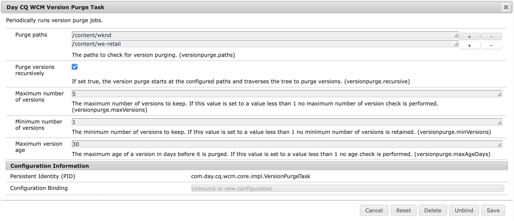

# 監視和維護您的Adobe Experience Manager實例{#monitoring-and-maintaining-your-aem-instance}

部署實AEM例後，您必須監視並維護其操作、效能和完整性。

這裡的一個關鍵因素是，要識別潛在問題，您必須知道系統在正常情況下的外觀和行為。 這種能力最好通過監控系統和收集資訊來實現。

| 檢查 | 考量事項 | 注釋/操作 |
|---|---|---|
| 備份計畫。 |  | 瞭解如何 [備份實例](/help/sites-deploying/monitoring-and-maintaining.md#backups)。 |
| 災難恢復計畫。 | 您公司的災難恢復指導原則。 |  |
| 錯誤跟蹤系統可用於報告問題。 | 比如說， [布吉利亞](https://www.bugzilla.org/)。 [吉拉](https://www.atlassian.com/software/jira)或其他許多。 |  |
| 正在監視檔案系統。 | 如果可用磁碟空間不足，則CRX儲存庫「凍結」。 在可用空間後恢復。 | &quot; `*ERROR* LowDiskSpaceBlocker`&quot;可用空間變低時，可以在日誌檔案中看到消息。 |
| [日誌檔案](/help/sites-deploying/monitoring-and-maintaining.md#working-with-audit-records-and-log-files) 正在監視。 |  |  |
| 系統監控（持續）在後台運行。 | 包括CPU、記憶體、磁碟和網路使用。 例如，iostat / vmstat / perfmon。 | 記錄的資料是可視的，可用於跟蹤效能問題。 還可以訪問原始資料。 |
| [正AEM在監視效能](/help/sites-deploying/monitoring-and-maintaining.md#monitoring-performance)。 | 包括 [請求計數器](/help/sites-deploying/monitoring-and-maintaining.md#request-counters) 監視流量級別。 | 如出現業績重大或長期損失，應進行詳細調查。 |
| 您正在監視 [複製代理](/help/sites-deploying/monitoring-and-maintaining.md#monitoring-your-replication-agents)。 |  |  |
| 定期清除工作流實例。 | 儲存庫大小和工作流效能。 | 請參閱 [定期清除工作流實例](/help/sites-administering/workflows-administering.md#regular-purging-of-workflow-instances)。 |

## 備份 {#backups}

備份以下內容是一個好做法：

* 軟體安裝 — 在配置發生重大更改之前/之後
* 儲存庫中儲存的內容 — 定期

您的公司可能有您遵循的備份策略，有關備份內容和備份時間的其他考慮因素包括：

* 系統和資料有多重要。
* 對軟體或資料進行更改的頻率。
* 資料量；容量有時可能是問題，執行備份的時間也是問題。
* 用戶線上時能否進行備份；如果可能，效能影響將如何。
* 用戶的地理分佈；即，何時是備份的最佳時間（以最大限度地減少影響）?
* 您的災難恢復策略；是否有備份資料必須儲存的指導原則（例如，非現場介質和特定介質）。

通常，完整備份是定期進行的（例如，每日、每週或每月），增量備份介於之間（例如，每小時、每日或每週）。

>[!CAUTION]
>
>實施生產實例備份時，test *必須* 確保成功還原備份。
>
>如果沒有此測試，備份可能無用（最壞情況）。

>[!NOTE]
>
>有關備份效能的詳細資訊，請閱讀 [備份效能](/help/sites-deploying/configuring-performance.md#backup-performance) 的子菜單。

### 備份軟體安裝 {#backing-up-your-software-installation}

在安裝或配置發生重大更改後，建立軟體安裝的備份。

要完成這項任務， [備份整個儲存庫](#backing-up-your-repository) 然後：

1. 停AEM下。
1. 備份整個 `<cq-installation-dir>` 從檔案系統中。

>[!CAUTION]
>
>如果您正在操作第三方應用程式伺服器，則其他資料夾可能位於不同的位置，並且必須也進行備份。 請參閱 [如何使用應AEM用程式伺服器安裝](/help/sites-deploying/application-server-install.md) 有關安裝應用程式伺服器的資訊。

>[!CAUTION]
>
>支援檔案資料儲存的增量備份；對其他元件（如Lucene索引）使用增量備份時，請確保在備份中也將刪除的檔案標籤為已刪除。

>[!NOTE]
>
>磁碟鏡像也可用作備份機制。

### 備份儲存庫 {#backing-up-your-repository}

的 [備份和恢復](/help/sites-administering/backup-and-restore.md) CRX文檔的一節涵蓋與CRX儲存庫備份相關的所有問題。

有關進行線上「熱」備份的完整詳細資訊，請參見 [建立聯機備份](/help/sites-administering/backup-and-restore.md#online-backup)。

## 版本清除 {#version-purging}

的 **清除版本** 工具用於清除儲存庫中節點或節點層次結構的版本。 其主要目的是通過刪除節點的舊版本來幫助您減小儲存庫的大小。

本節介紹與的版本化功能相關的維護操AEM作。 的 **清除版本** 工具用於清除儲存庫中節點或節點層次結構的版本。 其主要目的是通過刪除節點的舊版本來幫助您減小儲存庫的大小。

### 概觀 {#overview}

的 **清除版本** 工具可用作每週維護任務。 首次使用之前，必須先添加，然後進行配置。 之後，可以按請求或每週運行。

### 清除網站的版本 {#purging-versions-of-a-web-site}

要清除網站的版本，請按如下步驟操作：

1. 導航到 **[工具](/help/sites-administering/tools-consoles.md)** **控制台**&#x200B;選中 **操作**。 **維護**，則 **每週維護窗口**。

1. 選擇 **+添加** 的上界。

   

1. 選擇 **版本清除** 從 **添加新任務** 對話框。 然後 **保存**。

   

1. 的 **版本清除** 添加任務。 使用卡操作可以：
   * 選擇 — 在頂部工具欄中顯示其他操作
   * 運行 — 立即運行已配置的清除
   * 配置 — 配置每週清除任務

   

1. 選擇 **配置** 開啟Web控制台的操作 **第CQ WCM版本清除任務**，您可以在其中配置：

   

   * **清除路徑**
設定要清除的內容的起始路徑；比如說， 
`/content/wknd`。

      >[!CAUTION]
      >
      >Adobe建議您為每個網站定義多個路徑。
      >
      >定義子代過多的路徑可以顯著延長執行清除的時間。

   * **遞歸清除版本**

      * 如果僅要清除路徑定義的節點，請取消選擇。
      * 如果要清除由路徑及其子體定義的節點，請選擇。
   * **最大版本數**
設定要保留的最大版本數（針對每個節點）。 留空以不使用此設定。

   * **最低版本數**
設定要保留的最小版本數（針對每個節點）。 留空以不使用此設定。

   * **最大版本期限**
設定要保留的最大版本期限（每個節點），以天為單位。 留空以不使用此設定。
   然後 **保存**。

1. 導航/返回至 **每週維護窗口** 選擇 **運行** 立即啟動進程。

>[!CAUTION]
>
>可以使用「經典用戶介面」對話框執行 [乾跑](#analyzing-the-console) 配置：
>
>* http://localhost:4502/etc/versioning/purge.html
>
>如果不還原儲存庫，則無法還原已清除的節點。 在清除之前，請始終執行乾式運行，以保護配置。

#### 乾式運行 — 分析控制台 {#analyzing-the-console}

經典UI提供 **乾跑** 選項：

* http://localhost:4502/etc/versioning/purge.html

進程列出已處理的所有節點。 在此過程中，節點可以具有以下狀態之一：

* `ignore (not versionnable)`:該節點不支援版本控制，在過程中將忽略。

* `ignore (no version)`:該節點沒有任何版本，在進程中將忽略。

* `retained`:未清除該節點。
* `purged`:節點將被清除。

此外，控制台還提供有關版本的有用資訊：

* `V 1.0`:版本號。
* `V 1.0.1`&#42;:星號表示版本是當前（基本）版本，無法清除。

* `Thu Mar 15 2012 08:37:32 GMT+0100`:版本的日期。

在下一個示例中：

* 的 **[!DNL Shirts]** 版本會被清除，因為其版本年齡超過兩天。
* 的 **[!DNL Tonga Fashions!]** 版本會被清除，因為其版本數大於5。


## 使用審計記錄和日誌檔案 {#working-with-audit-records-and-log-files}

審計記錄和與Adobe Experience Manager(AEM)有關的日誌檔案可在不同位置找到。 下面將概述您可以查找的內容和查找位置。

### 使用日誌 {#working-with-logs}

AEMWCM記錄詳細日誌。 開啟包裝並啟動Quickstart後，您可以找到以下日誌：

* `<cq-installation-dir>/crx-quickstart/logs/`

* `<cq-installation-dir>/crx-quickstart/repository/`

#### 日誌檔案旋轉 {#log-file-rotation}

日誌檔案旋轉是指通過定期建立檔案來限制檔案增長的過程。 在AEM中，名為 `error.log` 按給定規則每天旋轉一次：

* 的 `error.log` 根據模式{original_filename}更名檔案 `.yyyy-MM-dd`。 例如，在2010年7月11日，當前日誌檔案被更名 `error.log-2010-07-10`，則 `error.og` 的子菜單。

* 以前的日誌檔案不會被刪除，因此您有責任定期清除舊的日誌檔案以限制磁碟的使用。

>[!NOTE]
>
>如果升級AEM安裝，則磁碟上將保留任何不再使用AEM的現有日誌檔案。 你可以不冒風險地移除它們。 所有新日誌條目都寫入新日誌檔案中。

### 查找日誌檔案 {#finding-the-log-files}

安裝的檔案伺服器上保存了各種日誌文AEM件：

* `<cq-installation-dir>/crx-quickstart/logs`

   * `access.log`
所有對WCM和存AEM儲庫的訪問請求都在此處註冊。

   * `audit.log`
此處註冊了審核操作。

   * `error.log`
此處註冊了錯誤消息（嚴重性級別不同）。

   * [ `ImageServer-<PortId>-yyyy>-<mm>-<dd>.log`](https://experienceleague.adobe.com/docs/dynamic-media-developer-resources/image-serving-api/image-serving-api/config-admin/server-logging/c-image-server-log.html)
此日誌僅在 [!DNL Dynamic Media] 的子菜單。 它提供用於分析內部ImageServer進程行為的統計和分析資訊。

   * `request.log`
每個訪問請求都與響應一起註冊。

   * [ `s7access-<yyyy>-<mm>-<dd>.log`](https://experienceleague.adobe.com/docs/dynamic-media-developer-resources/image-serving-api/image-serving-api/config-admin/server-logging/c-access-log.html)
此日誌僅在 [!DNL Dynamic Media] 的子菜單。 s7access日誌記錄對 [!DNL Dynamic Media] 通 `/is/image` 和 `/is/content`。

   * `stderr.log`
保存在啟動期間生成的錯誤消息，同樣具有不同嚴重性級別。 預設情況下，日誌級別設定為 
`Warning` ( `WARN`)

   * `stdout.log`
保存指示啟動期間事件的日誌記錄消息。

   * `upgrade.log`
提供從 
`com.day.compat.codeupgrade` 和 `com.adobe.cq.upgradesexecutor` 包。

* `<cq-installation-dir>/crx-quickstart/repository/segmentstore`

   * `journal.log`
修訂日誌資訊。

>[!NOTE]
>
>從**系統/控制台/狀態 — Bundlelist **頁生成的**下載完整**包中不包含ImageServer和s7訪問日誌。 為了支援目的，如果 [!DNL Dynamic Media] 問題，在您與客戶支援聯繫時添加ImageServer和s7訪問日誌。

### 激活DEBUG日誌級別 {#activating-the-debug-log-level}

預設日誌級別([Apache Sling日誌記錄配置](/help/sites-deploying/osgi-configuration-settings.md#apacheslingloggingconfiguration))是資訊，因此不記錄調試消息。

要激活記錄器的調試日誌級別，請設定屬性 `org.apache.sling.commons.log.level` 調試。 例如，在 `/libs/sling/config/org.apache.sling.commons.log.LogManager` 配置 [全局Apache Sling日誌記錄](/help/sites-deploying/osgi-configuration-settings.md#apacheslingloggingconfiguration)。

>[!CAUTION]
>
>不要將日誌保留在調試日誌級別的時間超過必要時間，因為它會生成大量日誌條目，佔用資源。

調試檔案中的一行通常以DEBUG開頭，然後提供日誌級別、安裝程式操作和日誌消息。 例如：

```shell
DEBUG 3 WebApp Panel: WebApp successfully deployed
```

日誌級別如下：

| 0 | 錯誤 | 操作失敗，安裝程式無法繼續。 |
|---|---|---|
| 1 | 錯誤 | 操作失敗。 安裝將繼續，但AEMWCM的一部分安裝不正確，無法正常工作。 |
| 2 | 警告 | 操作已成功，但遇到問題。 AEMWCM可能工作正確，或者可能無法正常工作。 |
| 3 | 資訊 | 操作已成功。 |

### 建立自定義日誌檔案 {#create-a-custom-log-file}

>[!NOTE]
>
>與Adobe Experience Manager合作時，有幾種方法管理此類服務的配置設定；見 [配置OSGi](/help/sites-deploying/configuring-osgi.md) 的子菜單。

在某些情況下，您可能希望建立具有不同日誌級別的自定義日誌檔案。 在儲存庫中，執行以下操作：

1. 如果不存在，請建立配置資料夾( `sling:Folder`) `/apps/<project-name>/config`。
1. 下 `/apps/<project-name>/config`，為新節點建立節點 [Apache Sling日誌記錄器配置](/help/sites-deploying/osgi-configuration-settings.md#apacheslingloggingloggerconfigurationfactoryconfiguration):

   * 名稱: `org.apache.sling.commons.log.LogManager.factory.config-<identifier>`

      位置 `<identifier>` 替換為您（必須）輸入以標識實例的自由文本（您不能忽略此資訊）。

      例如 `org.apache.sling.commons.log.LogManager.factory.config-MINE`

   * 類型: `sling:OsgiConfig`
   >[!NOTE]
   >
   >雖然不是技術要求，但建議 `<identifier>` 唯一。

1. 在此節點上設定以下屬性：

   * 名稱: `org.apache.sling.commons.log.file`

      類型：字串

      值：指定日誌檔案；比如說， `logs/myLogFile.log`

   * 名稱: `org.apache.sling.commons.log.names`

      類型：字串[] （字串+多）

      值：指定記錄器要記錄消息的OSGi服務；例如，以下所有內容：

      * `org.apache.sling`
      * `org.apache.felix`
      * `com.day`
   * 名稱: `org.apache.sling.commons.log.level`

      類型：字串

      值：指定所需的日誌級別( `debug`。 `info`。 `warn`或 `error`);比如說， `debug`

   * 根據需要配置其他參數：

      * 名稱: `org.apache.sling.commons.log.pattern`

         類型: `String`

         值：根據需要指定日誌消息的模式；比如說，

         `{0,date,dd.MM.yyyy HH:mm:ss.SSS} *{4}* [{2}] {3} {5}`
   >[!NOTE]
   >
   >`org.apache.sling.commons.log.pattern` 支援最多六個論點。
   >
   >{0}類型的時間戳 `java.util.Date`
   >
   >{1}日誌標籤
   >
   >{2}當前線程的名稱
   >
   >{3}記錄器的名稱
   >
   >{4}日誌級別
   >
   >{5}日誌消息
   >
   >如果日誌呼叫包括 `Throwable`,stacktrace將附加到消息中。

   >[!CAUTION]
   >
   >org.apache.sling.commons.log.names必須具有值。

   >[!NOTE]
   >
   >日誌寫入程式路徑與 `crx-quickstart` 位置。
   >
   >因此，日誌檔案指定為：
   >
   >`logs/thelog.log`
   >
   >寫入：
   >
   >`<cq-installation-dir>/crx-quickstart/logs/thelog.log`。
   >
   >以及指定為：
   >
   >`../logs/thelog.log`
   >
   >寫入目錄：
   >
   >`<cq-installation-dir>/logs/`\
   >(即 `<cq-installation-dir>/crx-quickstart/`)

1. 只有在需要新寫入程式（即配置與預設寫入程式不同）時，才需要執行此步驟。

   >[!CAUTION]
   >
   >僅當現有預設值不適合時，才需要新的日誌記錄寫入程式配置。
   >
   >如果未配置顯式寫入程式，則系統將根據預設值自動生成隱式寫入程式。

   下 `/apps/<project-name>/config`，為新節點建立節點 [Apache Sling日誌記錄寫入程式配置](/help/sites-deploying/osgi-configuration-settings.md#apacheslingloggingwriterconfigurationfactoryconfiguration):

   * 名稱： `org.apache.sling.commons.log.LogManager.factory.writer-<identifier>` (a Writer)

      和記錄器一樣， `<identifier>` 替換為您（必須）輸入以標識實例的自由文本（您不能忽略此資訊）。 例如 `org.apache.sling.commons.log.LogManager.factory.writer-MINE`

   * 類型: `sling:OsgiConfig`
   >[!NOTE]
   >
   >雖然不是技術要求，但建議 `<identifier>` 唯一。

   在此節點上設定以下屬性：

   * 名稱: `org.apache.sling.commons.log.file`

      類型: `String`

      值：指定日誌檔案，使其與記錄器中指定的檔案匹配；

      這個例子， `../logs/myLogFile.log`。

   * 根據需要配置其他參數：

      * 名稱: `org.apache.sling.commons.log.file.number`

         類型: `Long`

         值：指定要保留的日誌檔案數；比如說， `5`

      * 名稱: `org.apache.sling.commons.log.file.size`

         類型: `String`

         值：按大小/日期指定控制檔案旋轉所需的內容；比如說， `'.'yyyy-MM-dd`
   >[!NOTE]
   >
   >`org.apache.sling.commons.log.file.size` 通過設定以下任一項來控制日誌檔案的旋轉：
   >
   >* 最大檔案大小
   >* 時間/日期計畫

   >
   >指示何時建立新檔案（以及根據名稱模式更名的現有檔案）。
   >
   >* 可以用數字指定大小限制。 如果未提供大小指示器，則將其作為位元組數，或者您可以添加一個大小指示器 —  `KB`。 `MB`或 `GB` （忽略案例）。
   >* 時間/日期計畫可以指定為 `java.util.SimpleDateFormat` 的上界。 它定義檔案旋轉後的時間段。 此外，附加到旋轉檔案（用於標識）的尾碼。

   >
   >預設值為「。」yyyy-MM-dd（用於日誌輪替）。
   >
   >例如，在2010年1月20日午夜（或當此日期後的第一個日誌消息準確無誤）,../logs/error.log將更名為../logs/error.log.2010-01-20。 1月21日的日誌記錄將輸出到（新的且空的）../logs/error.log，直到在下一天更改時滾動。
   >
   >| `'.'yyyy-MM` | 每月初的輪換 |
   >|---|---|
   >| `'.'yyyy-ww` | 每週第一天的輪轉（取決於區域設定）。 |
   >| `'.'yyyy-MM-dd` | 每天午夜輪轉。 |
   >| `'.'yyyy-MM-dd-a` | 每天午夜和中午輪值。 |
   >| `'.'yyyy-MM-dd-HH` | 每小時在頂部旋轉。 |
   >| `'.'yyyy-MM-dd-HH-mm` | 每分鐘開始輪轉。 |
   >
   >注：指定時間/日期時：
   >
   >1. 應在一對單引號(&#39; &#39;)中「轉義」文本；
      >
      >    避免某些字元被解釋為圖案字母。
   >
   >1. 在選項中的任何位置都只允許使用有效檔案名的字元。


1. 使用所選工具讀取新日誌檔案。

   此示例建立的日誌檔案為 `../crx-quickstart/logs/myLogFile.log`。

Felix控制台還提供有關Sling Log Support的資訊，位於 `../system/console/slinglog`;比如說， `https://localhost:4502/system/console/slinglog`。

### 查找審計記錄 {#finding-the-audit-records}

保存審計記錄，以提供誰在何時做什麼的記錄。 為WCM和OSGi事件生AEM成不同的審計記錄。

#### 在AEM頁面創作時顯示的WCM審核記錄 {#aem-wcm-audit-records-shown-when-page-authoring}

1. 開啟頁面。
1. 在旁鍵中，您可以使用鎖定表徵圖選擇頁籤，然後按兩下 **審核日誌……**
1. 此時將開啟一個新窗口，顯示當前頁面的審計記錄清單。

   

1. 按一下 **確定** 來關閉窗口。

#### WCMAEM在儲存庫中審計記錄 {#aem-wcm-auditing-records-within-the-repository}

在 `/var/audit` 資料夾，根據資源保存審計記錄。 您可以向下鑽取，直到您看到單個記錄及其包含的資訊。

這些條目包含的資訊與編輯頁面時顯示的資訊相同。

#### OSGi Audit Records from the Web Console（Web控制台中的OSGi審核記錄） {#osgi-audit-records-from-the-web-console}

OSGi事件還生成可從 **配置狀態** 頁籤 — > **日誌檔案** 的子AEM菜單：


## 監視複製代理 {#monitoring-your-replication-agents}

您可以監視 [複製隊列](/help/sites-deploying/replication.md) 檢測隊列是關閉還是阻塞的時間，這反過來可能表示發佈實例或外部系統有問題：

* 是否啟用所有必需的隊列？
* 是否仍需要任何禁用的隊列？
* 全部 `enabled` 隊列應具有狀態 `idle` 或 `active`表示正常操作；不應設定隊列 `blocked`這通常是接收方問題的徵兆。

* 如果隊列的大小隨時間增長，則它可以指示阻止的隊列。

監視複製代理：

1. 訪問 **工具** 的上界AEM。
1. 按一下 **複製**。
1. 按兩下相應環境（左窗格或右窗格）的代理連結；比如說， **作者代理**。

   生成的窗口顯示作者環境的所有複製代理的概述，包括其目標和狀態。

1. 按一下相應的代理名稱（即連結）以顯示有關該代理的詳細資訊：

   

   您可以在這裡：

   * 查看是否啟用代理。
   * 查看任何複製的目標。
   * 查看複製隊列是否處於活動狀態（已啟用）。
   * 查看隊列中是否有任何項。
   * **刷新** 或 **清除** 更新隊列條目的顯示。 這樣做有助於您查看進入和離開隊列的項目。
   * **查看日誌** 訪問複製代理執行的任何操作的日誌。
   * **Test連接** 到目標實例。
   * **強制重試** 列項。

   >[!CAUTION]
   >
   >請勿在發佈實例上使用「Test連接」連結的「反向複製」發件箱。
   >
   >如果對發件箱隊列執行複製test，則每次反向複製都會重新處理早於test複製的任何項。
   >
   >如果此類項存在於隊列中，則可以使用以下XPath JCR查詢找到它們，並應將其刪除。
   >
   >`/jcr:root/var/replication/outbox//*[@cq:repActionType='TEST']`

同樣，您可以開發一個解決方案來檢測所有複製代理(位於 `/etc/replication/author` 或 `/etc/replication/publish`)，然後檢查代理的狀態( `enabled`。 `disabled`)和基礎隊列( `active`。 `idle`。 `blocked`)。

## 監視效能 {#monitoring-performance}

[效能優化](/help/sites-deploying/configuring-performance.md) 是一個在開發過程中接受焦點的交互過程。 部署後，在特定的時間間隔或事件後對其進行審閱。

在收集資訊以進行優化時使用的方法也可用於持續監測。

>[!NOTE]
>
>特定 [可用配置提高效能](/help/sites-deploying/configuring-performance.md#configuring-for-performance) 的下界。

下面列出了常見的效能問題，以及如何發現和消除這些問題的建議。

| 區域 | 症狀 | 要增加容量…… | 要減小卷…… |
|---|---|---|---|
| 用戶端 | 客戶端CPU使用率高。 | 安裝效能更高的客戶端CPU。 | 簡化(HTML)佈局。 |
|  | 伺服器CPU使用率低。 | 升級到更快的瀏覽器。 | 改進客戶端快取。 |
|  | 有些客戶很快，有些很慢。 |  |  |
| 伺服器 |  |  |  |
| 網路 | 伺服器和客戶端的CPU使用率都較低。 | 消除網路瓶頸。 | 改進/優化客戶端快取的配置。 |
|  | 在伺服器上本地瀏覽的速度（相對而言）較快。 | 增加網路頻寬。 | 減少網頁的「重量」(例如，減少影像、優化HTML)。 |
| Web伺服器 | Web伺服器上的CPU使用率很高。 | 將Web伺服器群集。 | 減少每頁的點擊量（訪問）。 |
|  |  | 使用硬體負載平衡器。 |  |
| 應用程式 | 伺服器CPU使用率高。 | 集AEM群實例。 | 搜索並消除CPU和記憶體掛起（使用代碼查看和定時輸出）。 |
|  | 記憶體消耗高。 |  | 改進所有級別的快取。 |
|  | 響應時間較短。 |  | 優化模板和元件（例如，結構、邏輯）。 |
| 存放庫 |  |  |  |
| 快取 |  |  |  |

效能問題可能源於與網站無關的各種原因，包括連接速度、CPU負載等方面的暫時減慢。

它還可能影響您的所有訪問者，或僅影響其中的一部分。

在優化一般效能或解決特定問題之前，必須獲取、排序和分析所有這些資訊。

* 在遇到效能問題之前：

   * 收集盡可能多的資訊，以建立正常情況下系統的良好工作知識

* 遇到效能問題時：

   * 嘗試使用一個（或最好是更多個）標準Web瀏覽器在您知道具有良好一般效能的不同客戶端上和/或在伺服器本身上（如果可能）複製它
   * 檢查是否在適當的時間空間內發生了任何更改（與系統相關），以及這些更改中是否有任何更改可能影響效能
   * 詢問問題，如：

      * 問題是否只在特定時間發生？
      * 問題是否僅發生在特定頁面上？
      * 其他請求是否受到影響？
   * 收集盡可能多的資訊，以與您在正常情況下對系統的瞭解進行比較：


### 用於監控和分析效能的工具 {#tools-for-monitoring-and-analyzing-performance}

下面簡要介紹了一些可用於監視和分析效能的工具。

其中一些工具取決於您的作業系統。

<table>
 <tbody>
  <tr>
   <td>工具</td>
   <td>用於分析……</td>
   <td>用法/詳細資訊……</td>
  </tr>
  <tr>
   <td>request.log</td>
   <td>響應時間和併發。</td>
   <td><a href="#interpreting-the-request-log">解釋request.log</a>。</td>
  </tr>
  <tr>
   <td>桁架/層</td>
   <td>頁面載入</td>
   <td><p>用於跟蹤系統調用和信號的Unix/Linux命令。 將日誌級別提高到 <code>INFO</code>。</p> <p>分析每個請求的頁載入數以及哪些頁。</p> </td>
  </tr>
  <tr>
   <td>線程轉儲</td>
   <td>觀察JVM線程。 確定爭論、鎖定和長跑者。</td>
   <td><p>取決於作業系統：<br /> - Unix/Linux: <code>kill -QUIT &lt;<em>pid</em>&gt;</code><br /> - Windows（控制台模式）:Ctrl-Break<br /> </p> <p>還提供分析工具，如 <a href="https://github.com/irockel/tda">TDA</a>。<br /> </p> </td>
  </tr>
  <tr>
   <td>堆轉儲</td>
   <td>記憶體不足，導致效能下降。</td>
   <td><p>添加：<br /> <code>-XX:+HeapDumpOnOutOfMemoryError</code><br /> 的子菜單AEM。</p> <p>查看 <a href="https://docs.oracle.com/javase/8/docs/technotes/guides/troubleshoot/prepapp002.html#CEGBHDFH">「JVM故障排除的選項/標誌」頁</a>。</p> </td>
  </tr>
  <tr>
   <td>系統調用</td>
   <td>確定時間問題。</td>
   <td><p>呼叫 <code>System.currentTimeMillis()</code> 或 <code>com.day.util</code>。 計時用於根據代碼或通過 <a href="#html-comments">HTML注釋</a>。</p> <p><strong>注：</strong> 實施這些功能，以便根據需要激活/停用這些功能；當系統運行順利時，不需要收集統計資訊的開銷。</p> </td>
  </tr>
  <tr>
   <td>阿帕奇長座</td>
   <td>識別記憶體洩漏，有選擇地分析響應時間。</td>
   <td><p>基本用法為：</p> <p><code>ab -k -n &lt;<em>requests</em>&gt; -c &lt;<em>concurrency</em>&gt; &lt;<em>url</em>&gt;</code></p> <p>請參閱 <a href="#apache-bench">阿帕奇長座</a> 和 <a href="https://httpd.apache.org/docs/2.4/programs/ab.html">ab手冊頁</a> 的雙曲餘切值。</p> </td>
  </tr>
  <tr>
   <td>搜索分析</td>
   <td> </td>
   <td>離線執行搜索查詢，確定查詢、test和確認結果集的響應時間。<br /> </td>
  </tr>
  <tr>
   <td>JMeter</td>
   <td>載入和功能test。</td>
   <td><a href="https://jmeter.apache.org/">https://jmeter.apache.org/</a></td>
  </tr>
  <tr>
   <td>JProfiler</td>
   <td>深入的CPU和記憶體分析。</td>
   <td><a href="https://www.ej-technologies.com/">https://www.ej-technologies.com/</a></td>
  </tr>
  <tr>
   <td>Java™飛行記錄器</td>
   <td>Java™飛行記錄器(JFR)是收集有關正在運行的Java™應用程式的診斷和分析資料的工具。</td>
   <td><a href="https://docs.oracle.com/javase/8/docs/technotes/guides/troubleshoot/tooldescr004.html#BABJJEEE">https://docs.oracle.com/javase/8/docs/technotes/guides/troubleshoot/tooldescr004.html#BABJJEEE</a></td>
  </tr>
  <tr>
   <td>JConsole</td>
   <td>觀察JVM度量和線程。</td>
   <td><p>用法：jconsole</p> <p>請參閱 <a href="https://docs.oracle.com/javase/8/docs/technotes/guides/management/jconsole.html">jconsole</a> 和 <a href="#monitoring-performance-using-jconsole">使用JConsole監視效能</a>。</p> <p><strong>注：</strong> 在JDK 1.8中，JConsole可通過插件進行擴展；例如，Top或TDA（線程轉儲分析器）。</p> </td>
  </tr>
  <tr>
   <td>Java™ VisualVM</td>
   <td>觀察JVM度量、線程、記憶體和效能分析。</td>
   <td><p>用法：visualvm或visualvm<br /> </p> <p>請參閱 <a href="https://docs.oracle.com/javase/8/docs/technotes/guides/visualvm/">可視化</a> 和 <a href="#monitoring-performance-using-j-visualvm">使用(J)VisualVM監視效能</a>。</p> <p><strong>注：</strong> 使用JDK 1.8,VisualVM可通過插件進行擴展。 在JDK 9之後，VisualVM將停止。 改用Java™飛行記錄器。</p> </td>
  </tr>
  <tr>
   <td>桁架/層，l</td>
   <td>深入內核調用和進程分析(UNIX®)。</td>
   <td>Unix/Linux命令。</td>
  </tr>
  <tr>
   <td>計時統計資訊</td>
   <td>請參閱頁面呈現的計時統計資訊。</td>
   <td><p>要查看頁面呈現的計時統計資訊，可以使用 <strong>Ctrl-Shift-U組合鍵</strong> 一起 <code>?debugClientLibs=true</code> 的子菜單。</p> </td>
  </tr>
  <tr>
   <td>CPU和記憶體分析工具<br /> </td>
   <td><a href="#interpreting-the-request-log">在開發過程中分析慢速請求時使用</a>。</td>
   <td>比如說， <a href="https://www.yourkit.com/">您的套件</a>。 或 <a href="https://docs.oracle.com/javase/8/docs/technotes/guides/troubleshoot/tooldescr004.html#BABJJEEE">Java™飛行記錄器</a>。</td>
  </tr>
  <tr>
   <td><a href="#information-collection">資訊收集</a></td>
   <td>安裝的當前狀態。</td>
   <td>盡可能瞭解您的安裝情況，還有助於您瞭解哪些因素可能導致效能變化，以及這些更改是否合理。 定期收集這些指標，以便您能夠輕鬆地看到重大變化。</td>
  </tr>
 </tbody>
</table>

### 解釋request.log {#interpreting-the-request-log}

此檔案註冊了有關對每個請求的基本信AEM息。 從中可以得出有價值的結論。

的 `request.log` 提供了一種內置的方法，可查看請求需要多長時間。 就發展而言， `tail -f` 這樣 `request.log` 注意反應緩慢。 要分析 `request.log`,Adobe建議 [使用 `rlog.jar` 允許您對響應時間進行排序和篩選](#using-rlog-jar-to-find-requests-with-long-duration-times)。

Adobe建議將「慢」頁面與 `request.log`，然後單獨調整它們以獲得更好的效能。 包括每個元件的效能度量或使用效能分析工具，如 ` [yourkit](https://www.yourkit.com/)`。

#### 監視網站上的流量 {#monitoring-traffic-on-your-website}

請求日誌將記錄發出的每個請求以及作出的響應：

```xml
09:43:41 [66] -> GET /author/y.html HTTP/1.1
09:43:41 [66] <- 200 text/html 797ms
```

通過在特定期間內（例如，在不同的24小時期間內）總計所有GET條目，您可以對網站上的平均流量進行聲明。

#### 使用request.log監視響應時間 {#monitoring-response-times-with-the-request-log}

效能分析的一個好起點是請求日誌：

`<cq-installation-dir>/crx-quickstart/logs/request.log`

日誌如下所示（為簡單起見，行縮短）:

```xml
31/Mar/2009:11:32:57 +0200 [379] -> GET /path/x HTTP/1.1
31/Mar/2009:11:32:57 +0200 [379] <- 200 text/html 33ms
31/Mar/2009:11:33:17 +0200 [380] -> GET /path/y HTTP/1.1
31/Mar/2009:11:33:17 +0200 [380] <- 200 application/json 39ms
```

此日誌每個請求或響應有一行：

* 發出每個請求或響應的日期。
* 請求數（方括弧）。 此數字與請求和響應匹配。
* 一個箭頭，指示它是請求（指向右側的箭頭）還是響應（向左的箭頭）。
* 對於請求，行包含：

   * 方法(通常為GET、HEAD或POST)
   * 請求的頁面
   * 協定

* 對於響應，行包含：

   * 狀態代碼(200表示「success」，404表示「page not found」（未找到頁面）
   * MIME類型
   * 響應時間

使用小指令碼，可以從日誌檔案中提取所需資訊並匯編所需的統計資訊。 從這些統計資訊中，您可以看到哪些頁或頁類型速度較慢，以及整體效能是否令人滿意。

#### 使用request.log監視搜索響應時間 {#monitoring-search-response-times-with-the-request-log}

搜索請求也會在日誌檔案中註冊：

```xml
31/Mar/2009:11:35:34 +0200 [338] -> GET /author/playground/en/tools/search.html?query=dilbert&size=5&dispenc=utf-8 HTTP/1.1
31/Mar/2009:11:35:34 +0200 [338] <- 200 text/html 1562ms
```

因此，如上所述，您可以使用指令碼來提取相關資訊並建立統計資訊。

但是，在確定響應時間後，分析請求佔用時間的原因以及可以採取哪些措施來改進響應。

#### 監視併發用戶的數量和影響 {#monitoring-the-number-and-impact-of-concurrent-users}

再次 `request.log` 可用於監控併發性以及系統對它的反應。

必須進行test，以確定系統可以處理多少併發用戶，然後才能看到負面影響。 同樣，可以使用指令碼從日誌檔案中提取結果：

* 監視在特定時間範圍內（如一分鐘）發出的請求數。
* test特定數量的用戶在同一時間（盡可能接近）發出相同請求的效果。 例如，30個用戶按一下 **保存** 同時。

```xml
31/Mar/2009:11:45:29 +0200 [333] -> GET /author/libs/Personalize/content/statics.close.gif HTTP/1.1
31/Mar/2009:11:45:29 +0200 [334] -> GET /author/libs/Personalize/content/statics.detach.gif HTTP/1.1
31/Mar/2009:11:45:30 +0200 [335] -> GET /author/libs/CFC/content/imgs/logo.rZMNURccynWcTpCxyuBNiTCoiBMmw000.default.gif HTTP/1.1
31/Mar/2009:11:45:32 +0200 [335] <- 304 text/html 0ms
31/Mar/2009:11:45:33 +0200 [334] <- 200 image/gif 31ms
31/Mar/2009:11:45:38 +0200 [333] <- 200 image/gif 31ms
31/Mar/2009:11:45:42 +0200 [336] -> GET /author/libs/CFC/content/imgs/logo.rZMNURccynWcTZRXunQbbQtvuuCMbRRBuWXz0000.default.gif HTTP/1.1
31/Mar/2009:11:45:43 +0200 [337] -> GET /author/titlebar_bg.gif HTTP/1.1
31/Mar/2009:11:45:43 +0200 [336] <- 304 text/html 0ms
31/Mar/2009:11:45:44 +0200 [337] <- 304 text/html 0ms
```

### 使用rlog.jar查找持續時間較長的請求 {#using-rlog-jar-to-find-requests-with-long-duration-times}

在AEM以下內容中包括各種幫助工具：
`<cq-installation-dir>/crx-quickstart/opt/helpers`

其中一種工具， `rlog.jar`，可用於快速排序 `request.log` 以便按持續時間（從最長到最短）顯示請求。

以下命令顯示可能的參數：

```shell
$java -jar rlog.jar
Request Log Analyzer Version 21584 Copyright 2005 Day Management AG
Usage:
  java -jar rlog.jar [options] <filename>
Options:
  -h               Prints this usage.
  -n <maxResults>  Limits output to <maxResults> lines.
  -m <maxRequests> Limits input to <maxRequest> requests.
  -xdev            Exclude POST request to CRXDE.
```

例如，可以運行它，指定 `request.log` 檔案作為參數，並顯示持續時間最長的十個第一個請求：

```shell
$ java -jar ../opt/helpers/rlog.jar -n 10 request.log
*Info * Parsed 464 requests.
*Info * Time for parsing: 22ms
*Info * Time for sorting: 2ms
*Info * Total Memory: 1mb
*Info * Free Memory: 1mb
*Info * Used Memory: 0mb
------------------------------------------------------
     18051ms 31/Mar/2009:11:15:34 +0200 200 GET /content/geometrixx/en/company.html text/ html
      2198ms 31/Mar/2009:11:15:20 +0200 200 GET /libs/cq/widgets.js application/x-javascript
      1981ms 31/Mar/2009:11:15:11 +0200 200 GET /libs/wcm/content/welcome.html text/html
      1973ms 31/Mar/2009:11:15:52 +0200 200 GET /content/campaigns/geometrixx.teasers..html text/html
      1883ms 31/Mar/2009:11:15:20 +0200 200 GET /libs/security/cq-security.js application/x-javascript
      1876ms 31/Mar/2009:11:15:20 +0200 200 GET /libs/tagging/widgets.js application/x-javascript
      1869ms 31/Mar/2009:11:15:20 +0200 200 GET /libs/tagging/widgets/themes/default.js application/x-javascript
      1729ms 30/Mar/2009:16:45:56 +0200 200 GET /libs/wcm/content/welcome.html text/html; charset=utf-8
      1510ms 31/Mar/2009:11:15:34 +0200 200 GET /bin/wcm/contentfinder/asset/view.json/ content/dam?_dc=1238490934657&query=&mimeType=image&_charset_=utf-8 application/json
      1462ms 30/Mar/2009:17:23:08 +0200 200 GET /libs/wcm/content/welcome.html text/html; charset=utf-8
```

連接單個 `request.log` 檔案。

### 阿帕奇長座 {#apache-bench}

為盡量減少特殊情況（如垃圾收集）的影響，建議使用工具，如 `apachebench` (例如， [ab](https://httpd.apache.org/docs/2.4/programs/ab.html) 以幫助識別記憶體洩漏並有選擇地分析響應時間。

Apache Bench可以通過以下方式使用：

```shell
$ ab -c 5 -k -n 1000 "https://localhost:4503/content/geometrixx/en/company.html"
This is ApacheBench, Version 2.3 <$Revision: 655654 $>
Copyright 1996 Adam Twiss, Zeus Technology Ltd, https://www.zeustech.net/
Licensed to The Apache Software Foundation, https://www.apache.org/

Benchmarking localhost (be patient)
Completed 100 requests
Completed 200 requests
Completed 300 requests
Completed 400 requests
Completed 500 requests
Completed 600 requests
Completed 700 requests
Completed 800 requests
Completed 900 requests
Completed 1000 requests
Finished 1000 requests

Server Software: Day-Servlet-Engine/4.1.52
Server Hostname: localhost
Server Port: 4503

Document Path: /content/geometrixx/en/company.html
Document Length: 24127 bytes

Concurrency Level: 5
Time taken for tests: 69.766 seconds
Complete requests: 1000
Failed requests: 998
(Connect: 0, Receive: 0, Length: 998, Exceptions: 0)
Write errors: 0
Keep-Alive requests: 0
Total transferred: 24160923 bytes
HTML transferred: 24010923 bytes
Requests per second: 14.33 /sec (mean)
Time per request: 348.828 [ms] (mean)
Time per request: 69.766 [ms] (mean, across all concurrent requests)
Transfer rate: 338.20 [Kbytes/sec] received

Connection Times (ms)
min mean[+/-sd] median max
Connect: 0 1 3.9 0 58
Processing: 138 347 568.5 282 8106
Waiting: 137 344 568.1 281 8106
Total: 139 348 568.4 283 8106

Percentage of the requests served within a certain time (ms)
50% 283
66% 323
75% 356
80% 374
90% 439
95% 512
98% 1047
99% 1132
100% 8106 (longest request)
```

上述數字取自訪問Geometrixx公司頁面的標準MAcBook Pro筆記型電腦（2010年年中），包括在預設安AEM裝中。 該頁面簡單，但未針對效能進行優化。

的 `apachebench` 還顯示所有併發請求中每個請求的平均時間；見 `Time per request: 54.595 [ms]` （指所有併發請求）。 可以更改併發參數的值 `-c` （一次要執行的多個請求數）以查看任何效果。

### 請求計數器 {#request-counters}

有關請求通信量（特定時間段內的請求數）的資訊會指示實例上的負載。 可以從 [請求日誌](#interpreting-the-request-log)，儘管使用計數器可自動收集資料，以便您查看：

* 活動上的顯著差異（即區分「多個請求」和「低活動」）
* 實例時
* 任何重新啟動（計數器重置為0）

要自動收集資訊，您還可以安裝RequestFilter以在每個請求中增加計數器。 多個計數器可用於不同的時間段。

收集到的資訊可用於指示：

* 活動的重大變化
* 冗餘實例
* 任何重新啟動（計數器重置為0）

### HTML注釋 {#html-comments}

建議每個項目都包括 `html comments` 伺服器效能。 可以找到許多好的公共例子。 選擇頁面，開啟要查看的頁面源，然後滾動到底部。 可以看到以下代碼：

```xml
</body>
 </html>
        <!--
        Page took 58 milliseconds to be rendered by server
         -->
```

### 使用JConsole監視效能 {#monitoring-performance-using-jconsole}

刀具命令 `jconsole` 可用於JDK。

1. 啟動AEM實例。
1. 執行 `jconsole.`
1. 選擇實AEM例並 **連接**。

1. 從 `Local` 應用程式，按兩下 `com.day.crx.quickstart.Main`;概覽顯示為預設值：

   

   現在，您可以選擇其他選項。

### 使用(J)VisualVM監視效能 {#monitoring-performance-using-j-visualvm}

對於JDK 6-8，工具命令 `visualvm` 的子菜單。 安裝JDK後，可以執行以下操作：

1. 啟動AEM實例。

   >[!NOTE]
   >
   >如果使用Java™ 5，則可以 `-Dcom.sun.management.jmxremote` 用於啟動JVM的Java™命令行的參數。 在Java™ 6中，JMX按預設啟用。

1. 運行其中之一：

   * `jvisualvm`:在JDK 1.6 bin資料夾中（測試版）
   * `visualvm`:可從 [VisualVM](https://docs.oracle.com/javase/8/docs/technotes/guides/visualvm/) （出血邊緣版本）

1. 從 `Local` 應用程式，按兩下 `com.day.crx.quickstart.Main`。 「概述」(Overview)顯示為預設值：

   

   現在，您可以選擇其他選項，包括「監視器：

   

可以使用此工具生成線程轉儲和記憶體頭轉儲。 技術支援團隊經常要求提供此資訊。

### 資訊收集 {#information-collection}

盡可能瞭解您的安裝，有助於您瞭解哪些因素可能導致效能變化，以及這些更改是否合理。 定期收集這些指標，以便您能夠輕鬆地看到重大變化。

以下資訊可能非常有用：

* [有多少作者在使用該系統？](#how-many-authors-are-working-with-the-system)
* [每天平均頁激活次數是多少？](#what-is-the-average-number-of-page-activations-per-day)
* [您當前在此系統上維護多少頁？](#how-many-pages-do-you-currently-maintain-on-this-system)
* [如果使用MSM，每月平均部署數是多少？](#if-you-use-msm-what-is-the-average-number-of-rollouts-per-month)
* [每月的即時拷貝平均數是多少？](#what-is-the-average-number-of-live-copies-per-month)
* [如果使用AEM Assets，您當前在Assets中維護多少資產？](#ifyouusecqdamhowmanyassetsdoyoucurrentlymaintainincqdam)
* [平均資產規模是多少？](#what-is-the-average-size-of-the-assets)
* [當前使用了多少個模板？](#how-many-templates-are-currently-used)
* [當前使用了多少個元件？](#how-many-components-are-currently-used)
* [在高峰時間，您每小時對作者系統有多少個請求？](#how-many-requests-per-hour-do-you-have-on-the-author-system-at-peak-time)
* [在高峰時間，您每小時在發佈系統上有多少個請求？](#how-many-requests-per-hour-do-you-have-on-the-publish-system-at-peak-time)

#### 有多少作者在使用該系統？ {#how-many-authors-are-working-with-the-system}

要查看自安裝以來使用系統的作者數，請使用命令行：

```shell
cd <cq-installation-dir>/crx-quickstart/logs
cut -d " " -f 3 access.log | sort -u | wc -l
```

要查看在給定日期工作的作者數：

```shell
grep "<date>" access.log | cut -d " " -f 3 | sort -u | wc -l
```

#### 每天平均頁激活次數是多少？ {#what-is-the-average-number-of-page-activations-per-day}

要查看自伺服器安裝以來頁面激活的總數，請使用儲存庫查詢；通過CRXDE — 工具 — 查詢：

* **類型** `XPath`

* **路徑** `/`

* **查詢** `//element(*, cq:AuditEvent)[@cq:type='Activate']`

然後計算自安裝以來經過的天數以計算平均值。

#### 您當前在此系統上維護多少頁？ {#how-many-pages-do-you-currently-maintain-on-this-system}

要查看伺服器上當前的頁數，請使用儲存庫查詢；通過CRXDE — 工具 — 查詢：

* **類型** `XPath`

* **路徑** `/`

* **查詢** `//element(*, cq:Page)`

#### 如果使用MSM，每月平均部署數是多少？ {#if-you-use-msm-what-is-the-average-number-of-rollouts-per-month}

要確定自安裝以來的部署總數，請使用儲存庫查詢；通過CRXDE — 工具 — 查詢：

* **類型** `XPath`

* **路徑** `/`

* **查詢** `//element(*, cq:AuditEvent)[@cq:type='PageRolledOut']`

計算自安裝以來經過的月數以計算平均值。

#### 每月的即時拷貝平均數是多少？ {#what-is-the-average-number-of-live-copies-per-month}

要確定自安裝後使用儲存庫查詢所建立的即時副本總數；通過CRXDE — 工具 — 查詢：

* **類型** `XPath`

* **路徑** `/`

* **查詢** `//element(*, cq:LiveSyncConfig)`

再次使用自安裝以來經過的月數來計算平均值。

#### 如果使用AEM Assets，您當前在Assets中維護多少資產？ {#if-you-use-aem-assets-how-many-assets-do-you-currently-maintain-in-assets}

要查看當前維護的DAM資產數量，請使用儲存庫查詢；通過CRXDE — 工具 — 查詢：

* **類型** `XPath`
* **路徑** `/`
* **查詢** `/jcr:root/content/dam//element(*, dam:Asset)`

#### 平均資產規模是多少？ {#what-is-the-average-size-of-the-assets}

確定 `/var/dam` 資料夾：

1. 使用WebDAV將儲存庫映射到本地檔案系統。

1. 使用命令行：

   ```shell
   cd /Volumes/localhost/var
   du -sh dam/
   ```

   要獲取平均大小，請將全局大小除以中的資產總數 `/var/dam` （如上所示）。

#### 當前使用了多少個模板？ {#how-many-templates-are-currently-used}

要查看伺服器上當前的模板數，請使用儲存庫查詢；通過CRXDE — 工具 — 查詢：

* **類型** `XPath`
* **路徑** `/`
* **查詢** `//element(*, cq:Template)`

#### 當前使用了多少個元件？ {#how-many-components-are-currently-used}

要查看伺服器上當前元件的數量，請使用儲存庫查詢；通過CRXDE — 工具 — 查詢：

* **類型** `XPath`
* **路徑** `/`
* **查詢** `//element(*, cq:Component)`

#### 在高峰時間，您每小時對作者系統有多少個請求？ {#how-many-requests-per-hour-do-you-have-on-the-author-system-at-peak-time}

要確定在高峰時間您對作者系統的每小時請求數：

1. 要確定自安裝以來的請求總數，請使用命令行：

   ```shell
   cd <cq-installation-dir>/crx-quickstart/logs
   grep -R "\->" request.log | wc -l
   ```

1. 要確定起始日期和終止日期，請執行以下操作：

   ```shell
   vim request.log
   G / 1G: for the last/first lines
   ```

   使用這些值可以計算自安裝以來已用的小時數，然後計算每小時的平均請求數。

#### 在高峰時間，您每小時在發佈系統上有多少個請求？ {#how-many-requests-per-hour-do-you-have-on-the-publish-system-at-peak-time}

在發佈實例上重複上述步驟。

## 分析特定方案 {#analyzing-specific-scenarios}

以下列出了有關如何檢查您是否開始遇到某些效能問題的建議。 （不幸的是）這份清單並不全面。

>[!NOTE]
有關詳細資訊，另請參閱以下文章：
* [線程轉儲](https://experienceleague.adobe.com/docs/experience-cloud-kcs/kbarticles/KA-17452.html?lang=en)
* [分析記憶體問題](https://experienceleague.adobe.com/docs/experience-cloud-kcs/kbarticles/KA-17482.html?lang=en)
* [使用內置Profiler分析](https://experienceleague.adobe.com/docs/experience-cloud-kcs/kbarticles/KA-17499.html?lang=en)
* [分析慢速和阻止的進程](https://helpx.adobe.com/experience-manager/kb/AnalyzeSlowAndBlockedProcesses.html)
>


### 100%的CPU {#cpu-at}

如果系統的CPU以100%的速度持續運行，請參閱：

* 知識庫：

   * [分析慢速和阻止的進程](https://helpx.adobe.com/experience-manager/kb/AnalyzeSlowAndBlockedProcesses.html)

### 記憶體不足 {#out-of-memory}

雖然在開發和測試期間應檢測到此類錯誤，但某些情形可能會漏過。

如果系統記憶體不足，則可以通過各種方式查看此問題，包括效能下降和錯誤消息，包括子文本：

`java.lang.OutOfMemoryError`

在這些情況下，請檢查：

* 用於 [AEM](/help/sites-deploying/deploy.md#getting-started)
* 知識庫：

   * [分析記憶體問題](https://experienceleague.adobe.com/docs/experience-cloud-kcs/kbarticles/KA-17482.html?lang=en)

### 磁碟I/O {#disk-i-o}

如果系統磁碟空間不足，或者您注意到磁碟出現問題，請參閱：

* 無論您是否禁用了調試資訊的收集，都可以在不同位置進行配置，包括：

   * [Apache Sling JSP指令碼處理程式](/help/sites-deploying/osgi-configuration-settings.md#apacheslingjspscripthandler)
   * [Apache Sling JavaScript處理程式](/help/sites-deploying/osgi-configuration-settings.md#apacheslingjavascripthandler)
   * [Apache Sling日誌記錄配置](/help/sites-deploying/osgi-configuration-settings.md#apacheslingloggingconfiguration)
   * [CQHTML庫管理器](/help/sites-deploying/osgi-configuration-settings.md#daycqhtmllibrarymanager)
   * [CQ WCM調試篩選器](/help/sites-deploying/osgi-configuration-settings.md#daycqwcmdebugfilter)
   * [伐木工](/help/sites-deploying/monitoring-and-maintaining.md#activating-the-debug-log-level)

* 您是否配置了 [版本清除](/help/sites-deploying/version-purging.md)
* 知識庫：

   * [開啟的檔案過多](https://experienceleague.adobe.com/docs/experience-cloud-kcs/kbarticles/KA-17470.html?lang=en)
   * [日誌佔用太多磁碟空間](https://helpx.adobe.com/experience-manager/kb/JournalTooMuchDiskSpace.html)

### 常規效能降級 {#regular-performance-degradation}

如果您看到實例的效能在每次重新引導後（有時為一週或更晚）有所惡化，則可以檢查以下內容：

* [記憶體不足](#outofmemory)
* 知識庫：

   * [未關閉的會話](https://helpx.adobe.com/experience-manager/kb/AnalyzeUnclosedSessions.html)

### JVM優化 {#jvm-tuning}

Java™虛擬機(JVM)在優化方面已經改進（尤其是自Java™ 7以來）。 因此，指定合理的固定JVM大小和使用預設值通常是合適的。

如果預設設定不合適，則必須建立一種方法來監控和評估GC效能。 在嘗試調整JVM之前，請執行此操作。 此過程可能涉及監控因素，包括堆大小、算法等。

一些常見選擇是：

* 詳細GC:

   ```
   -verbose:gc \
    -Xloggc:$LOGS/verbosegc.log \
    -XX:+PrintGCDetails \
    -XX:+PrintGCDateStamps
   ```

生成的日誌可由GC可視化工具接收，如：

` [https://www.ibm.com/developerworks/library/j-ibmtools2/](https://www.ibm.com/developerworks/library/j-ibmtools2/)`

或JConsole:

* 這些設定用於「寬開啟」JMX連接：

   ```
   -Dcom.sun.management.jmxremote \
    -Dcom.sun.management.jmxremote.port=8889 \
    -Dcom.sun.management.jmxremote.authenticate=false \
    -Dcom.sun.management.jmxremote.ssl=false
   ```

* 然後使用JConsole連接到JVM;請參閱以下內容：
   ` [https://docs.oracle.com/javase/8/docs/technotes/guides/management/jconsole.html](https://docs.oracle.com/javase/8/docs/technotes/guides/management/jconsole.html)`

您可以看到正在使用多少記憶體、使用了哪些GC算法、它們需要多長時間才能運行，以及此過程對應用程式效能有何影響。 沒有它，調音只是「隨機擺弄的旋鈕」。

>[!NOTE]
對於Oracle的VM，還有以下資訊：
[https://docs.oracle.com/javase/8/docs/technotes/guides/vm/server-class.html](https://docs.oracle.com/javase/8/docs/technotes/guides/vm/server-class.html)
