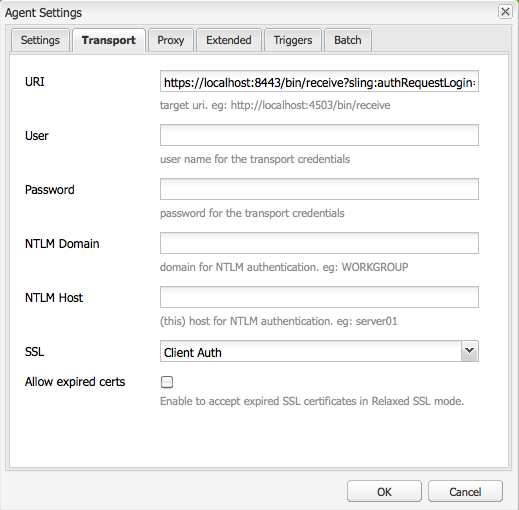

# 使用Mutual SSL進行複製{#replicating-using-mutual-ssl}

設定AEM，讓製作執行個體上的復寫代理使用相互SSL(MSSL)連線至發佈執行個體。 復寫代理程式和發佈執行個體上的HTTP服務會使用憑證來相互驗證。

為復寫設定MSSL時，需執行下列步驟：

1. 建立或取得製作和發佈執行個體的私密金鑰和憑證。
1. 在製作和發佈執行個體上安裝金鑰和憑證：

   * 作者：作者的私密金鑰和Publish的憑證。
   * 發佈：Publish的私密金鑰和作者的憑證。 證書與通過複製代理驗證的用戶帳戶相關聯。

1. 在發佈執行個體上設定Jetty型HTTP服務。
1. 配置複製代理的傳輸和SSL屬性。


您必須確定執行複製的用戶帳戶。 在發佈執行個體上安裝信任的作者憑證時，憑證會與此使用者帳戶相關聯。

## 取得或建立MSSL的憑證 {#obtaining-or-creating-credentials-for-mssl}

製作和發佈執行個體需要私密金鑰和公開憑證：

* 私鑰必須包含在pkcs#12或JKS格式中。
* 證書必須包含在pkcs#12或JKS格式中。 此外，「CER」格式中的憑證也可新增至Granite Truststore。
* 證書可由認可的CA自行簽署或簽署。

### JKS格式 {#jks-format}

以JKS格式產生私密金鑰和憑證。 私鑰儲存在KeyStore檔案中，證書儲存在TrustStore檔案中。 使用 [Java `keytool`](https://docs.oracle.com/javase/7/docs/technotes/tools/solaris/keytool.html) 來建立兩者。

使用Java執行下列步驟 `keytool` 要建立私鑰和憑據，請執行以下操作：

1. 在KeyStore中產生私密 — 公開金鑰組。
1. 建立或取得憑證：

   * 自簽名：從KeyStore匯出憑證。
   * CA簽名：產生憑證要求並傳送至CA。

1. 將憑證匯入TrustStore。

請依照下列程式，為製作和發佈執行個體建立私密金鑰和自行簽署的憑證。 對命令選項使用不同的值。

1. 開啟命令列視窗或終端機。 要建立私鑰對，請使用下表中的選項值輸入以下命令：

   ```shell
   keytool -genkeypair -keyalg RSA -validity 3650 -alias alias -keystore keystorename.keystore  -keypass key_password -storepass  store_password -dname "CN=Host Name, OU=Group Name, O=Company Name,L=City Name, S=State, C=Country_ Code"
   ```

   | 選項 | 作者 | 發佈 |
   |---|---|---|
   | -alias | 作者 | 發佈 |
   | -keystore | author.keystore | publish.keystore |

1. 要導出證書，請使用下表中的選項值輸入以下命令：

   ```shell
   keytool -exportcert -alias alias -file cert_file -storetype jks -keystore keystore -storepass store_password
   ```

   | 選項 | 作者 | 發佈 |
   |---|---|---|
   | -alias | 作者 | 發佈 |
   | -file | author.cer | publish.cer |
   | -keystore | author.keystore | publish.keystore |

### pkcs#12格式 {#pkcs-format}

以pkcs#12格式生成私鑰和證書。 使用 [openSSL](https://www.openssl.org/) 來產生。 請依照下列步驟產生私密金鑰和憑證要求。 若要取得憑證，請使用您的私密金鑰（自行簽署憑證）簽署要求，或將要求傳送至CA。 然後，生成包含私鑰和證書的pkcs#12歸檔檔案。

1. 開啟命令列視窗或終端機。 要建立私鑰，請使用下表中的選項值輸入以下命令：

   ```shell
   openssl genrsa -out keyname.key 2048
   ```

   | 選項 | 作者 | 發佈 |
   |---|---|---|
   | -out | author.key | publish.key |

1. 要生成證書請求，請使用下表中的選項值輸入以下命令：

   ```shell
   openssl req -new -key keyname.key -out key_request.csr
   ```

   | 選項 | 作者 | 發佈 |
   |---|---|---|
   | -key | author.key | publish.key |
   | -out | author_request.csr | publish_request.csr |

   簽署憑證要求或將要求傳送至CA。

1. 若要簽署憑證請求，請使用下表中的選項值，輸入下列命令：

   ```shell
   openssl x509 -req -days 3650 -in key_request.csr -signkey keyname.key -out certificate.cer
   ```

   | 選項 | 作者 | 發佈 |
   |---|---|---|
   | -signkey | author.key | publish.key |
   | -在 | author_request.csr | publish_request.csr |
   | -out | author.cer | publish.cer |

1. 要將私鑰和簽名證書添加到pkcs#12檔案，請使用下表中的選項值輸入以下命令：

   ```shell
   openssl pkcs12 -keypbe PBE-SHA1-3DES -certpbe PBE-SHA1-3DES -export -in certificate.cer -inkey keyname.key -out pkcs12_archive.pfx -name "alias"
   ```

   | 選項 | 作者 | 發佈 |
   |---|---|---|
   | -inkey | author.key | publish.key |
   | -out | author.pfx | publish.pfx |
   | -在 | author.cer | publish.cer |
   | -名稱 | 作者 | 發佈 |

## 在作者上安裝私密金鑰和TrustStore {#install-the-private-key-and-truststore-on-author}

在製作執行個體上安裝下列項目：

* 製作例項的私密金鑰。
* 發佈例項的憑證。

若要執行下列程式，您必須以製作執行個體管理員的身分登入。

### 安裝製作私密金鑰 {#install-the-author-private-key}

1. 開啟製作例項的「使用者管理」頁面。 ([http://localhost:4502/libs/granite/security/content/useradmin.html](http://localhost:4502/libs/granite/security/content/useradmin.html))
1. 若要開啟使用者帳戶的屬性，請按一下或點選您的使用者名稱。
1. 如果「Create KeyStore」（建立KeyStore）連結出現在「Account Settings」（帳戶設定）區域中，請按一下該連結。 配置密碼，然後按一下「確定」。
1. 在「帳戶設定」區域中，按一下「管理金鑰存放區」。

   

1. 按一下「從金鑰存放區檔案新增私密金鑰」 。

   

1. 按一下「選擇密鑰儲存檔案」，然後瀏覽並選擇author.keystore檔案或author.pfx檔案（如果使用pkcs#12），然後按一下「開啟」。
1. 輸入密鑰儲存的別名和密碼。 輸入私鑰的別名和密碼，然後按一下提交。
1. 關閉「KeyStore管理」對話框。

   

### 安裝發佈憑證 {#install-the-publish-certificate}

1. 開啟製作例項的「使用者管理」頁面。 ([http://localhost:4502/libs/granite/security/content/useradmin.html](http://localhost:4502/libs/granite/security/content/useradmin.html))
1. 若要開啟使用者帳戶的屬性，請按一下或點選您的使用者名稱。
1. 如果「Create TrustStore（建立信任儲存）」連結出現在「Account Settings（帳戶設定）」區域中，請按一下該連結，為TrustStore建立密碼，然後按一下「OK（確定）」。
1. 在「帳戶設定」區域中，按一下「管理信任儲存」。
1. 按一下「從CER檔案添加證書」。

   

1. 清除「將憑證對應至使用者」選項。 按一下「選擇證書檔案」，選擇「publish.cer」，然後按一下「開啟」。
1. 關閉TrustStore管理對話框。

   

## 在發佈時安裝私密金鑰和TrustStore {#install-private-key-and-truststore-on-publish}

在發佈執行個體上安裝下列項目：

* 發佈例項的私密金鑰。
* 製作例項的憑證。 將憑證與用於執行復寫請求的使用者建立關聯。

若要執行下列程式，您必須以發佈執行個體管理員的身分登入。

### 安裝發佈私密金鑰 {#install-the-publish-private-key}

1. 開啟發佈例項的「使用者管理」頁面。 ([http://localhost:4503/libs/granite/security/content/useradmin.html](http://localhost:4503/libs/granite/security/content/useradmin.html))
1. 若要開啟使用者帳戶的屬性，請按一下或點選您的使用者名稱。
1. 如果「Create KeyStore」（建立KeyStore）連結出現在「Account Settings」（帳戶設定）區域中，請按一下該連結。 配置密碼，然後按一下「確定」。
1. 在「帳戶設定」區域中，按一下「管理金鑰存放區」。
1. 按一下「從金鑰存放區檔案新增私密金鑰」 。
1. 按一下「選擇密鑰儲存檔案」，然後瀏覽並選擇publish.keystore檔案或publish.pfx檔案（如果使用pkcs#12），然後按一下「開啟」。
1. 輸入密鑰儲存的別名和密碼。 輸入私鑰的別名和密碼，然後按一下提交。
1. 關閉「KeyStore管理」對話框。

### 安裝製作憑證 {#install-the-author-certificate}

1. 開啟發佈例項的「使用者管理」頁面。 ([http://localhost:4503/libs/granite/security/content/useradmin.html](http://localhost:4503/libs/granite/security/content/useradmin.html))
1. 找到您用來執行復寫請求的使用者帳戶，然後按一下或點選使用者名稱。
1. 如果「Create TrustStore（建立信任儲存）」連結出現在「Account Settings（帳戶設定）」區域中，請按一下該連結，為TrustStore建立密碼，然後按一下「OK（確定）」。
1. 在「帳戶設定」區域中，按一下「管理信任儲存」。
1. 按一下「從CER檔案添加證書」。
1. 確定已選取「將憑證對應至使用者」選項。 按一下「選取憑證檔案」，選取「author.cer」，然後按一下「開啟」。
1. 按一下「提交」，然後關閉「TrustStore管理」對話框。

## 在發佈時設定HTTP服務 {#configure-the-http-service-on-publish}

在發佈執行個體上設定Apache Felix Jetty Based HTTP Service的屬性，以便在存取Granite金鑰存放區時使用HTTPS。 服務的PID為 `org.apache.felix.http`.

下表列出了配置是否使用Web控制台所需的OSGi屬性。

| Web主控台上的屬性名稱 | OSGi屬性名稱 | 值 |
|---|---|---|
| 啟用HTTPS | org.apache.felix.https.enable | true |
| 啟用HTTPS以使用Granite KeyStore | org.apache.felix.https.use.granite.keystore | true |
| HTTPS 連接埠 | org.osgi.service.http.port.secure | 8443（或其他需要的埠） |
| 用戶端憑證 | org.apache.felix.https.clientcertificate | &quot;需要客戶端證書&quot; |

## 在作者上設定復寫代理 {#configure-the-replication-agent-on-author}

在連線至發佈執行個體時，在製作執行個體上設定復寫代理，以使用HTTPS通訊協定。 有關配置複製代理的完整資訊，請參見 [配置複製代理](/help/sites-deploying/replication.md#configuring-your-replication-agents).

要啟用MSSL，請根據下表配置「傳輸」頁簽上的屬性：

<table>
 <tbody>
  <tr>
   <th>屬性</th>
   <th>值</th>
  </tr>
  <tr>
   <td>URI</td>
   <td><p>https://server_name:SSL_port/bin/receive?sling:authRequestLogin=1</p> <p>例如：</p> <p>http://localhost:8443/bin/receive?sling:authRequestLogin=1</p> </td>
  </tr>
  <tr>
   <td>使用者</td>
   <td>無值</td>
  </tr>
  <tr>
   <td>密碼</td>
   <td>無值</td>
  </tr>
  <tr>
   <td>SSL</td>
   <td>用戶驗證</td>
  </tr>
 </tbody>
</table>



設定復寫代理後，請測試連線，以判斷MSSL是否已正確設定。

```xml
29.08.2014 14:02:46 - Create new HttpClient for Default Agent
29.08.2014 14:02:46 - * HTTP Version: 1.1
29.08.2014 14:02:46 - * Using Client Auth SSL configuration *
29.08.2014 14:02:46 - adding header: Action:Test
29.08.2014 14:02:46 - adding header: Path:/content
29.08.2014 14:02:46 - adding header: Handle:/content
29.08.2014 14:02:46 - deserialize content for delivery
29.08.2014 14:02:46 - No message body: Content ReplicationContent.VOID is empty
29.08.2014 14:02:46 - Sending POST request to http://localhost:8443/bin/receive?sling:authRequestLogin=1
29.08.2014 14:02:46 - sent. Response: 200 OK
29.08.2014 14:02:46 - ------------------------------------------------
29.08.2014 14:02:46 - Sending message to localhost:8443
29.08.2014 14:02:46 - >> POST /bin/receive HTTP/1.0
29.08.2014 14:02:46 - >> Action: Test
29.08.2014 14:02:46 - >> Path: /content
29.08.2014 14:02:46 - >> Handle: /content
29.08.2014 14:02:46 - >> Referer: about:blank
29.08.2014 14:02:46 - >> Content-Length: 0
29.08.2014 14:02:46 - >> Content-Type: application/octet-stream
29.08.2014 14:02:46 - --
29.08.2014 14:02:46 - << HTTP/1.1 200 OK
29.08.2014 14:02:46 - << Connection: Keep-Alive
29.08.2014 14:02:46 - << Server: Day-Servlet-Engine/4.1.64
29.08.2014 14:02:46 - << Content-Type: text/plain;charset=utf-8
29.08.2014 14:02:46 - << Content-Length: 26
29.08.2014 14:02:46 - << Date: Fri, 29 Aug 2014 18:02:46 GMT
29.08.2014 14:02:46 - << Set-Cookie: login-token=3529326c-1500-4888-a4a3-93d299726f28%3ac8be86c6-04bb-4d18-80d6-91278e08d720_98797d969258a669%3acrx.default; Path=/; HttpOnly; Secure
29.08.2014 14:02:46 - << Set-Cookie: cq-authoring-mode=CLASSIC; Path=/; Secure
29.08.2014 14:02:46 - <<
29.08.2014 14:02:46 - << R
29.08.2014 14:02:46 - << eplicationAction TEST ok.
29.08.2014 14:02:46 - Message sent.
29.08.2014 14:02:46 - ------------------------------------------------
29.08.2014 14:02:46 - Replication (TEST) of /content successful.
Replication test succeeded
```
