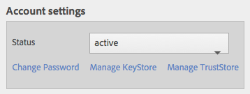
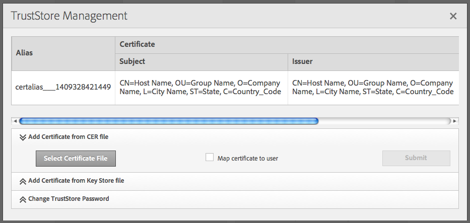

# 使用互相SSL進行複製{#replicating-using-mutual-ssl}

配AEM置以使作者實例上的複製代理使用相互SSL(MSSL)與發佈實例連接。 使用MSSL，發佈實例上的複製代理和HTTP服務使用證書來相互驗證。

為複製配置MSSL涉及執行以下步驟：

1. 為作者和發佈實例建立或獲取私鑰和證書。
1. 在作者上安裝密鑰和證書，並發佈實例：

   * 作者：作者的私鑰和發佈的證書。
   * 發佈：發佈的私鑰和作者證書。 證書與與複製代理進行身份驗證的用戶帳戶相關聯。

1. 在發佈實例上配置基於堤的HTTP服務。
1. 配置複製代理的傳輸和SSL屬性。


必須確定執行複製的用戶帳戶。 在發佈實例上安裝受信任的作者證書時，證書與此用戶帳戶相關聯。

## 獲取或建立MSSL的憑據 {#obtaining-or-creating-credentials-for-mssl}

您需要為作者和發佈實例提供私鑰和公共證書：

* 私鑰必須包含在pkcs#12或JKS格式中。
* 證書必須包含在pkcs#12或JKS格式中。 此外，還可將&quot;CER&quot;格式中的證書添加到Granite Truststore。
* 證書可以自簽名或由已識別的CA簽名。

### JKS格式 {#jks-format}

生成JKS格式的私鑰和證書。 私鑰儲存在KeyStore檔案中，證書儲存在TrustStore檔案中。 使用 [爪哇 `keytool`](https://docs.oracle.com/javase/7/docs/technotes/tools/solaris/keytool.html) 建立兩者。

使用Java執行以下步驟 `keytool` 建立私鑰和憑據：

1. 在KeyStore中生成私鑰對。
1. 建立或獲取證書：

   * 自簽名：從KeyStore導出證書。
   * CA簽名：生成證書請求並將其發送到CA。

1. 將證書導入到TrustStore。

請按下列步驟為作者和發佈實例建立私鑰和自簽名證書。 相應地為命令選項使用不同的值。

1. 開啟命令行窗口或終端。 要建立私鑰對和公鑰對，請使用下表中的選項值輸入以下命令：

   ```shell
   keytool -genkeypair -keyalg RSA -validity 3650 -alias alias -keystore keystorename.keystore  -keypass key_password -storepass  store_password -dname "CN=Host Name, OU=Group Name, O=Company Name,L=City Name, S=State, C=Country_ Code"
   ```

   | 選項 | 作者 | 發佈 |
   |---|---|---|
   |  — 別名 | 作者 | 發佈 |
   |  — 密鑰庫 | author.keystore | publish.keystore |

1. 要導出證書，請使用下表中的選項值輸入以下命令：

   ```shell
   keytool -exportcert -alias alias -file cert_file -storetype jks -keystore keystore -storepass store_password
   ```

   | 選項 | 作者 | 發佈 |
   |---|---|---|
   |  — 別名 | 作者 | 發佈 |
   |  — 檔案 | author.cer | publish.cer |
   |  — 密鑰庫 | author.keystore | publish.keystore |

### pkcs#12格式 {#pkcs-format}

生成pkcs#12格式的私鑰和證書。 使用 [openSSL](https://www.openssl.org/) 生成它們。 請按下列步驟生成私鑰和證書請求。 要獲取證書，請使用您的私鑰（自簽名證書）簽名請求，或將請求發送到CA。 然後，生成包含私鑰和證書的pkcs#12存檔檔案。

1. 開啟命令行窗口或終端。 要建立私鑰，請使用下表中的選項值輸入以下命令：

   ```shell
   openssl genrsa -out keyname.key 2048
   ```

   | 選項 | 作者 | 發佈 |
   |---|---|---|
   | 出 | author.key | publish.key |

1. 要生成證書請求，請使用下表中的選項值輸入以下命令：

   ```shell
   openssl req -new -key keyname.key -out key_request.csr
   ```

   | 選項 | 作者 | 發佈 |
   |---|---|---|
   | -key | author.key | publish.key |
   | 出 | author_request_csr | publish_request_csr |

   簽署證書請求或將請求發送到CA。

1. 要對證書請求進行簽名，請使用下表中的選項值輸入以下命令：

   ```shell
   openssl x509 -req -days 3650 -in key_request.csr -signkey keyname.key -out certificate.cer
   ```

   | 選項 | 作者 | 發佈 |
   |---|---|---|
   |  — 簽名鍵 | author.key | publish.key |
   | -中的 | author_request_csr | publish_request_csr |
   | 出 | author.cer | publish.cer |

1. 要將私鑰和簽名證書添加到pkcs#12檔案，請使用下表中的選項值輸入以下命令：

   ```shell
   openssl pkcs12 -keypbe PBE-SHA1-3DES -certpbe PBE-SHA1-3DES -export -in certificate.cer -inkey keyname.key -out pkcs12_archive.pfx -name "alias"
   ```

   | 選項 | 作者 | 發佈 |
   |---|---|---|
   |  — 鍵 | author.key | publish.key |
   | 出 | author.pfx | publish.pfx |
   | -中的 | author.cer | publish.cer |
   | -名稱 | 作者 | 發佈 |

## 在作者上安裝私鑰和TrustStore {#install-the-private-key-and-truststore-on-author}

在作者實例上安裝以下項：

* 作者實例的私鑰。
* 發佈實例的證書。

要執行以下過程，必須以作者實例的管理員身份登錄。

### 安裝作者私鑰 {#install-the-author-private-key}

1. 開啟作者實例的「用戶管理」頁。 ([http://localhost:4502/libs/granite/security/content/useradmin.html](http://localhost:4502/libs/granite/security/content/useradmin.html))
1. 要開啟用戶帳戶的屬性，請按一下或點擊用戶名。
1. 如果「Create KeyStore（建立密鑰儲存）」連結出現在「Account Settings（帳戶設定）」區域，請按一下該連結。 配置密碼，然後按一下「確定」。
1. 在「帳戶設定」區域，按一下「管理密鑰庫」。

   

1. 按一下「從密鑰儲存檔案添加私鑰」。

   

1. 按一下選擇密鑰儲存檔案，然後瀏覽並選擇author.keystore檔案或author.pfx檔案（如果使用pkcs#12），然後按一下開啟。
1. 輸入密鑰儲存的別名和密碼。 輸入私鑰的別名和密碼，然後按一下提交。
1. 關閉KeyStore管理對話框。

   

### 安裝發佈證書 {#install-the-publish-certificate}

1. 開啟作者實例的「用戶管理」頁。 ([http://localhost:4502/libs/granite/security/content/useradmin.html](http://localhost:4502/libs/granite/security/content/useradmin.html))
1. 要開啟用戶帳戶的屬性，請按一下或點擊用戶名。
1. 如果「Create TrustStore（建立信任儲存）」連結出現在「Account Settings（帳戶設定）」區域，請按一下該連結，為TrustStore建立密碼，然後按一下「OK（確定）」。
1. 在「帳戶設定」區域，按一下「管理信任儲存」。
1. 按一下「從CER檔案添加證書」。

   

1. 清除「將證書映射到用戶」選項。 按一下「選擇證書檔案」，選擇publish.cer，然後按一下「開啟」。
1. 關閉TrustStore管理對話框。

   

## 在發佈時安裝私鑰和TrustStore {#install-private-key-and-truststore-on-publish}

在發佈實例上安裝以下項：

* 發佈實例的私鑰。
* 作者實例的證書。 將證書與用於執行複製請求的用戶關聯。

要執行以下過程，必須以發佈實例的管理員身份登錄。

### 安裝發佈私鑰 {#install-the-publish-private-key}

1. 開啟發佈實例的「用戶管理」頁。 ([http://localhost:4503/libs/granite/security/content/useradmin.html](http://localhost:4503/libs/granite/security/content/useradmin.html))
1. 要開啟用戶帳戶的屬性，請按一下或點擊用戶名。
1. 如果「Create KeyStore（建立密鑰儲存）」連結出現在「Account Settings（帳戶設定）」區域，請按一下該連結。 配置密碼，然後按一下「確定」。
1. 在「帳戶設定」區域，按一下「管理密鑰庫」。
1. 按一下「從密鑰儲存檔案添加私鑰」。
1. 按一下選擇密鑰儲存檔案，然後瀏覽並選擇publish.keystore檔案或publish.pfx檔案（如果使用pkcs#12），然後按一下開啟。
1. 輸入密鑰儲存的別名和密碼。 輸入私鑰的別名和密碼，然後按一下提交。
1. 關閉KeyStore管理對話框。

### 安裝作者證書 {#install-the-author-certificate}

1. 開啟發佈實例的「用戶管理」頁。 ([http://localhost:4503/libs/granite/security/content/useradmin.html](http://localhost:4503/libs/granite/security/content/useradmin.html))
1. 找到用於執行複製請求的用戶帳戶，然後按一下或點擊用戶名。
1. 如果「Create TrustStore（建立信任儲存）」連結出現在「Account Settings（帳戶設定）」區域，請按一下該連結，為TrustStore建立密碼，然後按一下「OK（確定）」。
1. 在「帳戶設定」區域，按一下「管理信任儲存」。
1. 按一下「從CER檔案添加證書」。
1. 確保選中「將證書映射到用戶」選項。 按一下「選擇證書檔案」，選擇author.cer，然後按一下「開啟」。
1. 按一下「提交」，然後關閉「TrustStore管理」對話框。

## 在發佈時配置HTTP服務 {#configure-the-http-service-on-publish}

在發佈實例上配置Apache Felix Jetty Based HTTP服務的屬性，以便在訪問Granite密鑰庫時使用HTTPS。 服務的PID為 `org.apache.felix.http`。

下表列出了您是否在使用Web控制台時需要配置的OSGi屬性。

| Web控制台上的屬性名稱 | OSGi屬性名稱 | 值 |
|---|---|---|
| 啟用HTTPS | org.apache.felix.https.enable | true |
| 啟用HTTPS以使用Granite KeyStore | org.apache.felix.https.use.granite.keystore | true |
| HTTPS 連接埠 | org.osgi.service.http.port.secure | 8443（或其他所需埠） |
| 客戶端證書 | org.apache.felix.https.clientcertificate | &quot;需要客戶端證書&quot; |

## 在作者上配置複製代理 {#configure-the-replication-agent-on-author}

在作者實例上配置複製代理以在連接到發佈實例時使用HTTPS協定。 有關配置複製代理的完整資訊，請參見 [配置複製代理](/help/sites-deploying/replication.md#configuring-your-replication-agents)。

要啟用MSSL，請根據下表配置「傳輸」頁籤上的屬性：

<table>
 <tbody>
  <tr>
   <th>屬性</th>
   <th>值</th>
  </tr>
  <tr>
   <td>URI</td>
   <td><p>https://server_name:SSL_port/bin/receive?sling:authRequestLogin=1</p> <p>例如：</p> <p>http://localhost:8443/bin/receive?sling:authRequestLogin=1</p> </td>
  </tr>
  <tr>
   <td>使用者</td>
   <td>無值</td>
  </tr>
  <tr>
   <td>密碼</td>
   <td>無值</td>
  </tr>
  <tr>
   <td>SSL</td>
   <td>用戶驗證</td>
  </tr>
 </tbody>
</table>


配置複製代理後，test連接以確定MSSL是否配置正確。

```xml
29.08.2014 14:02:46 - Create new HttpClient for Default Agent
29.08.2014 14:02:46 - * HTTP Version: 1.1
29.08.2014 14:02:46 - * Using Client Auth SSL configuration *
29.08.2014 14:02:46 - adding header: Action:Test
29.08.2014 14:02:46 - adding header: Path:/content
29.08.2014 14:02:46 - adding header: Handle:/content
29.08.2014 14:02:46 - deserialize content for delivery
29.08.2014 14:02:46 - No message body: Content ReplicationContent.VOID is empty
29.08.2014 14:02:46 - Sending POST request to http://localhost:8443/bin/receive?sling:authRequestLogin=1
29.08.2014 14:02:46 - sent. Response: 200 OK
29.08.2014 14:02:46 - ------------------------------------------------
29.08.2014 14:02:46 - Sending message to localhost:8443
29.08.2014 14:02:46 - >> POST /bin/receive HTTP/1.0
29.08.2014 14:02:46 - >> Action: Test
29.08.2014 14:02:46 - >> Path: /content
29.08.2014 14:02:46 - >> Handle: /content
29.08.2014 14:02:46 - >> Referer: about:blank
29.08.2014 14:02:46 - >> Content-Length: 0
29.08.2014 14:02:46 - >> Content-Type: application/octet-stream
29.08.2014 14:02:46 - --
29.08.2014 14:02:46 - << HTTP/1.1 200 OK
29.08.2014 14:02:46 - << Connection: Keep-Alive
29.08.2014 14:02:46 - << Server: Day-Servlet-Engine/4.1.64
29.08.2014 14:02:46 - << Content-Type: text/plain;charset=utf-8
29.08.2014 14:02:46 - << Content-Length: 26
29.08.2014 14:02:46 - << Date: Fri, 29 Aug 2014 18:02:46 GMT
29.08.2014 14:02:46 - << Set-Cookie: login-token=3529326c-1500-4888-a4a3-93d299726f28%3ac8be86c6-04bb-4d18-80d6-91278e08d720_98797d969258a669%3acrx.default; Path=/; HttpOnly; Secure
29.08.2014 14:02:46 - << Set-Cookie: cq-authoring-mode=CLASSIC; Path=/; Secure
29.08.2014 14:02:46 - <<
29.08.2014 14:02:46 - << R
29.08.2014 14:02:46 - << eplicationAction TEST ok.
29.08.2014 14:02:46 - Message sent.
29.08.2014 14:02:46 - ------------------------------------------------
29.08.2014 14:02:46 - Replication (TEST) of /content successful.
Replication test succeeded
```
