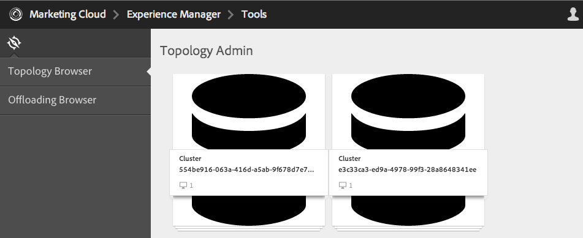
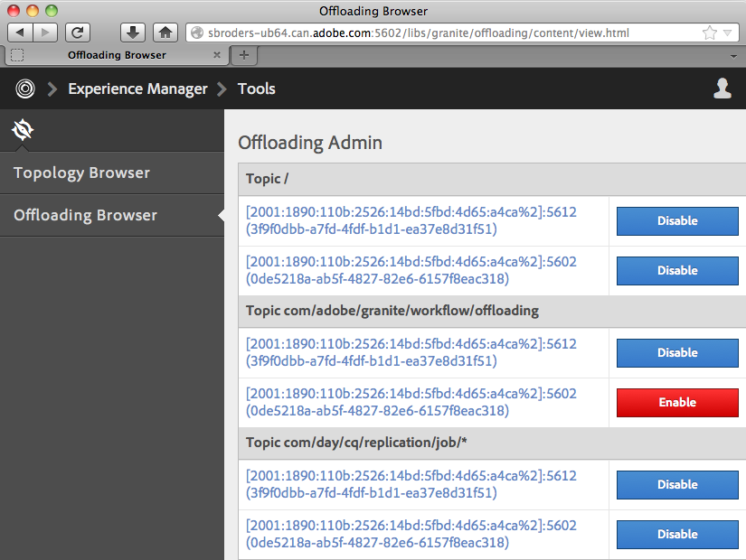

# 正在解除安裝工作{#offloading-jobs}

## 簡介 {#introduction}

解除安裝會將處理工作分散到拓撲中的Experience Manager執行個體之間。 解除安裝時，您可以使用特定Experience Manager例項來執行特定型別的處理。 專業化的處理可讓您最大限度地使用可用的伺服器資源。

解除安裝是根據 [Apache Sling探索](https://sling.apache.org/documentation/bundles/discovery-api-and-impl.html) 和Sling JobManager功能。 若要使用解除安裝，您可以將Experience Manager叢集新增至拓朴，並識別叢集處理的工作主題。 叢集是由一或多個Experience Manager執行處理所組成，因此單一執行處理會被視為叢集。

如需有關將執行處理新增至拓朴的資訊，請參閱 [管理拓撲](/help/sites-deploying/offloading.md#administering-topologies).

### 工作分佈 {#job-distribution}

Sling JobManager和JobConsumer可讓您建立拓撲中處理的工作：

* JobManager：為特定主題建立工作的服務。
* JobConsumer：執行一或多個主題工作的服務。 可以針對相同主題註冊多個JobConsumer服務。

當JobManager建立作業時，解除安裝架構會在拓撲中選取Experience Manager叢集以執行作業：

* 叢集必須包含一或多個執行處理執行已針對工作主題註冊的JobConsumer。
* 叢集中至少必須啟用一個執行處理的主題。

另請參閱 [設定主題使用量](/help/sites-deploying/offloading.md#configuring-topic-consumption) 以取得精簡工作分配的資訊。

當解除安裝架構選取叢集以執行工作，且叢集由多個執行處理組成時，Sling Distribution會決定叢集中的哪個執行處理執行工作。

### 工作承載 {#job-payloads}

「解除安裝」架構支援將工作與存放庫中的資源相關聯的工作裝載。 當建立工作以處理資源，且工作解除安裝到其他電腦時，工作裝載很有用。

建立工作後，裝載保證只會位於建立工作的執行個體上。 解除安裝工作時，復寫代理程式會確保在最終耗用工作的執行個體上建立裝載。 當作業執行完成時，反向復寫會將裝載複製回建立作業的執行個體。

## 管理拓撲 {#administering-topologies}

拓撲是鬆散耦合的Experience Manager叢集，參與解除安裝。 叢集由一或多個Experience Manager伺服器執行處理組成（單一執行處理被視為叢集）。

每個Experience Manager執行個體都會執行下列解除安裝相關服務：

* 探索服務：傳送要求給拓撲聯結器以加入拓撲。
* 拓撲聯結器：接收加入要求，並接受或拒絕每個要求。

拓撲的所有成員的「探索服務」會指向其中一個成員上的「拓撲聯結器」。 在接下來的章節中，此成員稱為根成員。

拓朴中的每個叢集都包含被識別為領導的執行個體。 叢集導線代表叢集的其他成員與拓撲互動。 當導線離開叢集時，會自動為叢集選擇新的導線。

### 檢視拓撲 {#viewing-the-topology}

使用「拓朴瀏覽器」來探索Experience Manager執行處理所參與的拓朴的狀態。 「拓朴瀏覽器」會顯示拓朴的叢集和執行處理。

對於每個叢集，您會看到一個叢整合員清單，指出每個成員加入叢集的順序，以及哪個成員是前導。 Current屬性指出您目前管理的執行處理。

對於叢集中的每個執行處理，您可以看到幾個拓撲相關特性：

* 執行個體工作消費者的允許主題清單。
* 用來連線拓朴的開放端點。
* 為其註冊執行處理以進行解除安裝的工作主題。
* 執行處理所處理的工作主題。

1. 使用Touch UI，按一下「工具」標籤。 ([http://localhost:4502/tools.html](http://localhost:4502/tools.html))
1. 在「Granite操作」區域中，按一下「解除安裝瀏覽器」。
1. 在導覽面板中，按一下「拓朴瀏覽器」。

   參與拓朴的叢集隨即顯示。

   

1. 按一下叢集，即可檢視叢集中的執行處理清單，以及其ID、目前狀態和導線狀態。
1. 按一下執行個體ID可檢視更多詳細屬性。

您也可以使用「Web主控台」來檢視拓撲資訊。 主控台提供拓朴叢集的進一步資訊：

* 哪個執行個體是本機執行個體。
* 此執行個體用來連線到拓撲的拓撲聯結器服務（傳出），以及連線到此執行個體的服務（傳入）。
* 變更拓撲和執行個體屬性的歷史記錄。

請使用下列步驟來開啟「Web主控台」的「拓朴管理」頁面：

1. 在瀏覽器中開啟Web主控台。 ([http://localhost:4502/system/console](http://localhost:4502/system/console))
1. 按一下「主要」>「拓朴管理」。

   

### 設定拓朴成員資格 {#configuring-topology-membership}

Apache Sling Resource-Based Discovery Service會在每個執行個體上執行，以控制Experience Manager執行個體與拓撲互動的方式。

探索服務會定期傳送POST要求（心率）給拓撲聯結器服務，以建立與維護與拓撲的連線。 Topology Connector服務會維護允許加入拓撲的IP位址或主機名稱允許清單：

* 若要將執行個體聯結至拓撲，請指定根成員的Topology Connector服務的URL。
* 若要啟用執行個體以加入拓撲，請將執行個體新增至根成員的拓撲聯結器服務的允許清單。

使用Web主控台或sling：OsgiConfig節點來設定org.apache.sling.discovery.impt.Config服務的下列屬性：

<table>
 <tbody>
  <tr>
   <th>屬性名稱</th>
   <th>OSGi名稱</th>
   <th>說明</th>
   <th>預設值</th>
  </tr>
  <tr>
   <td>心率逾時（秒）</td>
   <td>heartbeatTimeout</td>
   <td>系統認為目標例項無法使用之前，等待心率回應的秒數。 </td>
   <td>20</td>
  </tr>
  <tr>
   <td>心率間隔（秒）</td>
   <td>heartbeatinterval</td>
   <td>心率之間的時間長度（秒數）。</td>
   <td>15</td>
  </tr>
  <tr>
   <td>最小事件延遲（秒）</td>
   <td>minEventDelay</td>
   <td>
當拓撲發生變更時，延遲狀態從TOPOLOGY_CHANGING變更到TOPOLOGY_CHANGED的時間量。 當狀態為TOPOLOGY_CHANGING時，每次變更都會增加延遲的時間。
 
此延遲可防止接聽程式被事件淹沒。 
 
若要使用無延遲，請指定0或負數。
 </td>
   <td>3</td>
  </tr>
  <tr>
   <td>拓撲聯結器URL</td>
   <td>topologyConnectorUrls</td>
   <td>用於傳送活動訊號訊息的拓撲聯結器服務的URL。</td>
   <td>http://localhost:4502/libs/sling/topology/connector</td>
  </tr>
  <tr>
   <td>拓撲聯結器允許清單</td>
   <td>topologyConnectWhitelist</td>
   <td>本機Topology Connector服務允許在拓撲中的IP位址或主機名稱清單。 </td>
   <td>
localhost
 
127.0.0.1
 </td>
  </tr>
  <tr>
   <td>存放庫描述項名稱</td>
   <td>leaderElectionRepositoryDescriptor</td>
   <td> </td>
   <td>&lt;無值&gt;</td>
  </tr>
 </tbody>
</table>

使用以下程式將CQ執行處理連線到拓朴的根成員。 程式會將執行個體指向根拓撲成員的拓撲聯結器URL。 對拓撲的所有成員執行此程式。

1. 在瀏覽器中開啟Web主控台。 ([http://localhost:4502/system/console](http://localhost:4502/system/console))
1. 按一下「主要」>「拓朴管理」。
1. 按一下設定探索服務。
1. 將專案新增至Topology Connector URLs屬性，並指定根拓撲成員的Topology Connector服務的URL。 URL的格式為https://rootservername:4502/libs/sling/topology/connector。

對拓朴的根成員執行下列程式。 此程式會將其他拓撲成員的名稱新增至其[探索服務]允許清單。

1. 在瀏覽器中開啟Web主控台。 ([http://localhost:4502/system/console](http://localhost:4502/system/console))
1. 按一下「主要」>「拓朴管理」。
1. 按一下設定探索服務。
1. 針對拓撲的每個成員，將專案新增至拓撲聯結器允許清單屬性，並指定拓撲成員的主機名稱或IP位址。

## 設定主題使用量 {#configuring-topic-consumption}

使用解除安裝瀏覽器來設定拓撲中Experience Manager執行個體的主題使用量。 您可以針對每個執行處理指定其使用的主題。 例如，若要設定拓朴，使只有一個執行處理使用特定型別的主題，請停用所有執行處理上的主題，但有一個執行處理除外。

工作會分散在使用循環配置邏輯啟用相關主題的執行個體之間。

1. 使用Touch UI，按一下「工具」標籤。 ([http://localhost:4502/tools.html](http://localhost:4502/tools.html))
1. 在「Granite操作」區域中，按一下「解除安裝瀏覽器」。
1. 在導覽面板中，按一下「解除安裝瀏覽器」。

   解除安裝主題和可使用主題的伺服器執行個體隨即顯示。

   

1. 若要停用某個執行處理的主題使用，請在主題名稱下方按一下執行處理旁的停用。
1. 若要設定執行處理的所有主題使用量，請按一下任何主題下方的執行處理識別碼。

   

1. 按一下主題旁邊的下列按鈕之一，設定執行處理的使用行為，然後按一下儲存：

   * 已啟用：此執行處理會使用此主題的工作。
   * 已停用：此執行個體不會使用此主題的工作。
   * 獨佔：此執行處理只會使用此主題的工作。

   **注意：** 當您為主題選取「獨佔」時，其他所有主題都會自動設定為「已停用」。

### 已安裝的工作消費者 {#installed-job-consumers}

Experience Manager中安裝了數個JobConsumer實作。 這些JobConsumers註冊的主題會顯示在「解除安裝瀏覽器」中。 出現的其他主題是自訂「工作消費者」已註冊的主題。 下表說明預設的JobConsumers。

| 工作主題 | 服務PID | 說明 |
|---|---|---|
| / | org.apache.sling.event.impl.jobs.deprecated.EventAdminBridge | 隨Apache Sling安裝。 處理OSGi事件管理員產生的工作，以便回溯相容性。 |
| com/day/cq/replication/job/&amp;ast； | com.day.cq.replication.impl.AgentManagerImpl | 復製作業裝載的復寫代理程式。 |

<!--
| com/adobe/granite/workflow/offloading |com.adobe.granite.workflow.core.offloading.WorkflowOffloadingJobConsumer |Processes jobs that the DAM Update Asset Offloader workflow generates. |
-->

### 停用和啟用執行處理的主題 {#disabling-and-enabling-topics-for-an-instance}

Apache Sling作業取用者管理員服務提供主題允許清單和封鎖清單屬性。 設定這些屬性，以啟用或停用處理Experience Manager執行個體上的特定主題。

**注意：** 如果執行個體屬於拓撲，您也可以在拓撲中的任何電腦上使用「解除安裝瀏覽器」來啟用或停用主題。

建立已啟用主題清單的邏輯會先允許允許清單中的所有主題，然後移除封鎖清單上的主題。 預設會啟用所有主題(允許清單值為 `*`)且沒有已停用的主題（封鎖清單沒有值）。

使用Web主控台或 `sling:OsgiConfig` 節點，以設定下列屬性。 的 `sling:OsgiConfig` 節點，作業消費者管理員服務的PID為org.apache.sling.event.impl.jobs.JobConsumerManager。

| Web主控台中的屬性名稱 | OSGi ID | 說明 |
|---|---|---|
| 主題允許清單 | job.consumermanager.whitelist | 本機JobManager服務處理的主題清單。 預設值&amp;ast；會傳送所有主題至已註冊的TopicConsumer服務。 |
| 主題封鎖清單 | job.consumermanager.blacklist | 本機JobManager服務未處理的主題清單。 |

## 建立解除安裝的復寫代理程式 {#creating-replication-agents-for-offloading}

解除安裝架構使用復寫來在作者和工作者之間傳輸資源。 當執行個體加入拓撲時，解除安裝架構會自動建立復寫代理程式。 代理程式是以預設值建立的。 您必須手動變更代理程式用於驗證的密碼。

>[!CAUTION]
>
>自動產生的復寫代理的已知問題需要您手動建立新的復寫代理。

建立復寫代理程式，以便在執行個體之間傳輸工作裝載以進行解除安裝。 下圖顯示從作者解除安裝至背景工作執行個體所需的代理程式。 作者的Sling ID為1，而背景工作例項的Sling ID為2：

此設定需要下列三個代理程式：

1. 製作執行個體上複製到背景工作執行個體的傳出代理程式。
1. 作者執行個體上從背景工作執行個體上提取的反向代理程式。
1. 背景工作執行個體上的寄件匣代理程式。

此復寫配置類似於製作與發佈執行個體之間使用的復寫配置。 但是，針對解除安裝情況，所有相關的執行個體都是編寫執行個體。

>[!NOTE]
>
>解除安裝架構會使用拓撲來取得解除安裝執行個體的IP位址。 然後，架構會根據這些IP位址自動建立復寫代理。 如果解除安裝執行個體的IP位址稍後變更，則會在執行個體重新啟動後，自動將變更傳播到拓朴上。 不過，解除安裝架構不會自動更新復寫代理程式以反映新的IP位址。 為避免這種情況，請對拓撲中的所有執行個體使用固定IP位址。

### 命名要解除安裝的復寫代理程式 {#naming-the-replication-agents-for-offloading}

使用特定格式進行 ***名稱*** 復寫代理的屬性，讓解除安裝架構針對特定背景工作執行個體自動使用正確的代理。

**為編寫執行個體上的傳出代理程式命名：**

`offloading_<slingid>`，其中 `<slingid>` 是背景工作執行個體的Sling ID。

例如: `offloading_f5c8494a-4220-49b8-b079-360a72f71559`

**在製作執行個體上命名反向代理程式：**

`offloading_reverse_<slingid>`，其中 `<slingid>` 是背景工作執行個體的Sling ID。

例如: `offloading_reverse_f5c8494a-4220-49b8-b079-360a72f71559`

**為背景工作執行個體上的寄件匣命名：**

`offloading_outbox`

### 建立連出代理程式 {#creating-the-outgoing-agent}

1. 建立 **復寫代理** 作者。 (請參閱 [復寫代理程式檔案](/help/sites-deploying/replication.md))。 指定任何 **標題**. 此 **名稱** 必須遵守命名慣例。
1. 使用下列屬性建立代理程式：

   | 屬性 | 值 |
   |---|---|
   | 設定>序列化型別 | 預設 |
   | 傳輸>傳輸URI | https://*`<ip of target instance>`*：*`<port>`*`/bin/receive?sling:authRequestLogin=1` |
   | 傳輸>傳輸使用者 | 目標執行個體上的復寫使用者 |
   | 傳輸>傳輸密碼 | 目標執行個體上的復寫使用者密碼 |
   | 延伸> HTTP方法 | POST |
   | 觸發器>忽略預設值 | True |

### 建立反向代理程式 {#creating-the-reverse-agent}

1. 建立 **反向復寫代理** 作者。 (請參閱 [復寫代理程式檔案](/help/sites-deploying/replication.md).) 指定任何 **標題**. 此 **名稱** 必須遵守命名慣例。
1. 使用下列屬性建立代理程式：

   | 屬性 | 值 |
   |---|---|
   | 設定>序列化型別 | 預設 |
   | 傳輸>傳輸URI | https://*`<ip of target instance>`*：*`<port>`*`/bin/receive?sling:authRequestLogin=1` |
   | 傳輸>傳輸使用者 | 目標執行個體上的復寫使用者 |
   | 傳輸>傳輸密碼 | 目標執行個體上的復寫使用者密碼 |
   | 延伸> HTTP方法 | GET |

### 建立寄件匣代理程式 {#creating-the-outbox-agent}

1. 建立 **復寫代理** 在背景工作執行個體上。 (請參閱 [復寫代理程式檔案](/help/sites-deploying/replication.md).) 指定任何 **標題**. 此 **名稱** 必須是 `offloading_outbox`.
1. 使用下列屬性建立代理程式。

   | 屬性 | 值 |
   |---|---|
   | 設定>序列化型別 | 預設 |
   | 傳輸>傳輸URI | repo://var/replication/outbox |
   | 觸發器>忽略預設值 | True |

### 尋找Sling ID {#finding-the-sling-id}

使用下列其中一種方法取得Experience Manager例項的Sling ID：

* 開啟Web主控台，並在Sling設定中找到Sling ID屬性的值([http://localhost:4502/system/console/status-slingsettings](http://localhost:4502/system/console/status-slingsettings))。 如果實體尚未成為拓撲的一部分，此方法就相當實用。
* 如果例證已經是拓撲的一部分，請使用「拓撲」瀏覽器。

<!--
## Offloading the Processing of DAM Assets {#offloading-the-processing-of-dam-assets}

Configure the instances of a topology so that specific instances perform the background processing of assets that are added or updated in DAM.

By default, Experience Manager executes the [!UICONTROL DAM Update Asset] workflow when a DAM asset changes or one is added to DAM. Change the default behavior so that Experience Manager instead executes the [!UICONTROL DAM Update Asset Offloader] workflow. This workflow generates a JobManager job that has a topic of `com/adobe/granite/workflow/offloading`. Then, configure the topology so that the job is offloaded to a dedicated worker.

>[!CAUTION]
>
>No workflow should be transient when used with workflow offloading. For example, the [!UICONTROL DAM Update Asset] workflow must not be transient when used for asset offloading. To set/unset the transient flag on a workflow, see [Transient Workflows](/help/assets/performance-tuning-guidelines.md#workflows).

The following procedure assumes the following characteristics for the offloading topology:

* One or more Experience Manager instance are authoring instances that users interact with for adding or updating DAM assets.
* Users to do not directly interact with one or more Experience Manager instances that process the DAM assets. These instances are dedicated to the background processing of DAM assets.

1. On each Experience Manager instance, configure the Discovery Service so that it points to the root Topography Connector. (See [Configuring Topology Membership](#title4).)
1. Configure the root Topography Connector so that the connecting instances are on the allow list.
1. Open Offloading Browser and disable the `com/adobe/granite/workflow/offloading` topic on the instances with which users interact to upload or change DAM assets.

   

1. On each instance that users interact with to upload or change DAM assets, configure workflow launchers to use the [!UICONTROL DAM Update Asset Offloading] workflow:

    1. Open the Workflow console.
    1. Click the Launcher tab.
    1. Locate the two Launcher configurations that execute the [!UICONTROL DAM Update Asset] workflow. One launcher configuration event type is Node Created, and the other type is Node Modified.
    1. Change both event types so that they execute the [!UICONTROL DAM Update Asset Offloading] workflow. (For information about launcher configurations, see [Starting Workflows When Nodes Change](/help/sites-administering/workflows-starting.md).)

1. On the instances that perform the background processing of DAM assets, disable the workflow launchers that execute the [!UICONTROL DAM Update Asset] workflow.
-->

## 延伸閱讀 {#further-reading}

除了此頁面上顯示的詳細資訊外，您也可以閱讀下列內容：

* 如需使用Java API建立工作與工作消費者的相關資訊，請參閱 [建立及使用解除安裝工作](/help/sites-developing/dev-offloading.md).
