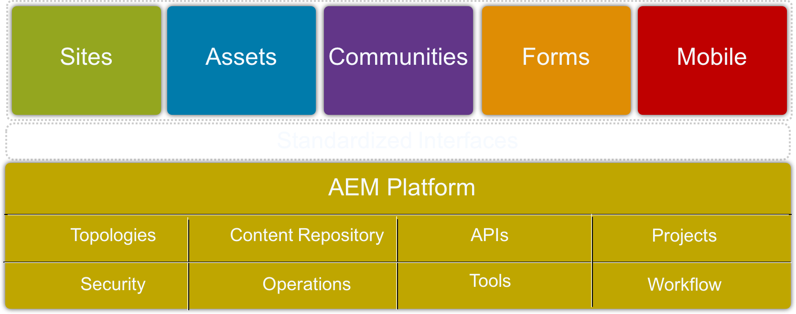
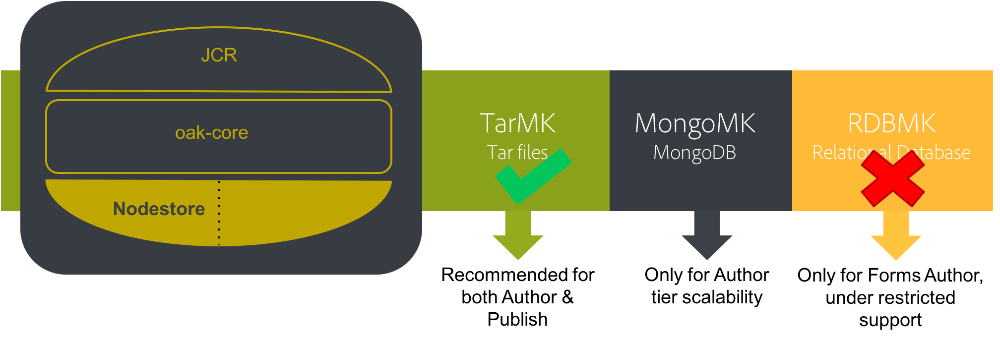
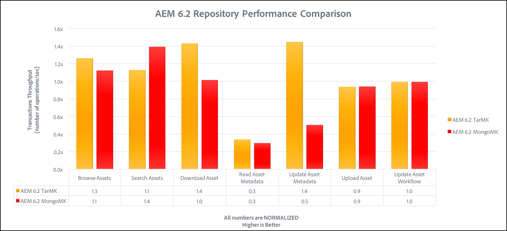

# 效能准則{#performance-guidelines}

本頁提供如何最佳化AEM部署效能的一般准則。 如果您是AEM的新手，請先瀏覽下列頁面，再開始閱讀效能准則：

* [AEM Basic Concepts](/help/sites-deploying/deploy.md#basic-concepts)
* [AEM中的儲存空間概觀](/help/sites-deploying/storage-elements-in-aem-6.md#overview-of-storage-in-aem)
* [建議的部署](/help/sites-deploying/recommended-deploys.md)
* [技術需求](/help/sites-deploying/technical-requirements.md)

以下是AEM的可用部署選項（捲動以檢視所有選項）:

<table>
 <tbody>
  <tr>
   <td>
<strong>AEM</strong>
 
<strong>產品</strong>
 </td>
   <td>
<strong>拓撲</strong>
 </td>
   <td>
<strong>作業系統</strong>
 </td>
   <td>
<strong>應用程式伺服器</strong>
 </td>
   <td>
<strong>JRE</strong>
 </td>
   <td>
<strong>安全性</strong>
 </td>
   <td>
<strong>微內核</strong>
 </td>
   <td>
<strong>資料儲存</strong>
 </td>
   <td>
<strong>索引</strong>
 </td>
   <td>
<strong>Web伺服器</strong>
 </td>
   <td>
<strong>瀏覽器</strong>
 </td>
   <td>
<strong>Marketing Cloud</strong>
 </td>
  </tr>
  <tr>
   <td>
網站
 </td>
   <td>
非HA
 </td>
   <td>
Windows
 </td>
   <td>
CQSE
 </td>
   <td>
Oracle
 </td>
   <td>
LDAP
 </td>
   <td>
Tar
 </td>
   <td>
區段
 </td>
   <td>
屬性
 </td>
   <td>
Apache
 </td>
   <td>
Edge
 </td>
   <td>
目標
 </td>
  </tr>
  <tr>
   <td>
資產
 </td>
   <td>
Publish-HA
 </td>
   <td>
Solaris
 </td>
   <td>
WebLogic
 </td>
   <td>
IBM
 </td>
   <td>
SAML
 </td>
   <td>
MongoDB
 </td>
   <td>
檔案
 </td>
   <td>
Lucene
 </td>
   <td>
IIS
 </td>
   <td>
IE
 </td>
   <td>
分析
 </td>
  </tr>
  <tr>
   <td>
社群
 </td>
   <td>
作者-CS
 </td>
   <td>
Red Hat
 </td>
   <td>
WebSphere
 </td>
   <td>
HP
 </td>
   <td>
Oauth
 </td>
   <td>
RDB/Oracle
 </td>
   <td>
S3/Azure
 </td>
   <td>
Solr
 </td>
   <td>
iPlanet
 </td>
   <td>
FireFox
 </td>
   <td>
行銷活動
 </td>
  </tr>
  <tr>
   <td>
表單
 </td>
   <td>
作者卸載
 </td>
   <td>
HP-UX
 </td>
   <td>
Tomcat
 </td>
   <td>
 
 </td>
   <td>
 
 </td>
   <td>
RDB/DB2
 </td>
   <td>
MongoDB
 </td>
   <td>
 
 </td>
   <td>
 
 </td>
   <td>
Chrome
 </td>
   <td>
Social
 </td>
  </tr>
  <tr>
   <td>
行動
 </td>
   <td>
作者群集
 </td>
   <td>
IBM AIX
 </td>
   <td>
JBoss
 </td>
   <td>
 
 </td>
   <td>
 
 </td>
   <td>
RDB/MySQL
 </td>
   <td>
RDBMS
 </td>
   <td>
 
 </td>
   <td>
 
 </td>
   <td>
Safari
 </td>
   <td>
對象
 </td>
  </tr>
  <tr>
   <td>
多網站
 </td>
   <td>
ASRP
 </td>
   <td>
SUSE
 </td>
   <td>
 
 </td>
   <td>
 
 </td>
   <td>
 
 </td>
   <td>
RDB/SQLServer
 </td>
   <td>
 
 </td>
   <td>
 
 </td>
   <td>
 
 </td>
   <td>
 
 </td>
   <td>
資產
 </td>
  </tr>
  <tr>
   <td>
商務
 </td>
   <td>
MSRP
 </td>
   <td>
Apple OS
 </td>
   <td>
 
 </td>
   <td>
 
 </td>
   <td>
 
 </td>
   <td>
 
 </td>
   <td>
 
 </td>
   <td>
 
 </td>
   <td>
 
 </td>
   <td>
 
 </td>
   <td>
啟動
 </td>
  </tr>
  <tr>
   <td>
動態媒體
 </td>
   <td>
JSRP
 </td>
   <td>
 
 </td>
   <td>
 
 </td>
   <td>
 
 </td>
   <td>
 
 </td>
   <td>
 
 </td>
   <td>
 
 </td>
   <td>
 
 </td>
   <td>
 
 </td>
   <td>
 
 </td>
   <td>
行動
 </td>
  </tr>
  <tr>
   <td>
品牌入口網站
 </td>
   <td>
J2E
 </td>
   <td>
 
 </td>
   <td>
 
 </td>
   <td>
 
 </td>
   <td>
 
 </td>
   <td>
 
 </td>
   <td>
 
 </td>
   <td>
 
 </td>
   <td>
 
 </td>
   <td>
 
 </td>
   <td>
 
 </td>
  </tr>
  <tr>
   <td>
AoD
 </td>
   <td>
 
 </td>
   <td>
 
 </td>
   <td>
 
 </td>
   <td>
 
 </td>
   <td>
 
 </td>
   <td>
 
 </td>
   <td>
 
 </td>
   <td>
 
 </td>
   <td>
 
 </td>
   <td>
 
 </td>
   <td>
 
 </td>
  </tr>
  <tr>
   <td>
LiveFyre
 </td>
   <td>
 
 </td>
   <td>
 
 </td>
   <td>
 
 </td>
   <td>
 
 </td>
   <td>
 
 </td>
   <td>
 
 </td>
   <td>
 
 </td>
   <td>
 
 </td>
   <td>
 
 </td>
   <td>
 
 </td>
   <td>
 
 </td>
  </tr>
  <tr>
   <td>
畫面
 </td>
   <td>
 
 </td>
   <td>
 
 </td>
   <td>
 
 </td>
   <td>
 
 </td>
   <td>
 
 </td>
   <td>
 
 </td>
   <td>
 
 </td>
   <td>
 
 </td>
   <td>
 
 </td>
   <td>
 
 </td>
   <td>
 
 </td>
  </tr>
  <tr>
   <td>
檔案安全性
 </td>
   <td>
 
 </td>
   <td>
 
 </td>
   <td>
 
 </td>
   <td>
 
 </td>
   <td>
 
 </td>
   <td>
 
 </td>
   <td>
 
 </td>
   <td>
 
 </td>
   <td>
 
 </td>
   <td>
 
 </td>
   <td>
 
 </td>
  </tr>
  <tr>
   <td>
流程管理
 </td>
   <td>
 
 </td>
   <td>
 
 </td>
   <td>
 
 </td>
   <td>
 
 </td>
   <td>
 
 </td>
   <td>
 
 </td>
   <td>
 
 </td>
   <td>
 
 </td>
   <td>
 
 </td>
   <td>
 
 </td>
   <td>
 
 </td>
  </tr>
  <tr>
   <td>
案頭應用程式
 </td>
   <td>
 
 </td>
   <td>
 
 </td>
   <td>
 
 </td>
   <td>
 
 </td>
   <td>
 
 </td>
   <td>
 
 </td>
   <td>
 
 </td>
   <td>
 
 </td>
   <td>
 
 </td>
   <td>
 
 </td>
   <td>
 
 </td>
  </tr>
 </tbody>
</table>

>[!NOTE]
>
>效能指引主要適用於AEM Sites。

## 使用效能指引的時機 {#when-to-use-the-performance-guidelines}

您應在下列情況下使用效能准則：

* **首次部署**:當第一次規劃部署AEM Sites或資產時，請務必瞭解在設定微型內核、節點儲存區和資料儲存區時可用的選項（與預設設定相比）。 例如，將TarMK的資料存放區預設設定變更為檔案資料存放區。
* **升級至新版本**:在升級到新版本時，請務必瞭解與運行環境相比的效能差異。 例如，從AEM 6.1升級至6.2，或從AEM 6.0 CRX2升級至6.2 OAK。
* **響應時間很慢**:當選定的Nodestore體系結構不滿足您的要求時，務必瞭解與其他拓撲選項相比的效能差異。 例如，部署TarMK而非MongoMK，或使用檔案資料儲存而非Amazon S3或Microsoft Azure資料儲存。
* **新增更多作者**:當建議的TarMK拓撲不滿足效能要求並且Author節點已達到最大可用容量時，請務必瞭解與使用MongoMK和三個或三個以上Author節點相比的效能差異。 例如，部署MongoMK而非TarMK。
* **新增更多內容**:當建議的Data store架構不符合您的需求時，請務必瞭解與其他Data Store選項相比的效能差異。 範例：使用Amazon S3或Microsoft Azure Data Store，而非檔案資料存放區。

## 簡介 {#introduction}

本章提供AEM架構及其最重要元件的一般概觀。 它也提供開發指南，並說明TarMK和MongoMK基準測試中使用的測試藍本。

### AEM平台 {#the-aem-platform}

AEM平台包含下列元件：

如需AEM平台的詳細資訊，請參閱「 [什麼是AEM](/help/sites-deploying/deploy.md#what-is-aem)」。

### AEM架構 {#the-aem-architecture}

AEM部署有三個重要的建置區塊。 內容 **** 作者、編輯者和審核者用來建立和審核內容的「作者例項」。 內容獲得核准後，會發佈至使用者從中存取內容的第二個執行個體類型，名為 **Publish Instance** 。 第三個構建塊是 **Dispatcher** ，它是一個模組，可處理快取和URL過濾，並安裝在webserver上。 如需AEM架構的其他資訊，請參閱「典型 [部署藍本」](/help/sites-deploying/deploy.md#typical-deployment-scenarios)。

### 微核 {#micro-kernels}

Micro Kernels在AEM中擔任永續性管理員。 AEM使用三種類型的微內核：TarMK、MongoDB和關係資料庫（受限制支援）。 選擇符合您需求的項目取決於您實例的用途以及您考慮的部署類型。 有關微內核的其他資訊，請參見「建議 [的部署](/help/sites-deploying/recommended-deploys.md) 」頁。

### Nodestore {#nodestore}

在AEM中，二進位資料可獨立於內容節點儲存。 儲存二進位資料的位置稱為 **Data Store**，而內容節點和屬性的位置稱為 **Node Store**。

>[!NOTE]
>
>Adobe建議TarMK為AEM Author和Publish執行個體的客戶使用的預設永續性技術。

>[!CAUTION]
>
>關係資料庫微內核受到限制支援。 使用 [此類微內核](https://helpx.adobe.com/marketing-cloud/contact-support.html) ，請先聯絡Adobe客戶服務。

### Data Store {#data-store}

在處理大量二進位檔案時，建議使用外部資料存放區，而非預設節點儲存區，以發揮最大效能。 例如，如果您的專案需要大量的媒體資產，將它們儲存在檔案或Azure/S3資料存放區下，存取它們的速度會比直接儲存在MongoDB中更快。

有關可用配置選項的詳細資訊，請參 [閱配置節點和資料儲存](/help/sites-deploying/data-store-config.md)。

>[!NOTE]
>
>Adobe建議選擇使用Adobe Managed services在Azure或Amazon Web Services(AWS)上部署AEM的選項，讓客戶從具備在這些雲端運算環境中部署和操作AEM的經驗和技能的團隊中獲益。 請參閱我們 [有關Adobe Managed services的其他檔案](https://www.adobe.com/marketing-cloud/enterprise-content-management/managed-services-cloud-platform.html?aemClk=t)。
>
>如需有關如何在Adobe Managed services以外的Azure或AWS上部署AEM的建議，我們強烈建議直接與雲端供應商或我們其中一個合作夥伴合作，支援在您選擇的雲端環境中部署AEM。 選定的雲端供應商或合作夥伴負責其將支援的架構的規模規格、設計和實施，以滿足您的特定效能、負載、可擴充性和安全性要求。
>
>如需詳細資訊，請參閱 [技術需求頁](/help/sites-deploying/technical-requirements.md#supported-platforms) 。

### 搜尋 {#search-features}

此區段中列出的是與AEM搭配使用的自訂索引提供者。 若要進一步瞭解索引，請參 [閱Oak查詢和索引](/help/sites-deploying/queries-and-indexing.md)。

>[!NOTE]
>
>對於大部分的部署，Adobe建議使用Lucene Index。 您只應將Solr用於特殊和複雜部署的可擴充性。

### 開發指南 {#development-guidelines}

您應針對AEM進行開發，以提供效 **能和擴充性**。 以下是您可以遵循的一些最佳實務：

**DO**

* 將簡報、邏輯和內容分離
* 使用現有的AEM API(例如：Sling)和工具(例如：複製)
* 根據實際內容進行開發
* 開發最佳的可快取性
* 將節省的數量減至最少(例如：使用暫時工作流程)
* 確定所有HTTP端點都是RESTful
* 限制JCR觀測範圍
* 注意非同步線程

**不要**

* 如果您可以，請勿直接使用JCR API
* 不要變更/libs，而是使用覆蓋
* 不要盡可能使用查詢
* 請勿使用Sling Bindings取得Java程式碼中的OSGi服務，而是使用：

   * DS元件中的@Reference
   * @Inject in a Sling Model
   * sling.getService()在Sightly Use Class中
   * sling.getService()在JSP中
   * 服務追蹤器
   * 直接訪問OSGi服務註冊表

如需有關AEM開發的詳細資訊，請閱讀「開 [發——基本概念」](/help/sites-developing/the-basics.md)。 如需其他最佳實務，請參閱 [開發最佳實務](/help/sites-developing/best-practices.md)。

### 基準藍本 {#benchmark-scenarios}

>[!NOTE]
>
>此頁上顯示的所有基準測試都已在實驗室設定中執行。

下面詳述的測試案例用於TarMK、MongoMk和TarMK與MongoMk章節的基準章節。 要查看哪個方案用於特定基準測試，請閱讀「技術規範」表中的「方 [案」欄位](/help/sites-deploying/performance-guidelines.md#tarmk-performance-benchmark) 。

**單一產品藍本**

AEM Assets:

* 使用者互動：瀏覽資產／搜尋資產／下載資產／讀取資產中繼資料／更新資產中繼資料／上傳資產／執行上傳資產工作流程
* 執行模式：併發用戶，每個用戶單次交互

**混合產品藍本**

AEM Sites + Assets:

* 網站使用者互動：閱讀文章頁面／閱讀頁面／建立段落／編輯段落／建立內容頁面／啟用內容頁面／作者搜尋
* 資產使用者互動：瀏覽資產／搜尋資產／下載資產／讀取資產中繼資料／更新資產中繼資料／上傳資產／執行上傳資產工作流程
* 執行模式：併發用戶，每個用戶的混合交互

**垂直使用案例藍本**

媒體:

* 閱讀文章頁面(27.4%)、閱讀頁面(10.9%)、建立工作階段(2.6%)、啟用內容頁面(1.7%)、建立內容頁面(0.4%)、建立段落(4.3%)、編輯段落(0.9%)、影像元件(0.9%)、瀏覽資產(20%)、讀取資產中繼資料(8.5%)、下載資產(4.2%)、搜尋資產(0.2%)、更新資產中繼資料(2.4%)、上傳資產(1.2%)、瀏覽專案(4.9%)、讀取專案(6.6%)、專案新增資產(1.2%)%)、專案新增網站(1.2%)、建立專案(0.1%)、作者搜尋(0.4%)
* 執行模式：併發用戶，每個用戶的混合交互

## TarMK {#tarmk}

本章提供TarMK的一般效能指南，指定最低架構要求和設定組態。 也提供基準測試以供進一步釐清。

Adobe建議TarMK為所有部署案例（包括AEM Author和Publish執行個體）中客戶使用的預設永續性技術。

如需TarMK的詳細資訊，請參 [閱部署藍本](/help/sites-deploying/recommended-deploys.md#deployment-scenarios)[和Tar儲存](/help/sites-deploying/storage-elements-in-aem-6.md#tar-storage)。

### TarMK最低架構准則 {#tarmk-minimum-architecture-guidelines}

>[!NOTE]
>
>以下說明的最低架構准則適用於生產環境和高流量網站。 這些不 **是執** 行AEM所需的最 [低規格](/help/sites-deploying/technical-requirements.md#prerequisites) 。

若要在使用TarMK時建立良好的效能，您應從下列架構開始：

* 一個作者實例
* 兩個發佈例項
* 兩個調度程式

以下是AEM網站和AEM資產的架構方針。

>[!NOTE]
>
>如果檔案資料儲存是共用的 **** ，則應開啟無二進位複製。

**AEM網站的Tar架構指引**

**AEM Assets的Tar架構指引**

### TarMK設定准則 {#tarmk-settings-guideline}

為獲得良好效能，您應遵循下列設定方針。 如需如何變更設定的指示，請參 [閱本頁](https://helpx.adobe.com/experience-manager/kb/performance-tuning-tips.html)。

<table>
 <tbody>
  <tr>
   <td><strong>設定</strong></td>
   <td><strong>參數</strong></td>
   <td><strong>值</strong></td>
   <td><strong>說明</strong></td>
  </tr>
  <tr>
   <td>Sling Job Queues</td>
   <td><code>queue.maxparallel</code></td>
   <td>將值設定為CPU內核數的一半。 </td>
   <td>預設情況下，每個作業隊列的併發線程數等於CPU內核數。</td>
  </tr>
  <tr>
   <td>Granite暫時工作流程佇列</td>
   <td><code>Max Parallel</code></td>
   <td>將值設定為CPU內核數的一半</td>
   <td> </td>
  </tr>
  <tr>
   <td>JVM參數</td>
   <td>
<code>Doak.queryLimitInMemory</code>
 
<code>Doak.queryLimitReads</code>
 
<code>Dupdate.limit</code>
 
<code>Doak.fastQuerySize</code>
 </td>
   <td>
500000
 
100000
 
250000
 
True
 </td>
   <td>將這些JVM參數新增至AEM啟動指令碼，以防止擴充查詢超載系統。</td>
  </tr>
  <tr>
   <td>Lucene索引配置</td>
   <td>
<code>CopyOnRead</code>
 
<code>CopyOnWrite</code>
 
<code>Prefetch Index Files</code>
 </td>
   <td>
已啟用
 
已啟用
 
已啟用
 </td>
   <td>如需可用參數的詳細資訊，請參 <a href="https://jackrabbit.apache.org/oak/docs/query/lucene.html">閱本頁</a>。</td>
  </tr>
  <tr>
   <td>資料儲存= S3資料儲存</td>
   <td>
<code>maxCachedBinarySize</code>
 
<code>cacheSizeInMB</code>
 </td>
   <td>
1048576(1MB)或更小
 
堆大小上限的2-10%
 </td>
   <td>另請參 <a href="/help/sites-deploying/data-store-config.md#data-store-configurations">閱資料儲存組態</a>。</td>
  </tr>
  <tr>
   <td>DAM更新資產工作流程</td>
   <td><code>Transient Workflow</code></td>
   <td>已勾選</td>
   <td>此工作流程管理資產的更新。</td>
  </tr>
  <tr>
   <td>DAM MetaData回寫</td>
   <td><code>Transient Workflow</code></td>
   <td>已勾選</td>
   <td>此工作流程會管理XMP回寫至原始二進位檔，並在JCR中設定上次修改的日期。</td>
  </tr>
 </tbody>
</table>

### TarMK效能基準 {#tarmk-performance-benchmark}

#### 技術規格 {#technical-specifications}

基準測試是按照以下規格執行的：

|  | **作者節點** |
|---|---|
| 伺服器 | 裸機硬體(HP) |
| 作業系統 | RedHat Linux |
| CPU/核心 | 英特爾(R)至強(R)CPU E5-2407 @2.40GHz,8核 |
| RAM | 32GB |
| 磁碟 | 磁性 |
| Java | Oracle JRE第8版 |
| JVM堆 | 16GB |
| 產品 | AEM 6.2 |
| Nodestore | TarMK |
| 資料儲存 | 檔案DS |
| 藍本 | 單一產品：資產/ 30個併發線程 |

#### 效能基準結果 {#performance-benchmark-results}

>[!NOTE]
>
>下面顯示的數字已標準化為1作為基線，而不是實際吞吐量數字。

 

## MongoMK {#mongomk}

選擇MongoMK持久性後端而非TarMK的主要原因是水準縮放實例。 這表示有兩個或兩個以上的活動作者實例始終運行，並使用MongoDB作為持久性儲存系統。 執行多個作者執行個體的需求，通常是因為單一伺服器的CPU和記憶體容量支援所有並行編寫活動，已不再持續。

如需TarMK的詳細資訊，請參 [閱部署藍本](/help/sites-deploying/recommended-deploys.md#deployment-scenarios)[和Mongo儲存](/help/sites-deploying/storage-elements-in-aem-6.md#mongo-storage)。

### MongoMK最低架構指南 {#mongomk-minimum-architecture-guidelines}

要在使用MongoMK時建立良好的效能，您應從以下體系結構開始：

* 三個作者例項
* 兩個發佈例項
* 3個MongoDB實例
* 兩個調度程式

>[!NOTE]
>
>在生產環境中， MongoDB將始終用作具有主節點和兩個輔助節點的複製副本集。 讀和寫操作可以轉到主節點，讀操作可以轉到輔助節點。 如果儲存不可用，可以用仲裁程式替換其中一個輔助節點，但MongoDB複製副本集必須始終由奇數個實例組成。

>[!NOTE]
>
>如果檔案資料儲存是共用的 **** ，則應開啟無二進位複製。

### MongoMK設定准則 {#mongomk-settings-guidelines}

為獲得良好效能，您應遵循下列設定方針。 如需如何變更設定的指示，請參 [閱本頁](https://helpx.adobe.com/experience-manager/kb/performance-tuning-tips.html)。

<table>
 <tbody>
  <tr>
   <td><strong>設定</strong></td>
   <td><strong>參數</strong></td>
   <td><strong>值（預設值）</strong></td>
   <td><strong>說明</strong></td>
  </tr>
  <tr>
   <td>Sling Job Queues</td>
   <td><code>queue.maxparallel</code></td>
   <td>將值設定為CPU內核數的一半。 </td>
   <td>預設情況下，每個作業隊列的併發線程數等於CPU內核數。</td>
  </tr>
  <tr>
   <td>Granite暫時工作流程佇列</td>
   <td><code>Max Parallel</code></td>
   <td>將值設定為CPU內核數的一半。</td>
   <td> </td>
  </tr>
  <tr>
   <td>JVM參數</td>
   <td>
<code>Doak.queryLimitInMemory</code>
 
<code>Doak.queryLimitReads</code>
 
<code>Dupdate.limit</code>
 
<code>Doak.fastQuerySize</code>
 
<code>Doak.mongo.maxQueryTimeMS</code>
 </td>
   <td>
500000
 
100000
 
250000
 
True
 
60000
 </td>
   <td>將這些JVM參數新增至AEM啟動指令碼，以防止擴充查詢超載系統。</td>
  </tr>
  <tr>
   <td>Lucene索引配置</td>
   <td>
<code>CopyOnRead</code>
 
<code>CopyOnWrite</code>
 
<code>Prefetch Index Files</code>
 </td>
   <td>
已啟用
 
已啟用
 
已啟用
 </td>
   <td>如需可用參數的詳細資訊，請參 <a href="https://jackrabbit.apache.org/oak/docs/query/lucene.html">閱本頁</a>。</td>
  </tr>
  <tr>
   <td>資料儲存= S3資料儲存</td>
   <td>
<code>maxCachedBinarySize</code>
 
<code>cacheSizeInMB</code>
 </td>
   <td>
1048576(1MB)或更小
 
堆大小上限的2-10%
 </td>
   <td>另請參 <a href="/help/sites-deploying/data-store-config.md#data-store-configurations">閱資料儲存組態</a>。</td>
  </tr>
  <tr>
   <td>DocumentNodeStoreService</td>
   <td>
<code>cache</code>
 
<code>nodeCachePercentage</code>
 
<code>childrenCachePercentage</code>
 
<code>diffCachePercentage</code>
 
<code>docChildrenCachePercentage</code>
 
<code>prevDocCachePercentage</code>
 
<code>persistentCache</code>
 </td>
   <td>
2048
 
35 (25)
 
20 (10)
 
30 (5)
 
10 (3)
 
4 (4)
 
./cache,size=2048,binary=0,-compact,-compress
 </td>
   <td>
快取的預設大小設定為256 MB。
 
對執行快取失效所花費的時間產生影響。
 </td>
  </tr>
  <tr>
   <td>橡樹觀察</td>
   <td>
<code>thread pool</code>
 
<code>length</code>
 </td>
   <td>
最小值與最大值= 20
 
50000
 </td>
   <td> </td>
  </tr>
 </tbody>
</table>

### MongoMK效能基準 {#mongomk-performance-benchmark}

### 技術規格 {#technical-specifications-1}

基準測試是按照以下規格執行的：

|  | **作者節點** | **MongoDB節點** |
|---|---|---|
| 伺服器 | 裸機硬體(HP) | 裸機硬體(HP) |
| 作業系統 | RedHat Linux | RedHat Linux |
| CPU/核心 | 英特爾(R)至強(R)CPU E5-2407 @2.40GHz,8核 | 英特爾(R)至強(R)CPU E5-2407 @2.40GHz,8核 |
| RAM | 32GB | 32GB |
| 磁碟 | 磁性->1k IOPS | 磁性->1k IOPS |
| Java | Oracle JRE第8版 | N/A |
| JVM堆 | 16GB | N/A |
| 產品 | AEM 6.2 | MongoDB 3.2 WiredTiger |
| Nodestore | MongoMK | N/A |
| 資料儲存 | 檔案DS | N/A |
| 藍本 | 單一產品：資產/ 30個併發線程 | 單一產品：資產/ 30個併發線程 |

### 效能基準結果 {#performance-benchmark-results-1}

>[!NOTE]
>
>下面顯示的數字已標準化為1作為基線，而不是實際吞吐量數字。

 

## TarMK與MongoMK {#tarmk-vs-mongomk}

在兩種選擇中，需要考慮的基本規則是TarMK是為效能而設計，而MongoMK是為可擴充性而設計。 Adobe建議TarMK為所有部署案例（包括AEM Author和Publish執行個體）中客戶使用的預設永續性技術。

選擇MongoMK持久性後端而非TarMK的主要原因是水準縮放實例。 這表示有兩個或兩個以上的活動作者實例始終運行，並使用MongoDB作為持久性儲存系統。 需要執行多個作者執行個體，通常是因為單一伺服器的CPU和記憶體容量支援所有並行編寫活動，已不再可持續。

如需TarMK與MongoMK的詳細資訊，請參閱建 [議的部署](/help/sites-deploying/recommended-deploys.md#microkernels-which-one-to-use)。

### TarMK與MongoMk准則 {#tarmk-vs-mongomk-guidelines}

**TarMK的優點**

* 專為內容管理應用程式而構建
* 檔案始終是一致的，可以使用任何基於檔案的備份工具進行備份
* 提供故障切換機制——請參見 [Cold Standby](/help/sites-deploying/tarmk-cold-standby.md) ，以瞭解詳細資訊
* 以最低的操作開銷提供高效能和可靠的資料儲存
* 降低TCO（總擁有成本）

**選擇MongoMK的標準**

* 一天中連接的指名用戶數：數千個或更多
* 並行用戶數：數百個或更多
* 每日資產收錄量：幾十萬甚至更多
* 每天編輯的頁數量：幾十萬甚至更多
* 每日搜尋量：數萬甚至更多

### TarMK與MongoMK基準比較 {#tarmk-vs-mongomk-benchmarks}

>[!NOTE]
>
>下面顯示的數字已標準化為1作為基線，而不是實際吞吐量數字。

### 方案1技術規格 {#scenario-technical-specifications}

<table>
 <tbody>
  <tr>
   <td><strong> </strong></td>
   <td><strong>Author OAK Node</strong></td>
   <td><strong>MongoDB節點</strong></td>
   <td> </td>
  </tr>
  <tr>
   <td>伺服器</td>
   <td>裸機硬體(HP)</td>
   <td>裸機硬體(HP)</td>
   <td> </td>
  </tr>
  <tr>
   <td>作業系統</td>
   <td>RedHat Linux</td>
   <td>RedHat Linux</td>
   <td> </td>
  </tr>
  <tr>
   <td>CPU/核心</td>
   <td>英特爾(R)至強(R)CPU E5-2407 @2.40GHz,8核</td>
   <td>英特爾(R)至強(R)CPU E5-2407 @2.40GHz,8核</td>
   <td> </td>
  </tr>
  <tr>
   <td>RAM</td>
   <td>32GB</td>
   <td>32GB</td>
   <td> </td>
  </tr>
  <tr>
   <td>磁碟</td>
   <td>磁性-&gt;1k IOPS</td>
   <td>磁性-&gt;1k IOPS</td>
   <td> </td>
  </tr>
  <tr>
   <td>Java</td>
   <td>Oracle JRE第8版</td>
   <td>N/A</td>
   <td> </td>
  </tr>
  <tr>
   <td>JVM堆16GB</td>
   <td>16GB</td>
   <td>N/A</td>
   <td> </td>
  </tr>
  <tr>
   <td>產品 </td>
   <td>AEM 6.2</td>
   <td>MongoDB 3.2 WiredTiger</td>
   <td> </td>
  </tr>
  <tr>
   <td>Nodestore</td>
   <td>TarMK或MongoMK</td>
   <td>N/A</td>
   <td> </td>
  </tr>
  <tr>
   <td>資料儲存</td>
   <td>檔案DS </td>
   <td>N/A</td>
   <td> </td>
  </tr>
  <tr>
   <td>藍本</td>
   <td>
  單一產品：資產／每次執行30個並行執行緒
 </td>
   <td> </td>
   <td> </td>
  </tr>
 </tbody>
</table>

### 方案1效能基準結果 {#scenario-performance-benchmark-results}

### 方案2技術規格 {#scenario-technical-specifications-1}

>[!NOTE]
>
>若要啟用與使用一個TarMK系統相同數目的MongoDB作者，您需要具有兩個AEM節點的叢集。 四節點MongoDB群集可處理1.8倍於1個TarMK實例的作者數。 一個8節點MongoDB群集可處理的作者數是一個TarMK實例的2.3倍。

<table>
 <tbody>
  <tr>
   <td><strong> </strong></td>
   <td><strong>編寫TarMK節點</strong></td>
   <td><strong>Author MongoMK節點</strong></td>
   <td><strong>MongoDB節點</strong></td>
  </tr>
  <tr>
   <td>伺服器</td>
   <td>AWS c3.8xlarge</td>
   <td>AWS c3.8xlarge</td>
   <td>AWS c3.8xlarge</td>
  </tr>
  <tr>
   <td>作業系統</td>
   <td>RedHat Linux</td>
   <td>RedHat Linux</td>
   <td>RedHat Linux</td>
  </tr>
  <tr>
   <td>CPU/核心</td>
   <td>32</td>
   <td>32</td>
   <td>32</td>
  </tr>
  <tr>
   <td>RAM</td>
   <td>60GB</td>
   <td>60GB</td>
   <td>60GB</td>
  </tr>
  <tr>
   <td>磁碟</td>
   <td>SSD - 10k IOPS</td>
   <td>SSD - 10k IOPS</td>
   <td>SSD - 10k IOPS</td>
  </tr>
  <tr>
   <td>Java</td>
   <td>Oracle JRE第8版</td>
   <td>  Oracle JRE第8版</td>
   <td>N/A</td>
  </tr>
  <tr>
   <td>JVM堆16GB</td>
   <td>30GB</td>
   <td>30GB</td>
   <td>N/A</td>
  </tr>
  <tr>
   <td>產品 </td>
   <td>AEM 6.2</td>
   <td>AEM 6.2</td>
   <td>  MongoDB 3.2 WiredTiger</td>
  </tr>
  <tr>
   <td>Nodestore</td>
   <td>TarMK </td>
   <td>MongoMK</td>
   <td>  N/A</td>
  </tr>
  <tr>
   <td>資料儲存</td>
   <td>檔案DS </td>
   <td>  檔案DS</td>
   <td>  N/A</td>
  </tr>
  <tr>
   <td>藍本</td>
   <td>
    垂直使用案例：媒體/ 2000個併發線程
 </td>
   <td></td>
   <td></td>
  </tr>
 </tbody>
</table>

### 方案2效能基準結果 {#scenario-performance-benchmark-results-1}

### AEM網站和資產的架構調整彈性准則 {#architecture-scalability-guidelines-for-aem-sites-and-assets}

## 績效指南摘要 {#summary-of-performance-guidelines}

本頁所列准則可總結如下：

* **TarMK with File Datastore** is recommended architecture for marts customers:

   * 最小拓撲：一個作者例項、兩個發佈例項、兩個調度程式
   * 如果檔案資料儲存是共用的，則開啟無二進位複製

* **MongoMK with File Datastore** is recommended architecture for horizontal scalability of the Author tier:

   * 最小拓撲：3個作者例項、3個MongoDB例項、2個發佈例項、2個調度程式
   * 如果檔案資料儲存是共用的，則開啟無二進位複製

* **Nodestore** 應儲存在本地磁碟上，而不是網路連接儲存(NAS)上
* 使用 **Amazon S3時**:

   * Amazon S3資料儲存在作者和發佈層之間共用
   * 必須開啟無二進位複製
   * Datastore Garbage Collection要求在所有Author和Publish節點上先執行一次，然後在Author上執行第二次

* **除了根據最常見的搜尋建立現成可用的索引外** ，還應建立自訂索引

   * Lucene索引應用於自定義索引

* **自訂工作流程可大幅改善效能**，例如移除「更新資產」工作流程中的視訊步驟、停用未使用的接聽程式等。

如需詳細資訊，請參閱「建議的 [部署](/help/sites-deploying/recommended-deploys.md) 」頁面。
